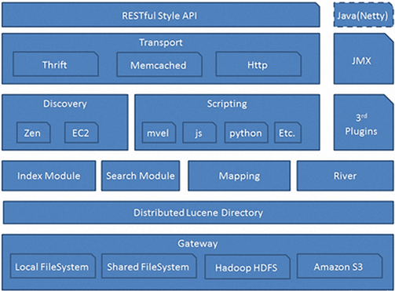

# 开篇几个问题

## 1、大规模数据如何检索

解决方案

1. 关系型数据库存储数据，实现数据的检索-------（速度慢，io瓶颈，不适合作为大规模数据检索工具）
2. nosql数据库（考虑因素，内存----查阅速度快）-----（nosql只能存储键值对数据，无法实现关键词检索）
3. hadoop（数据分析）+hbase（nosql）

思考：以上方案不能实现大规模数据检索，主要考虑：性能，是否能实现关键词检索的

如何设计

1. 数据放入内存   ------性能：RT（response time）短，一部分放入内存，并非全放
2. 数据压缩		   ------传输数据量级变小，RT短
3. 索引				   ------查阅数据先检索索引，再查询对象，RT短
4. 多线程			   ------ 
5. 顺序存储

## 2、什么是全文检索

### 基本概念

对<font color='red'>非结构化数据或结构化数据</font>先建立索引，再对<font color='red'>索引</font>进行搜索<font color='red'>文档的过程就叫全文检索</font>


**非结构化数据**

​	没有固定的格式的数据就叫非结构化数据（html, word, excel... ）----没有固定的长度，字段约束，描述

**结构化数据**

​	有固定格式的数据（数据库数据） ------有固定长度（varchar(50)）,字段类型、描述修饰数据

### 搜索算法

**顺序扫描法**

​	例如：没有目录的词典，要查询词语的时候，只能从第一页开始查询，一页一页的开始查询，知道查询到结果

​	软件：数据库，也可加索引，加了索引会好一些，但索引不支持模糊查询

**倒排索引**

​	例如：有目录的词典，要查一个词语，先查目录，根据目录定位到词语所在的页码，直接查询到词语

​	直观的解释就是，通过关键词，找到文档ID（跟传统的查询的**思维方式**相反）

### 关系型数据库为什么不能做大规模数据检索

```sql
select * from table where name like '%全文检索%';
```

**问题**：

1. 全表扫描----速度非常慢
2. 字段ong所有的内容都需要挨个匹配----速度非常慢
3. 全文检索问题：关键词拆分问题（'%全文X检索%'  若写错无法匹配到任意一条数据）

### 什么是索引

​	索引就是对一段文字进行分词拆解后得到的单词，就叫做索引

### 什么是文档

​	文档就是一条结构化的数据（数据库一行数据）

1. 数据结构的体现：数据库一行数据
2. Java对象体现：JavaBean（key，value）

### 全文检索场景

- 索引引擎
- 站内搜索
- 系统文件搜索

### 全文检索相关技术

#### Lucene

lucene制定java所以API接口规范，但是不是一个产品，可以使用Lucene开发一套搜索产品

#### solr

solr是一个线程的产品，值需要把次项目部署到服务器即可实现搜索，solr底层实现方式是lucene

#### elastic search

elastic search分布式搜索产品，只需要把es部署在服务器即可实现搜索，es底层也是Lucene。

### Solr和ES的比较

当单纯对**已有数据（数据不是实时的，规模不是很大的**：TB级别后，就该考虑用ES了）进行搜索时，**solr更快**

- solr适合数据量较小的项目
- solr适合数据固定的项目

当实时建立索引时，**Solr会产生io阻塞**，查询性能较差，ES具有明显优势

- solr不适合有实时数据写入的场景
- es比较适合实时数据写入场景

随着数据量的增加，Solr的搜索效率会变得更低，而ES的性能没有明显变化

## 索引库的创建

### 全文检索，从哪儿进行搜索，数据从哪儿来？


### 如何实现关键词检索

#### 倒排索引

举个例子：诗词大会的飞花令

根据一个词语或者一个字就能对应一首诗

那么，这个词语或字就是索引，诗词就是索引，能背出多少诗句就看倒排索引链有多长

### 索引库的创建过程


### 索引库的检索过程


# Elastic Search产品

## 为什么不使用Lucene技术开发搜索

Lucene不是一个现成的产品，只是一套用来开发搜索的API,可以使用Lucene开发搜索，但是开发成本，维护成本相当高，要**考虑索引库创建，索引库维护，集群维护**

## Elastic Search介绍

```
Elasticsearch由来：许多年前，一个叫Shay Banon的待业工程师跟随他的新婚妻子来到伦敦

```

## ES是什么？

高扩展的分布式全文检索引擎

Elastic Search是底层用Lucene，

## 为什么要使用ES

ES国内外使用优秀案例

GitHub

维基百科

SoundCloud

百度

我们也需要

在实际开发系统中，每个系统都会有一个搜索的功能，当搜索做到一定程度时，维护和扩展起来难度就会慢慢变大，所以很多公司都会把搜索单独独立出一个模块，用ES来实现。


## ES有什么能力


## 使用场景

网站搜索

日志分析

数据预警


## ES架构




## 文档得分计算

在进行搜索的时候，根据关键词进行文档搜索时，如何知道哪个文档是我们最需要的文档也就是最匹配搜索需求的文档。匹配方式：相关度得分计算，得分越高，匹配度越高，这个文档会显示在头条

seo优化：百度交钱，人为设置boost（得分加权因子）

搜索文档得分计算采用数据统计方法：

1. 布尔模型（Lucene底层，ES官方提供的计算模型）
2. 向量空间模型
3. 神经网络模型
4. 潜性语义索引模型
5. 回归模型
6. 概率模型

ES采用布尔模型

t：term -- 词条，索引，索引单词

q：query ---查询

d：document---文档

tf(t in d)：词条在文档中出现的频率

df(t)：词条一共出现多少个文档

idf(t)：词条出现在文档的反转频率

boost（t.field in d）：得分加权因子，可以手动设置，默认是1

lengthNorm(t.field in d)：字段长度对得分的影响

例如：10000文档，1号文档出现词语‘徐嘉欣’次数是100次，1号文档有1000单词

​	tf(t in d):词语“徐嘉欣”出现在一个文档中次数，就叫做词语频率

​    	tf = 100/1000 = 0.1

​	df(t in d)：单词文档频率，DF表示一个单词出现在多少个文档中。DF反映了单词的区分度，DF越高表示单词越	普遍，区分度越低。其权重越低

​		tf *idf(反转频率) ----- DF越高，权重越小 ==== 符合计算得分要求

​	IDF用对数计算，log底数为10

​	lengthNorm:表示field字段越长，越不重要，越短越重要。


## ES集群

### 单机Node（伪集群）

es是一个分布式架构（多台机器），此时只用了一个服务，因此这也叫集群，空集群

单node环境下，创建一个索引index，默认创建5个primary shard 5个replica shard

yellow：集群可用，但是集群处于不健康状态，因为此时副本分片没有机器来进行存储

分片分配：把5个主分片分配到一台机器

伪集群可以正常工作，但是一旦宕机，可能出现数据丢失的现象，而集群不可用


#### ES数据的存储方式

采用分片的存储方式，把数据存储在一个一个的分片中，而分片又分布在不同的服务器，这样分担服务器压力

创建一个索引index，默认创建5个primary shard 5个replica shard

#### 节点规划

设置语法

PUT /melo_index

{

"number_of_shards":3,

"number_of_replica":1

}

### 集群结构


**es集群架构特点：**

1、es集群由master,slave节点组成，主从结构

  *一个集群只能有一个master

  *一个master可以对应多个slave，理论上无限制

2、master节点功能

  *维护所有node节点状态，集群状态（元数据维护）

  *slave节点越多，就说明master节点要维护的数据就越多，master维护的数据是有极限的

  注意：一旦node节点过多，master节点的负担就过重，导致整个集群性能下降。可以有多少个slave，取决于master性能

**集群通信：**

1、master每隔1s向所有的slave node节点发送心跳检测，检测节点是否存活

2、所有的slave node会向master发送心跳检测包，检测master是否存活，如果master宕机，将会重新选一个slave作为master主机。

**ES集群存储：**

1、ES集群采用分片的方式进行数据存储

2、分片都均衡分布在不同的机器节点上

3、主分片不能和自己的副本分片在同一个机器上，如果放在同一个，一个节点挂了，数据就会丢失，集群是为了高可用

4、主分片可以进行读写操作，副本分片可以进行读操作

**因为master，slave 主从节点都可以进行读写操作，所以单个master不会成为性能瓶颈。这是ES特别独到之处**

**从节点也具有写的功能，主分片在从节点中存在，写数据是往主分片(primary shard)写**

### ES集群节点分配

☆代表主节点

●代表从节点

边框线条粗：primary shard

边框线条细：replica shard

#### **master节点**

维护集群状态，维护元数据

存储数据

设置方式：

- node.master: true --有参与选举的权利，选举为master的权利，能不能称为master需要看选举情况
- node.data:true   -----此节点既作为master候选节点，也可以存储数据

  #### 数据节点

只用来存数据的

设置方式：

- node.master:false 
- node.data:true  ---只能存储数据

#### 协调节点

协调节点根据路由算法，把数据分配到某一个分片进行存储，每一个节点都可以作为协调节点


如果不对节点类型进行设置，那么每一个节点都有三种身份

- 候选master
- 存储数据
- 协调节点

当集群规模越来越大时，数据规模越来越大，节点越来越多，为了提高集群的性能，可以让集群节点的功能单一

例如：可以让master节点不存数据，只进行管理

slave node只存数据，不参与选举master

单独抽离一个协调节点，由协调节点算出应该到哪个节点去拿数据

 如何让单独的一个节点做协调节点？

需要从业务功能上做细致的划分，让所有请求都去找协调节点

当集群节点超过100个时，就应该考虑使用职责单一

#### 部落节点

用来维护超大规模集群的节点，部落节点管理多个es集群的

## ES的重要名词

### index(索引)

对比关系型数据库，相当于数据库的database

### type(类型)

对比关系型数据库，相当于数据库的type（高版本就不要类型了，相当于一个库只有一个表）

### document(文档)

对比关系型数据库，相当于一行数据

### Field(字段)

对比关系型数据库，相当于列Column

#### mapping(映射--规则约束)

对数据类型和规范的约束，如果price字段是整形，要加一条price是String的值会报错

**在公司开发搜索时，首先应该设计约束规则，字段类型，要不要分词，所以mapping的设计非常重要**


# ElasticSearch核心原理

## ES存储特点

为了分担服务器压力，提供读写吞吐量，采用分片方式进行存储

1. es集群主分片数量一旦确定，不可改变
2. 副本分片数量在理论上是可以无限扩容，但是需要考虑master的性能
3. 一个文档只能存储在一个分片，不能被分散存储
4. 主分片数量确定了存储的容量
5. 一个主分片大小理论上是无限制的，一个分片太大的话，在数据读取或故障转移时，就会出现性能下降，一般情况下一个分片最大设置为50G为最佳
6. 极限分片，一台节点值存储一个分片
7. 副本分片的作用？数据备份，放置服务器故障引起的数据丢失，提供读操作分担请求压力
8. 一个分片就时一个完整的索引库，提供完整的搜索功能。

## 集群扩容

### 集群的横向扩展

当并发访问量越来越大时，可以进行横向扩展。


### 集群的继续扩容

数据量越来越大，超过主分片的容量时，只能增加主分片的数量（但是：主分片的数量一旦设定就无法更改）

解决方案：重新创建索引库，设置于预期的分片数量相同的分片数量，再迁移数据即可

**注意提供脚本监控数据增量和状态**

作为架构师：公司的数据规模，分片数量时由架构师主管取设置的，在做索引库构建的时候，就应该考虑这个问题，考虑现有数据，考虑增量数据，考虑并发访问量，考虑数据规模

## ES故障转移

案例场景：当服务器宕机，需要惊醒故障转移（把分片转移到健康的节点上面，继续对外提供服务）

故障转移会自动进行，当有新机器加入集群时，会自动进行负载均衡

访问请求落在分片上

分片均衡分布在node节点

注意节点和分片的区别

注意一个概念，节点宕机，并不代表分片挂了。ES集群可以做故障转移，把分片转移到集群中其他节点上

## ES索引储存

问题：如何保证索引数据不丢失？？

elasticsearch索引库约定：

​	索引，文档一旦写入磁盘，就不可更改

主要时基于以下几点考虑

1. 数据无需改变，防止并发修改，不需要加锁。不需要加锁，不需要担心多个线程同时写索引库。保护索引库数据安全性。
2. 防止索引，索引库被频繁的修改，写入，浪费性能，占用IO资源
3. 把索引读入内存，索引不能被改变，索引数据会一致存储在内存，搜索时，只需要命中内存的索引即可

问题：增删改应该怎么办？如何解决这个问题

索引库的存储结构：


**答案：为了不影响原来的索引库，重新创建一个segment，每次新增文档，更新文档，都会增加一个segment，不影响原来的索引库。**

### 文档新增


### 文档删除


### 文档更新


每次都会创建一个新的segment，时间长了，segment会多到爆炸？如何解决？

解决方案：segment合并


### 如何保证索引不丢失


## 集群选举

如果是同时启动，按照nodeid进行排序，取最小的作为master节点

如果不是同时启动，则先启动的作为master节点（需要有选举资格）

## 数据恢复

## 故障探查

ES有两种集群故障探查机制

1. 通过master进行的，master会ping集群中所有其他node
2. 每个node都会去ping master来确保master是否存活，否则会发起一个选举过程

## 脑裂现象

由于网络抖动，master节点和其他node节点无法进行连接，导致节点将会进行重新选举，此时就会产生脑裂，所谓的脑裂就是存在多个master

如何解决脑裂的问题：

公式 = **(master候选节点+1)/2 == 值** ----防止脑裂的一个值

脑裂双方（失联双方群体）

if(nodeNum >= 值){

​	可以选举一个老大

}else{

​	无法选举，甚至会取消master的资格

}

通过以上方式，防止脑裂产生


## 文档路由原理

实现文档CRUD，是否知道把文档CRUD到哪个分片


因为文档路由采用了以上的公式：hash加取模

所以在ES集群中是不可以增删主分片的，因为如果主分片数量修改了，同样的ID根据原来的路由算法得出的结果就变了，因为主分片的数量是作为取模的数字，数字发生变化，就导致结果会发生变化


## 几个实战中的问题

1. 多大规模集群？？
2. 设置多少个分片？？
3. 设置多少个副本分片？？

思路：

1. 数据量是多大？
2. 数据增量？
3. 服务器配置（x86 32G 2T）？

思考：

1. elasticsearch heap内存：最大堆内存设置：30G（可以让数据放入内存的大小）
2. 单个分片最大可以存储多少数据，一般情况：30G---50G，如果超过50G大小，查询或写入性能就会急剧下降

推断

数据规模：10TB级别数据，分析需要几台服务器，多少个主分片？？

1shard = 50G

10TB/50G = 205 shard（primary shard）,另外还要至少加上205个replica shard

10TB / 2TB = 5 台服务器

**结论：需要5台服务器，410个分片（205个primary shard）**

elasticsearch秘密

elasticsearch堆内存可以设置：30G

每1个G的堆内存支持多少分片：支持20到25个分片

设置30G的堆内存大小：实际上单机节点可以支持600-750个分片

需要设置多少个副本分片

参考横向扩容：关键看并发量