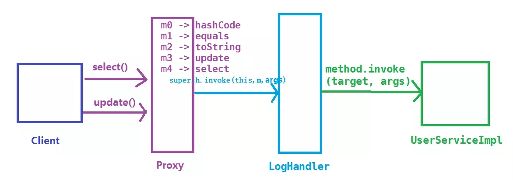

# 代理模式

在代理模式中（proxy Pattern），一个类代表另一个类的功能。这种类型的设计模式属于结构型模式。我们创建具有现有对象的对象，以便向外界提供功能接口。

## 介绍

**意图：**为其他对象提供一种代理以控制对这个对象的访问。

**主要解决：**在直接访问对象时带来的问题，比如说：要访问的对象在远程的机器上。在面向对象系统中，有些对象由于某些原因（比如对象创建开销很大，或者某些操作需要安全控制，或者需要进程外的访问），直接访问会给使用者或者系统结构带来很多麻烦，我们可以在访问此对象时加上一个对比此对象的访问层。

**何时使用：**想在访问一个类时做一些控制。

**如何解决：**增加中间层。

**关键代码：**实现与被代理类组合。

**应用实例：**

- windows里面的快捷方式
- 猪八戒去找高翠兰结果是孙悟空变的，可以这样理解：把高翠兰的外貌抽象出来，高翠兰本人和孙悟空都实现了这个接口，猪八戒访问高翠兰的时候看不出来这个是孙悟空，所以说孙悟空是高翠兰代理类。
- 买火车票不一定在火车站买，也可以去代售点。
- 一张支票或银行存单是账务中资金的代理。支票在市场交易中用来代替现金，并提供对签发人账号上资金的控制
- spring aop

**优点：**

- 职责清晰
- 高扩展性
- 智能化

**缺点：**

- 由于在客户端和真实主题之间增加了代理对象，因此有些类型的代理模式可能会造成请求的处理速度变慢。
- 实现代理模式需要额外的工作，有些代理模式的实现非常复杂。

**使用场景：**按职责来划分，通常有以下使用场景：

- 远程代理
- 虚拟代理
- Copy-on-Write代理
- 保护（Protect or Access）代理
- Cache代理
- 防火墙（Firewall）代理
- 同步化（Synchronization）代理
- 智能引用（Smart Reference）代理

## 静态代理

### 实现

我们将创建一个Image接口和实现了Image接口的实体类。ProxyImage是一个代理类，减少RealImage对象加载的内存占用。

ProxyPatternDemo，我们演示类使用ProxyImage来获取要加载的Image对象，并按照需求进行展示


#### 步骤1

创建一个接口

**Image.java**

```java
public interface Image {
   void display();
}
```

#### 步骤2

创建实现接口的实体类

**RealImage.java**

```java
public class RealImage implements Image {
 
   private String fileName;
 
   public RealImage(String fileName){
      this.fileName = fileName;
      loadFromDisk(fileName);
   }
 
   @Override
   public void display() {
      System.out.println("Displaying " + fileName);
   }
 
   private void loadFromDisk(String fileName){
      System.out.println("Loading " + fileName);
   }
}
```

**ProxyImage.java**

```java
public class ProxyImage implements Image{
 
   private RealImage realImage;
   private String fileName;
 
   public ProxyImage(String fileName){
      this.fileName = fileName;
   }
 
   @Override
   public void display() {
      if(realImage == null){
         realImage = new RealImage(fileName);
      }
      realImage.display();
   }
}
```

#### 步骤3

当被请求时，使用ProxyImage来获取RealImage类的对象

**ProxyPatternDemo.java**

```java
public class ProxyPatternDemo {
   
   public static void main(String[] args) {
      Image image = new ProxyImage("test_10mb.jpg");
 
      // 图像将从磁盘加载
      image.display(); 
      System.out.println("");
      // 图像不需要从磁盘加载
      image.display();  
   }
}
```

#### 步骤4

执行程序，输出结果

```java
Loading test_10mb.jpg
Displaying test_10mb.jpg

Displaying test_10mb.jpg
```

### 静态代理的缺点

虽然静态代理实现简单，且不侵入原代码，但是，当场景稍微复杂一些的时候，静态代理的缺点也会暴露出来

1. 当需要代理多个类的时候，由于代理对象要实现与目标对象一致的接口，有两种方式
       - 只维护一个代理类，这个代理类实现多个接口，但是这样就导致**代理类过于庞大**。
       - 新建多个代理类，每个目标对象对应一个代理类，但是这样会产生**过多的代理类**。
2. 当接口需要增加、删除、修改方法的时候，目标对象与代理类都要同时修改，**难维护**。

## 动态代理

### 如何改进静态代理

当然是让代理类**动态的生成**拉，也就是动态代理。

#### 为什么类可以动态的生成？

这里涉及到了Java虚拟机的**类加载机制**，《深入理解java虚拟机》7.3节 类加载的过程。

Java虚拟机类加载过程主要分为五个阶段：加载、验证、准备、解析、初始化。其中加载阶段需要完成以下三件事情

1. 通过一个类的全限定名来获取定义此类的二进制字节流。
2. 将这个字节流代表的静态储存结构转为话方法区运行时的数据结构。
3. 在内存中生成一个代表这个类的java.lang.class 对象，作为方法区这个类的各种数据访问入口。

由于虚拟机规范对这3点要求并不具体，所以实际的实现是非常灵活的，关于第1点，**获取类的二进制字节流**（class字节码）就有很多途径

- 从zip包获取，这是jar，ear，war等格式的基础
- 从网络中获取，典型的应用是Applet
- **运行时计算生成**，这种场景使用最多的是动态代理技术，在java.lang.reflect.Proxy类中，就是用了ProxyGenerator.generateProxyClass 来为特定接口生成形式为*$Proxy 的代理类的二进制字节流
- 有其他文件生成，典型应用是JSP，即由JSP文件生成对应的Class类
- 从数据库中获取等等

所以动态代理就是想办法，根据接口或目标对象，计算出代理类的字节码，然后再加载到JVM中使用。但是如何计算？如何生成？情况也许比想象的复杂得多，我们需要借助现有的方案。

#### 常见的字节码操作类库

> 这里有一些介绍： https://java-source.net/open-source/bytecode-libraries 

- Apache BCEL(Byte Code Engineering Library):是Java class working广泛使用的一种框架，它可以深入到JVM汇编语言进行类操作的细节。
- ObjectWeb ASM:是一个Java字节码操作框架。它可以用于直接以二进制形式动态生成stub跟类或其他代理类，或者再加载时动态修改类。
- CGLIB(Code Generation Library)：是一个功能强大，搞性能和搞质量的代码生成库，用于扩展JAVA类并在运行时实现接口。
- Javassist 是Java的加载时反射系统，它时一个用于在Java中编辑字节码的类库；它使Java程序能够在运行时定义新类，并在JVM加载之前修改类文件。
- ...

#### 实现动态代理的思考方向

为了让生成的代理类于目标对象（真实主题角色）保持一致性，从现在开始将介绍一下两种最常见的方式：

1. 通过实现接口的方式 -> JDK动态代理
2. 通过继承类的方式 -> CGLIB动态代理

### JDK动态代理

JDK动态代理主要涉及两个类： `java.lang.reflect.Proxy` 和 `java.lang.reflect.InvocationHandler` 

#### 实现

##### 步骤1

编写一个调用逻辑处理器LogHandler类，并实现InvocationHandler接口；在LogHandler中维护一个目标对象，这个对象是被代理的对象（真实主题角色）；在 `invoke`方法中编写方法调用的逻辑处理。

```java
import java.lang.reflect.InvocationHandler;
import java.lang.reflect.Method;
import java.util.Date;

public class LogHandler implements InvocationHandler {
    Object target;  // 被代理的对象，实际的方法执行者

    public LogHandler(Object target) {
        this.target = target;
    }
    @Override
    public Object invoke(Object proxy, Method method, Object[] args) throws Throwable {
        before();
        Object result = method.invoke(target, args);  // 调用 target 的 method 方法
        after();
        return result;  // 返回方法的执行结果
    }
    // 调用invoke方法之前执行
    private void before() {
        System.out.println(String.format("log start time [%s] ", new Date()));
    }
    // 调用invoke方法之后执行
    private void after() {
        System.out.println(String.format("log end time [%s] ", new Date()));
    }
}
```

##### 步骤2

编写客户端，获取动态生成的代理类对象须借助Proxy类的newProxyInstance方法

```java
import proxy.UserService;
import proxy.UserServiceImpl;
import java.lang.reflect.InvocationHandler;
import java.lang.reflect.Proxy;

public class Client2 {
    public static void main(String[] args) throws IllegalAccessException, InstantiationException {
        // 设置变量可以保存动态代理类，默认名称以 $Proxy0 格式命名
        // System.getProperties().setProperty("sun.misc.ProxyGenerator.saveGeneratedFiles", "true");
        // 1. 创建被代理的对象，UserService接口的实现类
        UserServiceImpl userServiceImpl = new UserServiceImpl();
        // 2. 获取对应的 ClassLoader
        ClassLoader classLoader = userServiceImpl.getClass().getClassLoader();
        // 3. 获取所有接口的Class，这里的UserServiceImpl只实现了一个接口UserService，
        Class[] interfaces = userServiceImpl.getClass().getInterfaces();
        // 4. 创建一个将传给代理类的调用请求处理器，处理所有的代理对象上的方法调用
        //     这里创建的是一个自定义的日志处理器，须传入实际的执行对象 userServiceImpl
        InvocationHandler logHandler = new LogHandler(userServiceImpl);
        /*
           5.根据上面提供的信息，创建代理对象 在这个过程中，
               a.JDK会通过根据传入的参数信息动态地在内存中创建和.class 文件等同的字节码
               b.然后根据相应的字节码转换成对应的class，
               c.然后调用newInstance()创建代理实例
         */
        UserService proxy = (UserService) Proxy.newProxyInstance(classLoader, interfaces, logHandler);
        // 调用代理的方法
        proxy.select();
        proxy.update();
        
        // 保存JDK动态代理生成的代理类，类名保存为 UserServiceProxy
        // ProxyUtils.generateClassFile(userServiceImpl.getClass(), "UserServiceProxy");
    }
}
```

#### InvocationHandler和Proxy的主要方法介绍

##### java.lang.reflect.InvocationHandler

`Object invoke(Object proxy,Method method,Object[] args)`定义了代理对象调用方法时希望执行的动作，用于集中处理在动态代理类对象上的方法调用

##### java.lang.reflect.Proxy

`static Class<?> getProxyClass(ClassLoader loader, Class<?>... interfaces)`返回指定接口的代理类

`static Object newProxyInstance(ClassLoader loader,Class<?>[] interfaces,InvocationHandler h)`构造实现指定接口的代理类的一个新实例，所有方法会调用给定处理器对象的invoke方法。

`static boolean isProxyClass(Class<?> cl)`返回cl是否为一个代理类

#### 代理类调用过程

生成的代理类到底长什么样子呢？借助下面的工具类，把代理类保存下来再探个究竟

（通过设置环境变量 sun.misc.ProxyGenerator.saveGeneratedFiles=true也可以保存代理类 ）

```java
import sun.misc.ProxyGenerator;
import java.io.FileOutputStream;
import java.io.IOException;

public class ProxyUtils {
    /**
     * 将根据类信息动态生成的二进制字节码保存到硬盘中，默认的是clazz目录下
     * params: clazz 需要生成动态代理类的类
     * proxyName: 为动态生成的代理类的名称
     */
    public static void generateClassFile(Class clazz, String proxyName) {
        // 根据类信息和提供的代理类名称，生成字节码
        byte[] classFile = ProxyGenerator.generateProxyClass(proxyName, clazz.getInterfaces());
        String paths = clazz.getResource(".").getPath();
        System.out.println(paths);
        FileOutputStream out = null;
        try {
            //保留到硬盘中
            out = new FileOutputStream(paths + proxyName + ".class");
            out.write(classFile);
            out.flush();
        } catch (Exception e) {
            e.printStackTrace();
        } finally {
            try {
                out.close();
            } catch (IOException e) {
                e.printStackTrace();
            }
        }
    }
}
```

```java
ProxyUtils.generateClassFile(userServiceImpl.getClass(), "UserServiceProxy");
```

UserServiceProxy的代码如下：

```java
import java.lang.reflect.InvocationHandler;
import java.lang.reflect.Method;
import java.lang.reflect.Proxy;
import java.lang.reflect.UndeclaredThrowableException;
import proxy.UserService;

public final class UserServiceProxy extends Proxy implements UserService {
    private static Method m1;
    private static Method m2;
    private static Method m4;
    private static Method m0;
    private static Method m3;

    public UserServiceProxy(InvocationHandler var1) throws  {
        super(var1);
    }

    public final boolean equals(Object var1) throws  {
        // 省略...
    }

    public final String toString() throws  {
        // 省略...
    }

    public final void select() throws  {
        try {
            super.h.invoke(this, m4, (Object[])null);
        } catch (RuntimeException | Error var2) {
            throw var2;
        } catch (Throwable var3) {
            throw new UndeclaredThrowableException(var3);
        }
    }

    public final int hashCode() throws  {
        // 省略...
    }

    public final void update() throws  {
        try {
            super.h.invoke(this, m3, (Object[])null);
        } catch (RuntimeException | Error var2) {
            throw var2;
        } catch (Throwable var3) {
            throw new UndeclaredThrowableException(var3);
        }
    }

    static {
        try {
            m1 = Class.forName("java.lang.Object").getMethod("equals", Class.forName("java.lang.Object"));
            m2 = Class.forName("java.lang.Object").getMethod("toString");
            m4 = Class.forName("proxy.UserService").getMethod("select");
            m0 = Class.forName("java.lang.Object").getMethod("hashCode");
            m3 = Class.forName("proxy.UserService").getMethod("update");
        } catch (NoSuchMethodException var2) {
            throw new NoSuchMethodError(var2.getMessage());
        } catch (ClassNotFoundException var3) {
            throw new NoClassDefFoundError(var3.getMessage());
        }
    }
}
```

从UserServiceProxy的代码种我们可以发现：

- UserServiceProxy继承了Proxy类，并且实现了被代理的所有接口，以及equals,hashCode,toString等方法
- 由于UserServiceProxy继承了Proxy类，所有每个代理类都会关联一个InvocationHandler方法调用处理器
- 类和所有方法都背public final修饰，所以代理只可被使用，不可再被继承
- 每个方法都有一个Method对象来描述，Method对象在static静态代码块中创建，以`m + 数字`的格式命名
- 调用方法的时候通过`super.h.invoke(this,m1,(Object[])null);`调用，其中`super.h.invoke`实际上是再创建代理的时候传递给`Proxy.newProxyInstance`的LogHandler对象，它继承InvocationHandler类，负责实际调用逻辑处理器

而LogHandler的invoke方法接收到method，args等参数后，进行了一些处理，然后通过反射让被代理的对象target执行方法

```java
@Override
    public Object invoke(Object proxy, Method method, Object[] args) throws Throwable {
        before();
        Object result = method.invoke(target, args);       // 调用 target 的 method 方法
        after();
        return result;  // 返回方法的执行结果
    }
```

JDK动态代理执行方法调用的过程简图如下：



#### InvocationHandler中invoke方法中的第一个参数proxy的用途

`https://stackoverflow.com/questions/22930195/understanding-proxy-arguments-of-the-invoke-method-of-java-lang-reflect-invoca`

用于某一个对象的方法返回该对象本身，然后去链式的调用该方法

接口：

```java
private interface Account {
    public Account deposit (double value);
    public double getBalance ();
}
```

```java
private class ExampleInvocationHandler implements InvocationHandler {
 
    private double balance;
 
    @Override
    public Object invoke (Object proxy, Method method, Object[] args) throws Throwable {
 
        // simplified method checks, would need to check the parameter count and types too
        if ("deposit".equals(method.getName())) {
            Double value = (Double) args[0];
            System.out.println("deposit: " + value);
            balance += value;
            return proxy; // here we use the proxy to return 'this'
        }
        if ("getBalance".equals(method.getName())) {
            return balance;
        }
        return null;
    }
}
```

 使用： 

```java
Account account = (Account) Proxy.newProxyInstance(getClass().getClassLoader(), new Class[] {Account.class, Serializable.class},
    new ExampleInvocationHandler());
 
// method chaining for the win!
account.deposit(5000).deposit(4000).deposit(-2500);
System.out.println("Balance: " + account.getBalance());
```

返回proxy可以实现对该代理对象进行连续调用

### CGLIB动态代理

#### 实现

##### 步骤1

使用CGLIB需要引入CGLIB包

##### 步骤二

然后编写一个UserDao类，它没有借口，只有两个方法，select和update

```java
public class UserDao {
    public void select() {
        System.out.println("UserDao 查询 selectById");
    }
    public void update() {
        System.out.println("UserDao 更新 update");
    }
}
```

##### 步骤三

编写一个LogInterceptor,继承了MethodInterceptor，用于方法拦截

```java
import java.lang.reflect.Method;
import java.util.Date;

public class LogInterceptor implements MethodInterceptor {
    /**
     * @param object 表示要进行增强的对象
     * @param method 表示拦截的方法
     * @param objects 数组表示参数列表，基本数据类型需要传入其包装类型，如int-->Integer、long-Long、double-->Double
     * @param methodProxy 表示对方法的代理，invokeSuper方法表示对被代理对象方法的调用
     * @return 执行结果
     * @throws Throwable
     */
    @Override
    public Object intercept(Object object, Method method, Object[] objects, MethodProxy methodProxy) throws Throwable {
        before();
        Object result = methodProxy.invokeSuper(object, objects);   // 注意这里是调用 invokeSuper 而不是 invoke，否则死循环，methodProxy.invokesuper执行的是原始类的方法，method.invoke执行的是子类的方法
        after();
        return result;
    }
    private void before() {
        System.out.println(String.format("log start time [%s] ", new Date()));
    }
    private void after() {
        System.out.println(String.format("log end time [%s] ", new Date()));
    }
}
```

##### 步骤4

测试

```java
import net.sf.cglib.proxy.Enhancer;

public class CglibTest {
    public static void main(String[] args) {
        Enhancer enhancer = new Enhancer();
        enhancer.setSuperclass(UserDao.class);  // 设置超类，cglib是通过继承来实现的
        enhancer.setCallback(new LogInterceptor());

        UserDao userDao = (UserDao)enhancer.create();   // 创建代理类
        userDao.update();
        userDao.select();
    }
}
```

 还可以进一步多个 MethodInterceptor 进行过滤筛选 

```java
public class LogInterceptor2 implements MethodInterceptor {
    @Override
    public Object intercept(Object object, Method method, Object[] objects, MethodProxy methodProxy) throws Throwable {
        before();
        Object result = methodProxy.invokeSuper(object, objects);
        after();
        return result;
    }
    private void before() {
        System.out.println(String.format("log2 start time [%s] ", new Date()));
    }
    private void after() {
        System.out.println(String.format("log2 end time [%s] ", new Date()));
    }
}
```

过滤器

```java
// 回调过滤器: 在CGLib回调时可以设置对不同方法执行不同的回调逻辑，或者根本不执行回调。
public class DaoFilter implements CallbackFilter {
    @Override
    public int accept(Method method) {
        if ("select".equals(method.getName())) {
            return 0;   // Callback 列表第1个拦截器
        }
        return 1;   // Callback 列表第2个拦截器，return 2 则为第3个，以此类推
    }
}
```

再次测试：

```java
public class CglibTest2 {
    public static void main(String[] args) {
        LogInterceptor logInterceptor = new LogInterceptor();
        LogInterceptor2 logInterceptor2 = new LogInterceptor2();
        Enhancer enhancer = new Enhancer();
        enhancer.setSuperclass(UserDao.class);   // 设置超类，cglib是通过继承来实现的
        enhancer.setCallbacks(new Callback[]{logInterceptor, logInterceptor2, NoOp.INSTANCE});   // 设置多个拦截器，NoOp.INSTANCE是一个空拦截器，不做任何处理
        enhancer.setCallbackFilter(new DaoFilter());

        UserDao proxy = (UserDao) enhancer.create();   // 创建代理类
        proxy.select();
        proxy.update();
    }
}
```

#### CGLIB创建动态代理的模式是：

1. 查找目标类上的所有非final的public类型的方法定义
2. 将这些方法的定义转换成字节码
3. 将组成的字节码转换成相应的代理的class对象
4. 实现MethodInterceptor接口，用来处理对代理类上所有方法的请求

### JDK动态代理与CGLIB动态代理对比

JDK动态代理：基于Java反射机制实现，必须要实现了接口的业务类才能用这种方法生成代理对象。

CGLIB动态代理：基于ASM机制实现，通过生成业务类的子类作为代理类。

##### JDK Proxy的优势

- 最小化依赖关系，减少依赖意味着简化开发和维护，JDK本身的支持，可能比CGLIB更加可靠
- 平滑进行JDK版本升级，而字节码类库通常需要进行更新以保证新版Java上能够使用。
- 代码实现简单。

##### CGLIB框架的优势

- 无需实现接口，达到代理类无侵入
- 只操作我们关心的类，而不必为其他相关类增加工作量
- 1.7之前性能搞高


## 面试题

### 描述动态代理的实现方式？分别说出相应的优缺点

代理可以分为静态代理和动态代理，动态代理常用的实现方式为JDK动态代理和CGLIB动态代理

**静态代理：**代理对象和实际对象都继承了同样的接口，在代理对象中指向的是实际对象的实例，这样对外暴露的是代理对象而真正调用的是实际对象

**优点：**可以很好的保护实际对象的业务逻辑对外暴露，从而提高安全性

**缺点：**不同的接口要有不同的代理实现类，代码冗余

#### JDK动态代理

- 为了解决动态代理中，生成大量的代理类造成的冗余
- JDK动态代理只需要实现InvocationHandler接口，重写invoke方法便可以完成代理的实现
- JDK的代理是利用反射生成代理类的字节码，并生成对象
- JDK动态代理只能代理接口，因为代理类本身已经继承了Proxy
- 优点：区别于静态代理的有点，区别于CGLIB的优点

#### CGLIB动态代理

- 由于 JDK 动态代理限制了只能基于接口设计，而对于没有接口的情况，JDK方式解决不了；
- CGLIB采用了非常底层的字节码技术，其原理是通过字节码技术为一个类创建子类，并在子类中采用方法拦截的技术拦截所有父类方法的调用，顺势织入横切逻辑，来完成动态代理的实现。
- 实现方式实现 MethodInterceptor 接口，重写 intercept 方法，通过 Enhancer 类的回调方法来实现。
- 但是CGLIB在创建代理对象时所花费的时间却比JDK多得多，所以对于单例的对象，因为无需频繁创建对象，用CGLIB合适，反之，使用JDK方式要更为合适一些。
- 同时，由于CGLIB由于是采用动态创建子类的方法，对于final方法，无法进行代理。

-  **优点**：没有接口也能实现动态代理，而且采用字节码增强技术，性能也不错。
-  **缺点**：技术实现相对难理解些。