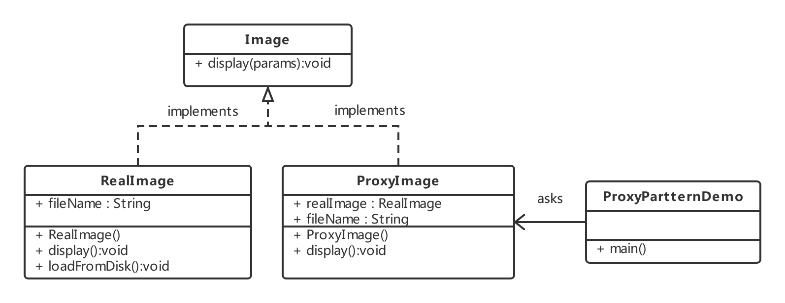

# 代理模式

在代理模式中（proxy Pattern），一个类代表另一个类的功能。这种类型的设计模式属于结构型模式。我们创建具有现有对象的对象，以便向外界提供功能接口。

## 介绍

**意图：**为其他对象提供一种代理以控制对这个对象的访问。

**主要解决：**在直接访问对象时带来的问题，比如说：要访问的对象在远程的机器上。在面向对象系统中，有些对象由于某些原因（比如对象创建开销很大，或者某些操作需要安全控制，或者需要进程外的访问），直接访问会给使用者或者系统结构带来很多麻烦，我们可以在访问此对象时加上一个对比此对象的访问层。

**何时使用：**想在访问一个类时做一些控制。

**如何解决：**增加中间层。

**关键代码：**实现与被代理类组合。

**应用实例：**

- windows里面的快捷方式
- 猪八戒去找高翠兰结果是孙悟空变的，可以这样理解：把高翠兰的外貌抽象出来，高翠兰本人和孙悟空都实现了这个接口，猪八戒访问高翠兰的时候看不出来这个是孙悟空，所以说孙悟空是高翠兰代理类。
- 买火车票不一定在火车站买，也可以去代售点。
- 一张支票或银行存单是账务中资金的代理。支票在市场交易中用来代替现金，并提供对签发人账号上资金的控制
- spring aop

**优点：**

- 职责清晰
- 高扩展性
- 智能化

**缺点：**

- 由于在客户端和真实主题之间增加了代理对象，因此有些类型的代理模式可能会造成请求的处理速度变慢。
- 实现代理模式需要额外的工作，有些代理模式的实现非常复杂。

**使用场景：**按职责来划分，通常有以下使用场景：

- 远程代理
- 虚拟代理
- Copy-on-Write代理
- 保护（Protect or Access）代理
- Cache代理
- 防火墙（Firewall）代理
- 同步化（Synchronization）代理
- 智能引用（Smart Reference）代理

## 静态代理

### 实现

我们将创建一个Image接口和实现了Image接口的实体类。ProxyImage是一个代理类，减少RealImage对象加载的内存占用。

ProxyPatternDemo，我们演示类使用ProxyImage来获取要加载的Image对象，并按照需求进行展示



#### 步骤1

创建一个接口

**Image.java**

```java
public interface Image {
   void display();
}
```

#### 步骤2

创建实现接口的实体类

**RealImage.java**

```java
public class RealImage implements Image {
 
   private String fileName;
 
   public RealImage(String fileName){
      this.fileName = fileName;
      loadFromDisk(fileName);
   }
 
   @Override
   public void display() {
      System.out.println("Displaying " + fileName);
   }
 
   private void loadFromDisk(String fileName){
      System.out.println("Loading " + fileName);
   }
}
```

**ProxyImage.java**

```java
public class ProxyImage implements Image{
 
   private RealImage realImage;
   private String fileName;
 
   public ProxyImage(String fileName){
      this.fileName = fileName;
   }
 
   @Override
   public void display() {
      if(realImage == null){
         realImage = new RealImage(fileName);
      }
      realImage.display();
   }
}
```

#### 步骤3

当被请求时，使用ProxyImage来获取RealImage类的对象

**ProxyPatternDemo.java**

```java
public class ProxyPatternDemo {
   
   public static void main(String[] args) {
      Image image = new ProxyImage("test_10mb.jpg");
 
      // 图像将从磁盘加载
      image.display(); 
      System.out.println("");
      // 图像不需要从磁盘加载
      image.display();  
   }
}
```

#### 步骤4

执行程序，输出结果

```java
Loading test_10mb.jpg
Displaying test_10mb.jpg

Displaying test_10mb.jpg
```

### 静态代理的缺点

虽然静态代理实现简单，且不侵入原代码，但是，当场景稍微复杂一些的时候，静态代理的缺点也会暴露出来

1. 当需要代理多个类的时候，由于代理对象要实现与目标对象一致的接口，有两种方式
       - 只维护一个代理类，这个代理类实现多个接口，但是这样就导致**代理类过于庞大**。
       - 新建多个代理类，每个目标对象对应一个代理类，但是这样会产生**过多的代理类**。
2. 当接口需要增加、删除、修改方法的时候，目标对象与代理类都要同时修改，**难维护**。

## 动态代理

### 如何改进静态代理

当然是让代理类**动态的生成**拉，也就是动态代理。

#### 为什么类可以动态的生成？

这里涉及到了Java虚拟机的**类加载机制**，《深入理解java虚拟机》7.3节 类加载的过程。

Java虚拟机类加载过程主要分为五个阶段：加载、验证、准备、解析、初始化。其中加载阶段需要完成以下三件事情

1. 通过一个类的全限定名来获取定义此类的二进制字节流。
2. 将这个字节流代表的静态储存结构转为话方法区运行时的数据结构。
3. 在内存中生成一个代表这个类的java.lang.class 对象，作为方法区这个类的各种数据访问入口。

由于虚拟机规范对这3点要求并不具体，所以实际的实现是非常灵活的，关于第1点，**获取类的二进制字节流**（class字节码）就有很多途径

- 从zip包获取，这是jar，ear，war等格式的基础
- 从网络中获取，典型的应用是Applet
- **运行时计算生成**，这种场景使用最多的是动态代理技术，在java.lang.reflect.Proxy类中，就是用了ProxyGenerator.generateProxyClass 来为特定接口生成形式为*$Proxy 的代理类的二进制字节流
- 有其他文件生成，典型应用是JSP，即由JSP文件生成对应的Class类
- 从数据库中获取等等

所以动态代理就是想办法，根据接口或目标对象，计算出代理类的字节码，然后再加载到JVM中使用。但是如何计算？如何生成？情况也许比想象的复杂得多，我们需要借助现有的方案。

#### 常见的字节码操作类库

> 这里有一些介绍： https://java-source.net/open-source/bytecode-libraries 

- Apache BCEL(Byte Code Engineering Library):是Java class working广泛使用的一种框架，它可以深入到JVM汇编语言进行类操作的细节。
- ObjectWeb ASM:是一个Java字节码操作框架。它可以用于直接以二进制形式动态生成stub跟类或其他代理类，或者再加载时动态修改类。
- CGLIB(Code Generation Library)：是一个功能强大，搞性能和搞质量的代码生成库，用于扩展JAVA类并在运行时实现接口。
- Javassist 是Java的加载时反射系统，它时一个用于在Java中编辑字节码的类库；它使Java程序能够在运行时定义新类，并在JVM加载之前修改类文件。
- ...

#### 实现动态代理的思考方向

为了让生成的代理类于目标对象（真实主题角色）保持一致性，从现在开始将介绍一下两种最常见的方式：

1. 通过实现接口的方式 -> JDK动态代理
2. 通过继承类的方式 -> CGLIB动态代理

### JDK动态代理

JDK动态代理主要涉及两个类： `java.lang.reflect.Proxy` 和 `java.lang.reflect.InvocationHandler` 

### 实现

#### 步骤1

编写一个调用逻辑处理器LogHandler类，并实现InvocationHandler接口；在LogHandler中维护一个目标对象，这个对象是被代理的对象（真实主题角色）；在 `invoke`方法中编写方法调用的逻辑处理。

```java
import java.lang.reflect.InvocationHandler;
import java.lang.reflect.Method;
import java.util.Date;

public class LogHandler implements InvocationHandler {
    Object target;  // 被代理的对象，实际的方法执行者

    public LogHandler(Object target) {
        this.target = target;
    }
    @Override
    public Object invoke(Object proxy, Method method, Object[] args) throws Throwable {
        before();
        Object result = method.invoke(target, args);  // 调用 target 的 method 方法
        after();
        return result;  // 返回方法的执行结果
    }
    // 调用invoke方法之前执行
    private void before() {
        System.out.println(String.format("log start time [%s] ", new Date()));
    }
    // 调用invoke方法之后执行
    private void after() {
        System.out.println(String.format("log end time [%s] ", new Date()));
    }
}
```

#### 步骤2

编写客户端，获取动态生成的代理类对象须借助Proxy类的newProxyInstance方法

```java
import proxy.UserService;
import proxy.UserServiceImpl;
import java.lang.reflect.InvocationHandler;
import java.lang.reflect.Proxy;

public class Client2 {
    public static void main(String[] args) throws IllegalAccessException, InstantiationException {
        // 设置变量可以保存动态代理类，默认名称以 $Proxy0 格式命名
        // System.getProperties().setProperty("sun.misc.ProxyGenerator.saveGeneratedFiles", "true");
        // 1. 创建被代理的对象，UserService接口的实现类
        UserServiceImpl userServiceImpl = new UserServiceImpl();
        // 2. 获取对应的 ClassLoader
        ClassLoader classLoader = userServiceImpl.getClass().getClassLoader();
        // 3. 获取所有接口的Class，这里的UserServiceImpl只实现了一个接口UserService，
        Class[] interfaces = userServiceImpl.getClass().getInterfaces();
        // 4. 创建一个将传给代理类的调用请求处理器，处理所有的代理对象上的方法调用
        //     这里创建的是一个自定义的日志处理器，须传入实际的执行对象 userServiceImpl
        InvocationHandler logHandler = new LogHandler(userServiceImpl);
        /*
           5.根据上面提供的信息，创建代理对象 在这个过程中，
               a.JDK会通过根据传入的参数信息动态地在内存中创建和.class 文件等同的字节码
               b.然后根据相应的字节码转换成对应的class，
               c.然后调用newInstance()创建代理实例
         */
        UserService proxy = (UserService) Proxy.newProxyInstance(classLoader, interfaces, logHandler);
        // 调用代理的方法
        proxy.select();
        proxy.update();
        
        // 保存JDK动态代理生成的代理类，类名保存为 UserServiceProxy
        // ProxyUtils.generateClassFile(userServiceImpl.getClass(), "UserServiceProxy");
    }
}
```

### InvocationHandler和Proxy的主要方法介绍

#### java.lang.reflect.InvocationHandler

`Object invoke(Object proxy,Method method,Object[] args)`定义了代理对象调用方法时希望之星的动作，用于集中处理在动态代理类对象上的方法调用


## 动态代理


