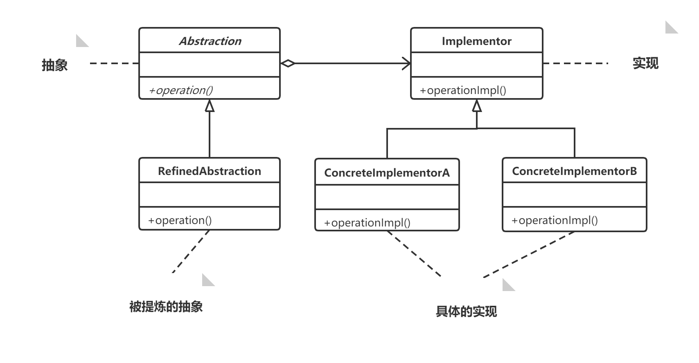

# 代码无错就是优？----简单工程模式

## 活字印刷术，面向对象

**没有活字印刷术的时候，要改一个字，就必须要整个刻板全部重新刻。**

活字印刷术的好处：

1. 改一个字，只需要更改要改的字，此为**可维护**。
2. 这些字并非用完这次就无用，完全可以在后来的的印刷中重复使用，此乃**可复用**。
3. 若需要加字，只需要另刻一个字加入即可，这是**可扩展**。
4. 字的排列其实可能是竖排可能是横排，此时只需要将活字移动就可做到满足排列需求，此时**灵活性好。**

在活字印刷术出现之前，上面的四种特性都无法满足，要修改，必须重刻，要加字，必须重刻，要重新排列，必须重刻，印完这本书后，此版已无任何可再利用的价值。

## 面向对象的好处

​    客户需求上的一些小的改动面对已完成的程序代码，如果是需要几乎重头来过，这实在是痛苦不堪。其原因在于我们原先所写的程序，不容易维护，灵活性差，不容易扩展，更谈不上复用，因此面对需求的变化，加班加点，对程序动大手术的那种无奈也就成了正常的事了。

​    如果在开始的时候就考虑**封装**，**继承**，**多态**把程序的**耦合度降低**，使用**设计模式**使得程序更加**灵活**，**容易修改**，并且**易于复用**，那后来在实现新的需求的时候，就会感觉到怎一个爽字了得。

## 业务的封装

准确来说，就是让业务逻辑与界面逻辑分开，让它们之间的耦合度下降。只有分离开，才可以达到容易维护或扩展。

> 比如，站点的归一化功能。有已归一化的合并，归一化，释放，可以定义操作顶级接口，用三个抽象方法取实现它，者三个抽象方法里有自己的魔板方法，然后选择性的调用基础的操作，这就类似于活字印刷术了，底层数据的增删改查就是活字印刷术里的活字，我选择调用不同的活字实现不同的业务逻辑。

## 紧耦合VS松耦合

利用继承和多态，接口，抽象方法都可以实现松耦合，对于一些改动或增加，不用修改之前已经写好的代码。

## 简单工程模式

```java
public class OperationFactory{
    public static Operation createOperation(String operate){
        switch(operate){
            case "+" : return new OperationAdd();
            case "_" : return new OperationSub();
            .....
            
        }
    }
}
```

客户端代码：

```java
Operation operate;
operate = OperationFactory.createOperation("+");
operate.NumberA = 1;
operate.NumberB = 2;
operate.getResult();
```


一段有意思的对话：

大鸟：“哈，看到了吧，这样子，你只需要输入运算符号，工厂就实例化出合适的对象，通过多态，返回父类的方式实现了计算器的结果。不管你是控制台程序，windows程序，web程序都可以用这段代码来实现计算器的功能，如果有一天我们需要更改加法运算，我们只需要改哪里？”

小菜：“改OpertationAdd就可以了。”

大鸟：“那么我们需要增加各种复杂运算，比如平方根，立方根，自然对数，等，应该如何做？”

小菜：“只需要增加相应的运算子类就可以了呀。”

大鸟：“嗯？够了吗？”

小菜：“对了，还需要去修改运算类工厂，在switch中增加分支。”

大鸟：“哈，那才对了，那如果需要修改界面呢？”

小菜：“那就去改界面啊，关运算什么事。”

## UML类图图示示样例


大鸟：“首先你看那个‘动物’矩形框，它就代表一个类（Class）。类图分三层，第一层显示类的名称，如果是抽象类，就用斜体显示。第二层是类的特性，通常就是字段和属性。第三层是类的操作，通常是方法或行为。‘+’表示public，‘-’表示private，‘#’protected。”

大鸟：“然后注意左下角的‘飞翔’，它表示一个接口图，与类图的区别主要是顶端有<<interface>>显示。第一行是接口名称，第二行是接口方法。接口还有另一种表示方法，俗称棒棒糖表示法，比如图中唐老鸭类就实现了‘讲人话’的接口。”

小菜：“为什么要实现‘讲人话’的接口？”

大鸟：“鸭子本来也有语言，只不过只有唐老鸭是能讲人话的鸭子。”

小菜：“有道理。”

```java
interface IFly{
    void fly();
}

interface ILanguage{
    void speak();
}
```

大鸟：“我举的几种鸟中，大雁是最能飞的，让它实现飞翔接口。”

大鸟：“你看企鹅和气候两个类，企鹅是很特别的鸟，会游泳不会飞翔。更重要的是，它与气候有很大的关联。我们不讨论为什么北极没有企鹅。总之，企鹅需要‘知道’气候的变化，需要‘了解’气候规律。当一个类‘知道’另一个类时，可以用关联(association)。关联关系用实线箭头来表示。“

```java
class Penguin extends Bird{
    private Climate climate;
}
```

大鸟：“大雁是群居动物，每只大雁都是属于一个雁群，一个雁群可以有多只大雁。所以它们之间满足聚合(Aggregation)关系。**聚合关系表示一种弱的‘拥有’关系，体现的是A对象可以包含B对象，但是B对象不是A对象的一部分。**聚合关系用空心菱形+实现箭头来表示。”

```java
class WideGooseAggregate{
    private WideGoose[] arrayWideGoose;
}
```

大鸟：“**合成（Composition，也有翻译成组合的）是一种强的‘拥有’关系，体现了严格的部分和整体的关系，部分和整体的生命周期一样**。在这里鸟和其翅膀就是合成关系，因为他们是部分和整体的关系，并且翅膀和鸟的生命周期是相同的。合成关系用实心菱形和实现箭头来表示。如果连线两端有数字，这些数字是基数，表示这一端的类可以拥有几个实例，很显然鸟只能有两个翅膀。关联和聚合关系也可以有数字”

```java
class Bird{
    private Wing wing;
    public Bird(){
        wing = new wing();
    }
}
```

大鸟：“动物几大特性，比如新城代谢，繁殖。而动物要有生命力，需要氧气、水和实物，也就是说动物依赖于水和氧气，依赖用虚线箭头来表示”

```java
abstract class Animal{
    public metabolish(Oxygen oxygen,Water water){
        
    }
}
```


**编程是一门技术，更是一门艺术。**

# 商场促销----策略模式

对于算法来说，本身只是一种策略，重要的是，这些算法是随时都可能互相替换的，这就是变化点，而封装变化点是我们面向对象的一种很重要的思维方式。我们来看看策略模式的结构图。


## 策略模式解析

“回过头来反思一下策略模式，**策略模式是一种定义一系列算法的方法，从概念上来看，所有这些算法完成的都是相同的工作，只是实现不同，它可以以相同的方式调用所有的算法，减少了各种算法类与使用类之间的耦合。**”大鸟总结到。

“策略模式的优点是什么？”小菜问道。

“**策略模式的Strategy类层次为Context定义了一系列的可供重用的算法或行为。继承有助于析取这些算法中的公共功能。**对于打折，返利或者其他算法，其实都是对实际商品收费的一种计算方式，通过继承，可以得到他们的公共功能，你说这些公共功能指什么？”

“公共的功能就是获得计算费用的结果。“

“另外一个**策略模式的优点就是简单化了单元测试，因为每个算法都有自己的类，可以通过自己的接口单独测试就好**”

**当不同的行为堆砌在一个类中时，就很难避免使用条件语句来选择合适的行为。将这些行为封装在一个个独立的策略中，可以在使用这些行为的类中消除条件语句。**

**策略模式就是用来封装算法的，但在实践中，我们发现可以用它来封装集合任何类型的规则，只要在分析过程中听到需要在不同时间应用不同的业务规则，就可以考虑使用策略模式处理这种变化的可能性。**

## 策略模式的个人见解

上面提到了，只要相同的行为可能存在不同的处理方式，就可以使用策略模式，而在传统的策略模式中，可以借鉴spiringmvc里面HandlerMapping中用到的策略模式，即在接口中添加`boolean support方法`，使客户端不关注具体使用的是哪个策略，只关注行为的本身。

```java
interface Strategy{
    boolean support(some args);
    void doHandle();
}
```


# 拍摄UFO----单一职责原则

## 一个故事

大鸟小菜晚上晚饭过后，在外面散步。

大鸟：“小菜，刚换的手机感觉如何？”

小菜：“哈，怎一个爽字了得，可以听音乐、玩游戏、拍照、摄像，功能齐全吧。”

大鸟：“你们这些小年轻，只会赶时髦，手机要那么多功能干嘛，能打电话就可以了。”

。。。。。

小菜：“大鸟，你看，有飞碟”。

大鸟：“赶快拍照。”

小菜：“靠，关键时刻怎么来电话了。”

大鸟：“快呀小菜。”

小菜：“好的，我马上挂了电话。”

。。。。。。

。。。。。。

“这是什么呀，黑乎乎的，什么也看不清。”大鸟大为失望。

小菜拿起手机，一连苦相：“狗屁，要那么多功能由鸟用，关键时刻就。。。”

## 单一职责原则

**就一个类而言，应该仅有一个引起它变化的原因**

**如果一个类承担的职责过多，就等于把这些职责耦合在一起，一个职责的变化可能会削弱或者抑制这个类完成其他职责的能力。这种耦合会导致脆弱的设计，当变化发生时，设计会遭到意想不到的破坏。**

**软件设计真正要做的许多内容，就是发现职责并把那些职责相互分离。**其实要去判断是否应该分离出类来，也不难，那就是**如果你能够想到多余一个动机去改变一个类，那么这个类就具有多余䘝的职责**，就应该考虑类的职责分离

# 考研求职两不误----开放--封闭原则

**对于扩展是开放的，对于更改是封闭的。**

**怎样的设计才能面对需求的改变却可以保持相对稳定，从而使得系统可以在第一个版本以后不断推出新的版本呢？**开闭原则，给我们答案

## 何时应对变化

**无论模块是多么“封闭”，都会存在一些无法对之封闭的变化。既然不可能完全封闭，设计人员必须对于他设计的模块应该对哪种变化封闭做出选择。他必须先猜测出最有可能发生的变化种类，然后构造抽象来隔离那些变化。**

**面对需求，对程序的改动是通过增加新代码进行的，而不是更改现有的代码。**

**当然，我们希望的是在开发工作展开不久就知道可能发生的变化。查明可能发生的变化锁等待的时间越长，要创建正确的抽闲高就越困难。**

**开放封闭原则是面向对象设计的核心所在。遵循这个原则可以带来面向对象技术所声称的巨大好处，也就是可维护、可扩展、可复用、灵活性好。开发人员应该仅对程序中呈现出频繁变化的那些部分作出抽象，然后，对于应用程序中每个部分都刻意进行抽象同样不是一个好主意。拒绝不成熟的抽象和抽象本身一样重要。**


# 会修电脑不会修收音机----依赖倒转原则

## 依赖倒转原则

**依赖倒转原则：抽象不应该依赖细节，细节应该依赖抽象。要针对接口编程，不要针对实现编程。**

- 高层模块不应该依赖底层模块。两个都应该依赖抽象。
- 抽象不应该依赖细节。细节应该依赖抽象

## 里式代换原则

**一个软件实体如果使用的是一个父类的话，那么一定适用于其子类，而且它察觉不出父类对象和子类对象的区别。也就是说，在软件里面，把父类都替换成它的子类，程序行为没有变化。**

**简单的说，子类型必须能够替换他们的父类。**

```java
Animal animal = new Cat();
animal.eat();
animal.drink();
animal.run();
animal.speak();
```

需求的变化需要将Cat替换成够，牛，羊等动物，程序的其他地方不需要改变。在继承设计的时候，要遵守了里式替换原则。


# 穿什么有这么重要？----装饰模式

.png)


**装饰模式是为已有功能动态地添加更多功能的一种方式，**什么时候用呢？

起初的设计中，当系统需要新功能的时候，是向旧的类中添加新的代码。这些新加的代码通常装饰了原有类中的核心职责或主要行为，比如用西装或嘻哈服饰来装饰人，但这种做法的问题在于，他们在朱磊中加入了新的字段，新的方法和新的逻辑，从而增加了主类的复杂度，而这些新加入的东西仅仅是为了满足一些只在某种特定情况下才会执行的特殊行为的需要。而装饰模式提供了一个非常好的解决方案，它把每个要装饰的功能放在单独的类中，并让这类包装它所要装饰的对象，因此，当需要执行特殊行为时，客户代码就可以在运行时根据需要有选择的按顺序的使用装饰功能包装对象了。

装饰模式的优点：

- **把类中的装饰功能从类中搬移出去，简化原有的类。**
- **有效的把类的核心职责和装饰功能区分开了。而且可以去除相关类中重复的装饰逻辑。**

## 我的心得

装饰模式是对对象已有功能的扩展。

代理模式是为其他对象提供一种代理以控制对这个对象的访问


# 代理模式

## 远程代理

手写dubbo就用到了远程的动态代理，代理处一个本地对象。


# 工厂方法

简单工厂模式在扩展时违背了开闭原则（可以用配置文件的方式去解决（spring））

而工厂方法就解决了简单工厂违背开闭原则的问题。

**工厂方法模式实现时，客户端需要决定实例化哪一个工厂来实现运算类，选择判断的问题还是存在的，也就是说，工厂方法把简单工厂的内部逻辑判断移动到了客户端进行。想要加功能，本来是改工厂类，现在是改客户端。**

简单工厂：

```java
LeiFeng xueleifengA = SimpleFactory.CreateLeiFeng("学雷锋的大学生");
LeiFeng xueleifengB = SimpleFactory.CreateLeiFeng("学雷锋的大学生");
LeiFeng xueleifengC = SimpleFactory.CreateLeiFeng("学雷锋的大学生");
```

若要修改成社区服务

```java
LeiFeng xueleifengA = SimpleFactory.CreateLeiFeng("社区");
LeiFeng xueleifengB = SimpleFactory.CreateLeiFeng("社区");
LeiFeng xueleifengrC = SimpleFactory.CreateLeiFeng("社区");
```

<font color='red'>需要对所有地方进行修改。</font>

对比工厂方法：

```java
IFactory factory = new StudentFactory();
Leifng xueleifeng = factory.CreateLeifeng();
```

<font color='red'>要替换成社区，只需要改一个地方就可以了</font>


```java
IFactory factory = new ValunteerFactory;
LeiFeng xueleifeng = factory.CreateLeifeng();
```

这里需要细品。

细品出什么地方适合用什么样的设计模式。


# 原型模式

**原型模式其实就是从一个对象再创建另外一个可定制的对象，而且不需要知道任何创建细节。**

**一般在初始化信息不发生变化的情况下，克隆是最好的办法。这既隐藏了对象创建的细节，又对性能是大大的提高，不用重新初始化对象，而是动态地获得对象运行时的状态**

## 深拷贝

## 浅拷贝


# 考题抄错会做也白搭----模板方法模式

当我们要完成在某一细节层次一致的一个过程或一系列步骤，但其个别步骤在更详细的层次上的实现可能不同时，我们通常考虑用模板方法模式来处理。

**模板方法模式，定义一个操作中的算法的骨架，而将一些步骤延迟到子类中。模板方法使得子类可以不改变一个算法的结构即可重新定义该算法的某些特定步骤**

## 模板方法的特点

模板方法模式是通过把不变行为搬移到超类，去除了子类中的重复代码来体现它的优势。

模板方法提供了一个很好的代码复用平台。

**当不变的和可变的行为在方法的子类实现中混合在一起的时候，不变的行为就会在子类中重复出现。我们通过模板方法模式把这些行为搬移到单一的地方，这样就帮助子类摆脱重复不变行为的纠缠。**


# 迪米特法则

**迪米特法则也叫最少认知原则。如果两个类不必彼此直接通信，那么这两个类就不应当发生直接的相互作用。如果其中一个类需要调用另外一个类的某一个方法的话，可以通过第三者转达这个调用**

在类的结构设计上，每一个类都应该尽量降低成员的访问权限。

类之间的耦合越弱，越有利于复用，一个处于弱耦合的类被修改，不会对有关系的类造成波及。


# 牛市股票还会亏钱？----外观模式


## 关于炒股

炒股的客户直接面对各行业不同类型的股票，需要对很多股票认识和理解，如果在没有足够了解证券知识的情况下去做股票，很容易亏钱。这个时候基金就是就是股民的帮手，它将投资者分散的资金集中起来，交由经理人进行管理，投资与股票，债券，外汇等领域。对于众多股民而言，不用关系众多股票的涨跌，对于基金而言，基金的专业就是做股票。这就是外观模式。

## 何时使用外观模式

**首先，在设计初期阶段，应该有意识的将不同的两个层分离**，比如经典的三层架构，就需要考虑在数据访问层和业务逻辑层、业务逻辑层和表示层的**层与层之间建立外观Facade，**这样可以为复杂得子系统提供一个简单的接口，使得耦合大大降低。

**其次，在开发阶段，子系统因为不断的重构演化而变得越来越复杂，**大多数的模式使用时也都会产生很多很小的类，这本是好事，但也给外部调用它们的用户程序带来了使用上的困难，**增加外观Facade可以提供一个简单的接口，减少它们之间的依赖。**

**第三，在维护一个遗留的大型系统时，可能这个系统已经非常难以维护和扩展了**，但因为它包含非常重要的功能，新的需求开发必须依赖与它。此时用外观模式Facade也是非常合适的。你可以**为新系统开发一个外观Facade类，来提供设计粗糙或高度复杂得遗留代码的比较清晰简单的接口，让新系统与Facade对象交互，Facade与遗留代码交互所有复杂工作。**

.png)

# 好菜每回味不同----建造者模式

**将一个复杂对象的构建与它的表示分离，使得同样的构建过程可以创建不同的表示。**

主要用于创建一些复杂对象，这些对象内部构建间的建造顺序通常是稳定的，但对象内部的构建通常棉铃复杂的变化。

建造者模式是在当创建复杂对象的算法应该独立于该对象的组成部分以及他们的装配方式时适用的模式。


# 老板回来了，我不知道----观察者模式

观察者模式由交发布-订阅（Publish/Subscribe）模式。

**观察者模式**定义了一种一对多的依赖关系，让多个观察者对象同时监听某一个主题对象。这个主题对象在状态发生变化时，会通知所有观察者对象，使他们能够自动更新自己。

## 观察者模式的特点

**将一个系统分割成一系列相互协作的类有一个很不好的副作用，那就是需要维护相关对象间的一致性。我们不希望为了维持一致性而使个类紧密耦合，这样会给维护、扩展和重用都带来不便。**而观察者模式的关键对象时主题Subject和观察者Observer，一个Subject可以有任意数目的依赖它的Observer，一旦subject发生改变，所有的Observer都可以得到通知。subject发出通知时并不需要知道知道谁是它的观察者，也就是说，具体观察者是谁，它根本不需要知道。而任何一个具体观察者不知道耶不需要知道其他观察者的存在。

## 什么时候应该使用观察者模式

当一个对象的改变需要同时改变其他对象的时候，而且它不知道具体有多少对象有待改变时，应该考虑使用观察者模式。

一个抽象模型有两个方面，其中一方面依赖于另一方面，这时用观察者模式可以将这两者封装在独立的对象中使他们各自独立地改变和复用。

观察者模式所做的工作实际上就是在解除耦合。让耦合的双方都依赖于抽象而不是具体的实现。从而使得各自的变化都不会影响到另一边的变化。

## 事件委托

把观察者具体方法的执行委托给事件处理器


# 抽象工厂模式

**抽象工厂模式：提供一个创建一系列相关或相互依赖对象的接口，而无需指定他们的实现类。**


## 抽象工厂模式的优点和缺点

### 抽象工厂模式的优点

抽象工厂模式最大的**好处便是易于交换产品系列（例如：更换数据库，由Oracle更换到Mysql）**，例如IFactory factory = new OracleFactory(),**在一个应用中只需要在初始化的时候出现一次，这就使得改变一个应用的具体工厂变得非常容易，它只需要改变具体工厂即可使用不同的产品配置。**我们的设计不能去防止需求的更改，那么我们的理想便是让改动变得最小，现在如果你要更改数据库访问，我们只需要更改具体工厂就可以做到。

**第二大好处是，它让具体的创建实例过程与客户端分离，客户端是通过它们的抽象接口操纵实例，产品的具体类名也被具体工厂的实现分离，不会出现在客户端代码中。**

### 抽象工厂模式的缺点

抽象工厂模式可以很方便的切换两个数据库访问的代码，但是如果需求来自增加功能，比如我们现在需要增加一张表，需要改动哪些地方？

**那至少需要增加三个类，抽象产品，Oracle产品，Mysql产品，还需要更改抽象工厂接口，Oracle工厂，Mysql工厂才可以完全实现，要改的地方有点多。**

另外就是每一个类开始的时候都需要声明IFactory factory = new OracleFactory()，如果我有100个地方调用数据库访问的类，是不是就要更改100次这样的代码才行？

**编程是门艺术，这样大批量的改动，显然是非常丑陋的。**

## 用简单工厂+依赖注入来改进抽象工厂

<font color='red'>用spring的依赖注入配置方式或者用或者用**扫描包+注解的方式也可以的**</font>

**所有在使用简单工厂的地方，都可以考虑用反射技术来去除switch或if，解除分支判断带来的耦合。

## 无痴迷，不成功

**一个程序员如果从来没有熬夜写程序的经历，不能算是一个好程序员，应为他没有痴迷过，所以他不会有太大成就。**

# 状态模式

根据具体的业务需求，当一个对象的内在状态改变时允许改变其行为，这个对象看起来像改变了其类。

状态模式主要解决的是当控制有一个对象状态转换的条件表达式过于复杂的情况。把状态的判断逻辑转移到表示不同状态的一系列类中，可以把复杂的逻辑简单化。

将特定的状态的相关行为都放入一个对象中，由于所有与状态相关的代码都存在于某个子类中，所以通过定义新的子类可以很容易的增加新的状态和转换。

当一个对象的行为取决于它的状态，并且它必须在运行时根据状态改变它的行为时，可以考虑状态模式。

详细参见：大话设计模式P158

# 在NBA我需要翻译----适配器模式

将一个类的接口转化成客户希望的另外一个接口。Adapter模式使得原本由于接口不兼容而不能一起工作的那些类可以一起工作。


# 如果再回到从前----备忘录模式

**在不破坏封装性的前提下，捕获一个对象的内部状态，并在该对象之外保存这个状态。这样以后就可将该对象恢复到原先保存的状态。**


# 组合模式

将对象组合成树形结构以表示‘部分-整体’的层次结构。组合模式使得用户对单个对象和组合对象的使用具有一致性。

**如果需求中是体现部分与整体层次的结构时，以及希望用户可以忽略组合对象与单个对象的不同，统一的使用组合结构中的所有对象时，就应该考虑用组合模式了。**

**简单说：组合模式让客户可以一直地使用组合结构和单个对象**

# 迭代器模式

迭代器模式（Iterator），提供一种方法顺序访问一个聚合对象中各个元素，而又不暴露该对象的内部表示。

当需要访问一个聚集对象，而且不管这些对象是什么都需要遍历的时候，你就应该考虑用迭代器模式。

为遍历不同的聚集结构提供如开始、下一个、是否结束、当前哪一项等统一接口。

研究历史是为了更好的迎接未来

```java
class ConcreteIterator implements Iterator{
    private Object [] xxx;
    private int count = 0;
    public ConcreteIterator(XXXX xxxx){
        this.xxxx = xxxx
    }
    public Object getFirst(){
		return xxx[0];        
    }
    public Object Next(){
        Object x = null;
        current++;
        if(current < aggregate.length){
            x = aggregate[current]
        }
        return x;
    }
    public boolean isDone(){
        return current >= aggregate.length ? true : false;
    }
    public object currentItem(){
        return aggregate[current];
    }
}
```

**迭代器模式就是分离了集合对象的遍历行为，抽象出一个迭代器类来负责，这样既可以做到不暴露集合的内部结构，又可让外部代码透明地访问集合内部的数据。**


# 单例模式

# 桥接模式

## 合成/聚合复用原则

**合成/聚合复用原则（CARP），尽量使用合成/聚合，尽量不要使用类继承。**

**聚合表示一种弱的‘拥有关系’，体现的是A对象可以包含B对象，但B对象不是A对象的一部分；合成则是一种强的‘拥有’关系，体现了严格的部分和整体的关系，部分和整体的生命周期一样。**


合成/复用原则的好处是，**优先使用对象的合成/聚合将有助于你保持每个类被封装，并被集中在单个任务上。这样类和类继承层次会保持较小规模，并且不太可能增长为不可控制的庞然大物。**

## 桥接模式

**桥接模式（Bridge），将抽象部分与它的实现部分分离，使他们都可以独立运行。**

什么叫抽象与它的实现分离，这并不是说，让抽象类与其派生类分离，因为这没有任何意义。实现指的是抽象类和它的派生类用来实现自己的对象。



**实现系统可能有多角度分类，每一种分类都有可能变化，那么久把这种多角度分离出来让他们独立变化，减少它们之间的耦合。**

在我们发现需要多角度去分类实现对象，而只用继承会造成大量的类增加，不能满足开闭原则，应该考虑用桥接模式。

# 命令模式

命令模式（command），**将一个请求封装为一个对象**，从而使你可用不同的请求对客户进行参数化；对请求排队或记录请求日志，以及支持可撤销操作。

## 命令模式的作用

第一，它能较容易地设计一个命令队列；

第二，在需要的情况下，可以较容易地将命令计入日志；

第三，允许接收请求的一方决定是否要否决请求。

第四，可以容易的实现对请求的撤销和重做。

第五，由于加进新的具体命令类不影响其他的类，因此增加新的具体命令类很容易。

命令模式把请求一个操作的对象与知道怎么执行一个操作的对象分隔开。

**敏捷开发原则告诉我们，不要为代码添加基于猜测的、实际不需要的功能。如果不清楚一个系统是否需要命令模式，一般就不要着急去实现它，事实上，在需要的时候通过重构实现这个模式并不困难，只有在真正需要如撤销/恢复操作等功能时，把原来的代码重构为命令模式才有意义**


# 加薪非要老总批？----责任链模式

责任链模式（Chain of Responsibility）：使多个对象都有机会处理请求，从而避免请求的发送者和接受者之间的耦合关系。将这个对象连成一条链，并沿着这条链传递该请求，直到有一个对象处理它为止。


## 职责链的好处

当客户提交一个请求时，请求时沿链传递直至有一个对象负责处理它。

接收者和发出者都没有对方的明确信息，且链中的对象自己也并不知道链的结构。结果是职责链可简化对象的相互连接，他们仅需保持一个指向其后继者的引用，而不需要保持它所有的候选接受者的引用。大大的降低了耦合度。

客户端可以随时地增加或修改处理一个请求的结构。增强了给对象指派职责的灵活性。

不过也需要考虑一个请求极有可能到了链的末端都得不到处理，或者因为没有正确的配置而得不到处理。


# 中介者模式

**中介者模式（Mediator），用一个中介对象来封装一系列的对象交互。中介者使各对象不需要县式地相互引用，从而使其耦合松散，并且可以独立地改变他们之间的交互。**


## 中介者模式的优缺点

中介者模式很容易在系统中应用，也很容易在系统中误用。当系统出现了‘多对多’交互复杂得对象群时，不要急于使用中介者模式，而要先反思你的系统在设计上是否合理。

Mediator的出现减少了各个Colleague的耦合，使得可以独立地改变和复用各个Colleague类和Mediator，由于把对象如何协作进行了抽象，将中介作为一个独立的概念并将其封装在一个对象中，这样关注的对象就从对象各自本身的行为转移到他们之间的交互上来，也就是站在一个更宏观的角度去看到系统。

由于ConcreteMediator控制了集中化，于是就把交互复杂性变成了中介者的复杂性，这就使得中介者会变得比任何一个ConreteColleague都复杂

中介者模式一般用于一组对象以定义良好但是复杂的方式进行通信的场合，以及想定制一个分布在多个类中的行为，而又不想生成太多的子类的场合。