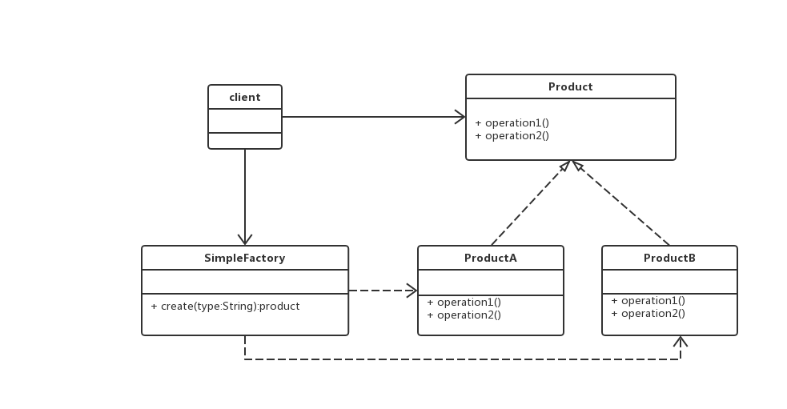
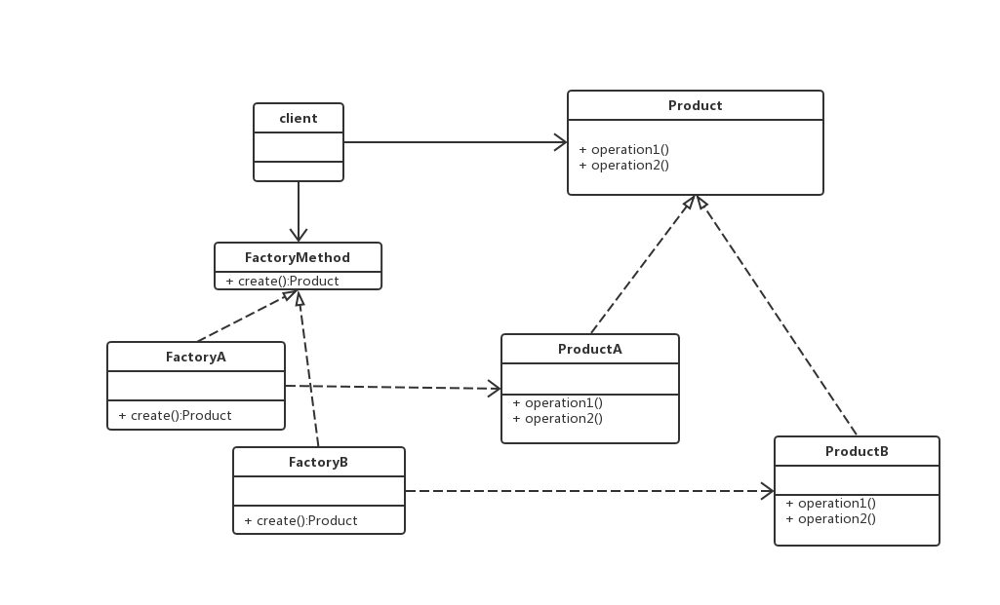
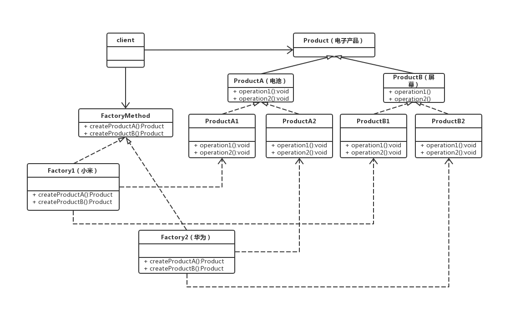
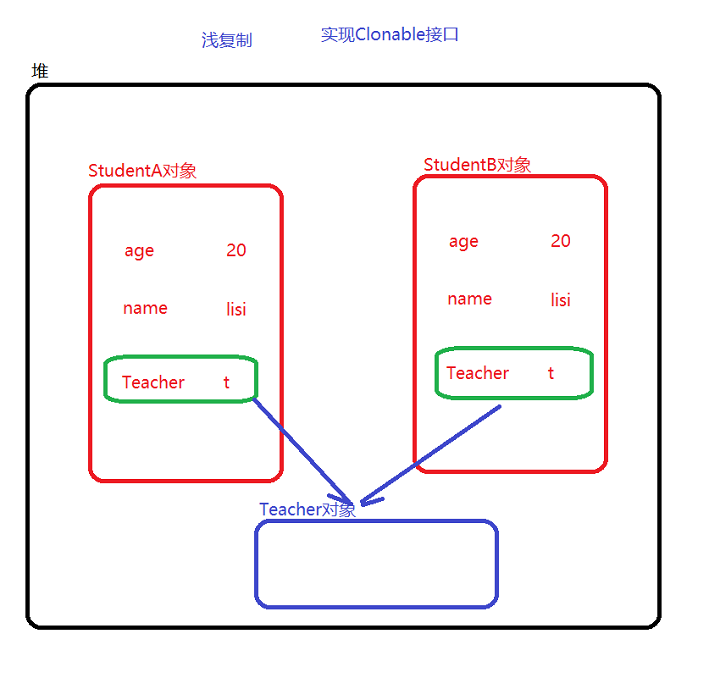
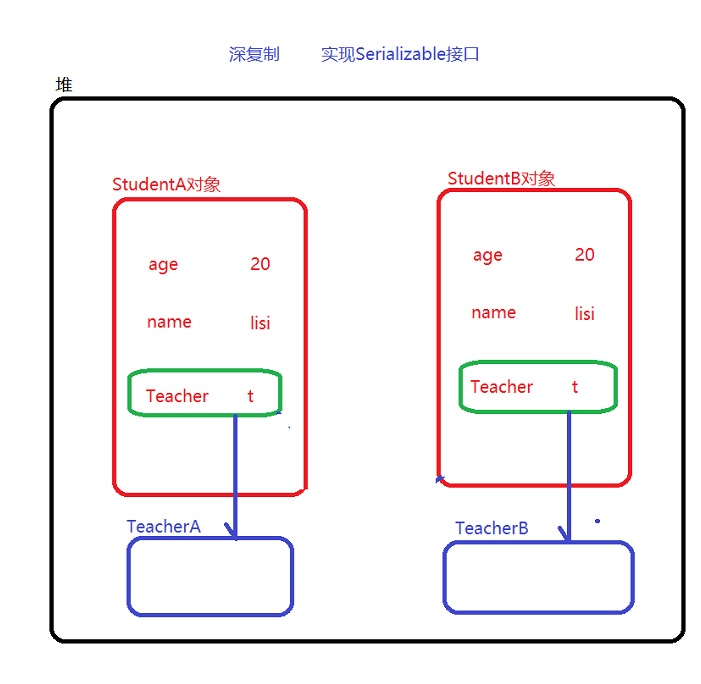

# 设计模式课程笔记

对于面向对象系统的设计而言，在支持**可维护性**的同时，提高系统的**可复用性**，是一个重要的问题。如何同时提高一个软件的可维护性和可复用性是面向对象设计需要解决的核心问题之一。

## 设计模式中的7大设计原则

### 开闭原则

**目的：**提高扩展性，便于维护

**含义：**对扩展开发，对修改关闭。即系统进行扩展是被鼓励的，对现有系统代码进行修改时不被支持的。也就是说，当软件有新的需求变更的时候，只需要通过对软件框架进行扩展来适应新的需求，而不是对框架内部的代码进行修改。

**解决：**开闭原则是设计原则的总纲，其他6种原则遵循得好，开闭原则自然就遵循得好。对需求的变更保持前瞻性和预见性，就可以使抽象具有更广泛适用性，设计出的软件架构就能相对稳定。软件需求中易变的细节，通过从抽象派生出实现类来扩展。

### 单一职责原则

**目的：**降低代码复杂度，系统解耦合，提高可读性

**含义：**对于一个类，只有一个引起该类变化的原因该类的职责是唯一的，且这个职责是唯一引起其类变化的原因。

**解决：**将不同的职责封装到不同的类或者模块中。当有新的需求将现有职责分为颗粒度更小的职责的时候，应该及时对现有代码进行重构。当系统逻辑足够简单，方法足够少，子类够少或后续关联够少时，也可以不必严格遵循SRP原则，避免过度设计、颗粒化过于严重

**实例：**电线类Wire为居民供电，电压为220V；但是新的需求增加，电线也输送高压电，电压为220KV，原有电线类可以增加方法实现扩充，这就违背了单一职责原则，可以提供基类，创建两个派生类，居民供电线，高压输电线。

### 接口隔离原则

**目的：**避免接口过于臃肿

**含义：**客户端不应该依赖它不需要的接口

**解决：**适度细化接口，将臃肿的接口拆分为独立的几个接口

**实例：**考试接口，包含考语数外、理化生、政史地等方法。学生类，实现考试接口，参加考试。文科生类、理科生类派生自学生类，实现考试接口时，都需要实现一些自己不需要的方法。这时，需要对考试接口进行细化，分为基础科考试接口、文科考试接口和理科考试接口；学生类实现基础科考试接口；文科生、理科生另外各自实现文科考试接口和理科考试接口。

### 里式替换原则

**目的：**避免系统继承体系被破坏

**含义：**所有引用基类的地方必须能够透明的使用其子类对象

**解决：**

- 子类必须实现父类的抽象方法，但不得重写（覆盖）父类的非抽象方法。
- 子类可以增加自己特有的方法
- 当子类覆盖或实现父类的方法时，方法的前置条件（形参）要比父类方法的输入更**宽松**(这样一来，相当于方法重载，不影响父类方法逻辑，可以满足里式替换的含义)
- 当子类的方法实现父类的抽象方法时，方法的后置条件（返回值）要比父类更**严格**。（不然编译报错）

**实例：**已经定义鸟类具有两个翅膀飞的方法；新加入鸵鸟，不会飞，如果覆盖父类的方法，在两个翅膀飞的方法中什么也不做，就违背了里式替换原则，应该创建并列的两种鸟基类，会飞的和不会飞的 ，都继承与鸟基类。父类接受HashMap形参，子类接受Map；父类返回Map子类返回HashMap

### 依赖倒置原则

**目的：**避免需求变化导致过多的维护工作

**含义：**高层模块不应该依赖底层模块，二者都应该依赖其抽象；抽象不应该依赖细节；细节应该依赖抽象

**解决：**面向接口编程，使用接口或者抽象类制定好规范和契约，而不去涉及任何具体的操作，吧展现细节的任务交给他们的实现类去完成。

**实例：**母亲类Mother有讲故事方法TellStory，依赖一个Book类输入，并使用了Book类的getContent方法以便讲故事。那么下次需要母亲讲报纸上的故事、手机上的故事时，原有接口无能为力。这时，抽象一个包含getContent党发的IReader基类，Book、Newspaper、Cellphone各自实现。母亲的TellStory方法接收一个IReader实例，并调用getContent方法即可

### 合成复用原则

**目的：**防止类的体系庞大

**含义：**当要扩展类的功能时，优先考虑使用合成/聚合，而不是继承

**解决：**当类于类之间的关系是“Is-A”时，用继承；当类于类之间的关系是“Has-A”时，用组合

**实例：**如JDBC中DbUtil的使用


### 最少认知原则

**目的：**降低类于类之间的耦合

**含义：**每一个软件单位对其他的单位都只有最少的认识，而且局限于那些于本单位密切相关的软件单位。

**解决：**不发生依赖、关联、组合、聚合等耦合关系的陌生类不要作为局部变量的形式出现在类的内部。

**实例：**中介模式

## 设计模式分类

**创建型模式：**简单工厂模式、工厂方法模式、抽象工厂模式、原型模式、单例模式、构建者模式

**结构型模式：**适配器模式、组合模式、装饰模式、桥接模式、外观模式、FlyWeight模式、代理模式

**行为型模式：**迭代器、模板方法、策略模式、仲裁者模式、访问者模式、命令模式、解释器模式、观察者模式、责任链模式、状态模式、备忘录模式

## 创建型设计模式

### 简单工厂模式

**介绍：**工厂类有一个工厂方法，接受一个参数，通过不同的参数实例化不同的产品类

**图示：**



**优点：**

- 简单工厂模式的特点就是“简单粗暴”，通过一个含参的工厂方法，我们可以实例化任何产品类，上至飞机火箭，下至土豆面条，无所不能
- 所以简单工厂有一个别名：上帝类

**缺点：**

- 在遵循开闭原则（多拓展开放，对修改关闭）的条件下，简单工厂对于增加新的产品，无能为力。因为增加新产品只能通过修改工厂方法来实现
- 入参不明确
- 任何东西的子类都可以背产生，负担太重。当所要生产产品种类非常多时，工厂方法的代码量可能会很庞大

**解决简单工厂的缺点：**

- 将对象名称和对象通过映射文件（XML）进行配置，读取到内存中建立映射关系
- 入参不明确，可以将入参设置为要查找对象的类名
- 通过对象名称，去map集合查找对象，只需要一行代码即可

**示例：**

- 普通工厂类

```java
public class AnimalFactory{
    //简单工厂设计模式（负担太重，不符合开闭原则）
    public static Animal createAnimal(String name){
        if("cat".equals(name)){
            return new Cat();
        }else if("dog".equals(name)){
            return new Dog();
        }else if("cow".equals(name)){
            return new Cow();
        }else{
            return null;
        }
    }
}
```

- 静态方法工厂

```java
public class AnimalFactory2{
    public static Dog createDog(){
        return new Dog();
    }
    public static Cat createCat(){
        return new Cat();
    }
}
```

### 工厂方法模式

**介绍：**工厂方法是针对每一种产品提供一个工厂，通过不同的工厂实例来创建不同的产品实例

**图示：**



**优点：**

- 工厂方法模式就很好的减轻了工厂类的负担，把某一类/某一种东西交由一个工厂生产
- 增加某一类“产品”并不需要修改工厂类，只需要添加生产这类“产品”的工厂即可，使得工厂类符合开闭原则

**缺点：**

- 对于某些可以形成产品族（一组产品）的情况处理比较复杂

**示例：**

- **抽象出来的工厂对象**

```java
//抽象出来的动物工厂--它只负责生产一种产品
public interface AnimalFactory{
    //工厂方法
    public Animal createAnimal();
}
```

- **具体工厂A**

```java
//具体的工厂实现类
public class CatFactory implements AnimalFactory{
    public Animal createAnimal(){
        return new Cat();
    }
}
```

- **具体工厂B**

```java
//具体工厂实现类
public class DogFactory implements AnimalFactory{
    public Animal createAnimal(){
        return new Dog();
    }
}
```

### 抽象工厂模式

**介绍：**

- **抽象工厂是应对产品族概念的**
- **工厂方法模式是一种极端情况的抽象工厂模式（即只生产一种产品的抽象工厂模式），而抽象工厂模式可以看成是工厂方法的一种推广**

**示例：**




**优点：**

- **与工厂模式相比，抽象工厂模式一个工厂可以生产多个产品**
-  **抽象工厂将抽象零件组装成抽象产品，易于增加具体的工厂** 

**缺点：**

- **不支持增加产品**

**示例：**

- **抽象出来的工厂方法，负责生产屏幕和电池**

```java
//抽象出来的工厂方法，负责生产屏幕和电池
public interface MobileFactory {
	public Battery createBattery();
	public Screen createScreen();
}
```

- **华为工厂**

```java
//华为工厂，负责生产华为的电池和屏幕
public class HwFactory implements MobileFactory{
	public Battery createBattery() {
		return new HwBattery();
	}
	public Screen createScreen() {
		return new HwScreen();
	}
}
```

- **苹果工厂**

```java
//苹果工厂负责生产苹果的电池和屏幕
public class AppleFactory implements MobileFactory{
	public Battery createBattery() {
		return new AppleBattery();
	}
	public Screen createScreen() {
		return new AppleScreen();
	}
}
```

### 工厂模式总结

- 如果要生产的产品的类型很多的话，其实建议使用简单工厂
- 只有要生产的产品类型不多的情况下，才考虑使用工厂方法模式和抽象工厂模式

### 原型模式

**介绍：**

- **原型模式虽然是创建型的模式，但是与工厂模式没有关系，从名字即可看出，该模式的思想就是**
  **将一个对象作为原型，对其进行复制、克隆，产生一个和原对象类似的新对象**
- **原型模式中包括浅复制（浅拷贝）和深复制（深拷贝）两种实现方式**

**浅复制：**浅复制指的只是对基本类型和String类型进行复制，没有对引用类型进行复制



**示例：**

```java
//实现Cloneable接口
public Object shallowClone() throws CloneNotSupportedException {
		// super.clone()其实就是调用了Object对象的clone方法
		// Object对象的clone方法是调用了native方法去在JVM中实现对象复制。
		// 此时不会调用构造方法去创建对象
		Prototype proto = (Prototype) super.clone();
		return proto;
	}
```


**深复制：**深复制指的就是对象的所有属性，都完全是新的，和原有的对象没有关系



**示例：**

```java
		/* 将对象序列化到二进制流 */
		ByteArrayOutputStream bos = new ByteArrayOutputStream();
		ObjectOutputStream oos = new ObjectOutputStream(bos);
		oos.writeObject(this);
		/* 从二进制流中读出产生的新对象 */
		ByteArrayInputStream bis = new ByteArrayInputStream(bos.toByteArray());
		ObjectInputStream ois = new ObjectInputStream(bis);
		return ois.readObject();
```

**原型模式的优点**：

- 根据客户端要求实现动态创建对象，客户端不需要知道对象的创建细节，便于代码的维护和扩展。
- 使用原型模式创建对象比直接new一个对象在性能上要好的多，因为Object类的clone方法是一
  个本地方法，它直接操作内存中的二进制流，特别是复制大对象时，性能的差别非常明显。

**使用原型模式注意事项：**

- 使用原型模式复制对象不会调用类的构造方法。
- 在使用时要注意深拷贝与浅拷贝的问题。

### 构建者模式

**介绍：**将一个复杂对象的构造与它的表示分离，是同样的构建过程可以创建不同的表示

**工厂模式和构建者模式的区别：**构建者模式和工厂模式很类似，区别在于构建者模式是一种个性化产品的创建。而工厂模式是一种标准化的产品创建

**示例：**

- **构建器**

```java
// 构建器
public class StudentBuilder {
	// 需要构建的对象
	private Student student = new Student();
	public StudentBuilder id(int id) {
		student.setId(id);
		return this;
	}
	public StudentBuilder name(String name) {
		student.setName(name);
		return this;
	}
	public StudentBuilder age(int age) {
		student.setAge(age);
		return this;
	}
	public StudentBuilder father(String fatherName) {
		Father father = new Father();
		father.setName(fatherName);
		student.setFather(father);
		return this;
	}
	// 构建对象
	public Student build() {
		return student;
	}
}
```

- **调用构建器构建对象**

```java
		StudentBuilder builder = new StudentBuilder();
		// 决定如何创建一个Student	builder.age(18).name("dili").father("wangjianlin");
		//根据不同的表示去创建对象（私人定制）
		Student student = builder.build();
		//builder.build(xxxxxxxx).build();
		System.out.println(student);
```

### 单例模式

**介绍：**单例对象（Singleton）是一种常用的设计模式。在Java应用中，单例对象能保证在一个JVM中，该对象
只有一个实例存在

**优点：**某些类创建比较频繁，对于一些大型的对象，这是一笔很大的系统开销

**单例模式的特征：**

- 构造私有
- 通过静态私有的成员变量去声明实例对象
- 通过静态公开的成员方法去获取实例对象

**饿汉式：**

类加载时便生成对象，不能做到延迟加载

```java
public Student{
    private Student(){}
    //static修饰的变量在new对象时，不存在多线程问题
    private static Student stu = new Student();

    public static getInstance(){
        return stu;
    }
}
```

**懒汉式：**

延迟加载（简单懒汉式）

```java
public class Test02 {
    //私有构造方法
    private Test02() {}
    //私有静态属性，延迟加载
    private static Test02 singleton = null;
    //同步方法如果不同步，会造成资源浪费
    //加锁之后，线程1获得锁，在没有执行完的时后交出来的CPU时间片，但是此时仍然拥有锁，其他线程获得CPU时间片
    //之后，也只能等待，依次类推，效率非常低
    public synchronized static Test02 getInstance() {
        if(singleton == null) {
            singleton = new Test02();
        }
        return singleton;
    }
}
```

私有内部内模式，构建器模式

```java
public class Test04 {
    private Test04() {}
    //构建器模式
    private static class SingletonBuilder{
        private static final Test04 singleton = new Test04(); 
    }
    public Test04 getInstance() {
        return SingletonBuilder.singleton;
    }
}
```

双重检查锁

```java
public class Student4 {
	private static Student4 student = null;
	private Student4() {}
	// 此处考验对synchronized知识点的掌握情况
	public static Student4 getSingletonInstance() {
		if (student == null) {
			// 采用这种方式，对于对象的选择会有问题
			// JVM优化机制：先分配内存空间，再初始化
			synchronized (Student4.class) {
				if (student == null) {
					student = new Student4();//高级语言一行，在字节码里可能是很多步骤
					//student.setName("ss")
					//new --- 开辟JVM中堆空间---产生堆内存地址保存到栈内存的student引用中---创建对象
					// 存在的问题：
                    //a.new 关键字会触发Student类的类加载（如果已经加载，则此步骤作废）
                    //b.根据Class对象中的信息，去开辟相应大小的内存空间
                    //c.初始化Student对象，就是完成成员变量的初始化操作（到这一部，我们才能说该对象是可用的）
                    //d.将开辟出来的内存空间地址，赋值给栈空间的变量student（引用）
                    //以上步骤，其实都是通过字节码指令去完成的
                    //物理机器直接操作的都是CPU指令，二进制代码（原子性其实是相对我们CPU指令来说的）
                    //指令重排序（JIT编译器优化）
                    //有序性 int x = 10;
                    //		boolean f = false;
                    //		x++;
                    //		flag = true;
                    //happend-before(六大原则)
                    //如果两行代码执行顺序交换后不会影响最终的程序执行结果，那么JIT即时编译器会根据情况去进行指令重排序
                    //如果程序之间没有依赖性，则可以进行指令重排序
                    //而以上代码中，c和d之间没有依赖性（因为d可以先执行，因为内存空间已经开辟出来了），所以可能会指令重排序
                    //当该线程走到d步骤时，这个时候student已经被分配空间了不为空，但是，此时student还未完成，直接调用会报错，而刚刚好另外一个线程走到了第一次空值判断，判断结构不为空，直接返回使用报错
                    //这个时候，就该volatile出场了
				}
			}
		}
		return student;
	}
	//student.getName();
}
```

