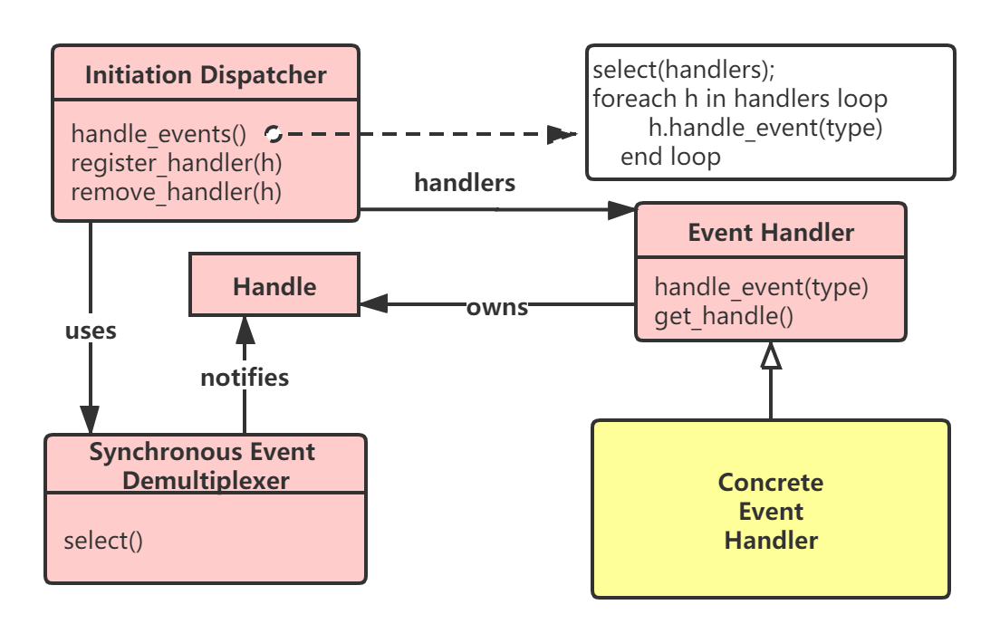
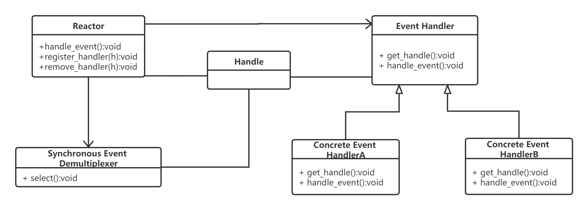
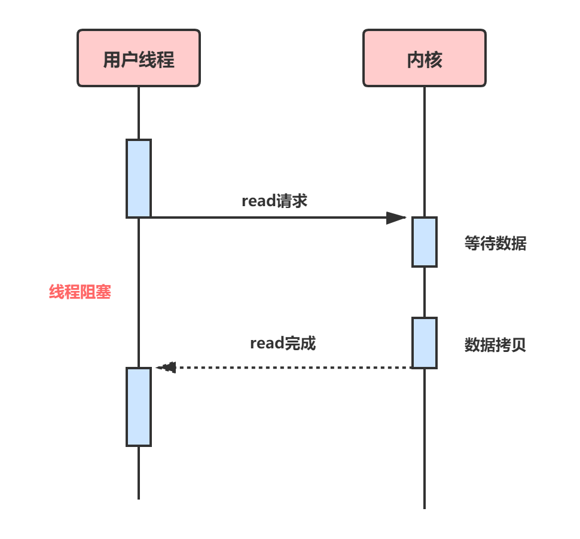
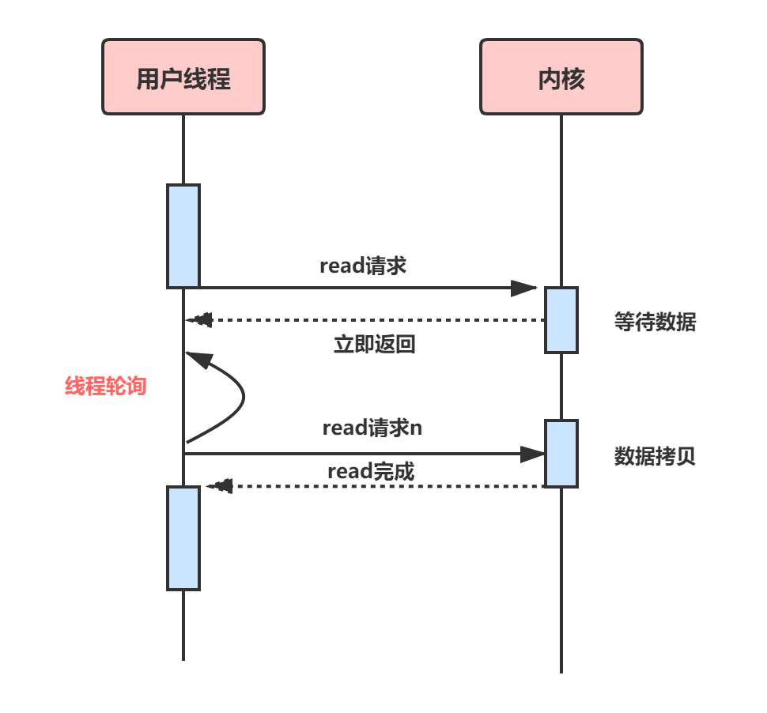
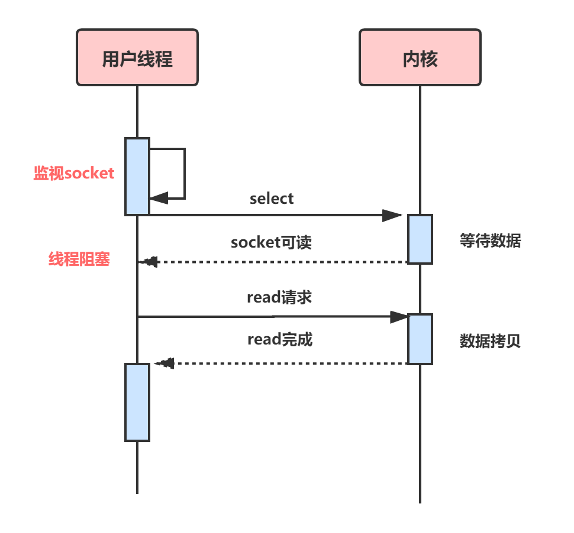
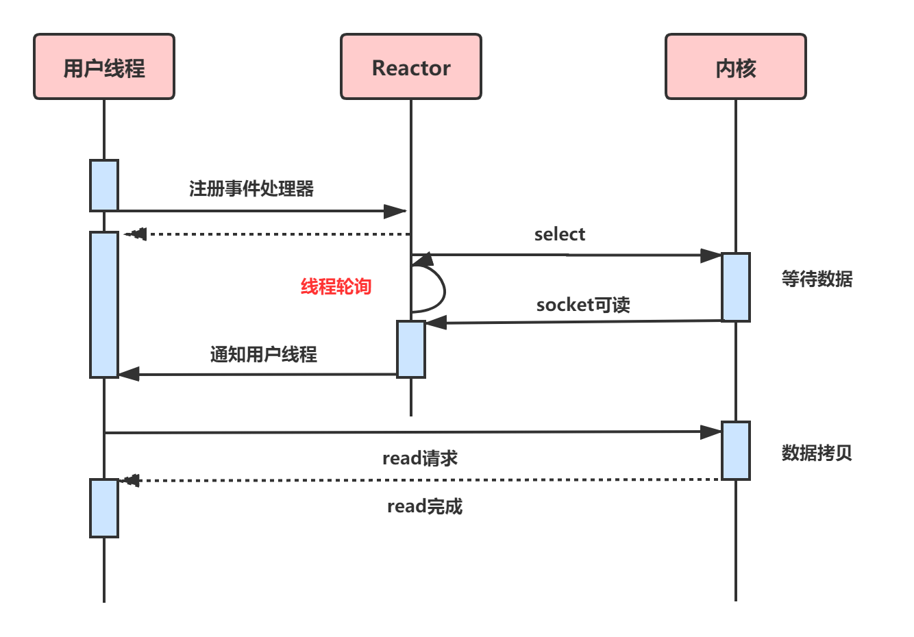

# 用户空间和内核空间

> **User space(用户空间)**：是用户程序的运行空间。
>
> **Kernel space(内核空间)**：是内核的运行空间。

为了安全，用户空间和内核空间是隔离的，即使用户程序崩溃了，内核也不受影响。

Kernel space可以执行任意命令，调用系统的一切资源；User space只能执行简单的运算，不能直接调用系统资源，必须通过系统接口（system call），才能向内核发出指令。

通过同接口，进程可以从用户空间切换到内核空间。

```shell
str = "my string" // 用户空间
x = x + 2
file.write(str) // 切换到内核空间
y = x + 4 // 切换回用户空间
```

上面代码中，第一行和第二行都是简单的赋值运算，在 User space 执行。第三行需要写入文件，就要切换到Kernel space，因为用户不能直接写文件，必须通过内核安排。第四行又是赋值运算，就切换回 User space。

# PIO与DMA

有必要简单地说说慢速I/O设备和内存之间的数据传输方式。

- PIO 我们拿磁盘来说，很早以前，磁盘和内存之间的数据传输是需要CPU控制的，也就是说如果我们读取磁盘文件到内存中，数据要经过CPU存储转发，这种方式称为PIO。显然这种方式非常不合理，需要占用大量的CPU时间来读取文件，造成文件访问时系统几乎停止响应。
- DMA 后来，DMA（直接内存访问，Direct Memory Access）取代了PIO，它可以不经过CPU而直接进行磁盘和内存（内核空间）的数据交换。在DMA模式下，CPU只需要向DMA控制器下达指令，让DMA控制器来处理数据的传送即可，DMA控制器通过系统总线来传输数据，传送完毕再通知CPU，这样就在很大程度上降低了CPU占有率，大大节省了系统资源，而它的传输速度与PIO的差异其实并不十分明显，因为这主要取决于慢速设备的速度。

# 缓存IO和直接IO

> 缓存IO：数据从磁盘先通过DMA copy到内核空间，再从内核空间通过cpu copy到用户空间
>
> 直接IO：数据从磁盘通过DMA copy到用户空间

## 缓存IO

**缓存I/O又被称作标准I/O，大多数文件系统的默认I/O操作都是缓存I/O**。在linux的缓存I/O机制中，数据先从磁盘复制到内核空间的缓冲区，然后从内核空间缓冲区复制到应用程序的地址空间。

- 读操作

  操作系统检查内核的缓冲区有没有需要的数据，如果已经缓存了，那么就直接从缓存中返回；否则从磁盘中读取，然后缓存在操作系统的缓存中。

- 写操作

  将数据从用户空间复制到内核空间的缓存中。这时对用户程序来说，写操作就已经完成，至于什么时候再写到磁盘中，有操作系统决定，除非显示地调用了sync同步命令

- 缓存I/O的优点

  - 在一定程度上分离内核空间和用户空间，保护系统本身的运行安全。
- 可以减少读盘的次数，从而提高性能
  
- 缓存I/O的缺点

  - 在缓存I/O机制中，DMA方式可以将数据直接从磁盘读到页缓存中，或者将数据从页缓存直接写回到磁盘上，而不能直接在应用程序地址空间和磁盘之间进行传输，这样，数据在传输过程中需要在应用程序地址空间（用户空间）和缓存（内核空间）之间进行多次数据拷贝操作，这些数据拷贝操作带来的CPU以及内存开销很大。

## 直接IO

**直接IO就是应用程序直接访问磁盘数据，而不经过内核缓冲区，也就是绕过内核缓冲区，自己管理I/O缓冲区，这样做的目的是减少一次从内核缓冲区到用户缓存的数据复制**

引入内核缓冲区的目的在于提高磁盘文件的访问性能，因为当进程需要读取磁盘文件时，如果文件内容已经在内核缓冲区中，那么就不需要再次访问磁盘；而当进程需要向文件中写入数据时，实际上只是写到了内核缓冲区便告诉进程已经写成功，而真正写入磁盘是通过一定的策略进行延迟的。

然而，对于一些较复杂的应用，比如数据库服务器，它们为了充分提高性能，希望绕过内核缓冲区，由自己在用户态空间实现并管理I/O缓冲区，包括缓存机制和写延迟机制等，以支持独特的查询机制，比如数据库可以根据更加合理的策略来提高查询缓存命中率。另一方面，绕过内核缓冲区也可以减少系统内存的开销，因为内核缓冲区本身就在使用系统内存。

应用程序直接访问磁盘数据，不经过操作系统内核数据缓冲区，这样做的目的是减少一次从内核缓冲区到用户程序缓存的数据复制。这种方式通常是在对数据的缓存管理由应用程序实现的数据库管理系统中。

直接I/O的缺点就是如果访问的数据不在应用程序缓存中，那么每次数据都会直接从磁盘进行加载，这种直接加载会非常缓慢。通常直接I/O跟异步I/O结合使用会得到较好的性能。


# IO访问方式

## 磁盘IO

当应用程序调用read接口时，操作系统检查在内核的高速缓存有没有需要的数据，如果已经缓存了，那么就直接从缓存中返回，如果没有，则从磁盘中读取，然后缓存在操作系统的缓存中。

应用程序调用write接口时，将数据从用户地址空间复制到内核地址空间的缓存中，这时对用户程序来说，写操作已经完成，至于什么时候再写到磁盘中，由操作系统决定，除非显示调用了sync同步命令。

## 网络IO

1. 操作系统将数据从磁盘复制到操作系统内核的页缓存中
2. 应用将数据从内核缓存复制到应用的缓存中
3. 应用将数据写回内核的Socket缓存中
4. 操作系统将数据从Socket缓存区复制到网卡缓存，然后将其通过网络发出

从上面的过程可以看出，数据白白从内核模式到用户模式走了一圈，浪费了两次copy，而这两次copy都是CPU copy，即占用CPU资源。

## 磁盘IO和网络IO对比

首先，磁盘IO主要的延时是由（以15000rpm硬盘为例）： 机械转动延时（机械磁盘的主要性能瓶颈，平均为2ms） + 寻址延时（2~3ms） + 块传输延时（一般4k每块，40m/s的传输速度，延时一般为0.1ms) 决定。（平均为5ms）

而网络IO主要延是由： 服务器响应延时 + 带宽限制 + 网络延时 + 跳转路由延时 + 本地接收延时 决定。（一般为几十到几千毫秒，受环境干扰极大）所以两者一般来说网络IO延时要大于磁盘IO的延时。

# Socket网络编程

## 客户端

```java
public class SocketClient {
	public static void main(String args[]) throws Exception {
		// 要连接的服务端IP地址和端口
		String host = "127.0.0.1";
		int port = 55533;
		// 与服务端建立连接
		Socket socket = new Socket(host, port);
		// 建立连接后获得输出流
		OutputStream outputStream = socket.getOutputStream();
		String message="你好 yiwangzhibujian";
		socket.getOutputStream().write(message.getBytes("UTF-8"));
		outputStream.close();
		socket.close();
	}
}
```

## 服务端

```java
public class SocketServer {
	public static void main(String[] args) throws Exception {
		// 监听指定的端口
		int port = 55533;
		ServerSocket server = new ServerSocket(port);
		// server将一直等待连接的到来
		System.out.println("server将一直等待连接的到来");
		Socket socket = server.accept();
		// 建立好连接后，从socket中获取输入流，并建立缓冲区进行读取
		InputStream inputStream = socket.getInputStream();
		byte[] bytes = new byte[1024];
		int len;
		StringBuilder sb = new StringBuilder();
		while ((len = inputStream.read(bytes)) != -1) {
			//注意指定编码格式，发送方和接收方一定要统一，建议使用UTF-8
			sb.append(new String(bytes, 0, len,"UTF-8"));
		}
		System.out.println("get message from client: " + sb);
		inputStream.close();
		socket.close();
		server.close();
	}
}
```

```java
public class SocketServer {
	public static void main(String args[]) throws IOException {
		// 监听指定的端口
		int port = 55533;
		ServerSocket server = new ServerSocket(port);
		// server将一直等待连接的到来
		System.out.println("server将一直等待连接的到来");
		while(true){
			Socket socket = server.accept();
			// 建立好连接后，从socket中获取输入流，并建立缓冲区进行读取
			InputStream inputStream = socket.getInputStream();
			byte[] bytes = new byte[1024];
			int len;
			StringBuilder sb = new StringBuilder();
			while ((len = inputStream.read(bytes)) != -1) {
				// 注意指定编码格式，发送方和接收方一定要统一，建议使用UTF-8
				sb.append(new String(bytes, 0, len, "UTF-8"));
			}
			System.out.println("get message from client: " + sb);
			inputStream.close();
			socket.close();
		}
	}
}
```

```java
public class SocketServer {
	public static void main(String args[]) throws Exception {
		// 监听指定的端口
		int port = 55533;
		ServerSocket server = new ServerSocket(port);
		// server将一直等待连接的到来
		System.out.println("server将一直等待连接的到来");
		//如果使用多线程，那就需要线程池，防止并发过高时创建过多线程耗尽资源
		ExecutorService threadPool = Executors.newFixedThreadPool(100);
		while (true) {
    		Socket socket = server.accept();
			Runnable runnable=()->{
					try {
					// 建立好连接后，从socket中获取输入流，并建立缓冲区进行读取
					InputStream inputStream = socket.getInputStream();
					byte[] bytes = new byte[1024];
					int len;
					StringBuilder sb = new StringBuilder();
					while ((len = inputStream.read(bytes)) != -1) {
						// 注意指定编码格式，发送方和接收方一定要统一，建议使用UTF-8
						sb.append(new String(bytes, 0, len, "UTF-8"));
					}
					System.out.println("get message from client: " + sb);
					inputStream.close();
					socket.close();
					} catch (Exception e) {
						e.printStackTrace();
					}
			};
			threadPool.submit(runnable);
		}
	}
}
```

问题：如果一百万个请求来了，难道开一百万个线程吗？


# 同步IO和异步IO

同步和异步时针对应用程序和内核的交互而言的，同步指的是用户进程触发IO操作并等待或者轮询的去查看IO操作是否就绪，而异步时指用户进程触发IO操作以后便开始做自己的事情，而当IO操作已经完成的时候会得到IO完成的通知。

> 指的是用户空间和内核空间数据交互的方式
>
> ​		同步：用户空间要的数据，必须等待内核空间给它才做其他事情
>
> ​		异步：用户空间要的数据，不需要等到内核空间给它，才做其他事情。内核空间会异步通知用户进程，并把数据给到用户空间。

# 阻塞IO和非阻塞IO

阻塞方式下读取或写入函数将一直等待，而非阻塞方式下，读取或写入函数会立即返回一个状态值

> 指的是用户空间和内核空间IO操作的方式：
>
> ​		堵塞：用户空间通过系统调用（systemcall）和内核空间发送IO操作时，该调用时堵塞的
>
> ​		非堵塞：用户空间通过系统调用（systemcall）和内核空间发送IO操作时，该调用时不堵塞的，直接返回的，只是返回时，可能没有数据。


# IO设计模式之Reactor和Proactor

平时接触的开源产品如Redis、ACE，事件模型都使用的Reactor模式；而同样做事件处理的Proactor，由于操作系统的原因，相关的开源产品也少，这里学习下其模型结构，重点对比下两张的异同点。

## 反应器Reactor

### 概述

**反应器设计模式（Reactor pattern）是一种为处理并发服务请求，并将请求提交到一个或者多个服务器处理程序的事件设计模式。当客户端请求抵达后，服务器处理程序使用多路分配策略，有一个非阻塞的线程来接收所有的请求，然后派发这些请求至相关的工作线程进行处理。**

Reactor模式主要包含下面几部分内容：

- **初始事件分发器（Initialization Dispatcher）：**用于管理Event Handler，定义注册、移除EventHandler等，它还作为Reactor模式的入口调用Synchronous Event Demultiplexer的select方法以阻塞等待事件返回，当阻塞等待返回时，根据时间发生的Handle将其分发给对应的Event Handler处理，即回调EventHandler的handle_event()方法
- **同步（多路）事件分离器（Synchronous Event Demultiplexer）：**无限循环等待新事件的到来，一旦发现有新的时间到来，就会通知初始事件分发器去调取特定的时间处理器。
- **系统处理程序（Handles）：**操作系统中的句柄，是对资源在操作系统层面上的一种抽象，它可以是打开的文件、一个连接（Socket）、Timer等。有Reactor模式一般使用在网络编程中，因而这里一般指Socket Handle，即一个网络连接（Connection，在Java NIO中的Channel）这个Channel注册到Synchronous Event Demultiplexer中，以监听Handle中发生的事件，对ServerSocketChannel可以是CONNECT事件，对SocketChannel可以使READ、WRITE、CLOSE事件等。
- **事件处理器（Event handler）:**定义事件处理方法，以供Initialization Dispatcher回调使用。

对于Reactor模式，可以将其看做由两部分组成，一部分是由Boss组成，另一部分是由worker组成。Boss就像老板一样，主要是拉活儿、谈项目，一旦Boss接到活儿了，就下给下面的work去处理。也可以看做是项目经理和程序员之间的关系。

## 为什么使用Reactor模式

**并发系统常使用reactor模式代替常用的多线程处理方式，节省系统的资源，提高系统的吞吐量。**

**多线程的处理**

> 每个单独到来的请求，专门启动一条线程，这样的话造成系统的开销很大，并且在单核机上，多线程并不能提高系统的性能，除非有一些阻塞情况发生。否则线程切换的开销会使处理的速度变慢。

**Reactor模式的处理**

> 服务器端启动一条单线程，用于轮询IO操作是否就绪，当有就绪的才进行相应的读写操作，这样的话就减少了服务器产生大量的线程，也不会出现线程之间的切换产生的性能消耗。

**以上两种处理方式都是基于同步的，多线程的处理是我们传统模式下对高并发的处理方式，Reactor模式的处理是现今面对高并发和高性能的一种主流的处理方式。**

### **Reactor模式结构**




Reactor包含如下角色：

- handle 句柄；用来表示socket连接或是打开文件
- Synchronous Event Demultiplexer:同步事件多路分解器：由操作系统内核实现的一个函数；用于阻塞等待发生在句柄集合上的一个或多个事件（如select/epoll）
- Event Handler：事件处理接口
- Concrete Event HandlerA:实现应用程序所提供的特定事件处理逻辑
- Reactor：反应器，定义一个接口，实现以下功能
  - 供应用程序注册和删除关注的时间句柄
  - 运行事件循环
  - 有就绪事件到来时，分发事件到之前注册的回调函数上处理
- Initiation Dispatcher:用于管理Event Handler，即EventHandler的容器，用于注册、移除EventHander等；另外，它还作为Reactor模式的入口调用Synchronous Event Demultiplexer的select方法以阻塞等待事件返回，当阻塞等待返回时，根据事件发生的Handle将其分发给对应的Event Handler处理，即回调EventHandler中的handle_event()方法。

### **业务流程及时序图**

.png)

1. 应用启动，将关注的时间handler注册到Reactor中
2. 调用Reactor，仅需无限事件循环，等待注册的事件到来
3. 事件到来，select返回，Reactor将事件分发到之前注册的回调函数中处理

## Proactor模式

运用于异步I/O操作，Proactor模式中，应用程序不需要进行实际的读写过程，它只需要从缓存区读取或者写入即可，操作系统会读取缓存区或者写入缓存区到真正的IO设备.

### TODO


# 漫谈五种IO模型

服务器端编程经常需要构造高性能的IO模型，常见的IO模型有四种：

1. 同步阻塞IO（Blocking IO）：即传统的IO模型。
2. 同步非阻塞IO（Non-Blocking IO）:默认创建的Socket都是阻塞的，非阻塞IO要求socket被设置为NONBLOCK。注意这里所说的NIO并非java的NIO
3. IO多路复用（IO Multiplexing）:即经典的Reactor设计模式，有事也称为异步阻塞IO，Java中Selector和Linux中的epoll都是这种模型
4. 异步IO（Asynchronous IO）：即经典的Proactor设计模式，也称为异步非阻塞IO

## IO模型举例理解1

> 1. 阻塞IO, 给女神发一条短信, 说我来找你了, 然后就默默的一直等着女神下楼, 这个期间除了等待你不会做其他事情, 属于备胎做法.
>
> 1. 非阻塞IO, 给女神发短信, 如果不回, 接着再发, 一直发到女神下楼, 这个期间你除了发短信等待不会做其他事情, 属于专一做法.
>
> 1. IO多路复用, 是找一个宿管大妈来帮你监视下楼的女生, 这个期间你可以些其他的事情. 例如可以顺便看看其他妹子,玩玩王者荣耀, 上个厕所等等. IO复用又包括 select, poll, epoll 模式. 那么它们的区别是什么? 
>
> 1.  select大妈 每一个女生下楼, select大妈都不知道这个是不是你的女神, 她需要
>   一个一个询问, 并且select大妈能力还有限, 最多一次帮你监视1024个妹子 
> 2. poll大妈不限制盯着女生的数量, 只要是经过宿舍楼门口的女生, 都会帮你去问是不是你女神 
> 3. epoll大妈不限制盯着女生的数量, 并且也不需要一个一个去问. 那么如何做呢epoll大妈会为每个进宿舍楼的女生脸上贴上一个大字条,上面写上女生自己的名字, 只要女生下楼了, epoll大妈就知道这个是不是你女神了, 然后大妈再通知你.
>
> 上面这些同步IO有一个共同点就是, 当女神走出宿舍门口的时候, 你已经站在宿舍门口等着女神的, 此时你属于同步等待状态
>
> 接下来是异步IO的情况 你告诉女神我来了, 然后你就去王者荣耀了, 一直到女神下楼了, 发现找不见你了,女神再给你打电话通知你, 说我下楼了, 你在哪呢? 这时候你才来到宿舍门口. 此时属于逆袭做法

## IO模型举例理解2

> 1.阻塞I/O模型 老李去火车站买票，排队三天买到一张退票。 耗费：在车站吃喝拉撒睡 3天，其他事一件没干。
>
> 2.非阻塞I/O模型 老李去火车站买票，隔12小时去火车站问有没有退票，三天后买到一张票。耗费：往返车站6次，路上6小时，其他时间做了好多事。
>
> 3.I/O复用模型 
>
> ​	1.select/poll 老李去火车站买票，委托黄牛，然后每隔6小时电话黄牛询问，黄牛三天	内买到票，然后老李去火车站交钱领票。 耗费：往返车站2次，路上2小时，黄牛手续	费100元，打电话17次
>
> ​	2.epoll 老李去火车站买票，委托黄牛，黄牛买到后即通知老李去领，然后老李去火车	站交钱领票。 耗费：往返车站2次，路上2小时，黄牛手续费100元，无需打电话
>
> 4.信号驱动I/O模型 老李去火车站买票，给售票员留下电话，有票后，售票员电话通知老李，然后老李去火车站交钱领票。 耗费：往返车站2次，路上2小时，免黄牛费100元，无需打电话
>
> 5.异步I/O模型 老李去火车站买票，给售票员留下电话，有票后，售票员电话通知老李并快递送票上门。 耗费：往返车站1次，路上1小时，免黄牛费100元，无需打电话

## 同步阻塞IO

同步阻塞IO模型时最简单的IO模型，用户线程在内核进行IO操作时被阻塞



如图所示，用户线程通过系统调用read发起IO读操作，由用户空间转到内核空间。内核空间等到数据包到达后，将接受到的数据拷贝到用户空间，完成read操作

```java
{
    read(socket,buffer);
    process(buffer);
}
```

即用户需要等到read将socket中的数据读取到buffer后，才继续处理接受的数据。整个IO请求过程中，用户线程时被阻塞的，这导致用户在发起IO请求时，不能做任何事情，对CPU的资源利用率不够。


## 同步非阻塞IO

同步非阻塞IO是在同步阻塞IO的基础上，将socket设置为NONBLOCK。这样做用户线程可以在发起IO请求后可以立即返回



如图：由于socket是非阻塞方式，因此用户线程发起IO请求时立即返回。但并未读取到任何数据，用户线程需要不断地发起IO请求，直到数据到达后，才真正读取到数据，继续执行

```java
{
    while(read(socket,buffer) != SUCCESS);
    process(buffer);
}
```

即用户需要不断地调用read，尝试读取socket中的数据，直到读取成功后，才继续处理接收的数据。整个IO请求的过程中，虽然用户线程每次发起IO请求后可以立即返回，但是为了等到数据，仍需要不断地轮询、重复请求，消耗了大量的CPU的资源。一般很少直接使用这种模型，而是在其他IO模型中使用非阻塞IO这一特性。


## IO多路复用

IO多路复用模型是建立在内核提供的多路分离函数select基础之上的，使用select函数可以避免同步非阻塞IO模型中轮询等待的问题。



如图，用户首先将需要进行IO操作的socket添加到select中，然后阻塞等待select系统调用返回。当数据到达时，socket被激活，select函数返回。用户线程正式发起read请求，读取数据并继续执行。

从流程上来看，使用select函数进行IO请求和同步阻塞模型没有太大的区别，甚至还多了添加监视socket，以及调用select函数的额外操作，效率更差。但是，使用select以后最大的优势是用户可以在一个线程内同时处理多个socket的IO请求。用户可以注册多个socket，然后不断的调用select读取被激活的socket，即可达到在同一线程内同时处理多个IO请求的目的。而在同步阻塞模型中，必须通过多线程的方式才能达到这个目的。

```java
{
    select(socket);
    while(1){
        sockets = select();
        for(socket in sockets){
            if(can_read(socket)){
                read(socket,buffer);
                process(buffer);
            }
        }
    }
}
```

其中while循环前将socket添加到select监视中，然后在while内一直调用select获取被激活的socket，一旦socket可读，便调用read函数将socket中的数据读取出来。

然而，使用select函数的优点并不仅限于此。虽然上述方式允许单线程内处理多个IO请求，但是每个IO请求的过程还是阻塞的（在select函数上阻塞），平均时间甚至比同步阻塞IO模型还要长。

**如果用户线程只注册自己感兴趣的socket或者IO请求，然后去做自己的事情，等到数据到来时再进行处理，则可以提高CPU的利用率。**

**IO多路复用模型使用了Reactor设计模式实现了这一机制。**



如图，通过Reactor的方式，可以将用户线程轮询IO操作状态的工作统一交给handle_events事件循环进行处理。用户线程注册事件处理器之后可以继续执行做其他的工作（异步），而Reactor线程负责调用内核的select函数检查socket状态。当有socket被激活时，则通知相应的用户线程（或执行用户线程的回调函数），执行handle_event进行数据读取、处理的工作。由于select函数是阻塞的，因此多路IO复用模型也被称为异步阻塞IO模型。注意，这里的所说的阻塞是指select函数执行时线程被阻塞，而不是指socket。一般在使用IO多路复用模型时，socket都是设置为NONBLOCK的，不过这并不会产生影响，因为用户发起IO请求时，数据已经到达了，用户线程一定不会被阻塞。

```java
void UserEventHandler::handle_event(){
    if(can_read(socket)){
        read(socket,buffer);
        process(buffer);
    }
}
{
    Reactor.register(new UserEventHandler(socket));
}
```

用户需要重写EventHandler的handle_event函数进行读取数据、处理的工作，用户线程只需要将自己的EventHandler注册到Reactor即可。Reactor中handle_event事件循环的伪代码如下

