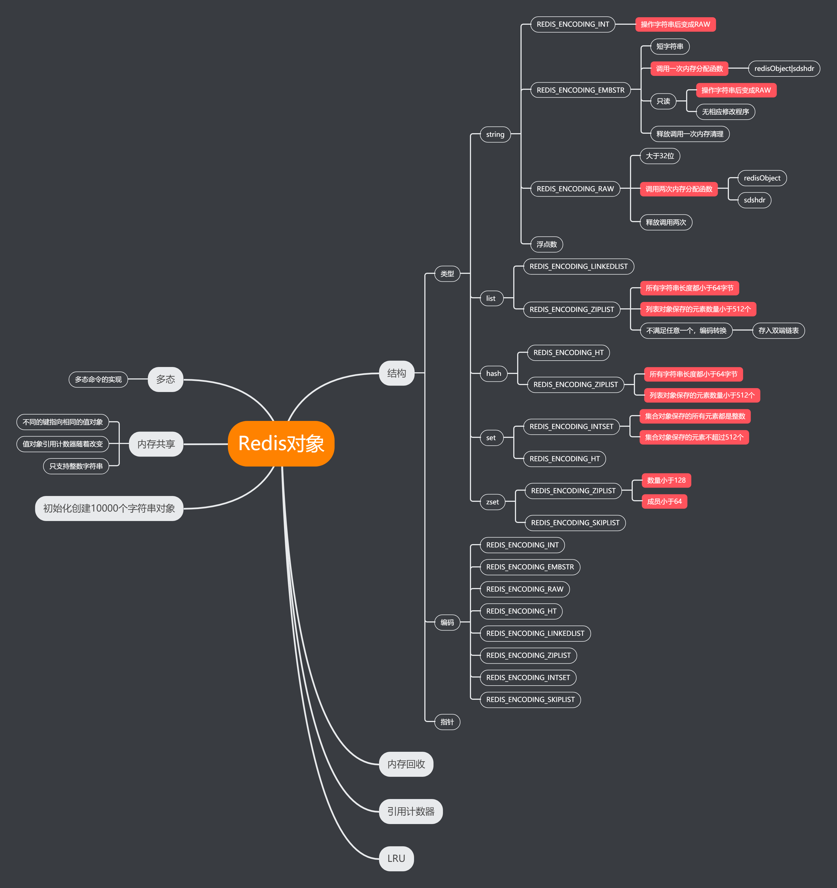
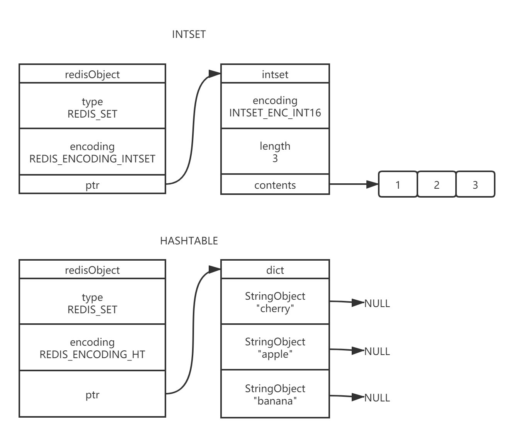

# Redis介绍

## 什么是Redis

- Redis是用C语言开发的一个**开源**的高性能**键值对**（key-value）内存数据库，它是一种NoSQL数据库
- 它是【单进程单线程】的内存数据库，所以不存在线程安全问题
- 它可以支持并发10W QPS，所以说性能非常优秀。之所以单进程单线程性能还那么好，是因为底层采用了【IO多路复用】
- 相比Memcache这种专业缓存技术，它有更优秀的读写性能，及丰富的数据类型。
- 它提供了**五种数据类型**来储存【值】：字符串类型(string)、散列类型（hash）、列表类型（list）、集合类型（set）、有序集合类型（sortedset、zset）

## 什么是NoSQL

- NoSQL，即Not-Only SQL(不仅仅是SQL)，泛指**非关系型数据库**
- NoSQL数据库是为了解决**高并发、高可用、高可扩展、大数据存储**问题而产生的数据库解决方案。
- NoSQL可以作为关系型数据库的良好补充，但是不能替代关系型数据库。

## Redis应用场景

- **内存数据库**（登录信息，购物车信息、用户浏览记录等）
- **缓存服务器**（商品数据、广告数据等等）（**最多使用**）
- 解决分布式集群架构中的session分离问题（session共享）
- 任务队列（秒杀、抢购、12306等等）
- 分布式锁的实现
- 支持发布订阅的消息模式
- 应用排行榜（有序集合）
- 网站访问统计
- **数据过期处理（可以精确到毫秒）**


# Redis内存模型

## Redis内存统计

```shell
127.0.0.1:6379> info memory
# Memory
#Redis分配的内存总量,包括虚拟内存(字节)
used_memory:853464
#占操作系统的内存，不包括虚拟内存(字节)
used_memory_rss:12247040
#内存碎片比例 如果小于0说明使用了虚拟内存
mem_fragmentation_ratio:15.07
#Redis使用的内存分配器
mem_allocator:jemalloc-5.1.0
```

## Redis内存分配

### 数据

作为数据库，数据是最主要的部分；这部分占用的内存会统计在 used_memory 中。

Redis 使用键值对存储数据，其中的值（对象）包括 5 种类型，即字符串、哈希、列表、集合、有序集合。

这 5 种类型是 Redis 对外提供的，实际上，在 Redis 内部，每种类型可能有 2 种或更多的内部编码实现。

### 进程0

Redis 主进程本身运行肯定需要占用内存，如代码、常量池等等；这部分内存大约几M，在大多数生产环境中与 Redis 数据占用的内存相比可以忽略。

这部分内存不是由 jemalloc 分配，因此不会统计在 used_memory 中。

补充说明：除了主进程外，Redis 创建的子进程运行也会占用内存，如 Redis 执行 AOF、RDB 重写时创建的子进程。

当然，这部分内存不属于 Redis 进程，也不会统计在 used_memory 和 used_memory_rss 中。

### 缓冲内存

缓冲内存包括客户端缓冲区、复制积压缓冲区、AOF 缓冲区等；其中，客户端缓冲区存储客户端连接的输入输出缓冲；复制积压缓冲区用于部分复制功能；AOF 缓冲区用于在进行 AOF 重写时，保存最近的写入命令。

### 内存碎片

   内存碎片是 Redis 在分配、回收物理内存过程中产生的。例如，如果对数据的更改频繁，而且数据之间
的大小相差很大，可能导致 Redis 释放的空间在物理内存中并没有释放但 Redis 又无法有效利用，这就形成了内存碎片，内存碎片不会统计在 used_memory 中内存碎片的产生与对数据进行的操作、数据的特点等都有关；此外，与使用的内存分配器也有关系：如果内存分配器设计合理，可以尽可能的减少内存碎片的产生。如果 Redis 服务器中的内存碎片已经很大，可以**通过安全重启的方式减小内存碎片：因为重启之后，Redis 重新从备份文件中读取数据，在内存中进行重排，为每个数据重新选择合适的内存单元，减小内存碎片。**

# Redis数据结构

## 简单动态字符串（SDS）

在Redis里面，C字符串只会作为字符串字面量（string literal）用在一些无需对字符串值进行修改的地方，比如打印日志。

```shell
redisLog(REDIS_WARNING,"Redis is now ready to exit, bye bye...");
```

当Redis需要的不仅仅是一个字符串字面量，而是一个可以被修改的字符串值时，Reids就会使用SDS(simple dynamic string, SDS)来表示字符串值，比如在Redis的数据库里面，包含字符串值得键值对在底层都是由SDS实现的。

### SDS的定义

```c
struct sdshdr{
    //记录buf数组中已使用字节的数量
    //等于SDS锁保存字符串的长度
    int len;
    
    //记录buf数组中未使用字节的数量
    int free;
    //字节数组，用于保存字符串
    char buf[];
}
```

### SDS与C字符串的区别

#### 获取长度的时间复杂度

**因为C字符串并不记录自身的长度，所以为了获取一个C字符串的长度需要遍历整个字符串，直到遇到'\0',而SDS获取字符串长度的时间复杂度为O(1)**

#### 缓冲区溢出

​	举个例子，<string.h>/strcat函数可以将src字符串中的内容凭借到dest字符串的末尾

```c
char *strcat(char *dest,const char *src)
```

因为C字符串不记录自身的长度，所以strcat假定用户在执行这个函数时，已经为dest分配了足够多的内存，可以容纳src字符串中的所有内容，而一旦假定不成立时，就会产生缓冲区溢出。

​	假设程序里有两个在内存中紧邻着的C字符串s1和s2，其中s1保存了字符串“Redis”，而s2则保存了字符串“MongoDB”，如下图


SDS的空间分配策略完全杜绝了发生缓冲区溢出的可能性：当SDS API需要对SDS进行修改时，API会先检查SDS的空间是否满足修改所需的要求，如果不满足的话，API会自动将SDS的空间扩展至执行修改所需的大小，然后才执行实际的修改操作，所以SDS既不需要手动修改SDS的空间大小，也不会出现前面所说的缓冲区溢出问题。

##### SDS空间预分配

- 如果对SDS进行修改之后，SDS的长度将小于1MB，那么程序会分配和len属性同样大小的未使用空间。例如，如果进行修改之后，SDS的len编程13字节，那么程序也会分配13字节的未使用空间，SDS的buf数组的实际长度将编程13+13+1=27字节。
- 如果对SDS进行修改之后，SDS的长度将大于等于1MB，那么程序会分配1MB的未使用空间。举个例子，如果进行修改之后，SDS的len将变成30MB，那么成簇会分配1MB的未使用空间，SDS的buf数组实际长度将为30MB+1MB+1byte。

通过空间预分配策略，Redis可以减少连续执行字符串增长操作所需的内存重分配次数

##### 惰性空间释放

惰性空间释放用于优化SDS的字符串缩短操作：当SDS的API需要缩短SDS保存的字符串时，程序并不立即使用内存重分配来回收缩短后多出来的字节，而是使用free属性将这些字节的数量记录下来，并等待将来使用。

通过惰性空间释放策略，SDS避免了缩短字符串时所需的内存重分配操作，并未将来可能有的增长操作提供了优化。于此同时，SDS也提供了相应的API，让我们可以在有需要时，真正的释放SDS的未使用空间，所以不用担心惰性空间策略会造成内存浪费。

#### 二进制安全

#### 兼容部分C字符串函数

.png)

## 链表

​	链表提供了高效的节点重排能力，以及顺序性的节点访问方式，并且可以通过增删节点来灵活的调整链表的长度。

### 链表和链表节点的实现


## 字典

​	字典，又称为符号表（smbol table）、关联数组(associative array)或映射(map)，是一种用于保存键值对(key-value pair)的抽象数据结构。

​	字典中的每个键都是独一无二的，程序可以在字典中根据键查找与之关联的值，或者通过键来更新值，删除值等。

### 字典的实现

​	Redis的字典使用哈希表作为底层实现，一个哈希表里面可以有多个哈希表节点，而每个哈希表节点就保存了字典中的一个键值对。


### 哈希算法

​	当要将一个新的键值对添加到字典里面时，程序需要先根据键值对的键计算出哈希值和索引值，然后再根据索引值，将包含新键值对的哈希表节点放到哈希表数组指定的索引上面。

### 解决键冲突

​	当有两个或两个以上数量的键被分配到了哈希表数组的同一个索引上面时，我们称这些键发生了冲突。

​	Redis的哈希表使用链地址法（separate chaining）来解决键冲突，每隔哈希表节点都有一个next指针，多个哈希表节点可以用next指针构成一个单向链表，被分配到同一个索引上的多个节点可以用这个单向链表连接起来，这就解决了键冲突的问题。

### rehash

​	随着操作的不断进行，哈希表保存的键值对会逐步增多或者减少，为了让哈希表的负载因子（load factor）维持在一个合理的范围之内，当哈希表保存的键值对数量太多或太少时，程序需要对哈希表的大小进行相应的扩展或收缩。

​	扩展和收缩哈希表的工作可以通过执行rehash（重新散列）操作来完成，Redis对字典的哈希表执行rehash的步骤如下

1. 为字典的ht[1]哈希表分配空间，这个哈希表的空间大小取决于要执行的操作，以及ht[0]当前包含的键值对数量
   - 如果执行的是扩展操作，那么ht[1]的大小为第一个大于等于ht[0].used*2的2的n次幂
   - 如果执行的是搜索操作，那么ht[1]的大小为第一个大于等于ht[0].used的2的n次幂
2. 将保存在ht[0]中的所有键值对rehash到ht[1]上面：rehash指的是从新计算键的哈希值和索引值，然后将键值对放到ht[1]哈希表的指定位置上
3. 当ht[0]包含的所有键值对都迁移到了ht[1]之后，释放ht[0]，将ht[1]设置为ht[0]，并在ht[1]新创建一个空白哈希表，为下一次rehash做准备。

### 哈希表的扩展与收缩

当以下条件中的任意一个被满足时，程序会自动开始对哈希表执行扩展操作：

1. 服务器目前没有在执行BGSAVE命令或者BGREWRITEAOF命令，并且哈希表的负载因子大于等于1

2. 服务器目前正在执行BGSAVE命令或者BGREWRITEAOF命令，并且哈希表的负载因子大于等于5.

   其中哈希表的负载因子可以通过公式：

   ```c
   load_factor = ht[0].used / ht[0].size
   ```

   计算得出

根据BGSAVE命令或者BGREWRITEAOF命令是否正在执行，服务器执行扩展操作所需的负载因子并不相同，者是因为在执行BGSAVE命令或者BGREWRITEAOF命令的过程中，Redis需要创建当前服务器的子进程，而大多数操作系统都采用写时复制（copy-on-write）技术来优化子进程的使用效率，所以在子进程存在期间，服务器会提高执行扩展操作所需要的负载因子，从而尽可能的避免在子进程存在期间进行哈希表扩展操作，这可以避免不必要的内存写入操作，最大限度的节约内存。

​	另一方面，当哈希表的负载因子小于0.1时，程序自动开始对哈希表执行收缩操作。

### 渐进式rehash

​	rehash动作并不是一次性、集中式地完成的，而是分多次、渐进式的完成的。

​	这样做的原因在于，如果ht[0]里值保存着四个键值对，那么服务器可以在瞬间就将这些键值对全部rehash到ht[1]；但是，如果哈希表里保存的键值对数量不是四个，而是四百万、四千万甚至四亿个键值对，那么要一次性将这些键值对全部rehash到ht[1]的话，庞大的计算量可能会导致服务器在一段时间内停止服务。

​	因为，为了避免rehash对服务器性能造成的影响，服务器不是一次性将ht[0]里面的所有键值对全部rehash到ht[1]，而是分多次，渐进式的将ht[0]里面的键值对慢慢地rehash到ht[1]

​	以下是哈希渐进式rehash的详细步骤：

1. 为ht[1]分配空间，让字典同时持有ht[0]和ht[1]两个哈希表
2. 在字典中维持一个索引计数器变量rehashidx，并将它的值设置为0，表示rehash工作正式开始。
3. 在rehash进行期间，每次对字典执行添加、删除、查找或者更新操作时，程序除了执行指定的操作以外，还会顺带将ht[0]哈希表在rehashidx索引上的所有键值对rehash到ht[1]，当rehash工作完成之后，程序将rehashidx属性的值增一。
4. 随着字典操作的不断执行，最终在某个时间点上，ht[0]的所有键值对都会被rehash到ht[1]，这时程序将rehashidx属性的值设为-1，表示rehash操作已经完成

渐进式rehash的好处在于它采取分而治之的方式，将rehash键值对所需的计算工作均摊到对字典的每个添加/删除/查找和更新上，从而避免了集中式rehash而带来的庞大计算量

### 渐进式rehash执行期间的哈希表操作

​	因为在渐进式rehash的过程中，字典会同时使用ht[0]和ht[1]两个哈希表，所以在渐进式rehash进行期间，字典的删除/查找/更行等操作会在两个哈希表上进行。

​	另外，在渐进式rehash执行期间，新添加到字典的键值对一律会被保持到ht[1]里面，而ht[0]则不再进行任何添加操作，这一措施保证了ht[0]包含的键值对数量会只减不增，并随着rehash操作的执行最终变为空表。


## 跳跃表

​	跳跃表(skiplist)是一种有序数据结构，它通过在每个节点中维持多个指向其他节点的指针，从而达到快速访问节点的目的。

​	跳跃表支持平均O(logN)、最坏O(N)复杂度的节点查找，还可以通过顺序性操作来批量处理节点。

​	在大部分情况下，跳跃表的效率可以和平衡树向媲美，并且因为跳跃表的实现比平衡树要来得更为简单，所以有不少程序都使用跳跃表来代替平衡树。

​	Redis使用跳跃表作为有序集合键的底层实现之一，如果一个有序集合包含的元素数量比较多，又或者有序集合中元素的成员时比较长的字符串时，Redis就会使用跳跃表来作为有序集合的底层实现。

### 跳跃表的实现


## 整数集合

整数集合(intset)是集合键的底层实现之一，当一个集合值包含整数值元素，并且这个集合的元素数量不多时，Redis就会使用整数集合作为集合键的底层实现。


## 压缩列表

压缩列表(ziplist)是列表键和哈希键的底层实现之一。当一个列表键只包含少量列表项，并且每个列表项要么就是小整数值，要么就是长度比较短的字符串，那么Redis就会使用压缩列表来做里诶啊哦键的底层实现。


# 对象



## 命令多态


## 集合对象



# Redis事务介绍

- Redis的事务是通过MULTI、EXEC、DISCARD和WATCH这四个命令完成的
- Redis的单个命令都是原子性的，所以这里需要确保事务性的对象是**命令集合**
- Redis将命令集合序列化并确保处于同一事务的**命令集合连续且不被打断**的执行
- Redis不支持回滚操作


## 事务命令

### MULTI

> 用于标记事务块的开始
>
> Redis会将后续的命令逐个放入队列中，然后使用EXEC命令原子化的执行这个命令序列

语法

> multi

### EXEC

> 在一个事务中执行所有先前放入队列的命令，然后恢复正常的连接状态

语法：

> exec

### DISCARD

> 清除所有先前在一个事务中放入队列的命令，然后恢复正常的连接状态

语法：

> discard

### WATCH

> 当某个【事务需要按条件执行】时，就要使用这个命令将给定的【键设置为受监控】的状态

语法：

> watch key [key...]

**注意事项：**使用该命令可以实现Redis乐观锁。

### UNWATCH

> 清除所有先前为一个事务监控的键。

语法：

> unwatch

## 事务失败处理

### Redis语法错误

事务队列里的所有命令都清除。

### Redis运行错误

在队列里正确的命令可以执行。

弱事务性：

1. 在队列里正确的命令可以执行（非原子的）
2. 不支持回滚。

### Redis不支持事务回滚（为什么）

1. 大多数事务失败是因为**语法错误或类型错误**，者两种错误，在开发阶段都是可以预见的。
2. Redis为了性能方面就忽略了事务回滚

## Redis事务使用场景---Redis乐观锁

​	乐观锁基于CAS（Compare And Swap）思想（比较并替换），是不具有互斥性，不会产生锁等待而消耗资源，但是需要反复的重试，但也是因为重试的机制，能比较快的响应。因此我们可以利用redis来实现乐观锁。具体思路如下：

1. 利用redis的watch功能，监控这个redisKey的状态值
2. 获取redisKey的值
3. 创建redis事务
4. 给这个key的值+1
5. 然后去执行这个事务
6. 如果key的值被修改过则回滚，key不加1

Redis乐观锁实现秒杀


# Redis持久化

## RDB方式


## AOF方式


### AOF保存模式

**不保存（AOF_FSYNC_NO）**

写入和保存都由主进程执行，两个操作都会阻塞主进程。

在这种模式下， 每次调用 flushAppendOnlyFile 函数， WRITE 都会被执行， 但 SAVE 会被略过。

### 每一秒保存一次

在这种模式中， SAVE 原则上每隔一秒钟就会执行一次， 因为 SAVE 操作是由后台子线程调用的， 所以它不会引起服务器主进程阻塞。

### 每执行一个命令保存一次

在这种模式下，每次执行完一个命令之后， WRITE 和 SAVE 都会被执行。另外，因为 SAVE 是由 Redis 主进程执行的，所以在 SAVE 执行期间，主进程会被阻塞，不能接受命令请求。

综合起来，三种 AOF 模式的操作特性可以总结如下：

| 模式                | WRITE是否阻塞 | SAVE是否阻塞 | 停机时丢失的数据量                              |
| ------------------- | ------------- | ------------ | ----------------------------------------------- |
| AOF_FSYNC_NO        | 阻塞          | 阻塞         | 操作系统最后一次对AOF文件触发SAVE操作之后的数据 |
| AOF_FSYNC_EVERY_SES | 阻塞          | 不阻塞       | 一般情况下不超过2秒钟的数据                     |
| AOF_FSYNC_ALWAYS    | 阻塞          | 阻塞         | 最多只丢失一个命令的数据                        |

### AOF重写原理（优化AOF文件）

Redis可以在AOD**文件体积变得过大**时，自动地在后台（**Fork**子进程）对AOF**进行重写**。重写后的新AOF文件包含了恢复当前数据集所需要的**最小命令集合**。Redis服务器可以创建一个新的AOF文件来替代现有的AOF文件，新旧两个文件所保存的数据库状态是相同的，但是新的AOF文件不会包含任何浪费空间的冗余命令，通常体积会较旧AOF文件小很多。

Redis 不希望 AOF 重写造成服务器无法处理请求， 所以 Redis 决定将 AOF 重写程序放到（后台）子进程里执行， 这样处理的最大好处是：

1. 子进程进行 AOF 重写期间，主进程可以继续处理命令请求。
2. 子进程带有主进程的数据副本，使用子进程而不是线程，可以在避免锁的情况下，保证数据的安全性。

不过， 使用子进程也有一个问题需要解决： 因为子进程在进行 AOF 重写期间， 主进程还需要继续处理命令， 而新的命令可能对现有的数据进行修改， 这会让当前数据库的数据和重写后的 AOF 文件中的数据不一致。

为了解决这个问题， Redis 增加了一个 AOF 重写缓存， 这个缓存在 fork 出子进程之后开始启用，Redis 主进程在接到新的写命令之后， 除了会将这个写命令的协议内容追加到现有的 AOF 文件之外，还会追加到这个缓存中。

### 重写过程分析

Redis在创建**新AOF文件**过程中，会继续讲命令最佳到**现有的AOF文件**里面，即使重写过程中发生停机，现有的AOF文件也不会丢失。而一旦**新的AOF文件**创建完毕，Redis就会从**旧AOF文件**切换到新的AOF文件，并开始对**新AOF文件**进行追加操作。

当子进程在执行 AOF 重写时， 主进程需要执行以下三个工作：

1. 处理命令请求。
2. 将写命令追加到现有的 AOF 文件中。
3. 将写命令追加到 AOF 重写缓存中。

这样一来可以保证：

1. 现有的 AOF 功能会继续执行，即使在 AOF 重写期间发生停机，也不会有任何数据丢失。 
2. 所有对数据库进行修改的命令都会被记录到 AOF 重写缓存中。

当子进程完成 AOF 重写之后， 它会向父进程发送一个完成信号， 父进程在接到完成信号之后， 会调用一个信号处理函数， 并完成以下工作：

1. 将 AOF 重写缓存中的内容全部写入到新 AOF 文件中。
2. 对新的 AOF 文件进行改名，覆盖原有的 AOF 文件。

 当步骤 1 执行完毕之后， 现有 AOF 文件、新 AOF 文件和数据库三者的状态就完全一致了。当步骤 2 执行完毕之后， 程序就完成了新旧两个 AOF 文件的交替。

 #### 优化触发条件

```shell
# 表示当前aof文件大小超过上一次aof文件大小的百分之多少的时候会进行重写。如果之前没有重写过，以启动时aof文件大小为准
auto-aof-rewrite-percentage 100
# 限制允许重写最小aof文件大小，也就是文件大小小于64mb的时候，不需要进行优化
auto-aof-rewrite-min-size 64mb
```

# Redis应用场景

内存数据库 不存在DB中 登录信息、浏览记录、购物车

缓存服务器 缓存DB信息减少DB压力，商品数据信息 代码表

session存储 多个应用服务器

任务队列 list 秒杀 请求限流

分布式锁 set nx

应用排行 zset

数据过期 冷热数据 expire


# 如何选择RDB和AOF

内存数据库 rdb（redis database）+aof 数据不能丢

缓存服务器 rdb

恢复时： 先aof再rdb


# 主从同步

## 全量同步

Redis的全量同步过程主要分三个阶段

- **同步快照阶段：**Master创建并发送快照RDB给slave，slave载入并解析快照。Master同时将此阶段所产生的新的写命令存储到缓冲区。
- **同步写缓冲阶段：**Master向slave同步存储在缓冲区的写操作命令。
- **同步增量阶段：**Master向Slave同步写操作命令

## 增量同步

- Redis增量同步主要是指**Slave完成初始化后开始正常工作时，Master发生的写操作同步到Slave的过程**
- 通常情况下，Master每执行一个写命令就会向slave发送相同的写命令，然后slave接收并执行。


# Redis和lua整合

## 什么是lua

lua是一种轻量小巧的脚本语言，用标准C语言编写并以源代码形式开放， 其设计目的是为了嵌入应用程序中，从而为应用程序提供灵活的扩展和定制功能。

## Redis中使用lua的好处

1. 减少网络开销，在Lua脚本中可以把多个命令放在同一个脚本中运行
2. 原子操作，redis会将整个脚本作为一个整体执行，中间不会被其他命令插入。换句话说，编写脚本的过程中无需担心会出现竞态条件
3. 复用性，客户端发送的脚本会永远存储在redis中，这意味着其他客户端可以复用这一脚本来完成同样的逻辑

## TODO


# Redis应用

## Redis消息模式

### 队列模式

MQ主要是用来：

- 解耦应用
- 异步化消息
- 流量削峰填谷

典型的消息服务是一个生产者和消费者模式的服务。一般是有生产者产生消息，将消息发送到队列中。而消息的消费者则监听消息，对消息进行处理。

有很多非常优秀的消息队列服务的产品。例如 RabbitMQ、RocketMQ、Kafka 等。这些产品都具备非常高级的功能。可靠性、扩展性都非常的好。

但是 redis 自身也能够很简单的实现消息队列的生产者和消费者模式。

使用list类型的lpush和rpop实现消息队列


#### 注意事项

- 消息接收方如果不知道队列中是否有消息，会一直发送rpop命令，如果这样的话，会每一次都建立一次连接，这样显然不好。
- 可以使用brpop命令，它如果从队列中取不出来数据，会一直阻塞，在一定范围内没有取出则返回null

### 发布订阅模式


## 实现ACK机制

ack，即消息确认机制（Acknowledge）

用Redis实现消息队列的ack机制

1. work处理失败后，要回滚消息到原始队列
2. 加入work挂掉，也要回滚消息到原始队列

### 实现方案

1. 维护两个队列：pending队列和doing表（hash表）。
2. workers定义为ThreadPool。
3. 由pending队列出队后，workers分配一个线程（单个worker）去处理消息——给目标消息append一个当前时间戳和当前线程名称，将其写入doing表，然后该worker去消费消息，完成后自行在doing表擦除信息。
4. 启用一个定时任务，每隔一段时间去扫描doing队列，检查每个元素的时间戳，如果超时，则由worker的ThreadPoolExecutor去检查线程是否存在，如果存在则取消当前任务执行，并把事务rollback。最后把该任务从doing队列中pop出，再重新push进pending队列。
5. 在worker的某线程中，如果处理业务失败，则主动回滚，并把任务从doing队列中移除，重新push进pending队列。

## Redis实现分布式锁

### 业务场景

1. 防止用户重复下单
2. MQ消息去重
3. 订单操作变更
4. 库存超卖

分析：

业务场景共性：

共享资源：用户id、订单id、商品id。。。

解决方案：

共享资源互斥

共享资源串行化

问题转化

锁的问题 


### Redis实现

#### 原理

利用Redis的单线程特性对共享资源进行串行化处理


#### 实现方式

##### 获取锁方式1（使用set命令实现）--推荐

```java
/**
* 使用redis的set命令实现获取分布式锁
* @param lockKey  可以就是锁
* @param requestId 请求ID，保证同一性  uuid+threadID
* @param expireTime 过期时间，避免死锁
* @return
*/
public  boolean getLock(String lockKey,String requestId,int expireTime) {
//NX:保证互斥性
    // hset  原子性操作
String result = jedis.set(lockKey, requestId, "NX", "EX", expireTime);
if("OK".equals(result)) {
return true;
}
return false;
}
```

##### 获取锁的方式2（setnx）--并发会产生问题

```java
public  boolean getLock(String lockKey,String requestId,int expireTime) {
Long result = jedis.setnx(lockKey, requestId);
if(result == 1) {
      //成功设置 失效时间
jedis.expire(lockKey, expireTime);
return true;
}
return false;
}
```

该方式因为，获取锁和设置失效时间不是原子操作，所以会出现并发问题，场景，我获取了锁，但是设置失效时间失败，这样产生了死锁。相比方式1，方式1是原子操作

可以使用lua来优化方式二

##### del释放锁（方式一）--存在并发问题

```java
/**
* 释放分布式锁
* @param lockKey
* @param requestId
*/
public static void releaseLock(String lockKey,String requestId) {
  if (requestId.equals(jedis.get(lockKey))) {
    jedis.del(lockKey);
 }
}
```

非原子操作

##### 方式二（redis+lua脚本实现）--推荐

```java
public static boolean releaseLock(String lockKey, String requestId) {
String script = "if redis.call('get', KEYS[1]) == ARGV[1] then return redis.call('del', KEYS[1]) else return 0 end";
Object result = jedis.eval(script, Collections.singletonList(lockKey),Collections.singletonList(requestId));
if (result.equals(1L)) {
return true;
}
return false;
}
```

### 存在的问题

单机：无法保证高可用

主从：无法保证强一致性

​	主挂，从变主，但是数据未同步到从，所以可能会引起锁的重复获取


无法续租：超过expireTime后，不能继续使用


### CAP模型分析

在分布式环境下不可能同时满足三者共存，只能满足其中两者共存，在分布式下P不能舍弃（舍弃了就是单机了）。

所以只能是CP（强一致性模型）和AP（高可用模型）

分布式锁是CP模型，而Redis是AP模型。（base）

> BASE理论是对CAP理论的延伸，思想是即使无法做到强一致性（CAP的一致性就是强一致性），但可以采用适当的采取弱一致性，即最终一致性。
>
> BASE是指基本可用（Basically Available）、软状态（ Soft State）、最终一致性（ Eventual Consistency）。
>
> #### 基本可用
>
> 基本可用是指分布式系统在出现故障的时候，允许损失部分可用性（例如响应时间、功能上的可用性），允许损失部分可用性。需要注意的是，基本可用绝不等价于系统不可用。（服务降级）
>
> 响应时间上的损失：正常情况下搜索引擎需要在0.5秒之内返回给用户相应的查询结果，但由于出现故障（比如系统部分机房发生断电或断网故障），查询结果的响应时间增加到了1~2秒。
>
> 功能上的损失：购物网站在购物高峰（如双十一）时，为了保护系统的稳定性，部分消费者可能会被引导到一个降级页面。
>
> #### 软状态
>
> 软状态是指允许系统存在中间状态，而该中间状态不会影响系统整体可用性。分布式存储中一般一份数据会有多个副本，允许不同副本同步的延时就是软状态的体现。mysql replication的异步复制也是一种体现。
>
> #### 最终一致性
>
> 最终一致性是指系统中的所有数据副本经过一定时间后，最终能够达到一致的状态。弱一致性和强一致性相反，最终一致性是弱一致性的一种特殊情况。


Redis集群不能保证数据的随时一致性，只能保证数据的最终一致。

为什么还可以用Redis实现分布式锁？

与业务有关

当业务不需要数据强一致性时，比如：社交场景，就可以使用Redis实现分布式锁

当业务必须要数据的强一致性，即不允许重复获得锁，比如金融场景（重复下单，重复转账）就不要使用

可以使用CP模型实现，比如：zookeeper和etcd。

|            | Redis    | zookeeper                     | etcd        |
| ---------- | -------- | ----------------------------- | ----------- |
| 一致性算法 | 无       | paxos(ZAB)                    | raft        |
| CAP        | AP       | CP                            | CP          |
| 高可用     | 主从集群 | n+1(n至少为2)                 | n+1         |
| 接口类型   | 客户端   | 客户端                        | http/grpc   |
| 实现       | setNX    | createEphemeral(临时顺序节点) | restful API |


# 常见缓存问题

## 数据读

### 缓存穿透

一般的缓存系统，都是按照key去缓存查询，如果不存在对应的value，就应该去后端系统查找（比如DB）。如果key对应的value是一定不存在的，并且对该key并发请求量很大，就会对后端系统造成很大的压力。

也就是说，对不存在的key进行高并发访问，导致数据库压力瞬间增大，这就叫做【缓存穿透】。

解决方案：

对查询结果为空的情况也进行缓存，缓存时间设置短一点，或者该key对应的数据insert了之后清理缓
存。

### 缓存雪崩

当缓存服务器重启或者大量缓存集中在某一个时间段失效，这样在失效的时候，也会给后端系统(比如DB)带来很大压力。

突然间大量的key失效了或redis重启，大量访问数据库

解决方案:

1. key的失效期分散开 不同的key设置不同的有效期
2. 设置二级缓存
3. 高可用

### 缓存击穿

对于一些设置了过期时间的key，如果这些key可能会在某些时间点被超高并发地访问，是一种非常“热点”的数据。这个时候，需要考虑一个问题：缓存被“击穿”的问题，这个和缓存雪崩的区别在于这里针对某一key缓存，前者则是很多key。

缓存在某个时间点过期的时候，恰好在这个时间点对这个Key有大量的并发请求过来，这些请求发现缓存过期一般都会从后端DB加载数据并回设到缓存，这个时候大并发的请求可能会瞬间把后端DB压垮。

解决方案：

用分布式锁控制访问的线程

使用redis的setnx互斥锁先进行判断，这样其他线程就处于等待状态，保证不会有大并发操作去操作数据库。

if(redis.sexnx()==1){ //先查询缓存 //查询数据库 //加入缓存 }

不设超时时间，写一致问题

## 数据写

数据不一致的根源 ： 数据源不一样

如何解决

强一致性很难，追求最终一致性


互联网业务数据处理的特点

高吞吐量

低延迟

数据敏感性低于金融业

时序控制是否可行？

先更新数据库再更新缓存或者先更新缓存再更新数据库

本质上不是一个原子操作，所以时序控制不可行

### 保证数据的最终一致性（延时双删）

1. 先更新数据库同时删除缓存项(key)，等读的时候再填充缓存
2. 2秒后再删除一次缓存项(key)
3. 设置缓存过期时间 Expired Time 比如 10秒 或1小时
4. 将缓存删除失败记录到日志中，利用脚本提取失败记录再次删除（缓存失效期过长 7*24）

### 升级方案

通过数据库的binlog来异步淘汰key，利用工具(canal)将binlog日志采集发送到MQ中，然后通过ACK机制确认处理删除缓存。