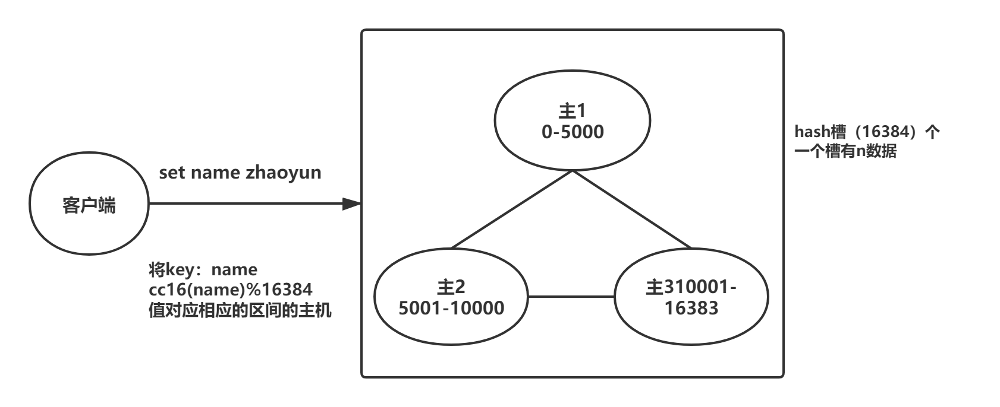
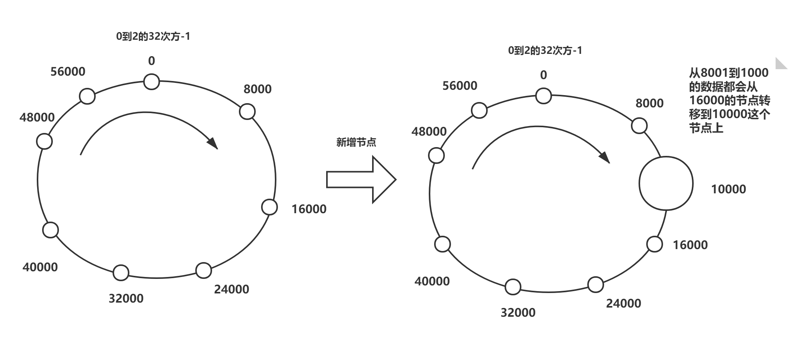

# Redis集群

## Redis Cluster

### 算法

16384个hash槽，一个槽是2k

槽是连续分布在主节点上

用name的hash取模16384，取模是几，就把对应的数据放在哪个节点上

## Redis-Cluster投票：容错

1、主节点投票，如果超过半数的主都认为某主挂了，则该主就挂了

2、主节点投票，选出挂了的主的从升级为主

集群挂了：

1、半数的主挂了，不能投票生效，则集群挂了

2、挂了的主机的从业挂了，造成slot槽分配不连续，集群就挂了

由此可见，redis cluster同时具备了高可用和高扩展

高可用：主挂了，可以选从

高扩展：可以动态地增加或减少节点，只需要进行hash槽的重新分配即可

# 通过Redis集群，引申出来的问题

## 数据分片策略

分布式数据存储方案中最为重要的一点就是数据分片，也就是所谓的sharding。为了使得集群能够水平扩展，说要解决的问题就是如何将整个数据集按照一定的规则分配到多个节点上，常用的数据分片的方法有：范围分片，哈希分片，一致性哈希算法和虚拟哈希槽等。

范围分片假设数据集有序，将顺序相临近的数据放在一起，可以很好的支持遍历操作。范围分片的缺点是面对顺序写时，会存在热点。比如日志类型的写入，一般日志的顺序都是和时间相关的，时间是单调递增，因此写入的热点永远在最后一个分片。对于关系型的数据库，因为经常性的需要表扫描或者索引扫描，基本上都会使用范围分片的策略。

我们为了将不同key分散放置到不同的redis节点，通常的做法是获取key的哈希值，然后根据节点数来取模，但这种做法有明显的弊端，当我们需要增加或减少一个节点时，会造成大量的key无法命中，所以就有人提出了一致性哈希的概念。

### 一致性哈希环

一致性hash算法有四个重要特征：

**均衡性：**也有人把它定义为平衡性，是指哈希的结果能够尽可能分不到所有的节点中去，这样可以有效的利用每隔节点上的资源。

**单调性：**当节点的数量变化时哈希的结果应尽可能的保护已分配的内容不会被重新分派到新的节点。

**分散性和负载：**这两个其实是差不多的意思，就是要求一致性哈希算法对key哈希应尽可能的避免重复。

## Redis的分片策略

**redis集群没有使用一致性hash，而是引入了哈希槽的概念**

Redis Cluster 采用虚拟哈希槽分区，所有的键根据哈希函数映射到 0 ~ 16383 整数槽内，**每个key通过CRC16校验后对16384取模来决定放置哪个槽(Slot)，**每一个节点负责维护一部分槽以及槽所银蛇的键值数据。

计算公式：slot = CRC16(key)&16383

这种结构很容易添加或删除节点，并且无论是添加删除或者修改某一个节点，都不会造成集群不可用的状态。使用好哈希槽的好处就在于可以方便的添加或移除节点。

当要增加节点时，只需要把其他节点的某些哈希槽挪到新节点就可以了。

当要溢出节点时，只需要把溢出节点上的哈希槽挪到其他节点就行了。

## Redis虚拟槽分区的特点

解耦数据和节点之间的关系，简化了节点扩容收缩难度。

节点自身维护槽的映射关系，不需要客户端或者代理服务维护槽分区元数据。

支持节点、槽和键之间的映射查询，用于数据路由，在线集群伸缩等场景。

## Redis集群伸缩的原理

Redis 集群提供了灵活的节点扩容和收缩方案。在不影响集群对外服务的情况下，可以为集群添加节点进行扩容也可以下线部分节点进行缩容。可以说，**槽是 Redis 集群管理数据的基本单位**，集群伸缩就是槽和数据在节点之间的移动。

### 面试问题：为什么RedisCluster会设计成16384个槽呢?

**1.如果槽位为65536，发送心跳信息的消息头达8k，发送的心跳包过于庞大。**

如上所述，在消息头中，最占空间的是 `myslots[CLUSTER_SLOTS/8]`。 当槽位为65536时，这块的大小是: `65536÷8÷1024=8kb`因为每秒钟redis节点需要发送一定数量的ping消息作为心跳包，如果槽位为65536，这个ping消息的消息头太大了，浪费带宽。

**2.redis的集群主节点数量基本不可能超过1000个。**

如上所述，集群节点越多，心跳包的消息体内携带的数据越多。如果节点过1000个，也会导致网络拥堵。因此redis作者，不建议redis cluster节点数量超过1000个。 那么，对于节点数在1000以内的redis cluster集群，16384个槽位够用了。没有必要拓展到65536个。

**3.槽位越小，节点少的情况下，压缩率高**

Redis主节点的配置信息中，它所负责的哈希槽是通过一张bitmap的形式来保存的，在传输过程中，会对bitmap进行压缩，但是如果bitmap的填充率slots / N很高的话(N表示节点数)，bitmap的压缩率就很低。 如果节点数很少，而哈希槽数量很多的话，bitmap的压缩率就很低。

而16384÷8÷1024=2kb，怎么样，神奇不！