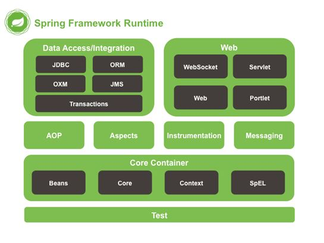

# 介绍篇

Spring是一个开源的设计层框架，他解决的是业务逻辑层和其他各层的松耦合问题，因此将面向接口的编程思想贯穿整个系统应用。

## 什么是耦合和内聚

**耦合性**（Coupling），也叫耦合度，是对模块间关联程度的度量。

>  在软件工程中，耦合指的就是对象之间的依赖性。对象之间的耦合越高，维护成本越高。因此对象的设计应使类和构件之间的耦合最小
>
> 软件设计中通常耦合度和内聚度作为衡量模块独立程度的标准
>
> 划分模块的一个准则就是高内聚低耦合

**内聚标志**一个模块各个元素彼此结合的紧密程度，它是信息隐蔽和局部化概念的自然扩展。

>  内聚是从功能角度度量模块内的联系,一个好的内聚模块应该恰好做一件事
>
>  内聚和耦合是密切相关的，同其他模块存在高耦合的模块意味着低内聚，而高内聚的模块意味着该模块同其他模块之间是低耦合
>
>  在进行软件设计时，应力争做到高内聚，低耦合
>
>  

**降低耦合度的方法：**

1. 少使用类的继承，多用接口隐藏实现细节
2. 模块的功能划分尽可能单一，道理也很简单，功能单一的模块提供其他模块调用的机会就少（其实这是高内聚的一种说法，高内聚低耦合一般同时出现）
3. 遵循一个定义只在一个地方出现
4. 少使用全局变量
5. 类属性和方法声明少用public，多用private关键字
6. 多用设计模式，比如采用MVC的设计模式就可以降低界面也业务逻辑的耦合度。
7. 尽量不用“硬编码”的方式写程序，同时也尽量避免直接用SQL语句操作数据库。
8. 避免直接操作或调用其他模块或类（内容耦合）；如果必须存在耦合，尽量使用数据耦合。

**增强内聚方法**

1. 模块只对外暴露最小限度的接口，形成最低的依赖关系
2. 只要对外接口不变，模块内部的修改，就不得影响其他模块。
3. 删除一个模块，应当只影响有依赖关系的其他模块，而不应该影响其他无关部分。

**总结：**遵循设计模式的7大原则，就能设计出搞内聚低耦合的程序

## Spring体系结构




### Spring核心概念介绍

**IOC（核心中的核心）：Inverse of Control，控制反转**。对象的创建权利由程序反转给Spring框架。

**DI： Dependency Injection,依赖注入。**在Spring框架负责创建爱你Bean对象时，动态的将依赖对象注入到Bean组件中。

**AOP： Aspect Oriented Programming，面向切面编程。**在不修改目标对象的源代码情况下，增强IOC容器中的bean的功能

**Spring容器：指的就是IOC容器**，底层也就是一个BeanFactory。


# 核心基础篇

## 基于XML的使用

### IOC配置

在Spring的XML文件中通过一个**bean标签**，完成ioc的配置。

#### bean标签介绍

- **bean标签作用**

  用于配置被spring容器管理的bean信息

  默认情况下它调用的是类中【无参构造器】。如果没有无参构造器则不能创建成功。

- **bean标签属性**

  - id：给对象在容器中提供一个唯一表示，用于获取对象
  - class：制定类的全限定名，用于反射创建对象。默认调用无参构造
  - **init-method**：指定类中的初始化方法名称
  - **destroy-method**：指定类中销毁方法名称。比如DataSource的配置中一般要指定destroy-method="close"。
  - scope：指定对象的作用域
    - singleton:**默认值**，单例的，生命周期如下
      - 对象出生：当应用加载，创建容器时，对象就被创建了
      - 对象活着：只要容器在，对象一直活着
      - 对象死亡：当应用卸载，销毁容器时，对象就被销毁。
    - prototype：多例的，每次访问对象时，都会重新创建对象实例。生命周期如下：
      - 对象出生：当使用对象时，创建新的对象实例
      - 对象活着：只要对象在使用中，就一直活着。
      - 对象死亡：当对象长时间不用时，被java的垃圾回收器回收了。
    - request：将Spring创建的bean对象存入到request中
    - session：将spring创建的bean对象存入到session中
    - global session：WEB项目中，应用在Protle环境，如果没有Portle环境那么与session一样

#### bean实例化的三种方式

- **第一种：使用默认无参构造函数（重点）**

  默认情况下：它会根据默认无参构造函数来创建类对象

  如果bean中没有默认无参构造函数，将会创建失败

  ```xml
  <bean id="userService" class="com.melo.service.userServiceImpl"/>
  ```

- 第二种：静态工厂（了解）

  ```java
  /**
  * 模拟一个静态工厂，创建业务层实现类
  */
  public class StaticFactory {
      public static UserService createUserService(){
      	return new UserServiceImpl();
  	}
  }
  ```

  ```xml
  <bean id="userService" class="com.kkb.spring.factory.StaticFactory"
  factory-method="createUserService"></bean>
  ```

- 第三种：实例工厂（了解）

  ```java
  /**
  * 模拟一个实例工厂，创建业务层实现类
  * 此工厂创建对象，必须现有工厂实例对象，再调用方法
  */
  public class InstanceFactory {
      public UserService createUserService(){
     	 	return new UserServiceImpl();
      }
  }
  ```

  ```xml
  <bean id="instancFactory" class="com.kkb.factory.InstanceFactory">
  </bean>
  <bean id="userService" factory-bean="instancFactory" factory-
  method="createUserService"></bean>
  ```


### DI配置

#### 概述

- **什么是依赖**

  ```
  依赖指的就是Bean实例中的属性
  依赖（属性）分为：简单类型（8种基本类型和String类型）的属性、POJO类型的属性、集合数组类型
  的属性。
  ```

- **什么是依赖注入**

  ```
  依赖注入：Dependency Injection。它是 spring 框架核心 IoC 的具体实现。 
  ```

- **为什么要进行依赖注入**

  ```
  我们的程序在编写时，通过控制反转，把对象的创建交给了 spring，但是代码中不可能出现没有依赖的
  情况。
  那如果一个bean中包含了一些属性，那么spring帮我们实例化了bean对象之后，也需要将对应的属性
  信息进行赋值操作，这种属性赋值操作，就是所谓的依赖注入（获取值、注入属性）
  ```

#### 依赖注入的方式

##### 构造函数注入

顾名思义，就是使用类的构造函数，给成员变量赋值。注意：赋值的操作不是我们自己做的，而是通过配置的方式，让spring框架来为我们注入

```java
public class UserServiceImpl implements UserService {
    private int id;
    private String name;
    public UserServiceImpl(int id, String name) {
        this.id = id;
        this.name = name;
    }
    @Override
    public void saveUser() {
    	System.out.println("保存用户:id为"+id+"，name为"+name+"  Service实现");
    }
}
```

```xml
<bean id="userService" class="com.kkb.spring.service.UserServiceImpl">
    <constructor-arg name="id" value="1"></constructor-arg>
    <constructor-arg name="name" value="zhangsan"></constructor-arg>
</bean>
```

##### set方法注入（重点）

- **手动装配方式（XML方式）**

  ```
  - 需要配置bean标签的子标签property
  - 需要配置的bean中指定setter方法。
  ```

- **自动装配方式**

  ```
  - @Autowired：
  - 作用一：查找实例，从spring容器中根据Bean的类型（byType）获取实例。
  - 作用二：赋值，将找到的实例，装配给另一个实例的属性值。
  - 注意事项：一个java类型在同一个spring容器中，只能有一个实例
  - @Resource：
  - 作用一：查找实例，从spring容器中根据Bean的名称（byName）获取实例。
  - 作用二：赋值，将找到的实例，装配给另一个实例的属性值。
  - @Inject
  ```

  

##### 使用p命名空间注入数据

**本质上还是调用set方法**

步骤1：需要先引入p命名空间

```
在schema的名称空间中加入该行：
xmlns:p="http://www.springframework.org/schema/p"
```

步骤2：使用p命名空间的语法

​	

```
p:属性名 = ""
p:属性名-ref = ""
```

步骤3：测试

​	

```xml
<bean id="person" class="com.kkb.spring.demo.Person" p:pname="老王"
p:car2-ref="car2"/>
<bean id="car2" class="com.kkb.spring.demo.Car2" />
```

#### 依赖注入不同类型的属性

##### 简单类型（value）

```xml
<bean id="userService" class="com.kkb.spring.service.UserServiceImpl">
<property name="id" value="1"></property>
<property name="name" value="zhangsan"></property>
</bean>
```

##### 引用类型（ref）

ref就是reference的缩写，是引用的意思。

```xml
<bean id="userService" class="com.kkb.spring.service.UserServiceImpl">
<property name="userDao" ref="userDao"></constructor-arg>
</bean>
<bean id="userDao" class="com.kkb.spring.dao.UserDaoImpl"></bean>
```

##### 集合类型（数组）

1. 如果是数组或者List集合，注入配置文件的方式是一样的

   ```xml
   <bean id="collectionBean" class="com.kkb.demo5.CollectionBean">
       <property name="arrs">
         <list>
    <!-- 如果集合内是简单类型，使用value子标签，如果是POJO类型，则使用
   bean标签 -->
           <value>美美</value>
           <value>小风</value>
    <bean></bean>
         </list>
       </property>
     </bean>
   ```

2. 如果是set集合，注入配置文件方式如下

   ```xml
   <property name="sets">
       <set>
     <!-- 如果集合内是简单类型，使用value子标签，如果是POJO类型，则使用bean标签
   -->
         <value>哈哈</value>
         <value>呵呵</value>
       </set>
     </property>
   ```

3. 如果是map集合

   ```xml
   <property name="map">
       <map>
         <entry key="老王2" value="38"/>
         <entry key="凤姐" value="38"/>
         <entry key="如花" value="29"/>
       </map>
     </property>
   ```
   
4. 如果是properties的方式

   ```xml
   <property name="pro">
       <props>
         <prop key="uname">root</prop>
         <prop key="pass">123</prop>
       </props>
     </property>
   ```

## 基于注解和XML混合方式的使用

