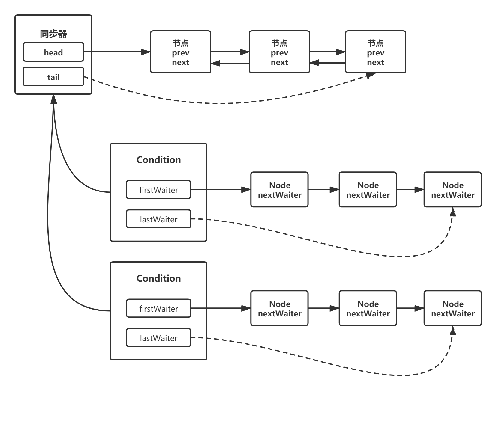
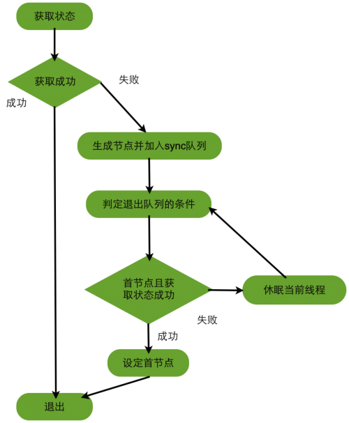
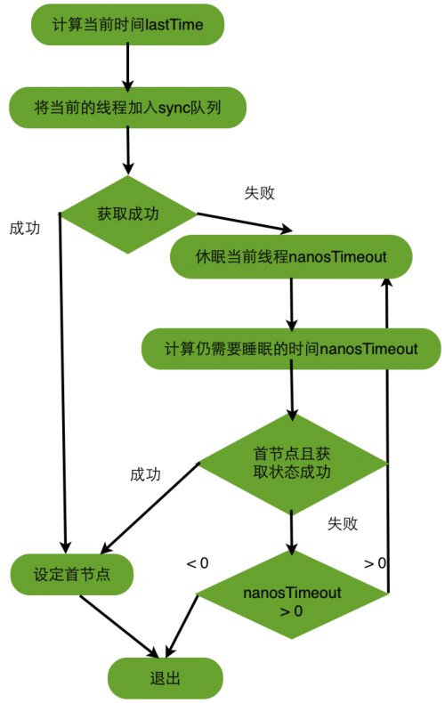
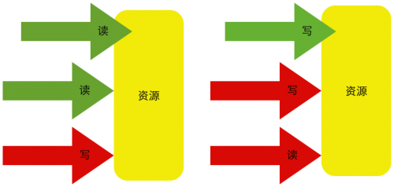

# AbstractQueuedSynchronizer的介绍和原理分析

## 简介

提供了一个基于FIFO队列，可以用于构建锁或者其他相关同步装置的基础框架。该同步器（以下简称同步器）利用了一个int来表示状态，期望它能够成为实现大部分同步需求的基础。使用的方法是继承，子类通过继承同步器并需要实现它的方法来管理其状态，管理的方式就是通过类似acquire和release的方式来操纵状态。然而多线程环境中对状态的操纵必须确保原子性，因此子类对于状态的把握，需要使用这个同步器提供的以下三个方法对状态进行操作：

- java.util.concurrent.locks.AbstractQueuedSynchronizer.getState()
- java.util.concurrent.locks.AbstractQueuedSynchronizer.setState(int)
- java.util.concurrent.locks.AbstractQueuedSynchronizer.compareAndSetState(int, int)

子类推荐被定义为自定义同步装置的内部类，同步器自身没有实现任何同步接口，它仅仅是定义了若干acquire之类的方法来供使用。该同步器即可以作为排他模式也可以作为共享模式，当它被定义为一个排他模式时，其他线程对其的获取就被阻止，而共享模式对于多个线程获取都可以成功。

同步器是实现锁的关键，利用同步器将锁的语义实现，然后在锁的实现中聚合同步器。可以这样理解：锁的API是面向使用者，它定义了与锁交互的公共行为，而每个锁需要完成特定的操作也是透过这些行为来完成的（比如：可以允许两个线程进行加锁，排除两个以上的线程），但是实现是依托给同步器来完成；同步器面向的是线程访问和资源控制，它定义了线程对资源是否能够获取以及线程的排队等操作。锁和同步器很好的隔离了二者所需要关注的领域，严格 意义上讲，同步器可以适用于除了锁意外的其他同步设施上（包括锁）。开始提到了实现依赖于一个FIFO队列，那么队列中的元素Node就是保存这线程应用和线程状态的容器，每个线程对同步器的访问，都可以看成是队列中的一个节点。Node主要包含以下成员变量：

```java
Node{
    int waitStatus;
    Node prev;
    Node next;
    Node nextWaiter;
    Thread thread;
}
```

以上五个成员变量主要负责保存该节点的线程引用，同步等待队列（以下简称sync队列）的前驱和后继节点，同时也包括了同步状态。

| 属性名称            | 描述                                                         |
| ------------------- | ------------------------------------------------------------ |
| **int waitStatus**  | 表示节点的状态。其中包含的状态有：<br />CANCELLED，值为1，表示当前的线程被取消<br />SIGNAL，值为-1，表示当前节点的后继节点包含的线程需要运行，也就是unpark;<br />CONDITION，值为-2，表示当前节点在等到condition，也就是在condition队列中<br />PROPAGATE，值为-3，表示当前场景下后续的acquireShared能够得以执行<br />值为0，表示当前节点在sync队列中，等待着获取锁。 |
| **Node prev**       | 前驱节点，比如当前节点被取消，那就需要前驱节点和后驱节点来完成连接 |
| **Node next**       | 后继节点                                                     |
| **Node nextWaiter** | 储存在condition队列中的后继节点                              |
| **Thread thread**   | 入队列时的当前线程                                           |

节点成为sync队列和condition队列构建的基础，在同步器中就包含了sync队列。同步器拥有三个成员变量：sync队列的头结点head、sync队列的尾节点tail和状态state。对于锁的获取，请求形成节点，将其挂载在尾部，而锁资源的转移（释放再获取）是从头部开始向后进行。对于同步器维护的状态state，多个线程对其的获取将会产生一个链式的结构。



### API说明

实现自定义同步器时，需要使用同步器提供的getState()、setState()和compareAndSetState()方法来操纵状态的改变

| 方法名称                                        | 描述                                                         |
| ----------------------------------------------- | ------------------------------------------------------------ |
| **protected boolean tryAcquire(int arg)**       | 排它的获取这个状态。这个方法的实现需要查询当前状态是否允许获取，然后再进行获取（使用compareAndSetState来做）状态。 |
| **protected boolean tryRelease(int arg)**       | 释放状态                                                     |
| **protected int tryAcquireShared(int arg)**     | 共享模式下获取状态                                           |
| **protected boolean tryReleaseShared(int arg)** | 共享的模式下释放状态。                                       |
| **protected boolean isHeldExclusively()**       | 在排它模式下，状态是否被占用。                               |

实现这些方法必须是非阻塞而且线程安全的，推荐使用该同步器的父类`java.util.concurrent.locks.AbstractOwnableSynchronizer`来设置当前的线程。

开始提到同步器内部基于一个FIFO队列，对于一个独占锁的获取和释放有以下伪代码表示。

获取一个排它锁：

```java
while(获取锁){
    if(获取锁){
        退出while循环
    }else{
        if(当前线程没有入队列){
            那么入队
        }
        阻塞当前线程
    }
}
```

释放一个排它锁：

```java
if(释放成功){
    删除头结点
    激活原头结点的后继节点
}
```

### 示例

下面通过一个排它锁的例子来深入理解一下同步器的工作原理，而只有掌握同步器的工作原理才能够更加深入了解其他的并发组件。
排他锁的实现，一次只能一个线程获取到锁。

```java
class Mutex implements Lock,java.io.Serializable{
    //内部类，自定义同步器
    private static class Sync extends AbstractQueuedSynchronizer{
        //是否处于占用状态
        protected boolean isHeldExclusively(){
            return getState()==1;
        }
        //当状态为0的时候获取锁
        public boolean tryAcquire(int acquires){
            assert acquires == 1;//Otherwise unused
            if(compareAndSetState(0,1)){
                setExclusiveOwnerThread(Thread.currentThread());
                return true;
            }
            return false;
        }
        //释放锁，将状态设置为0
        protected boolean tryRelease(int releases){
            assert releases == 1;//Otherwise unused
            if(getState() == 0){
                throw new IllegalMonitorStateException();
            }
            setExclusiveOwnerThread(null);
            setState(0);
            return true;
        }
        //返回一个Condition，每个condition都包含了一个condition队列
        Condition newCondition(){
            return new ConditionObject();
        }
    }
    //仅需要将操作代理到Sync上即可
    private final Sync sync = new Sync();
    public void lock(){
        sync.acquire(1);
    }
    public boolean tryLock(){
        return sync.tryAcquire(1);
    }
    public void unlock(){
        sync.release(1);
    }
    public Condition newCondition(){
        return sync.newCondition();
    }
    public boolean isLocked(){
        return sync.isHeldExclusively();
    }
    public boolean hasQueuedThreads(){
        return sync.hasQueuedThreads();
    }
    public void lockInterruptibly() throws InterruptedException{
        sync.acquireInterruptibly(1);
    }
    public boolean tryLock(long timeout,TimeUnit unit)throws InterruptedException{
        return sync.tryAcquireNanos(1,unit.toNanos(timeout));
    }
}
```

可以看到Mutex将Lock接口均代理给了同步器的实现。

使用方将Mutex构造出来之后，调用lock获取锁，调用unlock进行解锁。下面以Mutex为例子，详细分析同步器的实现逻辑。

### 实现分析

#### public final void acquire(int arg)

该方法以排他的方式获取锁，对中断不敏感，完成synchronized语义。

```java
public final void acquire(int arg){
    if (!tryAcquire(arg) &&
            acquireQueued(addWaiter(Node.EXCLUSIVE), arg))
            selfInterrupt();
    }
```

上述逻辑主要包括：

1. 尝试获取（调用tryAcquire更改状态，需要保证原子性）；
   在tryAcquire方法中使用了同步器提供的对state操作的方法，利用compareAndSet保证只有一个线程能够对状态进行成功修改，而没有成功修改的线程将进入sync队列排队。如果获取不到，将
2. 当前线程构造成节点Node并加入sync队列；
   进入队列的每个线程都是一个节点Node，从而形成了一个双向队列，类似CLH队列，这样做的目的是线程间的通信会被限制在较小规模（也就是两个节点左右）。
3. 再次尝试获取，如果没有获取到那么将当前线程从线程调度器上摘下，进入等待状态。
   使用LockSupport将当前线程unpark，关于LockSupport后续会详细介绍。

```java
/**
     * Creates and enqueues node for current thread and given mode.
     *
     * @param mode Node.EXCLUSIVE for exclusive, Node.SHARED for shared
     * @return the new node
     */
    private Node addWaiter(Node mode) {
        Node node = new Node(Thread.currentThread(), mode);
        // Try the fast path of enq; backup to full enq on failure
        Node pred = tail;
        if (pred != null) {
            node.prev = pred;
            if (compareAndSetTail(pred, node)) {
                pred.next = node;
                return node;
            }
        }
        enq(node);
        return node;
    }
/**
     * Inserts node into queue, initializing if necessary. See picture above.
     * @param node the node to insert
     * @return node's predecessor
     */
    private Node enq(final Node node) {
        for (;;) {
            Node t = tail;
            if (t == null) { // Must initialize
                if (compareAndSetHead(new Node()))
                    tail = head;
            } else {
                node.prev = t;
                if (compareAndSetTail(t, node)) {
                    t.next = node;
                    return t;
                }
            }
        }
    }
```

上述逻辑主要包括：

1. 使用当前线程构造Node；

   对于一个节点需要做的是将当前节点前驱节点指向尾节点（current.prev=tail），尾节点指向它（tail = current），原有的尾节点的后继节点指向它（t.next = current）而这些操作要求是原子的。上面的操作是利用尾节点的设置来保证的，也就是compareAndSetTail来完成的。

2. 先尝试在队尾添加；

   如果尾节点已经有了，然后做如下操作：

   1. 分配引用T指向尾节点
   2. 将节点的前驱节点更新为尾节点（current.prev = tail）
   3. 如果尾节点是T，那么将当尾节点设置为该节点（tail = current，原子更新）；
   4. T的后继节点指向当前节点（T.next = current）。

   注意第三点要求是原子的。

   这样可以以最短路径O(1)的效果来完成线程入队，是最大化减少开销的一种方式。

3. 如果对尾添加失败或者是第一个入队的节点

   如果是第1个节点，也就是sync队列没有初始化，那么会进入到enq这个方法，进入的线程可能有多个，或者说在addWaiter中没有成功入队的线程都将进入enq这个方法。

   可以看到enq的逻辑是确保进入的Node都会有机会顺序的添加到sync队列中，而加入的步骤如下：

   1. 如果尾节点为空，那么原子化的分配一个头节点，并将尾节点指向头节点，这一步是初始化；
   2. 然后是重复在addWaiter中做的工作，但是在一个while(true)的循环中，直到当前节点入队为止。

   进入sync队列之后，接下来就是要进行锁的获取，或者说是访问控制了，只有一个线程能够在同一时刻继续的运行，而其他的进入等待状态。而每个线程都是一个独立的个体，它们自省的观察，当条件满足的时候（自己的前驱是头结点并且原子性的获取了状态），那么这个线程能够继续运行。

```java
/**
     * Acquires in exclusive uninterruptible mode for thread already in
     * queue. Used by condition wait methods as well as acquire.
     *
     * @param node the node
     * @param arg the acquire argument
     * @return {@code true} if interrupted while waiting
     */
    final boolean acquireQueued(final Node node, int arg) {
        boolean failed = true;
        try {
            boolean interrupted = false;
            for (;;) {
                final Node p = node.predecessor();
                if (p == head && tryAcquire(arg)) {
                    setHead(node);
                    p.next = null; // help GC
                    failed = false;
                    return interrupted;
                }
                if (shouldParkAfterFailedAcquire(p, node) &&
                    parkAndCheckInterrupt())
                    interrupted = true;
            }
        } finally {
            if (failed)
                cancelAcquire(node);
        }
    }
```

上述逻辑主要包括：

1. 获取当前节点的前驱节点

   需要获取当前节点的前驱节点，而头结点所对应的含义是当前站有锁且正在运行。

2. 当前驱节点是头结点并且能够获取状态，代表该当前节点占有锁；

   如果满足上述条件，那么代表能够占有锁，根据节点对锁占有的含义，设置头结点为当前节点。

3. 否则进入等待状态。

   如果没有轮到当前节点运行，那么将当前线程从线程调度器上摘下，也就是进入等待状态

这里针对acquire做一下总结：

1. 状态的维护；

   需要在锁定时，需要维护一个状态(int类型)，而对状态的操作是原子和非阻塞的，通过同步器提供的对状态访问的方法对状态进行操纵，并且利用compareAndSet来确保原子性的修改。

2. 状态的获取；

   一旦成功的修改了状态，当前线程或者说节点，就被设置为头节点。

3. sync队列的维护。

   在获取资源未果的过程中条件不符合的情况下(不该自己，前驱节点不是头节点或者没有获取到资源)进入睡眠状态，停止线程调度器对当前节点线程的调度。

这时引入的一个释放的问题，也就是说使睡眠中的Node或者说线程获得通知的关键，就是前驱节点的通知，而这一个过程就是释放，释放会通知它的后继节点从睡眠中返回准备运行。

下面的流程图基本描述了一次acquire所需要经历的过程：




如上图所示，其中的判定退出队列的条件，判定条件是否满足和休眠当前线程就是完成了自旋spin的过程。

#### public final boolean release(int arg)

在unlock方法的实现中，使用了同步器的release方法。相对于在之前的acquire方法中可以得出调用acquire，保证能够获取到锁（成功获取状态），而release则表示将状态设置回去，也就是将资源释放，或者说将锁释放。

```java
/**
     * Releases in exclusive mode.  Implemented by unblocking one or
     * more threads if {@link #tryRelease} returns true.
     * This method can be used to implement method {@link Lock#unlock}.
     *
     * @param arg the release argument.  This value is conveyed to
     *        {@link #tryRelease} but is otherwise uninterpreted and
     *        can represent anything you like.
     * @return the value returned from {@link #tryRelease}
     */
    public final boolean release(int arg) {
        if (tryRelease(arg)) {
            Node h = head;
            if (h != null && h.waitStatus != 0)
                unparkSuccessor(h);
            return true;
        }
        return false;
    }
```

上述逻辑主要包括：

1. 尝试释放状态；
   tryRelease能够保证原子化的将状态设置回去，当然需要使用compareAndSet来保证。如果释放状态成功过之后，将会进入后继节点的唤醒过程。
2. 唤醒当前节点的后继节点所包含的线程。
   通过LockSupport的unpark方法将休眠中的线程唤醒，让其继续acquire状态。

```java
 /**
     * Wakes up node's successor, if one exists.
     *
     * @param node the node
     */
    private void unparkSuccessor(Node node) {
        //将状态设置为同步状态
        int ws = node.waitStatus;
        if (ws < 0)
            compareAndSetWaitStatus(node, ws, 0);

        /*
         * Thread to unpark is held in successor, which is normally
         * just the next node.  But if cancelled or apparently null,
         * traverse backwards from tail to find the actual
         * non-cancelled successor.
         */
        Node s = node.next;
        if (s == null || s.waitStatus > 0) {
            s = null;
            for (Node t = tail; t != null && t != node; t = t.prev)
                if (t.waitStatus <= 0)
                    s = t;
        }
        if (s != null)
            LockSupport.unpark(s.thread);
    }
```

上述逻辑主要包括，该方法取出了当前节点的next引用，然后对其线程(Node)进行了唤醒，这时就只有一个或合理个数的线程被唤醒，被唤醒的线程继续进行对资源的获取与争夺。
回顾整个资源的获取和释放过程：
在获取时，维护了一个sync队列，每个节点都是一个线程在进行自旋，而依据就是自己是否是首节点的后继并且能够获取资源；
在释放时，仅仅需要将资源还回去，然后通知一下后继节点并将其唤醒。
这里需要注意，队列的维护（首节点的更换）是依靠消费者（获取时）来完成的，也就是说在满足了自旋退出的条件时的一刻，这个节点就会被设置成为首节点。

#### protected boolean tryAcquire(int arg)

tryAcquire是自定义同步器需要实现的方法，也就是自定义同步器非阻塞原子化的获取状态，如果锁该方法一般用于Lock的tryLock实现中，这个特性是synchronized无法提供的。

#### public final void acquireInterruptibly(int arg)

该方法提供获取状态能力，当然在无法获取状态的情况下会进入sync队列进行排队，这类似acquire，但是和acquire不同的地方在于它能够在外界对当前线程进行中断的时候提前结束获取状态的操作，换句话说，就是在类似synchronized获取锁时，外界能够对当前线程进行中断，并且获取锁的这个操作能够响应中断并提前返回。一个线程处于synchronized块中或者进行同步I/O操作时，对该线程进行中断操作，这时该线程的中断标识位被设置为true，但是线程依旧继续运行。
如果在获取一个通过网络交互实现的锁时，这个锁资源突然进行了销毁，那么使用acquireInterruptibly的获取方式就能够让该时刻尝试获取锁的线程提前返回。而同步器的这个特性被实现Lock接口中的lockInterruptibly方法。根据Lock的语义，在被中断时，lockInterruptibly将会抛出InterruptedException来告知使用者。

```java
public final void acquireInterruptibly(int arg)
            throws InterruptedException {
        if (Thread.interrupted())
            throw new InterruptedException();
        if (!tryAcquire(arg))
            doAcquireInterruptibly(arg);
    }
private void doAcquireInterruptibly(int arg)
        throws InterruptedException {
        final Node node = addWaiter(Node.EXCLUSIVE);
        boolean failed = true;
        try {
            for (;;) {
                final Node p = node.predecessor();
                if (p == head && tryAcquire(arg)) {
                    setHead(node);
                    p.next = null; // help GC
                    failed = false;
                    return;
                }
                //判断中断标志
                if (shouldParkAfterFailedAcquire(p, node) &&
                    parkAndCheckInterrupt())
                    throw new InterruptedException();
            }
        } finally {
            if (failed)
                cancelAcquire(node);
        }
    }
```

上述逻辑主要包括：

1. 检测当前线程是否被中断；
   判断当前线程的中断标志位，如果已经被中断了，那么直接抛出异常并将中断标志位设置为false。

2. 尝试获取状态；
   调用tryAcquire获取状态，如果顺利会获取成功并返回。

3. 构造节点并加入sync队列；
   获取状态失败后，将当前线程引用构造为节点并加入到sync队列中。退出队列的方式在没有中断的场景下和acquireQueued类似，当头结点是自己的前驱节点并且能够获取到状态时，即可以运行，当然要将本节点设置为头结点，表示正在运行。

4. 中断检测。
   在每次被唤醒时，进行中断检测，如果发现当前线程被中断，那么抛出InterruptedException并退出循环。

#### private boolean doAcquireNanos(int arg, long nanosTimeout) throws InterruptedException

该方法提供了具备有超时功能的获取状态的调用，如果在指定的nanosTimeout内没有获取到状态，那么返回false，反之返回true。可以将该方法看做acquireInterruptibly的升级版，也就是在判断是否被中断的基础上增加了超时控制。
针对超时控制这部分的实现，主要需要计算出睡眠的delta，也就是间隔值。间隔可以表示为nanosTimeout = 原有nanosTimeout – now（当前时间）+ lastTime（睡眠之前记录的时间）。如果nanosTimeout大于0，那么还需要使当前线程睡眠，反之则返回false。

```java
private boolean doAcquireNanos(int arg, long nanosTimeout)
            throws InterruptedException {
        if (nanosTimeout <= 0L)
            return false;
        final long deadline = System.nanoTime() + nanosTimeout;
        final Node node = addWaiter(Node.EXCLUSIVE);
        boolean failed = true;
        try {
            for (;;) {
                final Node p = node.predecessor();
                if (p == head && tryAcquire(arg)) {
                    setHead(node);
                    p.next = null; // help GC
                    failed = false;
                    return true;
                }
                nanosTimeout = deadline - System.nanoTime();
                if (nanosTimeout <= 0L)
                    return false;
                if (shouldParkAfterFailedAcquire(p, node) &&
                    nanosTimeout > spinForTimeoutThreshold)
                    LockSupport.parkNanos(this, nanosTimeout);
                if (Thread.interrupted())
                    throw new InterruptedException();
            }
        } finally {
            if (failed)
                cancelAcquire(node);
        }
    }
```

上述逻辑主要包括：
\1. 加入sync队列；
将当前线程构造成为节点Node加入到sync队列中。
\2. 条件满足直接返回；
退出条件判断，如果前驱节点是头结点并且成功获取到状态，那么设置自己为头结点并退出，返回true，也就是在指定的nanosTimeout之前获取了锁。
\3. 获取状态失败休眠一段时间；
通过LockSupport.unpark来指定当前线程休眠一段时间。
\4. 计算再次休眠的时间；
唤醒后的线程，计算仍需要休眠的时间，该时间表示为nanosTimeout = 原有nanosTimeout – now（当前时间）+ lastTime（睡眠之前记录的时间）。其中now – lastTime表示这次睡眠所持续的时间。
\5. 休眠时间的判定。
唤醒后的线程，计算仍需要休眠的时间，并无阻塞的尝试再获取状态，如果失败后查看其nanosTimeout是否大于0，如果小于0，那么返回完全超时，没有获取到锁。 如果nanosTimeout小于等于1000L纳秒，则进入快速的自旋过程。那么快速自旋会造成处理器资源紧张吗？结果是不会，经过测算，开销看起来很小，几乎微乎其微。Doug Lea应该测算了在线程调度器上的切换造成的额外开销，因此在短时1000纳秒内就让当前线程进入快速自旋状态，如果这时再休眠相反会让nanosTimeout的获取时间变得更加不精确。
上述过程可以如下图所示：



上述这个图中可以理解为在类似获取状态需要排队的基础上增加了一个超时控制的逻辑。每次超时的时间就是当前超时剩余的时间减去睡眠的时间，而在这个超时时间的基础上进行了判断，如果大于0那么继续睡眠（等待），可以看出这个超时版本的获取状态只是一个近似超时的获取状态，因此任何含有超时的调用基本结果就是近似于给定超时。

#### public final void acquireShared(int arg)

调用该方法能够以共享模式获取状态，共享模式和之前的独占模式有所区别。以文件的查看为例，如果一个程序在对其进行读取操作，那么这一时刻，对这个文件的写操作就被阻塞，相反，这一时刻另一个程序对其进行同样的读操作是可以进行的。如果一个程序在对其进行写操作，那么所有的读与写操作在这一时刻就被阻塞，直到这个程序完成写操作。
以读写场景为例，描述共享和独占的访问模式，如下图所示：



上图中，红色代表被阻塞，绿色代表可以通过。

```java
public final void acquireShared(int arg) {
        if (tryAcquireShared(arg) < 0)
            doAcquireShared(arg);
    }
private void doAcquireShared(int arg) {
        final Node node = addWaiter(Node.SHARED);
        boolean failed = true;
        try {
            boolean interrupted = false;
            for (;;) {
                final Node p = node.predecessor();
                if (p == head) {
                    int r = tryAcquireShared(arg);
                    if (r >= 0) {
                        setHeadAndPropagate(node, r);
                        p.next = null; // help GC
                        if (interrupted)
                            selfInterrupt();
                        failed = false;
                        return;
                    }
                }
                if (shouldParkAfterFailedAcquire(p, node) &&
                    parkAndCheckInterrupt())
                    interrupted = true;
            }
        } finally {
            if (failed)
                cancelAcquire(node);
        }
    }
```

上述逻辑主要包括：

1. 尝试获取共享状态；
   调用tryAcquireShared来获取共享状态，该方法是非阻塞的，如果获取成功则立刻返回，也就表示获取共享锁成功。

2. 获取失败进入sync队列；
   在获取共享状态失败后，当前时刻有可能是独占锁被其他线程所把持，那么将当前线程构造成为节点（共享模式）加入到sync队列中。

3. 循环内判断退出队列条件；
   如果当前节点的前驱节点是头结点并且获取共享状态成功，这里和独占锁acquire的退出队列条件类似。

4. 获取共享状态成功；
   在退出队列的条件上，和独占锁之间的主要区别在于获取共享状态成功之后的行为，而如果共享状态获取成功之后会判断后继节点是否是共享模式，如果是共享模式，那么就直接对其进行唤醒操作，也就是同时激发多个线程并发的运行。

5. 获取共享状态失败。
   通过使用LockSupport将当前线程从线程调度器上摘下，进入休眠状态。
   对于上述逻辑中，节点之间的通知过程如下图所示：


上图中，绿色表示共享节点，它们之间的通知和唤醒操作是在前驱节点获取状态时就进行的，红色表示独占节点，它的被唤醒必须取决于前驱节点的释放，也就是release操作，可以看出来图中的独占节点如果要运行，必须等待前面的共享节点均释放了状态才可以。而独占节点如果获取了状态，那么后续的独占式获取和共享式获取均被阻塞。

#### public final boolean releaseShared(int arg)

调用该方法释放共享状态，每次获取共享状态acquireShared都会操作状态，同样在共享锁释放的时候，也需要将状态释放。比如说，一个限定一定数量访问的同步工具，每次获取都是共享的，但是如果超过了一定的数量，将会阻塞后续的获取操作，只有当之前获取的消费者将状态释放才可以使阻塞的获取操作得以运行。

```java
public final boolean releaseShared(int arg) {
        if (tryReleaseShared(arg)) {
            doReleaseShared();
            return true;
        }
        return false;
    }

```

上述逻辑主要就是调用同步器的tryReleaseShared方法来释放状态，并同时在doReleaseShared方法中唤醒其后继节点。

## 一个例子

在上述对同步器AbstractQueuedSynchronizer进行了实现层面的分析之后，我们通过一个例子来加深对同步器的理解：
设计一个同步工具，该工具在同一时刻，只能有两个线程能够并行访问，超过限制的其他线程进入阻塞状态。
对于这个需求，可以利用同步器完成一个这样的设定，定义一个初始状态，为2，一个线程进行获取那么减1，一个线程释放那么加1，状态正确的范围在[0，1，2]三个之间，当在0时，代表再有新的线程对资源进行获取时只能进入阻塞状态（注意在任何时候进行状态变更的时候均需要以CAS作为原子性保障）。由于资源的数量多于1个，同时可以有两个线程占有资源，因此需要实现tryAcquireShared和tryReleaseShared方法，这里谢谢luoyuyou和同事小明指正，已经修改了实现。

```java
public class TwinsLock implements Lock{
    private final Sync sync = new Sync(2);
    private static final class Sync extends AbstractQueuedSynchronizer{
        private static final long   serialVersionUID    = -7889272986162341211L;
        Sync(int count){
            if(count <= 0){
                throw new IllegalArgumentException("count must large than zero.");
            }
            setState(count);
        }
        public int tryAcquireShared(int reduceCount){
            for(;;){
                int current = getState();
                int newCount = current - reduceCount;
                if(newCount < 0 || compareAndSetState(current,newCount)){
                    return newCount;
                }
            }
        }
        
        public boolean tryReleaseShared(int returnCount){
            for(;;){
                int current = getState();
                int newCount = current + returnCount;
                if(compareAndSetState(current,newCount)){
                    return true;
                }
            }
        }
    }
    public void lock(){
        sync.acquireShared(1);
    }
    public void lockInterruptibly() throws InterrupedException{
        sync.acquireSharedInterruptibly(1);
    }
    public boolean tryLock(){
        sync.tryAcquireShared(1) >= 0;
    }
    public boolean tryLock(long time, TimeUnit unit) throws InterruptedException{
        return sync.tryAcquireSharedNanos(1,unit.toNanos(time));
    }
    public void unLock(){
        sync.releaseShared(1);
    }
    public Condition newCondition(){
        return null;
    }
}
```

这里我们编写一个测试来验证TwinsLock是否能够正常工作并达到预期。

```java
public class TwinsLockTest{
    @Test
    public void test(){
        final Lock lock = new TwinsLock();
        
        class Worker extends Thread{
            public void run(){
                while(true){
                    lock.lock();
                    try{
                        Thread.sleep(1000L);
                        System.out.println(Thread.currentThread());
                        Thread.sleep(1000L);
                    }catch(Exception ex){
                        
                    }finally{
                        lock.unlock();
                    }
                }
            }
        }
        for(int i = 0;i<=10;i++){
            Worker w = new Worker();
            w.start();
        }
        new Thread(){
            public void run(){
                while(true){
                    try{
                        Thread.sleep(200L);
                        System.out.println();
                    }catch(Exception ex){
                        
                    }
                }
            }
        }.start();
        try{
            Thread.sleep(20000L);
        }catch(InterruptedException e){
            e.printStackTrace();
        }
    }
}
```

