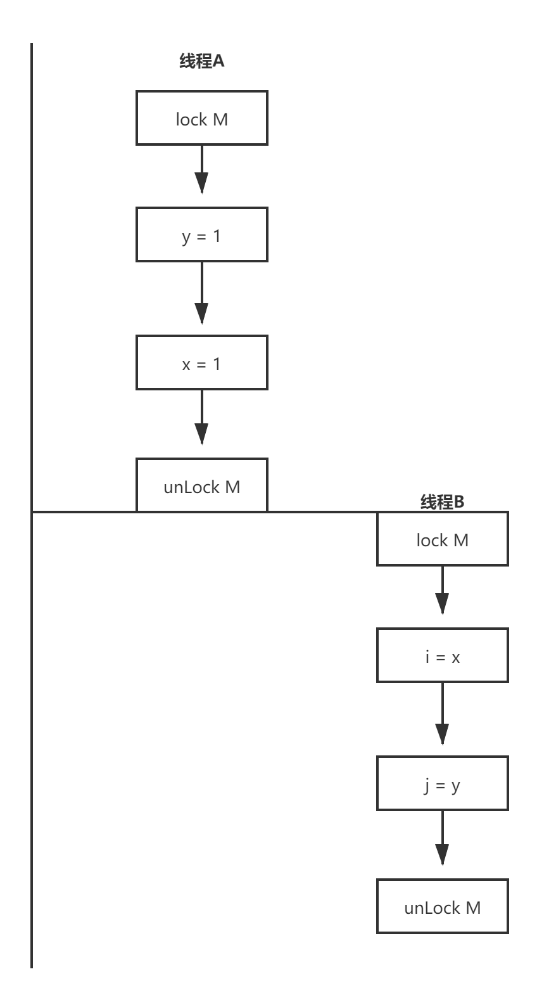

# 第一部分 基础知识

## 线程安全性

如果当多个线程访问同一个可变的状态变量时没有使用同步，那么程序就会出现错误。有三种方式可以修复这个问题：

- 不在线程之间共享该状态变量
- 将状态变量修改为不可变的变量
- 在访问状态变量时使用同步

当设计线程安全的类时，良好的面向对象技术、不可修改性，以及明晰的不变性规范都能起到一定的帮助作用。

### 什么是线程安全性

**当多个线程访问某个类时，不管运行时环境采用何种调度方式或者这些线程将如何交替执行，并且在主调代码中不需要任何额外的同步或协同，这个类都能表现出正确的行为，那么就称这个类是线程安全的。**

而正确性的含义是：某个类的行为与其规范完全一致。

如果某个类在单线程环境中都不是正确的，那么它肯定不会是线程安全的。

在线程安全类中封装了必要的同步机制，因此客户端无需进一步采取同步措施。

由于线程访问无状态对象的行为并不会影响其他线程中操作的正确性，因此无状态对象一定是线程安全的。

大多数servlet都是无状态的，从而极大地降低了在实现servlet线程安全性时的复杂性，只有当servlet在处理请求时需要保存一些信息时，线程安全性才会使一个问题。

### 原子性

虽然递增操作 ++i 是一种紧凑地语法，使其看上去是一个操作，但是这个操作并非是原子的，因为它并不会作为一个不可分割的操作来执行。实际上，它包含了三个独立的操作：读取 i 的值，将值加1，然后将计算结果写入到 i 。这是一个“读取 - 修改 - 写入”的操作序列，并且其结果状态依赖于之前的状态。

#### 竞态条件

最常见的竞态条件是“先检查后执行(Check-Then-Act)”，即通过一个可能失效的观测结果来决定下一步的动作。

这里有个著名的“星巴克约会问题”。假定你计划中午在University Avenue的星巴克与一位朋友会面。当你到达那里的时候，发现在University Avenue上有两家星巴克，并且并没有约定到具体哪一家。。。。。。可以脑补一下。除非你们之间约定了某种协议，否则你们整天都在University Avenue上走来走去，倍感沮丧。

在星巴克这个示例中说明了一种竞态条件，因为要获得正确的结果（于朋友会面），必须取决于事件发生的时序（当你们到达星巴克时，在离开并去另一家星巴克之前会等待多长时间）。当你迈出前门时，你在星巴克A的观察结果将变得无效，你的朋友可能从后门进入，而你却不知道。这种观察结果的失效就是大多数静态条件的本质-----基于一种可能失效的观察结果做出判断或执行计算。

#### 延迟初始化中的竞态条件

使用“先检查后执行”的一种常见情况就是延迟初始化。延迟初始化的目的是将对象的初始化操作推迟到实际被使用时才进行，同时要确保只被初始化一次。

```java
public class LazyInitRace{
    public ExpensiveObject instance = null;
    
    public ExpensiveObject getInstance(){
        if(instance == null){
            instance = new ExpensiveObject();
        }
        return instance;
    }
}
```

> 不要这么做，存在竞态条件，它可能会破坏这个类的正确性

#### 复合操作

要避免竞态条件问题，就必须在某个线程修改该变量时，通过某种方式防止其他线程使用这个变量，从而确保其他线程只能在修改操作完成之前或之后读取和修改状态，而不是在修改状态的过程中。

在实际情况中，应尽可能地使用现有的线程安全对象(例如 AtomicLong)来管理类的状态。

### 加锁机制

#### 内置锁

Java提供了一种内置的锁机制来支持原子性：同步代码快（Synchronized Block）。同步代码块包括两部分：一个作为锁的对象引用，一个作为由这个锁保护的代码块。用Synchronized来修饰的方法就是一种横跨整个方法体的同步代码块，其中该同步代码块的锁就是方法调用所在的对象。静态的Synchronized方法以Class对象作为锁。

```java
synchronized (lock){
    //访问或修改由锁保护的共享状态
}
```

每个Java对象都可以用做一个实现同步的锁，这些锁被称为内置锁或监视器锁。线程在进入同步代码块之前会自动获得锁，并且在退出同步代码块时自动释放锁，而无论是通过正常的控制路径退出，还是通过从代码块中抛出异常退出。获得内置锁的唯一途径就是进入由这个锁保护的同步代码块或方法。

Java的内置锁相当于一个互斥体（或互斥锁），这意味着最多只有一个线程能持有这种锁。当线程A尝试获取一个由线程B持有的锁时，线程A必须等待或阻塞，直到线程B释放这个锁。如果B永不释放，那A将永远等下去。

由于每次只能有一个线程执行内置锁保护的代码，因此，由这个锁保护的同步代码块会以原子的方式执行，多个线程在执行该代码块时也不会相互干扰。

#### 重入

当某个线程请求一个由其他线程持有的锁时，发出请求的线程会阻塞。然后，由于内置锁时可重入的，因此如果某个线程试图获得一个已经由它自己持有的锁，那么这个请求就会成功。“重入”意味着获取锁的操作粒度是线程，而不是调用。重入的一种实现方法是，为每个锁关联一个获取计数值和一个所有者线程。当计数值为0时，这个锁就被认为是没有被任何线程持有。当线程请求一个未被持有的锁时，JVM将记下锁的持有者，并将获取计数值置为1.如果同一个线程再次获取这个锁，计数值将递增，而当线程退出同步代码块时，计数器会相应的递减。当计数器为0时，这个锁被释放。

重入进一步提升了加锁行为的封装性，因此简化了面向对象并发代码的开发。

能解我心头之惑的一段代码片段

```java
public class Widget {

    public synchronized void doSomething() throws InterruptedException {
        System.out.println(Thread.currentThread().getName() + "super do something");
    }
    public synchronized void doSomething2() throws InterruptedException {
        System.out.println(Thread.currentThread().getName() + "super do something2==============");
    }
}
import java.util.concurrent.TimeUnit;

public class LoggingWidget extends Widget {
    @Override
    public synchronized void doSomething() throws InterruptedException {
        System.out.println(Thread.currentThread().getName() + "sub do something");
        super.doSomething();
        TimeUnit.SECONDS.sleep(10);
    }

    @Override
    public synchronized void doSomething2() throws InterruptedException {
        System.out.println(Thread.currentThread().getName() + "sub do something2============");
        super.doSomething2();
        TimeUnit.SECONDS.sleep(10);
    }
}
import java.util.concurrent.TimeUnit;

public class Test {
    public static void main(String[] args) throws InterruptedException {
        LoggingWidget log1 = new LoggingWidget();
        new Thread(() ->{
            try {
                log1.doSomething();
            } catch (InterruptedException e) {
                e.printStackTrace();
            }
        }).start();
        new Thread(() ->{
            try {
                log1.doSomething2();
            } catch (InterruptedException e) {
                e.printStackTrace();
            }
        }).start();
        System.out.println("look look");
        TimeUnit.SECONDS.sleep(30);
    }
}

look look
Thread-0sub do something
Thread-0super do something
//等了10秒之后才打印出下面的片段
Thread-1sub do something2============
Thread-1super do something2==============
```


### 用锁来保护状态

由于锁能使其保护的代码路径以串行的形式来访问，因此可以通过锁来构造一些协议以实现对共享状态的独占访问

对于可能被多个线程同时访问的可变状态变量，在访问它时都需要持有同一个锁，在这种状态下，我们称为状态变量时由这个锁保护的。

每个共享的和可变的变量都应该只由一个锁来保护，从而使维护人员知道是哪一个锁。

对于每个包含多个变量的不可变性条件，其中涉及的所有变量都需要由同一个锁来保护。

### 活跃性与性能

通常，在简单性与性能之间存在相互制约因素。当实现某个同步策略时，一定不要盲目的为了性能而牺牲简单性（这可能会破坏安全性）

当执行时间较长的计算或者可能无法快速完成的操作时（例如，网络I/O或控制台I/O），一定不要持有锁。


# 对象的共享

## 可见性

在没有同步的情况下，编译器、处理器以及运行时等都可能对操作的执行顺序进行一些意想不到的跳转。在缺乏足够同步的多线程程序中，要想对内存操作的执行顺序进行判断，几乎无法得出正确的结论。

### 失效数据

一个线程可能读到的是某个变量的最新值，而获得另一个变量的失效值（读取之后被其他线程修改了）

### 非原子的64位操作

非volatile类型的long和double变量，JVM运行将64位的读操作或写操作分解为两个32位的操作。当读取一个非volatile类型的long变量时，如果对该变量的读操作和写操作在不同的线程中执行，那么很可能会读取到某个值的高32位和另一个值的低32位。

### 加锁与可见性

内置锁可以用于确保某个线程以一种可预测的方式来查看另一个线程的执行结果。



**加锁的含义不仅仅局限于互斥行为，还包括内存可见性。为了确保所有线程都能看到共享变量的最新值，所有执行读操作或写操作的线程都必须在同一个锁上同步**

### Volatile变量

Volatile已经很熟悉了，这里不做过多解释

volatile变量的正确使用方式包括：确保他们自身状态的可见性，确保他们锁引用的对象的状态的可见性，以及标识一些重要的程序生命周期事件的发生（例如，初始化或关闭）。

volatile变量的一种典型用法：检查某个状态标记以判断是否退出循环。在以下示例中，线程试图通过类似于数绵羊的传统方法进入睡眠。为了是这个示例能正确执行，asleep必须为volatile变量。否则，当asleep被另一个线程修改时，执行判断的线程却发现不了。我们也可以用锁来确保asleep更新操作的可见性，但这将使代码变得更复杂。

```java
volatile boolean asleep;
...
    while(!asleep){
        countSomeSheep();
    }
```

虽然volatile变量很方便，但也存在一些局限性。volatile变量通常用做某个操作完成、发生中断或者状态的标志，例如上面程序的asleep标志。尽管volatile变量也可用于其他状态信息，但在使用时要非常小心。例如，volatile的语义不足以确保递增操作(count++)的原子性，除非你能确保只有一个线程对变量执行写操作。

加锁机制既可以确保可见性又可以确保原子性，而volatile变量只能确保可见性。

当且仅当满足以下所有条件时，才应该使用volatile变量：

- 对变量的写入操作不依赖变量的当前值，或者你能确保只有单个线程更新变量的值。
- 该变量不会与其他状态变量一起纳入不变性条件中。
- 在访问变量时不需要加锁。

## 发布与逸出

“发布(publish)”一个对象的意思是指，使对象能够在当前作用域之外的代码中使用。例如，将一个指向该对象的引用保存到其他代码可以访问的地方，或者在某一个非私有的方法中返回该引用，或者将引用传递到其他类的方法中。在许多情况中，我们要确保对象及其内部状态不被发布，而在某些情况中，我们又需要发布某个对象，但如果在发布时要确保线程安全性，则可能需要同步。发布内部状态可能会破坏封装性，并且使得程序难以维持不变性条件。例如，如果在某个对象构造完之前就发布该对象，就会破坏线程安全性。当某个不应该发布的对象被发布时，这种情况就被称为逸出(Escape)。

发布对象最简单的方法就是将对象的引用保存到一个公有的静态变量中，以便任何类的线程都能看见该对象，

```java
public static Set<Secret> knownSecrets;

public void initialize(){
    knownSecrets = new HashSet<>();
}
```

当发布某个对象时，可能会间接的发布其他对象，如以上程序。

同样，如果从非私有方法中返回一个引用，也会发布该对象**（不要这么做）**

```java
class UnsafeStates{
    private String[] states = new String []{"AK", "AL" ...};
    
    public String[] getStates(){
        return states;
    }
}
```

如果按上述方式来发布states，就会出现问题，因为任何调用者都能修改这个数组的内容。在这个示例中，数组states已经逸出了它所在的作用域，因为这个本应是私有的变量已经被发布了。

当发布一个对象时，在该对象的非私有域中引用的对象同样会被发布。

最后一种发布对象或其内部状态的机制就是发布一个内部的类实例。

隐式的使this引用逸出**（不要这么做）**

```java
public class ThisEscape{
    public ThisEscape(EventSource source){
        source.registerListener(
            new EventListener(){
                public void onEvent(Event e){
                    doSomething(e);
                }
            });
    }
}
```

当ThisEscape发布EventListener时，也隐含发布了ThisEscape实例本身，因为在这个内部类的实例中包含对ThisEscape实例的隐含引用。

## 线程封闭

**栈封闭**，局部变量就是栈封闭，不要是方法中的对象逸出。

**ThreadLocal**

```java
private static ThreadLocal<Connection> connectionHolder = new ThreadLocal<>(){
    public Connection initValue(){
        return DriverManager.getConnection(DB_URL)；
    };
    public static Connection getConnection(){
        return connectionHolder.get();
    }
}
```

假设你需要将一个单线程应用程序移植到多线程中，通过将共享的全局变量转换为ThreadLocal对象，可以维持线程安全性。

注意，不能滥用ThreadLocal。

## 不变性

不可变对象一定是线程安全的

虽然在Java语言规范和Java内存模型中都没有给出不可变性的正式定义，但不可变性并不等于将对象中所有的域都申明为final，即使对象中所有的域都是final，这个对象也仍然可变，因为在final类型的域中可以保存可变的对象引用。

**当满足以下条件时，对象才是不可变的**

- 对象创建以后其状态就不能修改
- 对象的所有域都是final类型
- 对象是正确创建的（在创建期间，this没有逸出）。

### Finali域

关键字final可以视为C++中const机制的一种受限版本，用于构造不可变性对象。final类型的域是不能修改的（但是如果在final域中所引用的对象时可变的，那么这些被应用的对象时可以修改的）。然而，在Java内存模型中，final域还有特殊的语义。final域能确保初始化过程的安全性，从而可以不受限制的访问不可变对象，并在共享这些对象时无须同步。

即使对象是可变的，通过将对象的某些域声明为final类型，仍然可以简化对状态的判断，因此限制对象的可变性也就相当于限制了该对象的状态集合。通过将域声明为final，也相当于告诉维护人员这些域是不可变的。

**正如“除非需要更高的可见性，否则应将所有的域都声明为私有域”是一个良好的习惯，“除非需要某个域是可变的，否则应将其声明为final域”也是一个良好的编程习惯**


**在并发程序中使用和共享对象时，可以使用一些使用的策略**

- **线程封闭**。线程封闭的对象只能由一个线程拥有，对象被封闭在线程中，并且只能由这个线程修改。
- **只读共享**。在没有额外同步的情况下，共享的只读对象可以由多个线程并发访问，但任何线程都不能改变它。共享的只读对象包括不可变对象和事实不可变对象
- **线程安全共享**。线程安全的对象在其内部实现同步，因此多个线程可以通过对象的公有接口来进行访问而不需要进一步的同步。
- **保护对象**。被保护的对象只能通过持有特定的锁来访问。保护对象封装在其他线程安全对象中的对象，以及以发布的并且由某个特定锁保护的对象。


# 对象的组合

