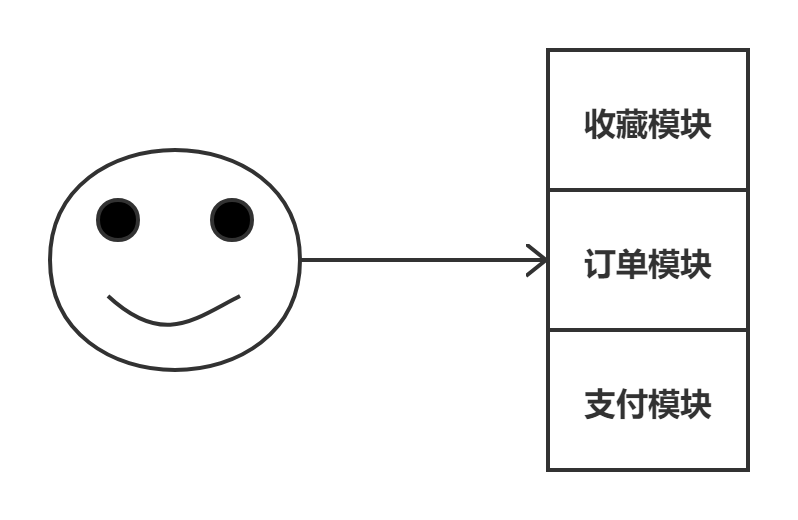
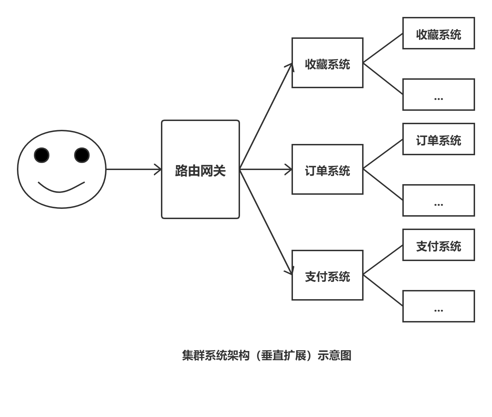
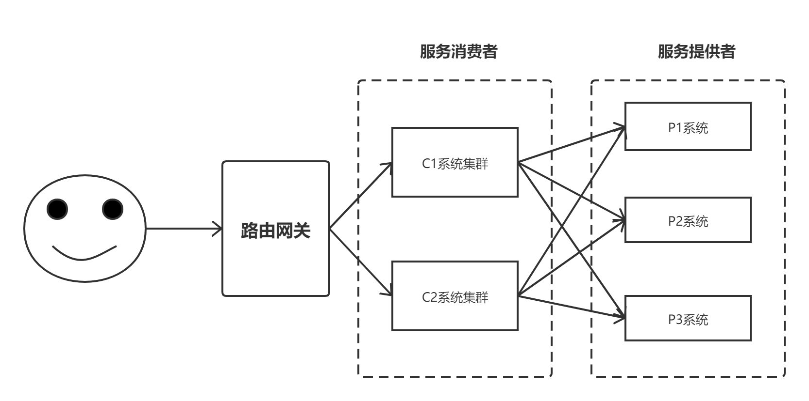
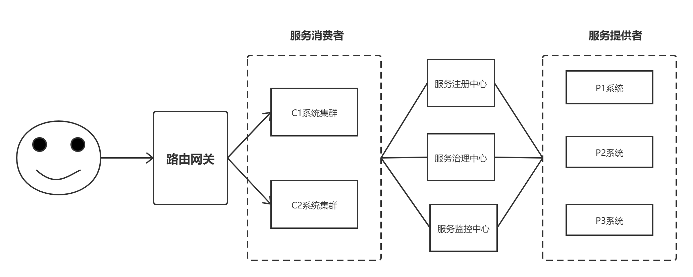

# Dubbo概述

## 系统架构的发展

### 单体架构

​	当站点功能与流量都很小时，只需要一个应用，将所有功能都集中在一个工程中，并部署在一台服务器上，以减少部署节点和成本。例如：用户模块、支付模块等都做在一个工程中，以一个应用的形式部署在一台服务器上。



### 集群架构

.png)

当站点流量增加而单机已无法应对其访问量时，可通过搭建集群增加主机的方式提升系统的性能。这种方式成为水平扩展

### 分布式架构



当访问量逐渐增大，集群架构的水平扩展带来的效率提升越来越小。此时可以将项目拆分成多个功能相对独立的子工程以提升效率。

### 微服务架构



当子工程越来越多时，发现他们可能同时都拥有某功能相同或相似的模块，于是将这些在整个项目中冗余的功能模块抽取出来作为独立的工程，这些工程就是专门为那些调用他们的工程服务。那么这些抽取出来的功能就成为微服务，微服务应用称为服务提供者，而调用微服务的应用就称为服务消费者。

### 流动计算架构



​	随着功能的扩张，微服务越来越多；随着PV的增长，消费者工程就需要越来越多；随着消费者的扩张，为其提供服务的提供者服务器就需要越来越多，而每种提供者都要求创建集群。这样的话，消费者对于提供者的访问就不能再采用直连方式进行了，此时就需要服务注册中心了。提供者将服务注册到注册中心，而消费者通过注册中心进行消费，消费者无需再与提供者绑定了。提供者的宕机，对消费者不会产生直接的影响。

​	随着服务的增多，在一些特殊时段（例如双11）就会出现服务资源浪费的问题：有些服务的QPS很低，但其还占用着很多系统资源，而有些QPS很高，已经出现了资源紧张，用户体验骤降的情况。此时就需要服务治理中心了。让一些不重要的服务暂时性降级，或为其分配较低的权重等，对整个系统资源进行统一调配。

​	这里的资源调配分为两种：预调配与实时调配。

​	预调配是根据系统架构师的“系统容量预估”所进行的调配，是一种经验，是一种预处理，就像每年的双11期间的pv与uv都会很高，就需要提前对服务性能进行调配。

​	实时调配指的是根据服务监控中心所提供的基于访问压力的实时系统容量评估数据，对个服务性能进行实时调配的方案。


## 架构师的基本素养

### 常用术语

#### 系统容量与系统容量预估

​	系统容量指系统所能承受的最大访问量，而系统容量预估则是在峰值流量到达之前系统架构师给出的若干技术指标。

#### QPS

​	QPS，Query Per Second，每秒查询量。在分布式系统中QPS的定义是，单个进程每秒请求服务的成功次数。

​	QPS = 总请求数/进程总数/请求时间 = 总请求数/(进程总数*请求时间)

#### UV

​	Unique Visitor，独立访客数量，指一定时间范围内站点访问所来自的IP数量。同一IP多次访问站点只计算一次。

#### PV

​	Page View，页面访问量，指一定时间范围内打开或刷新页面的次数。

### 系统容量预估基本计算

#### 带宽计算

平均带宽 = 总流量数（bit） / 产生这些流量的时长（秒）
=（PV * 页面平均大小 * 8） / 统计时间（秒）
带宽需求（峰值带宽） = 平均带宽 * 峰值因子

日均PV 10w，页面平均大小0.4M，则
平均带宽 =( 10w * 0.4M * 8) / (60 * 60 *24)

#### 并发量计算

​	并发量，也称为并发连接数，一般是指**单台服务器**每秒处理的连接数。平均并发连接数的计算公式是：

平均并发连接数 = (站点PV * 页面平均衍生连接数) / （统计时间 * web服务器数量）

日均PV 50w，页面平均衍生连接数是30，服务器数量为5台。

平均并发连接数 = （10w * 30） / (60 * 60 * 24 * 5)

峰值并发量 = 平均并发连接数 * 峰值因子

#### 服务器预估量

​	根据往年同期活动获得的日均PV、并发量、页面衍生连接数，及公司业务扩展所带来的流量增长率，就可以计算出服务器预估值。

服务器预估值 = 站点每秒处理的总连接数 / 单机并发连接数

​                        = （PV * 页面衍生连接数 * （1 + z增长率） / 统计时间 / 单机并发连接数

## Dubbo简介

是一款高性能、轻量级的开源Java RPC框架，它提供了三大核心能力；面向接口的远程方法调用、只能容错和负载均衡，以及服务自动注册和发现。

### 什么是RPC

​	RPC（Remote Procedure Call Protocol）——远程过程调用协议，它是一种通过网络从远程计算机程序上请求服务，而不需要了解底层网络技术的协议。RPC协议假定某些传输协议的存在，如TCP或UDP，为通信程序之间携带信息数据。在OSI网络通信模型（OSI七层网络模型，OSI，Open System Interconnection，开放系统互联）中，RPC跨越了传输层和应用层。RPC使得开发包括网络分布式多程序在内的应用程序更加容易。

​	RPC采用客户机/服务器模式（即C/S模式）。请求程序就是一个客户机，而服务提供程序就是一个服务器。首先，客户机调用进程发送一个有进程参数的调用信息到服务进程，然后等待应答信息。在服务器端，进程保持睡眠状态直到调用信息到达为止。当一个调用信息到达，服务器获得进程参数，计算结果，发送答复信息，然后等待下一个调用信息，最后，客户端调用进程接收答复信息，获得进程结果，然后调用执行继续进行。

### Dubbo重要时间点

Dubbo发展过程中的重要时间点：

- 2011年开源，之后就迅速成为了国内该类开源项目的佼佼者。2011年时，优秀的、可在生产环境使用的RPC框架很少，Dubbo的出现迅速给人眼前一亮的感觉，迅速受到了开发者的亲睐。
- 2012年10月之后就基本停止了重要升级，改为阶段性维护。
- 2014年10月30日发布2.4.11版本后，Dubbo停止更新。
- 2017年10月云栖大会上，阿里宣布Dubbo被列入集团重点维护开源项目，这也就意味着Dubbo起死回生，开始重新进入快车道。
- 2018年2月15日，大年三十，经过一系列紧张的投票，宣布Dubbo正式进入Apache孵化器。
- 19年520正式出壳

## Dubbo四大组件

Dubbo中存在4大组件

**Provider：**服务提供者

**Consumer:**服务消费者

**Registry:**服务注册于发现中心，提供目录服务，亦称为服务注册中心。

**Monitor:**统计服务的调用次数，调用时间等信息的日志服务，并可以对服务设置权限、降级处理等，称为服务管控中心。


## 版本号

### Dubbo版本号与zk客户端

​	Dubbo在2.6.0及其以前版本时，默认使用的客户端为zkClient。2.6.1版本，将默认客户端由**zkClient**修改为**curator**。至于curator的版本，与Dubbo及所要连接的Zookeeper的版本有关。目前其支持的版本为2.x.x版本，最高版本为2.13.0。

### Dubbo与Spring的版本号

​	Dubbo的使用是基于Spring环境下的，即Dubbo是依赖于Spring框架的。Dubbo2.7.0依赖的Spring是4.3.16。所以，在Dubbo的开发过程中最好使用与该Spring版本相同的Spring，这样可以避免可能的版本冲突问题。


# Dubbo高级配置

## 关闭服务检查

​	默认情况下，若服务消费者先于服务提供者启动，则消费者端会报错。因为默认情况下消费者会在启动时查检其要消费的服务的提供者是否已经注册，若未注册则抛出异常。可以在消费者端的spring配置文件中添加check=”false”属性，则可关闭服务检查功能。

​	只要注意启动顺序，该属性看似可以不使用。但在循环消费场景下是必须要使用的。即A消费B服务，B消费C服务，而C消费A服务。这是典型的循环消费。在该场景下必须至少有一方要关闭服务检查功能，否则将无法启动任何一方。

## 多版本控制

​	当系统进行升级时，一般都是采用“**灰度发布（又称为金丝雀发布**）”过程。即在低压力时段，让部分消费者先调用新的提供者实现类，其余的仍然调用老的实现类，在新的实现类运行没有问题的情况下，逐步让所有消费者全部调用成新的实现类。多版本控制就是实现灰度发布的。

**provider.xml**

```xml
<dubbo:application name="xxxxx-provider-version"/>
<dubbo:registry address="zookeeper://192.168.1.200:2181"/>
<bean id="oldService" ...../>
<bean id="newService" ...../>
<dubbo:service interface="com.melo.SomeService" ref = "oldService" version="0.0.1"/><dubbo:service interface="com.melo.SomeService" ref = "newService" version="0.0.2"/>

```

**consumer.xml**

```xml
<dubbo:application name="xxxxx-comsumer-version"/>
<dubbo:registry address="zookeeper://192.168.1.200:2181"/>
<!--指定消费0.0.1版本 -->
<dubbo:reference id="someService" version="0.0.1" interface="com.melo.SomeService"/>
<dubbo:reference id="someService" version="0.0.2" interface="com.melo.SomeService"/>
```

## 服务分组

​	服务分组与多版本控制的使用方式几乎是相同的，只要将version替换为group即可。但使用目的不同。使用版本控制的目的是为了升级，将原有老版本替换掉，将来不再提供老版本的服务，所以不同版本间不能出现相互调用。而分组的目的则不同，其也是针对相同接口，给出了多种实现类。但不同的是，这些不同实现并没有谁替换掉谁的意思，是针对不同需求，或针对不同功能模块所给出的不同实现。这些实现所提供的服务是并存的，所以它们间可以出现相互调用关系。例如，对于支付服务的实现，可以有微信支付实现与支付宝支付实现等。

## 多协议支持

​	除了Dubbo服务暴露协议Dubbo协议外，Dubbo框架还支持另外8种服务暴露协议：RMI协议、Hessian协议、HTTP协议、WebService协议、Thrift协议、Memcached协议、Redis协议、Rest协议。但在实际生产中，使用最多的就是Dubbo服务暴露协议。

### 各个协议的特点

​	小数据大并发使用Dubbo，大数据小并发使用其它。

#### dubbo协议

- Dubbo默认传输协议
- 连接个数：单连接
- 连接方式：长连接
- 传输协议：TCP
- 传输方式：NIO 异步传输
- 适用范围：传入传出参数数据包较小（建议小于100K），消费者比提供者个数多，单一消费者无法压满提供者，尽量不要用 dubbo 协议传输大文件或超大字符串。

#### rmi协议

- 采用 JDK 标准的 java.rmi.* 实现
- 连接个数：多连接
- 连接方式：短连接
- 传输协议：TCP
- 传输方式：BIO同步传输
- 适用范围：传入传出参数数据包大小混合，消费者与提供者个数差不多，可传文件。

#### hession协议

- 连接个数：多连接
- 连接方式：短连接
- 传输协议：HTT
- 传输方式：BIO同步传输
- 适用范围：传入传出参数数据包较大，提供者比消费者个数多，提供者抗压能力较大，可传文件

#### http协议

- 连接个数：多连接
- 连接方式：短连接
- 传输协议：HTTP
- 传输方式：BIO同步传输
- 适用范围：传入传出参数数据包大小混合，提供者比消费者个数多，可用浏览器查看，可用表单或URL传入参数，暂不支持传文件。

#### webService协议

- 连接个数：多连接
- 连接方式：短连接
- 传输协议：HTTP
- 传输方式：BIO同步传输
- 适用场景：系统集成，跨语言调用

#### thrift协议

​	Thrift 是 Facebook 捐给 Apache 的一个 RPC 框架，其消息传递采用的协议即为thrift协议。当前 dubbo 支持的 thrift 协议是对 thrift 原生协议的扩展。Thrift协议不支持null值的传递。

#### memcached协议与redis协议

它们都是高效的KV缓存服务器。它们会对传输的数据使用相应的技术进行缓存。

#### rest协议

若需要开发具有RESTful风格的服务，则需要使用该协议。

### 同一服务支持多种协议

​	对于多协议的用法有两种，一种是同一个服务支持多种协议，一种是不同的服务使用不同的协议。首先来看“同一服务支持多种协议”的用法。

#### 修改提供者配置文件

​	在提供者中要首先声明新添加的协议，然后在服务<dubbo:service/>标签中再增加该新的协议。若不指定，默认为dubbo协议。

```xml
<dubbo:protocol name="dubbo" port='20880'/>
<dubbo:protocol name="rmi" port='1099'/>
<dubbo:service interface="com.melo.SomeService" ref = "oldService" version="0.0.1"/>
<dubbo:service interface="com.melo.SomeService" ref = "newService" version="0.0.2" protocol="dubbo,rmi"/>
```

​	这里需要理解这个服务暴露协议的意义。其是指出，消费者若要连接当前的服务，就需要通过这里指定的协议及端口号进行访问。这里的端口号可以是任意的，不一定非要使用默认的端口号（Dubbo默认为20880，rmi默认为1099）。这里指定的协议名称及端口号，在当前服务注册到注册中心时会一并写入到服务映射表中。当消费者根据服务名称查找到相应主机时，其同时会查询出消费此服务的协议、端口号等信息。其底层就是一个Socket编程，通过主机名与端口号进行连接。

#### 修改消费者配置文件

在消费者引用服务时要指出所要使用的协议。

```xml
<dubbo:application name="xxxxx-comsumer-version"/>
<dubbo:registry address="zookeeper://192.168.1.200:2181"/>
<!--指定消费0.0.1版本 -->
<dubbo:reference id="someService" version="0.0.1" interface="com.melo.SomeService" protocol="dubbo"//>
<dubbo:reference id="someService" version="0.0.2" interface="com.melo.SomeService" protocol="rmi"//>
```

#### 应用场景

​	“同一服务支持多种协议”的应用场景是：系统在使用过程中其使用场景逐渐发生了变化，例如，由原来的消费者数量多于提供者数量，变为了消费者数量与提供者数量差不多了，并且原来系统不用传输文件，现在的系统需要传输文件了。此时就将将原来默认的dubbo协议更换为rmi协议。目的是为了兼容老工程，扩展新功能。

### 不同的服务使用不同的协议

#### 应用场景

​	同一个系统中不同的业务具有不同的特点，所以它们的传输协议就应该根据它们的特点选择不同的协议。

​	例如对于前面使用服务分组实现的“微信支付”与“支付宝支付”，就可以针对不同的支付方式，使用不同的协议。


## 负载均衡

若消费者与提供者均设置了负载均衡策略，消费者端设置的优先级高。

若消费者端没有显式的设置，但提供者端显式的设置了，且同一个服务（接口名、版本号、分组都相同）的负载均衡策略相同。消费者调用时会按照提供者设置的策略调用。

若多个提供者端设置的不相同，则最后一个注册的会将前面注册的信息覆盖。

#### dubbo内置的负载均衡算法

**random：随机算法，是Dubbo默认的负载均衡算法。存在服务堆积问题。**

**roundrobin：轮询算法。按照设定好的权重依次进行调度。**

**leastactive：最少活跃度调度算法。即被调度的次数越少，其优选级就越高，被调度到的机率就越高。**

**consistenthash：一致性hash算法。对于相同参数的请求，其会被路由到相同的提供者。**

#### 指定负载均衡算法

负载均衡算法可以在消费者端指定，也可以在提供者端指定。

消费者端指定

```xml
<dubbo:reference id="someService" check="false" interface="com.meolo.SomeService" loadbalance="roundrobin"/>
<dubbo:reference id="someService" check="false" interface="com.meolo.SomeService" loadbalance="roundrobin">
	<dubbo:method name="hello" loadbalance="roundrobin"/>
    <dubbo:method name="doFirst" loadbalance="random"/>
    <dubbo:method name="doFirst" loadbalance="leastactive"/>
</dubbo:reference>
```

服务提供者指定

```xml
<dubbo:service interface="com.meolo.SomeService" ref="someService" loadbalance="roundrobin"/>
<dubbo:service interface="com.meolo.SomeService" ref="someService" loadbalance="roundrobin">
	<dubbo:method name="hello" loadbalance="roundrobin"/>
    <dubbo:method name="doFirst" loadbalance="random"/>
    <dubbo:method name="doFirst" loadbalance="leastactive"/>
</dubbo:service>
```

## 集群容错

集群容错指的是，当消费者调用提供者集群时发生异常的处理方案。

### Dubbo内置的容错策略

Dubbo内置了6种集群容错策略。

#### Failover

故障转移策略。当消费者调用提供者集群中的某个服务器失败时，其会自动尝试着调用其它服务器。该策略通常用于读操作，例如，消费者要通过提供者从DB中读取某数据。但重试会带来服务延迟。

#### Failfast

快速失败策略。消费者端只发起一次调用，若失败则立即报错。通常用于非幂等性的写操作，比如新增记录。

幂等：在请求参数相同的前提下，请求一次与请求n次，对系统产生的影响是相同的。.

- GET：幂等
- POST：非幂等
- PUT：幂等
- DELETE：幂等

#### Failsafe

失败安全策略。当消费者调用提供者出现异常时，直接忽略本次消费操作。该策略通常用于执行相对不太重要的服务，例如，写入审计日志等操作。

#### Failback

失败自动恢复策略。消费者调用提供者失败后，Dubbo会记录下该失败请求，然后定时自动重新发送该请求。该策略通常用于实时性要求不太高的服务，例如消息通知操作。

#### Forking

并行策略。消费者对于同一服务并行调用多个提供者服务器，只要一个成功即调用结束并返回结果。通常用于实时性要求较高的读操作，但其会浪费较多服务器资源。

#### Broadcast

广播策略。广播调用所有提供者，逐个调用，任意一台报错则报错。通常用于通知所有提供者更新缓存或日志等本地资源信息。

### 配置集群容错策略

容错策略可以设置在消费者端，也可以设置在提供者端。若消费者与提供者均做了设置，则消费者端的优先级更高。

#### 设置重试次数

Dubbo默认的容错策略是故障转移策略Failover，即允许失败后重试。可以通过如下方式来设置重试次数，注意设置的是重试次数，不含第一次正常调用。

提供者端设置

```xml
<dubbo:service interface="com.meolo.SomeService" ref="someService" retries="2"/>
<dubbo:service interface="com.meolo.SomeService" ref="someService">
	<dubbo:method name="hello" retries="2"/>
</dubbo:service>
```

消费者端设置

```xml
<dubbo:reference id="someService" check="false" interface="com.meolo.SomeService" retries="2"/>
<dubbo:reference id="someService" check="false" interface="com.meolo.SomeService">
	<dubbo:method name="hello" retries="2"/>
</dubbo:reference>
```

#### 容错策略设置

提供者端

```xml
<dubbo:service interface="com.SomeService" ref="someService" cluster="failfast"/>
```

消费者端

```xml
<dubbo:reference id="someService" interface="com.SomeService" cluster="failfast"/>
```


## 服务降级

解决高并发的三把利器：降级、限流、缓存

### 服务降级基础（面试题）

#### 什么是服务降级

服务降级，当服务器压力剧增的情况下，根据当前业务情况及流量对一些服务有策略的降低服务级别，以释放服务器资源，保证核心任务的正常运行。

#### 服务降级的方式

能够实现服务降级方式很多，常见的有如下几种情况：

- 部分服务暂停：双11时，不能修改收货地址
- 全部服务暂停：12306 11点后不能买票
- 随机拒绝服务：12306，支付时系统忙，请重试
- 部分服务延迟：当前系统繁忙，请耐心等待，等待一段时间后，会得到正确的响应

#### 整个系统的服务降级埋点


静态代理服务器不能做降级

消息中间件的埋点，后面给用户的结果是真的结果，只不过结果稍微慢一些

#### 服务降级与Mock机制

Mock NULL和自定义Mock

## 服务调用超时

​	前面的服务降级的发生，其实是由于消费者调用服务超时引起的，即从发出调用请求到获取到提供者的响应结果这个时间超出了设定的时限。默认服务调用超时时限为1秒。可以在消费者端与提供者端设置超时时限。


## 服务限流

​	为了防止某个消费者的QPS或是所有消费者的QPS总和突然飙升而导致的重要服务的失效，系统可以对访问流量进行控制，这种对集群的保护措施称为服务限流。

​	Dubbo中能够实现服务限流的方式较多，可以划分为两类：直接限流与间接限流。

### 直接限流

直接限流：通过对连接数量直接进行限制来达到限流的目的。（官方方案汇总）

#### executes:当前服务的并发执行能力是多少，设置在服务提供者端

该属性仅能设置在提供者端。可以设置为接口级别，也可以设置为方法级别。限制的是服务（方法）并发执行数量。

```xml
<dubbo:service interface="com.SomeService" ref="someService" executes="10"/>
<dubbo:service interface="com.meolo.SomeService" ref="someService">
	<dubbo:method name="hello" executes="10"/>
</dubbo:service>
```

#### accepts:用于对指定协议的连接数量进行限制，仅提供在端

该属性仅可设置在提供者端的<dubbo:provider/>与<dubbo:protocol/>。用于对指定协议的连接数量进行限制。

```xml
<!--限制当前提供者在使用dubbo协议时最多接收10个消费者连接 -->
<dubbo:provider protocol="dubbo" accepts="10"/>
<dubbo:protocol name="dubbo" port="20880" accepts="10"/>
```

#### actives两端都可以设置

该限流方式与前两种不同的是，其可以设置在提供者端，也可以设置在消费者端。可以设置为接口级别，也可以设置为方法级别。

**提供者端限流**

根据消费者与提供者间建立的连接类型的不同，其意义也不同：

- 长连接：表示当前长连接最多可以处理的请求个数。与长连接的数量没有关系。
- 短连接：表示当前服务可以同时处理的短连接数量。

```xml
<dubbo:service interface="com.SomeService" ref="someService" actives="10"/>
<dubbo:service interface="com.meolo.SomeService" ref="someService">
	<dubbo:method name="hello" actives="10"/>
</dubbo:service>
```

**消费者端限流**

根据消费者与提供者间建立的连接类型的不同，其意义也不同：

- 长连接：表示当前消费者所发出的长连接中最多可以提交的请求个数。与长连接的数量没有关系。
- 短连接：表示当前消费者可以提交的短连接数量。

```xml
<dubbo:reference id="someService" check="false" interface="com.meolo.SomeService" actives="10"/>
<dubbo:reference id="someService" check="false" interface="com.meolo.SomeService">
	<dubbo:method name="hello" actives="10"/>
</dubbo:reference>
```

#### connections:两端

可以设置在提供者端，也可以设置在消费者端。限定连接的个数。对于短连接，该属性效果与actives相同。但对于长连接，其限制的是长连接的个数。

一般情况下，我们会使connectons与actives联用，让connections限制长连接个数，让actives限制一个长连接中可以处理的请求个数。联用前提：使用默认的Dubbo服务暴露协议。

**提供者端限流**

```xml
<dubbo:service interface="com.SomeService" ref="someService" connections="10"/>
<dubbo:service interface="com.meolo.SomeService" ref="someService">
	<dubbo:method name="hello" connections="10"/>
</dubbo:service>
```

**消费者端限流**

```xml
<dubbo:reference id="someService" check="false" interface="com.meolo.SomeService" connections="10"/>
<dubbo:reference id="someService" check="false" interface="com.meolo.SomeService">
	<dubbo:method name="hello" connections="10"/>
</dubbo:reference>
```

### 间接限流

间接限流：通过一些非连接数量设置来达到限制流量的目的。（个人经验总结）

#### 延迟连接-仅消费者端

仅可设置在消费者端，且不能设置为方法级别。仅作用于Dubbo服务暴露协议。将长连接的建立推迟到消费者真正调用提供者时。可以减少长连接的数量。

```xml
<!--设置当消费者对指定接口的每一个方法发出的连接均采用延迟连接 -->
<dubbo:reference id="someService" lazy="true" interface="com.meolo.SomeService"/>
<!--设置当前消费者对所有接口的所有方法发出的连接均采用延迟连接-->
<dubbo:sonsumer lazy="true"></dubbo:sonsumer>
```

#### 粘贴连接-仅消费者

仅能设置在消费者端，其可以设置为接口级别，也可以设置为方法级别。仅作用于Dubbo服务暴露协议。

其会使客户端尽量向同一个提供者发起调用，除非该提供者挂了，其会连接另一台。只要启用了粘连连接，其就会自动启用延迟连接。

其限制的是流向，而非流量。

```xml
<!--设置当消费者对指定接口的每一个方法发出的连接均开启粘贴连接 -->
<dubbo:reference id="someService" sticky="true" interface="com.meolo.SomeService"/>
<dubbo:reference id="someService" check="false" interface="com.meolo.SomeService">
	<dubbo:method name="hello" sticky="true"/>
</dubbo:reference>
```

#### 负载均衡

可以设置在消费者端，亦可设置在提供者端；可以设置在接口级别，亦可设置在方法级别。其限制的是流向，而非流量。

```xml
<dubbo:reference id="someService" sticky="true" loadbalance="leastactive"/>
```

## 声明式缓存

为了进一步提高消费者对用户的响应速度，减轻提供者的压力，Dubbo提供了基于结果的声明式缓存。该缓存是基于消费者端的，所以使用很简单，只需修改消费者配置文件，与提供者无关。

```xml
<dubbo:reference id="someService" cache="true" interface="com.meolo.SomeService"/>
```

当然，若一个接口中只有部分方法需要缓存，则可使用方法级别的缓存。

```xml
<dubbo:reference id="someService" check="false" interface="com.meolo.SomeService">
	<dubbo:method name="hello" cache="true"/>
</dubbo:reference>
```

### 默认缓存1000个结果

声明式缓存中可以缓存多少个结果呢？默认可以缓存1000个结果。若超出1000，将采用LRU策略来删除缓存，以保证最热的数据被缓存。注意，该删除缓存的策略不能修改。

### 应用场景

应用于查询结果不会发生改变的情况，例如，查询某产品的序列号、订单、身份证号等。


## 多注册中心 

同一个服务注册到不同的中心，使用逗号进行分隔。

```xml
<dubbo:registry id="bjCenter" address="zookeeper://bjZK:2181"/>
<dubbo:registry id="shCenter" address="zookeeper://shZK:2181"/>
<dubbo:registry id="gzCenter" address="zookeeper://gzZK:2181"/>
<dubbo:registry id="cqCenter" address="zookeeper://cqZK:2181"/>
<dubbo:service interface="com.SomeService" ref="weixinSomeService" group="pay.weixin" register="bjCenter,shCenter"/>
<dubbo:service interface="com.SomeService" ref="zhifubaoSomeService" group="pay.zhifubao" register="gzCenter,cqCenter"/>
```

对于消费者工程，用到哪个注册中心，就声明哪个注册中心，无需将全部注册中心进行声明

```xml
<dubbo:registry id="bjCenter" address="zookeeper://bjZK:2181"/>
<dubbo:registry id="shCenter" address="zookeeper://shZK:2181"/>
<dubbo:registry id="gzCenter" address="zookeeper://gzZK:2181"/>
<dubbo:reference id="bjWeixin" group="pay.weixin"  interface="com.meolo.SomeService" register="bjCenter"/>
<dubbo:reference id="shWeixin" group="pay.weixin"  interface="com.meolo.SomeService" register="shCenter"/>
<dubbo:reference id="zhifubao" group="pay.zhifubao"  interface="com.meolo.SomeService" register="gzCenter"/>
```

## 单功能注册中心

这些仅订阅或仅注册，只对当前配置文件中的服务起作用，不会影响注册中心本身的功能。

### 仅订阅

#### 概念

​	对于某服务来说，其可以发现和调用注册中心中的其它服务，但不能被其它服务发现和调用，这种情形称为仅订阅。

​	简单说就是，仅可去发现，但不能被发现。

​	其底层的实现是，当前服务可以从注册中心下载注册列表，但其不会将自己的信息写入到注册列表。

#### 设置方式

对于“仅订阅”注册中心的实现，只需修改**提供者**配置文件，在<dubbo:registry/>标签中添加register=”false”属性。即对于当前服务来说，注册中心不再接受其注册，但该服务可以通过注册中心去发现和调用其它服务。

```xml
<dubbo:registry id="bjCenter" address="zookeeper://bjZK:2181" register="false"/>
```

#### 应用场景

在功能开发完成之前，是不能给其他服务调用的，但是又需要调用注册中心的其他服务，需要下载注册列表，可是一连就注册进去了

### 仅注册

#### 概念

对于某服务来说，其可以被注册中心的其它服务发现和调用，但不能发现和调用注册中心中的其它服务，这种情形称为仅注册。

简单来说就是，仅可被发现，但不能去发现。

从底层实现来说就是，当前服务可以写入到注册列表，但其不能下载注册列表。

#### 设置方式

对于“仅注册”注册中心的实现，只需修改**提供者**配置文件，在<dubbo:registry/>标签中添加subscribe=”false”的属性。即对于当前服务来说，注册中心中的其它服务可以发现和调用当前服务，但其不能发现和调用其它服务。

```xml
<dubbo:registry id="bjCenter" address="zookeeper://bjZK:2181" subscribe="false"/>
```

## 服务暴露延迟

如果我们的服务启动过程需要warmup事件，就可以使用delay进行服务延迟暴露。只需在服务提供者的<dubbo:service/>标签中添加delay属性。其值可以有三类：

**正数**：单位为毫秒，表示在提供者对象创建完毕后的指定时间后再发布服务。

**0**：默认值，表示当前提供者创建完毕后马上向注册中心暴露服务。

**-1**：表示在Spring容器初始化完毕后再向注册中心暴露服务。

```xml
<dubbo:registry id="bjCenter" address="zookeeper://bjZK:2181" delay="5000"/>
<dubbo:registry id="bjCenter" address="zookeeper://bjZK:2181" delay="-1"/>
```


## 消费者的异步调用

在Dubbo简介时，我们分析了Dubbo的四大组件工作原理图，其中消费者调用提供者采用的是同步调用方式。其实，消费者对于提供者的调用，也可以采用异步方式进行调用。异步调用一般应用于提供者提供的是耗时性IO服务。

### Future异步执行原理

异步方法调用执行原理如下图所示，其中实线为同步调用，而虚线为异步调用。

- UserThread：消费者线程
- IOThrea：提供者线程
- Server：对IO型操作的真正执行者


消费者配置文件

```xml
<dubbo:reference id="someService" timeout="200000" interface="com.meolo.SomeService">
	<dubbo:method name="hello" async="true"/>
</dubbo:reference>
```

消费者代码1

```java
long async = System.currentTimeMillis();
//异步调用
service.doXXXX();
long invoke = System.currentTimeMillis()-async;
```

消费代码2

```java
service.doXxxx();
Future<String> future = RpcContext.getContext().getFuture();
future.get();
```

### CompletableFuture异步调用

​	使用Future实现异步调用，对于无需获取返回值的操作来说不存在问题，但消费者若需要获取到最终的异步执行结果，则会出现问题：消费者在使用Future的get()方法获取返回值时被阻塞。为了解决这个问题，Dubbo又引入了CompletableFuture来实现对提供者的异步调用。

#### 定义接口

```java
public interface OtherService{
    String doFirst();
    String doSecond();
    
    CompletableFuture<String> doThird();
    CompletableFuture<String> doFourth();
}
```

#### 实现类

```java
public OtherServiceImpl implements OtherService{
    //耗时操作
    private void sleep(){
        try{
            TimeUnit.SECONDS.sleep(5);
        }catch(Exception e){
            e.printStackTrace();
        }
    }
    ......
        
    public CompletableFuture<String> doThird(){
        long start = System.currentTimeMillis();
        sleep();
        CompletableFuture future = CompletableFuture.completableFuture("s");
        long endTime = System.currentTimeMillis();
        return future;
    }
}
```

#### 消费者调用

```java
CompletableFuture<String> doThirdFuture = service.doThird();
doThirdFuture.whenComplete((r,ex)->{
    if(ex !=null){
        ex.printStackTrace();
    }else{
        sysout
    }
})
```

```xml
<dubbo:reference id="someService" timeout="200000" interface="com.meolo.SomeService">
	<dubbo:method name="hello" />
</dubbo:reference>
```


### 总结

Future与CompletableFuture的对比：

Future：Dubbo2.7.0版本之前消费者异步调用提供者的实现方式。源自于JDK5，对异步结果的获取采用了阻塞与**轮询方式**。

CompletableFuture：Dubbo2.7.0版本之后消费者异步调用提供者的实现方式。源自于JDK8，对异步结果的获取采用了**回调的方式。不阻塞whenComplete**


## 提供者的异步执行

从前面“对提供者的异步调用”例子可以看出，消费者对提供者实现了异步调用，消费者线程的执行过程不再发生阻塞，但提供者对IO耗时操作仍采用的是同步调用，即IO操作仍会阻塞Dubbo的提供者线程。

​	但需要注意，提供者对IO操作的异步调用，并不会提升RPC响应速度，因为耗时操作终归是需要消耗那么多时间后才能给出结果的。

```java
CompletableFuture<String> future = CompletableFuture.supplyAsync(()->{
    sleep();
    return "dothird()";
});
return future;
```


## Spring Boot中使用Dubbo

高并发下Redis会出现的问题

缓存雪崩：很多缓存刚好过期，高并发下的查询都跑到数据库去了，事先规划好过期时间
缓存穿透：预设值，服务降级
热点缓存：是缓存雪崩的特例，其中一个热点缓存过期，分布式锁，双重检测锁

## 属性配置优先级

Dubbo配置文件中各个标签属性配置的优先级总原则是：

- 方法级优先，接口及次之，全局再次之
- 如果级别一样，则消费方优先，提供方次之。

另外，还有两个标签需要说明一下：

<dubbo:consumer/>设置在消费者端，用于设置消费者端的默认配置，即消费者端的全局设置。

<dubbo:provider/>设置在提供者端，用于设置提供者端的默认配置，即提供者端的默认配置。

## 配置建议

provider上配置合理的provider端属性

在consumer上尽量多配置consumer端属性