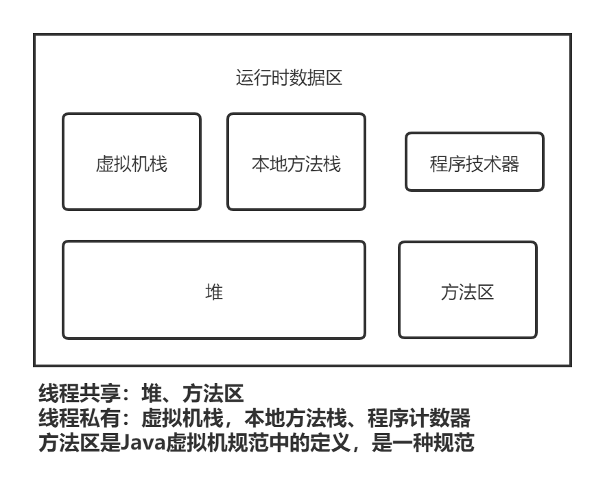
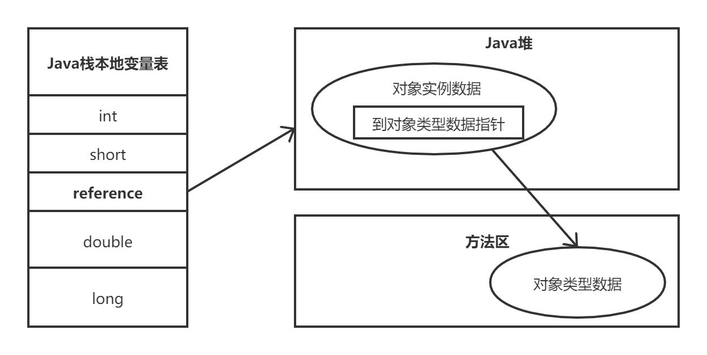
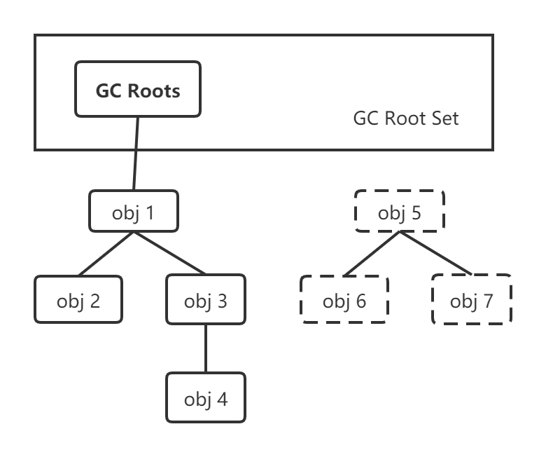

#   JVM面试

## JVM运行时数据区区域分为那几部分

### 程序计数器

​    程序计数器（Program Counter Register）是一块较小的内存空间，它可以看做是当前线程锁执行的字节码的行号指示器。在虚拟机概念模型里（仅是概念模型，各种虚拟机可能会通过一些更高效的方式去实现），字节码解释器工作时就是通过改变这个计数器的值来选择下一条需要执行的字节码指令，分支、循环、跳转、异常处理、线程恢复等基础功能都需要依赖这个计数器来完成。

​    由于Java虚拟机的多线程是通过线程轮流切换并分配处理器执行时间的方式来实现的，在任何一个确定的时刻，一个处理器（对于多核处理器来说是一个内核）都只会执行一条线程中的指令。因为，为了线程切换后能恢复到正确的执行位置，每条线程都需要有一个独立的程序计数器，个条线程之间互不影响，独立存储，我们称之为‘线程私有’的内存。

​    如果线程正在执行的是一个java方法，这个计数器记录的是正在执行的虚拟机字节码指令的地址；如果正在执行的是Native方法，这个计数器为空。此内存区域是唯一一个在java虚拟机规范中没有规定任何OutOfMemoryError情况的区域。

### Java虚拟机栈

​    与程序计数器一样，Java虚拟机栈也是线程私有的，它的生命周期与线程相同。虚拟机栈描述的是java方法执行的内存模型：每个方法在执行的同时都会创建一个栈帧（stack Frame）用于存储局部变量表、操作数栈、动态链接、方法出口等信息。每一个方法从调用直至执行完成的过程，就对应着一个栈帧在虚拟机栈中入栈到出栈的过程

​    局部变量表存放了编译期可知的各种基本数据类型(boolean, byte, char, short, int, float, long, double)，对象引用(reference类型，它不等同于对象本身，可能是一个指向对象起始地址的引用指针，也可能是指向一个代表对象的句柄或其他与此对象相关的位置)和returnAddress类型（指向一条字节码指令的地址）

​    其中64位长度的long和double类型的数据会占用2个局部变量空间(Slot)，其余的数据类型只占1个。局部变量表锁需要的内存空间在编译器间完成分配，当进入一个方法时，这个方法需要在栈中分配多大的局部变量空间是完全确定的，在方法运行期间不会改变局部变量表的大小。

​    在Java虚拟机规范中，对这个区域规定了两种异常状况：StackOverflowError(栈深度大于虚拟机允许的深度)和OutOfMemoryError(无法申请到足够的内存)

### 本地方法栈

本地方法栈（Native Method Stack）与虚拟机栈锁发挥的作用是非常相似的，他们之间的区别不过是虚拟机栈为虚拟机执行java方法（也就是字节码）服务，而本地方法栈则为虚拟机使用到的native方法服务。

### Java堆

​    对于大多数应用来说，java堆是java虚拟机锁管理的内存中最大的一块。java堆是被所有线程共享的一块内存区域，在虚拟机启动时创建。此内存区域的唯一目的就是存放对象实例，几乎所有的对象实例都在这里分配内存。这一点在java虚拟机规范中的描述是：所有的对象实例以及数组都要在堆上分配，**但是随着 JIT 编译器的发展与逃逸分析技术逐渐成熟，栈上分配、标量替换优化技术将会导致一些微妙的变化发生，所有对象分配在堆上渐渐变得不是那么绝对了。**

​    java堆是垃圾收集器管理的主要区域，因此很多时候也被称为“GC堆”（Garbage Collected Heap，型号国内没有翻译成“垃圾堆”）。从内存回收的角度来看，由于现在收集器基本都采用分代收集算法，所以java堆中还可以细分为：**新生代和老年代；再细致一点的有Eden空间，From Survivor空间、To Survivor空间等。从内存分配的角度来看，线程共享的Java堆中可能划分出多个线程私有的分配缓存区（Thread Local Allocation Buffer, TLAB）**。不过无论怎么划分，都与存放的内容无关，无论哪个区域存放的都仍然是对象实例，进一步划分的目的是为了更好的回收内存，或者更快的分配内存。

​    根据java虚拟机规范的规定，java对可以处于物理上不连续的内存空间中，只要逻辑上是连续的即可，就像我们的磁盘空间一样。当前主流的虚拟机都是按照可扩展来实现的(通过 -Xmx 和 -Xms 控制)。如果在堆中没有内存完成实例分配，并且堆也无法再扩展时，将会抛出OutOfMemoryError异常.

### 方法区

​    方法区(Method Area)与java堆一样，是各个线程共享的内存区域，它用于存储已被虚拟机加载的类信息、常量、静态变量、即时编译器编译后的代码等数据。虽然java虚拟机规范把方法区描述为堆的一个逻辑部分，但它却有一个别名叫做Non-Heap,目的应该是与java对区分开来。

​    对于习惯在HotSpot虚拟机上开发、部署程序的开发者来说，很多人都更愿意把方法区称为“永久代”（Permanent Generation），本质上两者并不等价，仅仅是因为HotSpot虚拟机的设计团队选择吧GC分代收集扩展至方法区。（具体看书）

​    根据java虚拟机规范的规定，当方法区无法满足内存分配需求时，将抛出OutOfMemoryError异常。

### 运行时常量

​    运行时常量（Runtime Constant Pool）是方法区的一部分。Class文件中除了有类的版本、字段、方法、接口等描述信息外，还有一项信息是常量池（Constant Pool Table），用于存放编译器生成的各种字面量和符号引用，这部分内容将在类加载后进入方法区的运行时常量池中存放。

​    运行时常量池相对于Class文件常量池的另外一个重要特征是具备动态性，Java语言并不要求常量一定只有编译期才能产生，也就是并非预置入Class文件中常量池的内容才能进入方法区运行时常量池，运行期间也可能将新的常量放入池中，这种特性被开发人员利用比较多的是String类的intern()方法。

  当常量池无法再申请到内存时会OutOfMemoryError。

#### 字符串常量池（string pool）

​    字符串常量池里的内容是在类加载完成，经过验证，准备阶段之后在堆中生成字符串对象实例，然后将该字符串对象实例的引用值存到spring pool中（记住：string pool中存的是引用值而不是具体的实例对象，具体的实例对象时在堆中开辟的一块空间存放的），spring pool在每个虚拟机上只有一份，被所有类共享

### 直接内存

​    直接内存（Direct Memory）并不是虚拟机运行时数据区的一部分，也不是java虚拟机规范中定义的内存区域。但是这部分内存也被频繁地使用，而且也可能导致OutOfMemoryError异常出现。、

​    在JDK1.4中加入了NIO（New Input/Output）类，引入了一种基于通道与缓冲区的I/O方式，它可以使用Native函数库直接分配对外内存，然后通过一个存储在java对中的DirectByteBuffer对象作为这块内存的引用进行操作。这样能在一些场景下显著提高性能，因为避免了再Java堆和Native堆中来回复制数据

​    显然，本机直接内存分配不会受到java对大小的限制，但是，既然是内存，肯定还是会受到本机总内存大小以及处理器寻址空间的限制。服务器管理员在配置虚拟机参数时，会根据实际内存设置-Xmx等参数信息，但经常忽略直接内存，使得各个内存区域综合大于物理内存限制，从而导致OutOfMemoryError异常。

## 对象的创建

​    Java是一门面向对象的编程语言，在java程序运行过程中无时无刻都有对象被创建出来。在语言层面上，创建对象（例如克隆、反序列化）通常仅仅需要一个new关键字而已，而在虚拟机中，对象（普通对象）的创建又是怎样的过程呢。

​    虚拟机遇到一条new指令时，首先将去检查这个指令的参数是否能在常量池中定位到一个类的符号引用，并且检查这个符号引用代表的类是否已被加载、解析和初始化过。如果没有，那么必须先执行相应的类加载过程。

​    在类加载检查通过后，接下来虚拟机将为新生对象分配内存。对象所需内存的大小在类加载完成后变可完全确定，为对象分配空间的任务等同于把一块确定大小的内存从java堆中划分出来。假设java堆中内存时绝对规整的，所有用过的内存都放一边，空闲的内存放另一边，中间放着一个指针作为分界点的指示器，那分配内存就仅仅是把那个指针向空闲空间挪一挪，这种分配的方式叫指针碰撞。如果java堆中的的内存并不是规整的，已使用的内存和空闲的内存相互交错，那就没有办法简单的进行指针碰撞了，虚拟机就必须维护一个列表，记录上哪些内存块是可用的，在分配的时候从列表中找到一块足够大的空间划分给对象实例，并更新列表上的记录，这种配置方式称为“空闲列表”（Free List）。选择哪种分配方式由java堆是否规整决定，而java堆是否规整又由所采用的垃圾收集器是否带有压缩整理功能决定。因此，在使用Serial，ParNew等待Compact过程的收集器时，系统采用的分配算法是指针碰撞，而使用CMS这种基于Mark-Sweep算法的收集器时，通常采用空闲列表。

​    除如何划分可用空间之外，还有另一个需要考虑的问题是对象创建在虚拟机是非常频繁的行为，即使是仅仅修改一个指针所指向的位置，在并发情况下也并不是线程安全的，可能出现正在给A分配内存，指针还没来得及修改，对象B又同时使用了原来的指针来分配内存的情况。解决这个问题有两个方案，一种是对分配内存空间的动作进行同步处理----实际上虚拟机采用CAS配上失败重试的方式保证了其原子性；另一种是把内存分配的动作按照线程划分在不同的空间之中进行，即每个线程在Java堆中预先分配以小块内存，称为本地线程分配缓存（Thread Local Allocation Buffer,TLAB）。哪个线程要分配内存，就在哪个线程的TLAB上分配，只有TLAB用完并分配新的TLAB时，才需要同步锁定。虚拟机是否使用TLAB，可以通过-XX:+/-UseTLAB参数来设定。

​      内存分配完后，虚拟机需要将分配到的内存空间都初始化为零值（不包括对象头），如果使用了TLAB，这一工作过程也可以提前至TLAB分配时进行。这一步操作保证了对象的实例字段在Java代码中可以不赋初始值就直接使用（细品细品），程序能访问到这些字段的数据类型所对应的零值。

  接下来，虚拟机要对对象进行必要的设置，例如这个对象是哪个类的实例，如何才能找到类的元数据信息，对象的哈希吗、对象的GC分代年龄等信息。这些信息存放在对象的对象头中。根据虚拟机当前的运行状态的不同，如是否启用偏向锁等，对象头会有不同的设置方式。

​    在上面的工作完成之后，从虚拟机的角度来看，一个新的对象已经产生了，但从java程序的视角来看，对象创建才刚刚开始----<init>方法还没执行，所有的字段都还为零。所以，一般来说，执行new指令之后会接着执行<init>方法，把对象按照程序员的医院进行初始化，这样一个真正的对象才算完全产生出来。

### 对象的内存布局

​    在HotSpot虚拟机中，对象在内存中存储的布局可以分为3块区域：对象头(Header)，实例数据(Instance Data)和对齐填充(padding)

​    HotSpot虚拟机的对象头包括两部分信息，第一部分用于存储对象自身的运行时数据，如哈希码(Hash Code)、GC分代年龄、锁状态标志、线程持有的锁、偏向线程ID、偏向时间戳等，这部分数据的长度在32位和64位的虚拟机中分别为32bit和64bit，官方称为"Mark Word"。对象需要存储的运行时数据很多，其实已经超出了32位、64位Bitmap结构锁能记录的限度，但是对象头信息是与对象自身定义的数据无关的额外存储成本，考虑到虚拟机的空间效率，Mark Word被设计成了一个非固定的数据结构以便在绩效的空间内存储尽量多的信息，它会根据对象的状态复用自己的存储空间。例如，在32位的HotSpot虚拟机中，如果对象处于未被锁定的状态下，那么Mark Word的32bit空间中的25bit用于存放对象哈希码，4bit用于存放对象分代年龄，2bit用于存储锁定标志，1bit固定为0，而在其他状态（轻量级锁定，重量级锁定，GC标记、可偏向）下对象的存储内容

| 存储内容                             | 标志位 | 状态               |
| ------------------------------------ | ------ | ------------------ |
| 对象哈希码、对象分代年龄             | 01     | 未锁定             |
| 指向锁记录的指针                     | 00     | 轻量级锁定         |
| 指向重量级锁的指针                   | 10     | 膨胀（重量级锁定） |
| 空，不需要记录信息                   | 11     | GC标记             |
| 偏向线程ID、偏向时间戳、对象分代年龄 | 01     | 可偏向             |

  对象头的另一部分是类型指针，即对象指向它的类元数据的指针，虚拟机通过这个指针来确定这个对象时哪个类的实例。并不是所有的虚拟机实现都必须在对象数据上保留类型指针，换句话说，查找对象的元数据信息并不一定要经过对象本身。另外，如果对象时一个java数组，那在对象头中还必须有一块用于记录数组长度的数据，因为虚拟机可以通过普通java对象的元数据信息确定java对象的大小，但是从数组的元数据中却无法确定数组大小。

​    接下来的实例数据部分是对象真正存储的有效信息，也是在程序代码中所定义的各种类型的字段内容。无论是从父类继承下来的，还在子类定义的，都需要记录下来。这部分的存储顺序会受到虚拟机分配策略参数和字段在java源码中定义顺序的影响。HotSpot虚拟机默认的分配策略为longs/doubles、ints、shorts/chars、bytes/booleans、oops(Ordingary Object Pointers)，从分配策略来看，相同宽度的字段总是被分配到一起。在满足这个前提条件下，在父类中定义的变量会出现在子类之前。如果CompactFields参数值为true（默认true），那么子类中较窄的变量也可能会插入到父类变量的空隙中

​    第三部分对齐填充并不是必然存在的，也没有特别含义，它仅仅起者占位符的作用。由于HotSpot VM的自动内存管理系统要求对象起始地址必须是8字节的整数倍，换句话说，就是对象的大小必须是8字节的整数倍。而对象头正好是8字节的整数倍（1倍或者两倍）,因此，当对象实例数据部分没有对齐时，就需要通过对齐填充来补全。

### 对象的访问定位

​    建立对象时为了使用对象，我们java程序需要通过栈上的reference数据来操作堆上的具体对象。由于reference类型在java虚拟机规范中只规定了一个指向对象的引用，并没有定义这个引用应该通过何种方式去定位、访问堆中的对象的具体位置，所以对象访问方式也是取决于虚拟机实现而定的。目前主流的方式有使用句柄和直接指针两种。

#### 句柄访问

如果使用句柄访问的话，那么java对中将会划分出一块内存来作为句柄池，reference中存储的就是对象的句柄地址，而句柄中包含了对象实例数据预类型数据各自的具体地址信息

.png)

#### 指针访问

如果直接使用指针方式访问，那么java堆对象的布局中就必须考虑如何防止访问类型数据的相关信息，而reference中存储的直接就是对象地址

​    这两种方式各有优势，使用句柄来访问的最大好处是reference存储的是稳定的句柄地址，在对象被移动（垃圾收集时移动对象时非常普遍的行为）时只会改变句柄种的实例数据指针，而refernce本身不需要修改。

​    使用直接指针方式的最大好处就是处理速度快，它节省了一次指针定位的时间开销，由于对象的访问在java中非常频繁，因此这类开销积少成多后也是一项非常可观的执行成本。HotSpot使用的是第二种方式，但从整个软件开发的范围来看，各种语言和框架使用句柄来访问的情况也十分常见。

# 垃圾收集器与内存分配策略

思考3件事情

- 哪些内存需要回收
- 什么时候回收
- 如何回收

经过半个多世纪的发展，目前内存的动态分配与回收技术已经相当成熟，为什么我们还要去了解GC和内存分配呢。答案很简单：当需要排查各种内存溢出，内存泄漏问题时，当垃圾收集称为系统达到更高并发量的瓶颈时，我们就需要对这些自动化的技术实施必要的监控和调节。

   线程私有的内存空间随线程而生，随线程而灭。而java堆和方法区就不一样了。

## 对象已死吗

​    在堆里面存放着java世界几乎所有的对象实例，垃圾收集器在对堆进行回收前，第一件事情就是要确认这些对象哪些还存活，哪些已经死亡。

### 引用计数算法

​    很多教科书判断对象是否存活的算法是这样的：给对象中添加一个引用计数器，每当有一个地方引用它时，计数器值就加1；当引用失效时，计数器就减1；任何时候计数器为0的对象就不可能再被使用。但这样的算法有一个问题，若A引用了B，B引用了A，他们互相引用，而再也没有其他地方引用到他们本身时，实际上他们不可能再被使用，但是他们的引用计数器值都为1，于是引用计数器无法通知GC收集器回收他们

### 可达性分析算法

在java语言中，可作为GC Roots的对象包括下面几种

- 虚拟机栈（栈帧中的本地变量表）中引用的对象
- 方法区中类静态属性引用的对象
- 方法区中常量引用的对象
- 本地方法栈JNI引用的对象

### 再谈引用

​    无论是通过引用计数器算法还是可达性算法，判定对象是否存活都与 “引用” 有关。在JDK1.2之前，java中的引用的定义很传统：如果Refernce类型的数据中存储的数值代表是另外一块内存的起始地址，就称为者块内存代表着一块引用。这种定义太过狭隘，以个对象在这种定义下只有被引用或者没有被引用两种状态，对于如何描述一种“食之无味，弃之可惜”的对象就显得无能为力。我们希望能描述这样一类对象，当内存空间还足够时，则能保留在内存之中；如果内存空间在进行垃圾收集后还是不够，则可以抛弃这些对象。很多系统的缓存功能都符合这样的应用场景。

​    在JDK1.2之后，java对引用的概念进行补充，将引用分为强引用（Strong reference）、软引用(Soft Reference)、弱引用（Weak Refernce），虚引用（Phantom Refernce）4种，这4中引用的强度依次逐渐减弱。