#   JVM面试

## JVM运行时数据区区域分为那几部分


### 程序计数器

​    程序计数器（Program Counter Register）是一块较小的内存空间，它可以看做是当前线程锁执行的字节码的行号指示器。在虚拟机概念模型里（仅是概念模型，各种虚拟机可能会通过一些更高效的方式去实现），字节码解释器工作时就是通过改变这个计数器的值来选择下一条需要执行的字节码指令，分支、循环、跳转、异常处理、线程恢复等基础功能都需要依赖这个计数器来完成。

​    由于Java虚拟机的多线程是通过线程轮流切换并分配处理器执行时间的方式来实现的，在任何一个确定的时刻，一个处理器（对于多核处理器来说是一个内核）都只会执行一条线程中的指令。因为，为了线程切换后能恢复到正确的执行位置，每条线程都需要有一个独立的程序计数器，个条线程之间互不影响，独立存储，我们称之为‘线程私有’的内存。

​    如果线程正在执行的是一个java方法，这个计数器记录的是正在执行的虚拟机字节码指令的地址；如果正在执行的是Native方法，这个计数器为空。此内存区域是唯一一个在java虚拟机规范中没有规定任何OutOfMemoryError情况的区域。

### Java虚拟机栈

​    与程序计数器一样，Java虚拟机栈也是线程私有的，它的生命周期与线程相同。虚拟机栈描述的是java方法执行的内存模型：每个方法在执行的同时都会创建一个栈帧（stack Frame）用于存储局部变量表、操作数栈、动态链接、方法出口等信息。每一个方法从调用直至执行完成的过程，就对应着一个栈帧在虚拟机栈中入栈到出栈的过程

​    局部变量表存放了编译期可知的各种基本数据类型(boolean, byte, char, short, int, float, long, double)，对象引用(reference类型，它不等同于对象本身，可能是一个指向对象起始地址的引用指针，也可能是指向一个代表对象的句柄或其他与此对象相关的位置)和returnAddress类型（指向一条字节码指令的地址）

​    其中64位长度的long和double类型的数据会占用2个局部变量空间(Slot)，其余的数据类型只占1个。局部变量表锁需要的内存空间在编译器间完成分配，当进入一个方法时，这个方法需要在栈中分配多大的局部变量空间是完全确定的，在方法运行期间不会改变局部变量表的大小。

​    在Java虚拟机规范中，对这个区域规定了两种异常状况：StackOverflowError(栈深度大于虚拟机允许的深度)和OutOfMemoryError(无法申请到足够的内存)

### 本地方法栈

本地方法栈（Native Method Stack）与虚拟机栈锁发挥的作用是非常相似的，他们之间的区别不过是虚拟机栈为虚拟机执行java方法（也就是字节码）服务，而本地方法栈则为虚拟机使用到的native方法服务。

### Java堆

​    对于大多数应用来说，java堆是java虚拟机锁管理的内存中最大的一块。java堆是被所有线程共享的一块内存区域，在虚拟机启动时创建。此内存区域的唯一目的就是存放对象实例，几乎所有的对象实例都在这里分配内存。这一点在java虚拟机规范中的描述是：所有的对象实例以及数组都要在堆上分配，**但是随着 JIT 编译器的发展与逃逸分析技术逐渐成熟，栈上分配、标量替换优化技术将会导致一些微妙的变化发生，所有对象分配在堆上渐渐变得不是那么绝对了。**

​    java堆是垃圾收集器管理的主要区域，因此很多时候也被称为“GC堆”（Garbage Collected Heap，型号国内没有翻译成“垃圾堆”）。从内存回收的角度来看，由于现在收集器基本都采用分代收集算法，所以java堆中还可以细分为：**新生代和老年代；再细致一点的有Eden空间，From Survivor空间、To Survivor空间等。从内存分配的角度来看，线程共享的Java堆中可能划分出多个线程私有的分配缓存区（Thread Local Allocation Buffer, TLAB）**。不过无论怎么划分，都与存放的内容无关，无论哪个区域存放的都仍然是对象实例，进一步划分的目的是为了更好的回收内存，或者更快的分配内存。

​    根据java虚拟机规范的规定，java对可以处于物理上不连续的内存空间中，只要逻辑上是连续的即可，就像我们的磁盘空间一样。当前主流的虚拟机都是按照可扩展来实现的(通过 -Xmx 和 -Xms 控制)。如果在堆中没有内存完成实例分配，并且堆也无法再扩展时，将会抛出OutOfMemoryError异常.

### 方法区

​    方法区(Method Area)与java堆一样，是各个线程共享的内存区域，它用于存储已被虚拟机加载的类信息、常量、静态变量、即时编译器编译后的代码等数据。虽然java虚拟机规范把方法区描述为堆的一个逻辑部分，但它却有一个别名叫做Non-Heap,目的应该是与java对区分开来。

​    对于习惯在HotSpot虚拟机上开发、部署程序的开发者来说，很多人都更愿意把方法区称为“永久代”（Permanent Generation），本质上两者并不等价，仅仅是因为HotSpot虚拟机的设计团队选择吧GC分代收集扩展至方法区。（具体看书）

​    根据java虚拟机规范的规定，当方法区无法满足内存分配需求时，将抛出OutOfMemoryError异常。

### 运行时常量

​    运行时常量（Runtime Constant Pool）是方法区的一部分。Class文件中除了有类的版本、字段、方法、接口等描述信息外，还有一项信息是常量池（Constant Pool Table），用于存放编译器生成的各种字面量和符号引用，这部分内容将在类加载后进入方法区的运行时常量池中存放。

​    运行时常量池相对于Class文件常量池的另外一个重要特征是具备动态性，Java语言并不要求常量一定只有编译期才能产生，也就是并非预置入Class文件中常量池的内容才能进入方法区运行时常量池，运行期间也可能将新的常量放入池中，这种特性被开发人员利用比较多的是String类的intern()方法。

  当常量池无法再申请到内存时会OutOfMemoryError。

#### 字符串常量池（string pool）

​    字符串常量池里的内容是在类加载完成，经过验证，准备阶段之后在堆中生成字符串对象实例，然后将该字符串对象实例的引用值存到spring pool中（记住：string pool中存的是引用值而不是具体的实例对象，具体的实例对象时在堆中开辟的一块空间存放的），spring pool在每个虚拟机上只有一份，被所有类共享

### 直接内存

​    直接内存（Direct Memory）并不是虚拟机运行时数据区的一部分，也不是java虚拟机规范中定义的内存区域。但是这部分内存也被频繁地使用，而且也可能导致OutOfMemoryError异常出现。、

​    在JDK1.4中加入了NIO（New Input/Output）类，引入了一种基于通道与缓冲区的I/O方式，它可以使用Native函数库直接分配对外内存，然后通过一个存储在java对中的DirectByteBuffer对象作为这块内存的引用进行操作。这样能在一些场景下显著提高性能，因为避免了再Java堆和Native堆中来回复制数据

​    显然，本机直接内存分配不会受到java对大小的限制，但是，既然是内存，肯定还是会受到本机总内存大小以及处理器寻址空间的限制。服务器管理员在配置虚拟机参数时，会根据实际内存设置-Xmx等参数信息，但经常忽略直接内存，使得各个内存区域综合大于物理内存限制，从而导致OutOfMemoryError异常。

## 对象的创建

​    Java是一门面向对象的编程语言，在java程序运行过程中无时无刻都有对象被创建出来。在语言层面上，创建对象（例如克隆、反序列化）通常仅仅需要一个new关键字而已，而在虚拟机中，对象（普通对象）的创建又是怎样的过程呢。

​    虚拟机遇到一条new指令时，首先将去检查这个指令的参数是否能在常量池中定位到一个类的符号引用，并且检查这个符号引用代表的类是否已被加载、解析和初始化过。如果没有，那么必须先执行相应的类加载过程。

​    在类加载检查通过后，接下来虚拟机将为新生对象分配内存。对象所需内存的大小在类加载完成后变可完全确定，为对象分配空间的任务等同于把一块确定大小的内存从java堆中划分出来。假设java堆中内存时绝对规整的，所有用过的内存都放一边，空闲的内存放另一边，中间放着一个指针作为分界点的指示器，那分配内存就仅仅是把那个指针向空闲空间挪一挪，这种分配的方式叫指针碰撞。如果java堆中的的内存并不是规整的，已使用的内存和空闲的内存相互交错，那就没有办法简单的进行指针碰撞了，虚拟机就必须维护一个列表，记录上哪些内存块是可用的，在分配的时候从列表中找到一块足够大的空间划分给对象实例，并更新列表上的记录，这种配置方式称为“空闲列表”（Free List）。选择哪种分配方式由java堆是否规整决定，而java堆是否规整又由所采用的垃圾收集器是否带有压缩整理功能决定。因此，在使用Serial，ParNew等待Compact过程的收集器时，系统采用的分配算法是指针碰撞，而使用CMS这种基于Mark-Sweep算法的收集器时，通常采用空闲列表。

​    除如何划分可用空间之外，还有另一个需要考虑的问题是对象创建在虚拟机是非常频繁的行为，即使是仅仅修改一个指针所指向的位置，在并发情况下也并不是线程安全的，可能出现正在给A分配内存，指针还没来得及修改，对象B又同时使用了原来的指针来分配内存的情况。解决这个问题有两个方案，一种是对分配内存空间的动作进行同步处理----实际上虚拟机采用CAS配上失败重试的方式保证了其原子性；另一种是把内存分配的动作按照线程划分在不同的空间之中进行，即每个线程在Java堆中预先分配以小块内存，称为本地线程分配缓存（Thread Local Allocation Buffer,TLAB）。哪个线程要分配内存，就在哪个线程的TLAB上分配，只有TLAB用完并分配新的TLAB时，才需要同步锁定。虚拟机是否使用TLAB，可以通过-XX:+/-UseTLAB参数来设定。

​      内存分配完后，虚拟机需要将分配到的内存空间都初始化为零值（不包括对象头），如果使用了TLAB，这一工作过程也可以提前至TLAB分配时进行。这一步操作保证了对象的实例字段在Java代码中可以不赋初始值就直接使用（细品细品），程序能访问到这些字段的数据类型所对应的零值。

  接下来，虚拟机要对对象进行必要的设置，例如这个对象是哪个类的实例，如何才能找到类的元数据信息，对象的哈希吗、对象的GC分代年龄等信息。这些信息存放在对象的对象头中。根据虚拟机当前的运行状态的不同，如是否启用偏向锁等，对象头会有不同的设置方式。

​    在上面的工作完成之后，从虚拟机的角度来看，一个新的对象已经产生了，但从java程序的视角来看，对象创建才刚刚开始----<init>方法还没执行，所有的字段都还为零。所以，一般来说，执行new指令之后会接着执行<init>方法，把对象按照程序员的医院进行初始化，这样一个真正的对象才算完全产生出来。

### 对象的内存布局

​    在HotSpot虚拟机中，对象在内存中存储的布局可以分为3块区域：对象头(Header)，实例数据(Instance Data)和对齐填充(padding)

​    HotSpot虚拟机的对象头包括两部分信息，第一部分用于存储对象自身的运行时数据，如哈希码(Hash Code)、GC分代年龄、锁状态标志、线程持有的锁、偏向线程ID、偏向时间戳等，这部分数据的长度在32位和64位的虚拟机中分别为32bit和64bit，官方称为"Mark Word"。对象需要存储的运行时数据很多，其实已经超出了32位、64位Bitmap结构锁能记录的限度，但是对象头信息是与对象自身定义的数据无关的额外存储成本，考虑到虚拟机的空间效率，Mark Word被设计成了一个非固定的数据结构以便在绩效的空间内存储尽量多的信息，它会根据对象的状态复用自己的存储空间。例如，在32位的HotSpot虚拟机中，如果对象处于未被锁定的状态下，那么Mark Word的32bit空间中的25bit用于存放对象哈希码，4bit用于存放对象分代年龄，2bit用于存储锁定标志，1bit固定为0，而在其他状态（轻量级锁定，重量级锁定，GC标记、可偏向）下对象的存储内容

| 存储内容                             | 标志位 | 状态               |
| ------------------------------------ | ------ | ------------------ |
| 对象哈希码、对象分代年龄             | 01     | 未锁定             |
| 指向锁记录的指针                     | 00     | 轻量级锁定         |
| 指向重量级锁的指针                   | 10     | 膨胀（重量级锁定） |
| 空，不需要记录信息                   | 11     | GC标记             |
| 偏向线程ID、偏向时间戳、对象分代年龄 | 01     | 可偏向             |

  对象头的另一部分是类型指针，即对象指向它的类元数据的指针，虚拟机通过这个指针来确定这个对象时哪个类的实例。并不是所有的虚拟机实现都必须在对象数据上保留类型指针，换句话说，查找对象的元数据信息并不一定要经过对象本身。另外，如果对象时一个java数组，那在对象头中还必须有一块用于记录数组长度的数据，因为虚拟机可以通过普通java对象的元数据信息确定java对象的大小，但是从数组的元数据中却无法确定数组大小。

​    接下来的实例数据部分是对象真正存储的有效信息，也是在程序代码中所定义的各种类型的字段内容。无论是从父类继承下来的，还在子类定义的，都需要记录下来。这部分的存储顺序会受到虚拟机分配策略参数和字段在java源码中定义顺序的影响。HotSpot虚拟机默认的分配策略为longs/doubles、ints、shorts/chars、bytes/booleans、oops(Ordingary Object Pointers)，从分配策略来看，相同宽度的字段总是被分配到一起。在满足这个前提条件下，在父类中定义的变量会出现在子类之前。如果CompactFields参数值为true（默认true），那么子类中较窄的变量也可能会插入到父类变量的空隙中

​    第三部分对齐填充并不是必然存在的，也没有特别含义，它仅仅起者占位符的作用。由于HotSpot VM的自动内存管理系统要求对象起始地址必须是8字节的整数倍，换句话说，就是对象的大小必须是8字节的整数倍。而对象头正好是8字节的整数倍（1倍或者两倍）,因此，当对象实例数据部分没有对齐时，就需要通过对齐填充来补全。

### 对象的访问定位

​    建立对象时为了使用对象，我们java程序需要通过栈上的reference数据来操作堆上的具体对象。由于reference类型在java虚拟机规范中只规定了一个指向对象的引用，并没有定义这个引用应该通过何种方式去定位、访问堆中的对象的具体位置，所以对象访问方式也是取决于虚拟机实现而定的。目前主流的方式有使用句柄和直接指针两种。

#### 句柄访问

如果使用句柄访问的话，那么java对中将会划分出一块内存来作为句柄池，reference中存储的就是对象的句柄地址，而句柄中包含了对象实例数据预类型数据各自的具体地址信息

.png)

#### 指针访问

如果直接使用指针方式访问，那么java堆对象的布局中就必须考虑如何防止访问类型数据的相关信息，而reference中存储的直接就是对象地址


​    这两种方式各有优势，使用句柄来访问的最大好处是reference存储的是稳定的句柄地址，在对象被移动（垃圾收集时移动对象时非常普遍的行为）时只会改变句柄种的实例数据指针，而refernce本身不需要修改。

​    使用直接指针方式的最大好处就是处理速度快，它节省了一次指针定位的时间开销，由于对象的访问在java中非常频繁，因此这类开销积少成多后也是一项非常可观的执行成本。HotSpot使用的是第二种方式，但从整个软件开发的范围来看，各种语言和框架使用句柄来访问的情况也十分常见。


# 垃圾收集器与内存分配策略

思考3件事情

- 哪些内存需要回收
- 什么时候回收
- 如何回收

经过半个多世纪的发展，目前内存的动态分配与回收技术已经相当成熟，为什么我们还要去了解GC和内存分配呢。答案很简单：当需要排查各种内存溢出，内存泄漏问题时，当垃圾收集称为系统达到更高并发量的瓶颈时，我们就需要对这些自动化的技术实施必要的监控和调节。

   线程私有的内存空间随线程而生，随线程而灭。而java堆和方法区就不一样了。

## 对象已死吗

​    在堆里面存放着java世界几乎所有的对象实例，垃圾收集器在对堆进行回收前，第一件事情就是要确认这些对象哪些还存活，哪些已经死亡。

### 引用计数算法

​    很多教科书判断对象是否存活的算法是这样的：给对象中添加一个引用计数器，每当有一个地方引用它时，计数器值就加1；当引用失效时，计数器就减1；任何时候计数器为0的对象就不可能再被使用。但这样的算法有一个问题，若A引用了B，B引用了A，他们互相引用，而再也没有其他地方引用到他们本身时，实际上他们不可能再被使用，但是他们的引用计数器值都为1，于是引用计数器无法通知GC收集器回收他们

### 可达性分析算法


在java语言中，可作为GC Roots的对象包括下面几种

- 虚拟机栈（栈帧中的本地变量表）中引用的对象
- 方法区中类静态属性引用的对象
- 方法区中常量引用的对象
- 本地方法栈JNI引用的对象

### 再谈引用

​    无论是通过引用计数器算法还是可达性算法，判定对象是否存活都与 “引用” 有关。在JDK1.2之前，java中的引用的定义很传统：如果Refernce类型的数据中存储的数值代表是另外一块内存的起始地址，就称为者块内存代表着一块引用。这种定义太过狭隘，以个对象在这种定义下只有被引用或者没有被引用两种状态，对于如何描述一种“食之无味，弃之可惜”的对象就显得无能为力。我们希望能描述这样一类对象，当内存空间还足够时，则能保留在内存之中；如果内存空间在进行垃圾收集后还是不够，则可以抛弃这些对象。很多系统的缓存功能都符合这样的应用场景。

​    在JDK1.2之后，java对引用的概念进行补充，将引用分为强引用（Strong reference）、软引用(Soft Reference)、弱引用（Weak Refernce），虚引用（Phantom Refernce）4种，这4中引用的强度依次逐渐减弱。

- 强引用就是指在程序代码之中普遍存在的，类似"Object obj = new Object()"这类的引用，只要强引用还存在，垃圾收集器永远不会回收掉被引用的对象。
- 软引用是用来描述一些还有用但并非必须的对象。对于软引用关联着的对象，在系统将要发生内存溢出异常之前，将会把这些对象列进回收范围之中进行第二次回收。如果这次回收还没有足够的内存，才会抛出内存溢出异常。在jdk1.2之后提供了softRefernce类来实现软引用。
- 弱引用也是用来描述非必须对象的，但是它的强度比软引用更弱一些，被弱引用关联的对象只能生存到下一次垃圾收集发生之前。当垃圾收集器工作时，无论当前内存是否足够，都会回收掉只被弱引用关联的对象。在jdk1.2之后，提供了WeakReference类来实现弱引用
- 虚引用也称为幽灵引用，它是最弱的一种应用关系。一个对象是否有虚引用存在，完全不会对其生存时间构成影响，也无法通过虚引用来取得一个对象实例。为一个对象设置虚引用关联的唯一目的就是能在这个对象被收集器回收时收到一个系统通知。在JDK1.2之后，提供了PhantomReference类来实现虚引用。

### 生存还是死亡

​    即使在可达性分析算法中不可达的对象，也并非是“非死不可”的，这时候他们暂时处于“缓刑”阶段，要真正宣告一个对象死亡，至少要经历两次标记过程：如果对象在进行可达性分析后发现没有与GC ROOTS相连接的引用链，那么它将会被第一次标记并且进行一次筛选，筛选的条件是此对象是否有必要执行finalize()方法。当对象没有覆盖finalize()方法，或者finalize()方法已经被虚拟机调用过了，虚拟机将这两种情况都视为“没必要执行了”。

​    如果这个对象被判定为有必要执行finalize()方法，那么这个对象将会放置在一个叫做F-Queue的队列中，并在稍后由一个由虚拟机自动建立的，低优先级的Finalizer线程去执行它。这里所谓的“执行”是指虚拟机会出发这个方法，但并不承诺会等待它运行结束，这样做的原因是，如果一个对象在finalize()方法中执行缓慢，或者发生了死循环，将很可能导致F-Queue队列中其他对象永久等待，甚至导致整个内存回收系统崩溃。finalize()方法是逃脱死亡命运的最后一次机会，稍后GC将对F-Queue中的对象进行第二次小规模的标记，如果对象要在finalize()中成功拯救自己，只要重新与引用链上的任何一个对象关联即可，譬如把自己（this关键字）赋值给某个类变量或者对象的成员变量，那么第二次标记时它将被移除“即将回收”的集合。

​    finalize()方法只会被执行一次，所以第二次自救会失败。

​    需要特别说明的是，各个大神都不鼓励使用这个方法，还是忘记他最好。finalize()能做的所有工作，使用try-finally或者其他方法都可以做得更好、更及时。

### 回收方法区

​    很多人认为方法区（或者HotSpot虚拟机中的永久代）是没有垃圾收集的，Java虚拟机规范中确实说过可以不要求虚拟机在方法区实现垃圾收集，而且在方法区中进行垃圾收集的“性价比”一般较低：在堆中，尤其是在新生代中，常规应用进行一次垃圾收集一般可以回收70%-95%的空间，而永久代的垃圾收集效率远低于此。

​    永久代的垃圾收集主要回收两部分内容：废弃常量和无用的类。回收废弃常量与回收java堆中的对象非常类似。以常量池中字面量的回收为例，加入一个字符串“abc”已经进入了常量池中，但是当前系统没有任何一个String对象时叫做"abc"的，换句话说，就是没有任何String对象引用常量池中的“abc”常量，也没有其他地方引用这个字面量，如果这个时候进行内存回收，这个“abc”就会被清理出常量池。

​    判定一个常量是否是“废弃常量”比较简单，而要判定一个类是否是“无用的类”的条件则相对苛刻许多。

- 该类所有的实例都已经被回收。
- 加载该类的ClassLoader已经被回收。
- 该类对应的java.lang.Class对象没有在任何地方被引用，无法再任何地方通过反射访问该类的方法。

虚拟机可以对满足以上3个条件的无用类进行回收，但是否真的回收，HotSpot虚拟机提供了 -Xnoclassgc参数进行控制，。。。。

​    在大量使用反射、动态代理、CGLib等ByteCode框架，动态生成JSP以及OSGI这类频繁自定义ClassLoader的场景都需要虚拟机具备类卸载的功能，以保证永久代不会溢出。


## 垃圾回收算法

### 标记 - 清除算法

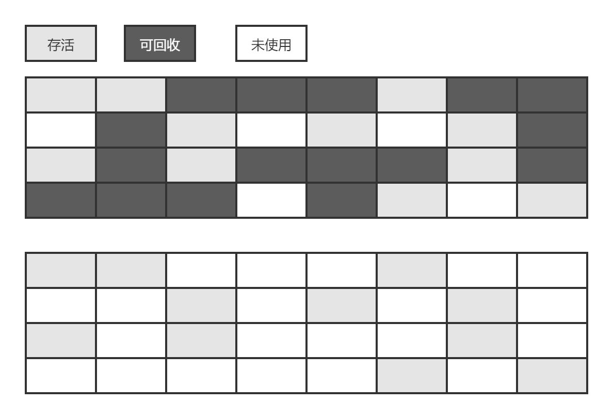

算法分为“标记”和“清除”两个阶段。它的主要不足有两个：一个是效率问题，标记和清除两步效率都不高；另一个是空间问题，标记清除之后会产生大量的不连续的内存碎片，在分配较大对象时，无法找到足够的连续内存而不得不提前触发另一次垃圾收集。

### 复制算法

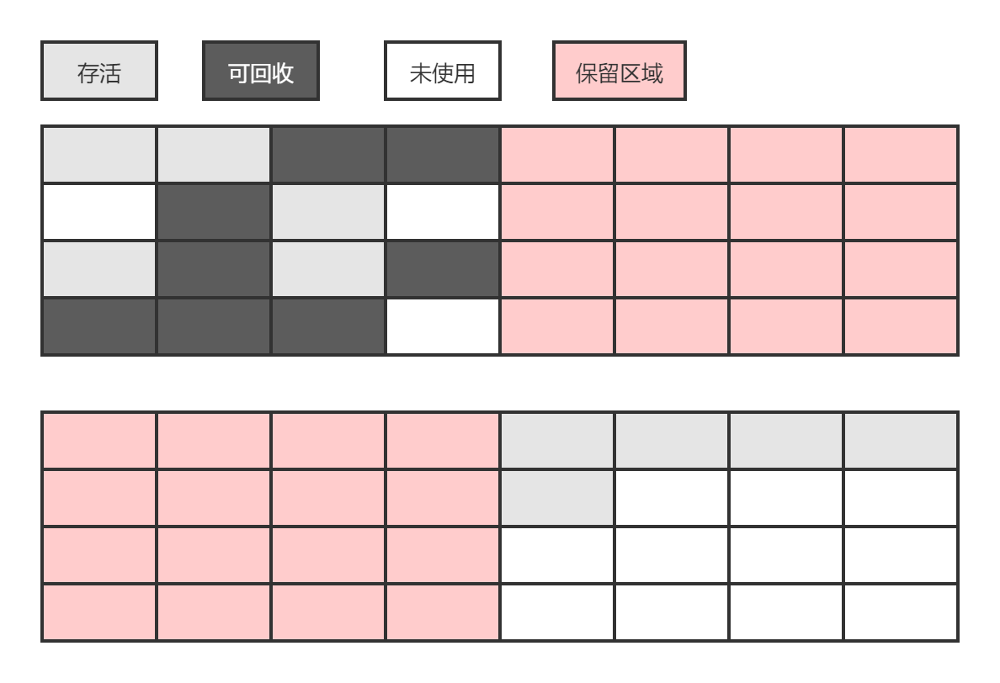

​    为了解决效率问题，一种称为“复制”的收集算法出现了，它将可用内存按容量划分为大小相等的两块，每次只使用一块。当这一块内存用完了，就将还存活的对象复制到领一块去，然后把已使用过的内存空间一次清理掉。这种方式实现简单，运行高效，只是代价是将内存缩小为了原来的一半，未免太高了一点。

​    现在的商业虚拟机都是采用这种收集算法来回收新生代。新生代中的对象98%都是朝生夕死的，所以并不需要按照1:1的比例来划分内存空间，而是将内存分为一块较大的Eden空间和两块较小的Survivor空间，每次使用Eden和其中一块Survivor。当回收时，将Eden和Survivor中还存活的对象一次性的复制到另一块Survivor中，最后清理掉Eden和刚才用过的Survivor。HotSpot虚拟机默认Eden和Survivor的大小比例是8:1，也就是说新生代中可用的内存空间为整个新生代容量的90%，只有10%的内存会被“浪费”。当然98%的对象可回收只是一般场景下的数据，我们没有办法保证每次回收都只有不多余10%的对象存活，当Survivor空间不够时，需要依赖其他内存（这里指老年代）进行分配担保。

### 标记-整理算法

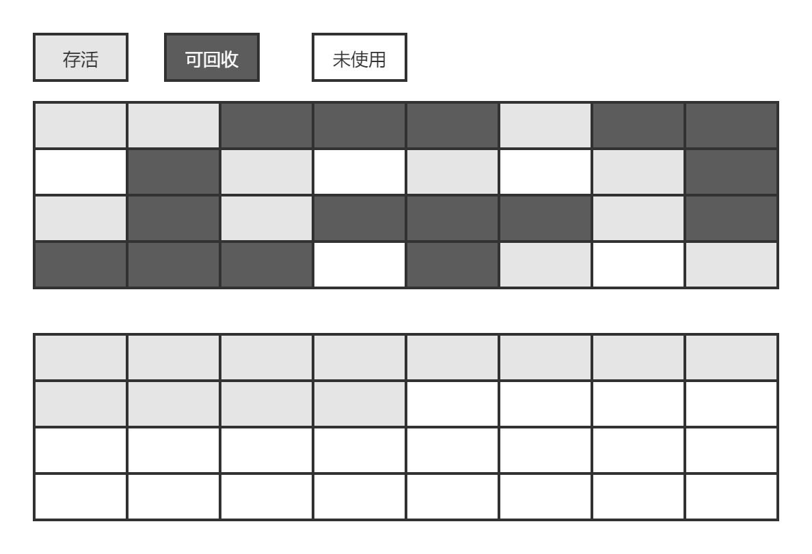

标记的过程和标记-清理算法一样，只是后续步骤不是直接对可回收对象进行清理，而是让所有存活对象都向一端移动，然后直接清理掉边界意外的内存

### 分代收集算法

​    当前商业虚拟机的垃圾收集都采用“分代收集”算法，这种算法并没有什么新的思想，只是根据对象存活周期的不同将内存划分为几块。一般是把java堆分为新生代和老年代，这样就可以根据各个年代的特点采用最适合的收集算法。在新生代中，每次垃圾收集都发现有大批对象死去，只有少量存活，那就选用复制算法，只要付出少量的存活对象的复制成本就可以完成收集。而老年代因为对象存活率高，没有额外的担保空间，就必须使用标记-清理或标记整理算法。

## HotSpot的算法实现

### 枚举根节点

​    可作为GC Root的节点主要在全局性的引用（常量或静态属性）与执行上下文（例如栈帧中的本地变量表）中，现在很多应用仅仅方法区就有数百M，如果要逐个检查，会花费很多时间。

​    **stop the world**

​    当系统停顿下来后，并不需要一个不漏的检查完所有执行上下文和全局的引用位置，虚拟机应当是由办法直接得知哪些地方存放着对象引用。在HotSpot中模式使用一组称为OopMap的数据结构来达到这个目的。

### 安全点

​    在OopMap的协助下，HotSpot可以快速准确的完成GC ROOTS美剧，但是，可能导致引用关系变化，或者说OopMap内容变化的指令非常多，如果要为每一条指令都生成对应的OopMap,那将会需要大量的额外空间。

​    实际上，HotSpot只是在特定的位置记录了这些信息，这些位置称为安全点，即程序并非在所有地方都会停下来开始GC，只有到达安全点后才能暂停。SafePoint不能太少，让GC等待时间太长，也不能过于频繁。所以安全点的选定基本上是以程序“是否具有让程序长时间执行的特征”，例如，方法调用、循环跳转、异常跳转等。

​    对于SafePoint，另一个需要考虑的问题是如何在GC发生时让所有线程都在安全点停下来。

​    抢先式中断，在GC时，先让所有线程都停下来，若发现有的线程没有在安全点，则会恢复线程，让它跑到安全点上。现在几乎没有虚拟机采用抢先试。

​    主动式中断，当GC需要中断线程的时候，不直接对线程操作，仅仅简单的设置一个标志，各个线程执行时主动去轮询这个标志，发现中断标志为真时就自己中断挂起。轮询标志的地方和安全点是重合的，另外再加上创建对象需要分配内存的地方

### 安全区域

​    使用SafePoint似乎已经完美地解决了如何进入GC的问题，但实际情况却不一定。SafePoint机制保证了程序执行时，在不太长的时间内就会遇到可进入GC的Safepoint。但是，程序不执行的时候呢？所谓的不执行指的是，没有分配到CPU时间，典型的例子就是线程处于sleep状态或者Blocked状态，这时候是无法响应JVM的中断请求。JVM也不太可能等待线程重新分配CPU时间。对于这种情况，就需要安全区域来解决。

​    安全区域是指在一段代码中，引用关系不会发生变化。在这个区域中的任意地方开始GC都是安全的，

​    当线程执行到SafeRegion时，首先标识自己已经进入了SafeRegion，那样，当在这段时间里JVM要发起GC时，就不用管标识自己为SafePoint状态的线程了，当线程要离开SafeRegion时，它要检查系统是否已经完成了跟节点枚举（或是整个GC过程），如果完成而来，那线程继续执行。否则就必须等待收到可以安全离开SafeRegion的信号为止。

## 垃圾收集器

.png)

上图展示了7种不同的垃圾收集器，如果两个垃圾收集器之间存在连线，就说明他们可以搭配使用。


### Serial收集器

​    Serial收集器是最基本的，发展历史最悠久的收集器，曾经（JDK1.3.1之前）是虚拟机新生代的唯一选择。看名字就可以知道，这个收集器是一个单线程的收集器，在它进行垃圾收集时，必须暂停其他所有的工作线程，直到它收集结束。

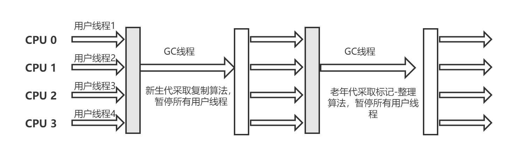

​    Serial看似“老而无用”，但实际上到现在为止，它依然是虚拟机运行在Client模式下的默认新生代收集器。它也有着优于其他收集器的地方：简单，对于限定单个CPU的环境来说，Serial收集器由于没有线程交互开销，专心做垃圾回收效率会更高。

### ParNew收集器

​    ParNew收集器其实就是Serial收集器的多线程版本，除了使用多条线程进行垃圾收集之外，其余行为都与Serial一样，在实现上，这两种收集器也共用了相当多的代码。

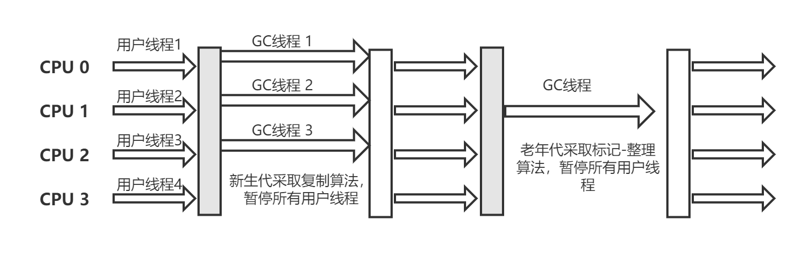

### Parallel Scavenge 收集器

​    Parallel Scavenge收集器是一个新生代收集器，它也是使用复制算法的收集器，又是并行的多线程收集器。看上去和ParNew都一样。Parallel Scavenge收集器的特点是它的关注点与其他收集器不同，GMS等收集器的关注点是尽可能地缩短收集时用户线程的停顿时间，而Parallel Scavenge收集器的目标则是一个可控制的吞吐量（Throughtput）。所谓吞吐量就是CPU用于运行用户代码的时间与CPU总消耗时间的比值，即吞吐量=运行用户代码时间/(运行用户代码时间+垃圾收集时间)。停顿时间越短就越适合需要与用户交互的程序，良好的响应速度能提升用户体验，而高吞吐量则可以高效利用CPU时间，尽快完成程序的任务，主要适合在后台运算而不需要太多交互的任务。

​    由于与吞吐量关系密切，Parallel Scavenge收集器也经常称为“吞吐量优先”收集器。

参数

- -XX:MaxGCPauseMillis：最大收集停顿时间，一个大于0的毫秒数。
- -XX:GCTimeRatio：设置吞吐量大小
- -XX:+UserAdaptiveSizePolicy：开关参数，打开后，就不需要手工指定新生代大小(-Xmn)、Eden与Survivor的比例（-XX：SurvivorRatio）、晋升老年代对象大小（-XX:PretenureSizeThreshold）等细节参数了。虚拟机会根据当前系统的运行情况收集性能监控信息，动态调节这些参数以提供最合适的停顿时间或最大的吞吐量，这种调节方式称为GC自适应的调节策略（GC Ergonomics），如果对于收集器运作原理不太了解，手工优化存在困难的时候，使用Parallel Scavenge收集器配置自适应调节策略，把内存管理的调优任务交给虚拟机去完成是一个不错的选择。只需要把基本的内存参数设置好（如 -Xmx设置最大堆），然后使用MaxGCPauseMillis参数（更关注最大停顿时间）或GCTimeRatio（更关注吞吐量）参数给虚拟机设立一个优化目标，那具体细节就交给虚拟机去完成了。自适应调节策略也是Parallel Scavenge与ParNew的重要区别。

### Serial Old收集器

​     Serial Old是Serial收集器的老年代版本，是一个单线程收集器，使用标记-整理算法。

​    主要有两大用途

- 一种用途是JDK1.5以及之前的版本中与Parallel Scavenge收集器搭配使用。
- 另一种就是作为CMS收集器的后备预案。

### Parallel Old收集器

Parallel Old是Parallel Scavenge收集器的老年代版本，使用多线程和标记-整理算。这个收集器是从JDK1.6中才开始使用的，在此之前，如果新生代选择了Parallel Scavenge收集器，老年代除了Serial Old收集器外别无选择（Parallel Scavenge收集器无法与CMS收集器配合工作）。由于老年代Serial Old收集器在服务端应用性能上的“拖累”，这种组合的吞吐量甚至还不一定有ParNew加CMS的组合给力。

​    直到Parallel Scavenge收集器出现后，“吞吐量优先”收集器终于有了比较名副其实的应用组合。

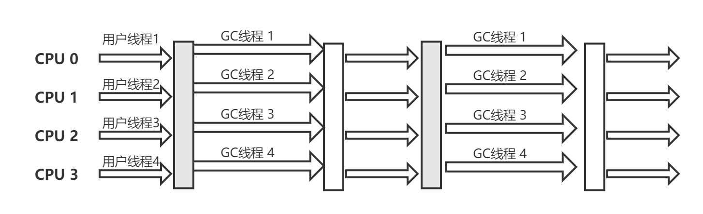

### CMS收集器

​    CMS（Concurrent Mark Sweep）收集器时一种以获取最短回收停顿时间为目标的收集器。目前很大一部分的Java应用集中在互联网站或者B/S系统的服务端上，这类应用尤其重视服务的响应速度，希望系统停顿时间最短。CMS收集器就非常符合这类需求。

​    从名字（包含 Mark Sweep）上就可以看出，CMS收集器是基于标记-清除算法实现，它的运行过程相对于前面几种收集器来说更复杂一些，整个过程分为4个步骤：

- 初始标记(CMS initial mark)
- 并发标记(CMS initial concurrent mark)
- 重新标记(CMS remark)
- 并发清除(CMS concurrent sweep)

​    其中，初始标记、重新标记这两个步骤仍然需要“stop the world”。初始标记仅仅只是标记一下GC ROOTS能直接关联的对象，速度很快，并发标记阶段就是进行GC ROOTS Tracing的过程，而重新标记阶段则是为了修正并发标记期间程序继续运行而导致标记产生变动的那一部分，这个阶段的停顿时间一般会比初始标记阶段稍长一些，但远比并发标记的时间短。

​    由于整个过程中耗时最长的并发标记和并发清除过程收集器线程都可以与用户线程一起工作，所以，从整体上来说，CMS收集器的内存回收过程是与用户线程一起并发执行的。

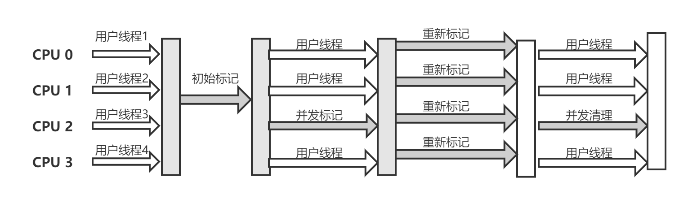

CMS收集器有三个明显的缺点

- 对CPU资源很敏感
- CMS收集器无法处理浮动垃圾。由于CMS并发清理阶段用户线程还运行着，伴随程序运行自然就还会有新的垃圾不断产生，CMS无法再当次收集中处理他们。
- 还有一个缺点，“标记-清理”

### G1收集器

​    G1(Garbage-First)收集器时当今收集器技术发展的最前沿成果之一，早在JDK1.7刚刚确立项目目标。

​    G1是一款面向服务端应用的垃圾收集器。HotSpot开发团队赋予它的使命是替换掉JDK1.5中发布的CMS收集器。

- 并行与并发：G1能充分利用多CPU，多核环境下的硬件优势，使用多个CPU（CPU或者CPU核心）来缩短Stop-the-world停顿的时间，部分其他收集器原本需要停顿Java线程执行的GC动作，G1收集器仍然可以通过并发的方式让Java程序继续执行。
- 分代收集：与其他收集器一样，分代概念在G1中得以保留。虽然G1可以不需要其他收集器配合就能独立管理整个GC堆，但它能采用不同的方式去处理新创建的对象和已经存活了一段时间、熬过多次GC的对象以获取更好的效果。
- 空间整合：与CMS的标记-清理算法不同，G1从整体上来看是基于“标记-整理”算法实现。
- 可预测的停顿：这是G1相对于CMS的另一大优势，降低停顿时间是CMS和G1的共同关注点，但G1除了追求低停顿外，还能建立可预测的停顿时间模型，能让使用者明确指定在一个长度为M毫秒的时间片段内，消耗在垃圾收集器上的时间不得超过N毫秒。

​    在使用G1收集器时，Java堆的内存布局就与其他收集器有很大差别，它将整个Java堆分为多个大小相等的独立区域（Region），虽然还保留有新生代和老年代的概念，但新生代和老年代不再是物理隔离的了，他们都是一部分Region的集合。

​    G1在后台维护一个优先列表，每次根据允许的收集时间，优先回收回收价值最大的Region(这也就是Garbage-First名称的由来)。这种使用Region划分内存空间以及优先级的区域回收方式，保证了G1收集器在有限的时间内可以获取尽可能多的收集效率。

   G1把内存“化整为零”的思路，理解起来似乎很容易，但其中的实现细节却远远没有想象中那么简单，否则也不会从2004年发表第一篇G1的论文到2014年才开发出G1的商用版（10年）。以一个细节为例：把Java堆分为多个Region后，垃圾收集是否就真的能以Region为单位进行了？听起来顺理成章，再仔细想想就很容易发现问题所在：Region不可能是孤立的，一个对象分配在了某个Region中，它并非只能被本region中的其他对象引用，而是可以和整个Java堆任意region的任意对象发生引用关系。那在做可达性判断的时候，岂不是要扫描整个java堆才能保证准确性？这个问题并不是在G1中才有，只是在G1中更加突出了。在以前的分代收集中，新生代的规模一般都比老年代要小得多，新生代的收集也比老年代频繁许多，那回收新生代中的对象时也面临同样的问题，如果回收新生代时也不得不扫描老年代的话，那么Mionr GC的效率可能会下降很多。

​    虚拟机是采用Remenbered Set来避免全堆扫描。G1中每个region都有一个与之对应的Remenbered Set，虚拟机发现程序在对Reference类型的数据进行写操作时，会产生一个Write Barrier暂时中断写操作，检查Refernce引用的对象是否处于不同的region（在分代的例子就是检查是否老年代中的对象引用了新生代中的对象），如果是，变通过CardTable把相关的引用信息记录到被引用对象所属的Region 的Remenbered Set之中，当进行内存回收时，在GC根节点的枚举范围中加入Remenbered Set即可保证不全堆扫描

​    如果不计算Remenbered Set的操作，G1收集器的运作大致可划分为以下几个步骤

- 初始标记：与CMS一样，这个阶段需要停顿线程，但是时间很短
- 并发标记：可达性分析，时间很长，但可与用户线程并行
- 最终标记：修正并发标记期间用户程序继续运行导致的变动，需要停顿线程，但是可以并发执行
- 筛选回收：对各个region的回收价值和成本进行排序，根据用户所期望的GC停顿时间来指定回收计划。

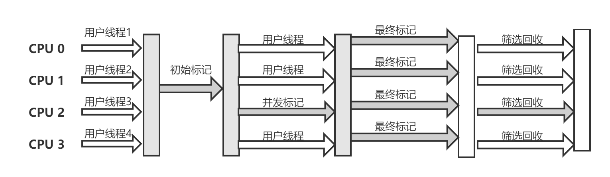

### 理解GC日志

​    阅读GC日志是处理Java虚拟机内存问题的基础技能，它只是一些人为确定的规则，没有太多技术含量。

​    每一种收集器的日志形式都是由他们自身的实现所决定的，换言之，每种收集器的日志不一样。但是维持着一定的共性。

```
33.125: [GC [DefNew: 3324k->152k(3127k), 0.0025925 secs] 3324k->152k(11904k), 0.0031680 secs]
100.667: [Full GC [Tenured: OK->210K(20140K), 0.0149142 SECS]4603K->210K(19456K), [Perm:2999k->2999k(21248k)], 0.0150007 secs] [Times: user=0.01 sys=0.00,real=0.02 secs]
```

​    最前面的"33.125"和"100.667"代表了GC发生的时间，这个数字的含义是从java虚拟机启动以来经过的秒数。

​    GC日志开头的“GC”和"Full GC"说明这次垃圾收集的停顿类型，而不是用来区分新生代GC还是老年代GC的。如果有"Full"，说明这次GC是发生了stop-the-world的，例如下面这段新生代收集器ParNew的日志也会出现“Full GC”。如果是调用了System.gc()方法所触发的收集，那么在这里将显示"Full GC(System)"

```
[Full GC 283.736:[ParNew:261599k->261599k(261952k), 0.0000288secs]]
```

​    接下来的"DefNew"、“Tenured”、“Perm”表示GC发生的区域，这里显示的区域名和使用GC收集器时密切相关的。

​    后面方括号内部“3324k->152k(3712k)”含义是“GC前该内存区域已使用容量->GC后该内存区域使用量(该区域总容量)”。而在方括号之外的"3324k->152k(11904k)表示“GC前堆已使用的容量->GC后堆已使用容量（堆总容量）"

   再往后，"0.0025925 secs"表示该区域GC所占用的时间，单位是秒。

​     [Times: user=0.01 sys=0.00,real=0.02 secs]这里面的user,sys,real与Linux的time命令所输出的时间含义一致，分别代表了用户态消耗的CPU时间，内核态消耗的CPU时间和操作从开始到结束所经过的墙钟时间。CPU时间和强钟时间的区别是，墙钟时间包括各种非运算符的等待耗时，例如等待磁盘I/O、等待线程阻塞，而CPU时间不包括这些耗时。

### 垃圾回收参数总结

## 内存分配与回收策略

​    对象的内存分配，往大方向讲，就是在堆上分配，对象主要分配在新生代的Eden区，如果启用了本地线程分配缓存（LTAB）,将按线程优先在TLAB上分配。少数情况下也可能会直接分配在老年代中，分配规则并不是百分之百固定的，其细节取决于当前使用的是哪一种垃圾收集器组合，还有虚拟机中与内存相关的设置。

### 对象优先在Eden分配

​    大多数情况下，对象在新生代Eden区中分配。当Eden区没有足够空间进行分配时，虚拟机将发起一次Minor GC。

​    虚拟机提供了 -XX:+PrintGCDetails这个收集器日志参数，告诉虚拟机在发生垃圾收集行为时打印回收日志，并且在进程退出的时候输出当前的内存各区域分配的情况。在实际应用中，内存回收日志一般是打印到文件后通过日志工具进行分析。

### 大对象直接进入老年代

所谓的大对象是指，需要大量连续内存空间的java对象，最典型的大对象就是那种很长的字符串以及数组。大对象对虚拟机的内存分配来说就是一个坏消息（比遇到一个大对象更加坏的消息就是遇到一群“朝生夕死”的大对象，写程序的时候应该避免），经常出现大对象容易导致内存还有不少空间时就提前触发垃圾收集。

​    虚拟机提供了一个- XX:PretenureSizeThresholdcanshu ,令大于这份设置值的对象直接在老年代分配。这样做的目的是避免在Eden区及两个Survivor区之间发生大量的内存复制。

### 长期存活的对象将进入老年代

​    既然虚拟机采用了分代收集的思想来管理内存，那么内存回收时就必须能识别哪些对象应该放在新生代，哪些对象应该放在老年代。为了做到这点，虚拟机给每个对象定义了一个对象年龄（Age）计数器。如果对象在Eden出生并经过一次Minor GC后仍然存活，并且能被survivor容纳的话，将被移动到survivor空间，并且对象年龄设为1.对象在Survivor区每“熬”过一次Minor GC，年龄就加一岁，当它的年龄增加到一定程度（默认15岁），就将会被晋升到老年代。对象晋升老年嗲的年龄阈值，可以通过参数 -XX:MaxTenuringThreshold设置

### 动态对象年龄判定

​    为了能更好地适应不同程序的内存状况，虚拟机并不是永远地要求对象的年龄必须达到了MaxTenuringThreshold才能晋升到老年代，如果在Survivor空间中相同年龄所有对象大小的综合大于Survivor空间的一半，年龄大于或等于该年龄的对象就可以直接进入老年代。

### 空间分配担保

​    在发生Minor GC之前，虚拟机会先检查老年代最大可用的连续空间释放大于新生代所有对象总空间，如果这个条件成立，那么Minor GC是可以确保安全的。如果不成立，则虚拟机会查看HandlePromotionFailure设置是否运行担保失败。如果允许，那么会继续检查老年代最大可用连续空间是否大于历次晋升到老年代对象的平均大小，如果大于，将尝试进行一次Minor GC，尽管这次Minor GC是由风险的；如果小于，或者设置为不允许冒险，那这时会进行一次Full GC

# 虚拟机性能监控与故障处理工具

## JDK命令行工具

### JPS:虚拟机进程状况工具

​    JDK的很多小工具的名字都参考了UNIX命令的命名方式，jps(JVM Process Status Tool)是其中的典型。除了名字像UNIX的ps命令，它的功能也和ps相似：可以列出正在运行的虚拟机进程，并且显示虚拟机执行朱磊（Main class, mian()函数所在的类）名称以及这些进程的本地虚拟机唯一ID（Local Virtual Machine Identifier, LVMID）。虽然功能比较单一，但是它是使用频率最高的JDK命令工具，因为其他工具大多数需要输入它查询到的LVMID来确定要监控是哪一个虚拟机进程。

```
jps命令格式：
jps [options] [hostid]
jps执行样例
> jps -l
2388 D:\Develop\xxxxx.jar
2764 com.sun,.....
3788 sun.tools.jps.jps
```

jps选项表

| 选项 | 作用                                               |
| ---- | -------------------------------------------------- |
| -q   | 只输出LVMID，省略主类名称                          |
| -m   | 输出虚拟机进程启动时传递给主类main()函数的参数     |
| -l   | 输出主类的全名，如果进程执行的是jar包，输出Jar路径 |
| -v   | 输出虚拟机进程启动时JVM参数                        |

### jstat：虚拟机统计信息监视工具

​    jstat（JVM Statistic Monitoring Tool）是用于监视虚拟机各种运行状态信息的命令行工具。它可以显示本地或远程虚拟机进程中的类装载、内存、垃圾收集、JIT编译等运行数据。

```
jstat [options vmid [inteval[s|ms] [count]]]
```

​    对于命令格式中的VMID与LVMID需要特别说明一下：如果是本地虚拟机进程，VMID与LVMID是一致的，如果是远程的，格式应该是

```
[protocol:][//]lvmid[@hostname[:port]/servername]
```

​    参数interval 和count代表查询间隔和次数，如果省略这个两个参数，说明只查一次。

```
jstat -gc 2764 250 20
```

​    选项option代表用户希望查询的虚拟机虚拟机信息，主要分为3类：类装载，垃圾收集，运行期编译状况。

| 选项      | 作用                                                         |
| --------- | ------------------------------------------------------------ |
| -class    | 监视类装载、卸载数量、总空间以及类装载所耗费的时间           |
| -gc       | 监视java堆状况，包括Eden区、两个survivor、老年代、永久代等的容量、已用空间、GC时间合计 |
| ...       | ...                                                          |
| -compiler | 输出JIT编译器编译过的方法、耗时等                            |

### jinfo:Java配置信息

```
jindo [option] pid

> jinfo -flag CMSInitiatingOccupancyFraction 1444
-XX:CMSInitiatingOccupancyFraction=85
```

### jmap:Java内存映射工具

​    jmap（Memory Map For Java）命令用于生成堆转储快照（一般称为heapdump或dump文件）。如果不使用jmap命令，要想获取Java堆转储快照，还有一些比较“暴力”的手段：譬如在第2章中用过的-XX:+HeapDumpOnOutOfMemoryError参数，可以让虚拟机在OOM异常出现后自动生成dump文件，又或者在Linux系统下通过Kill -3 命令发送进程退出信号“吓唬”以下虚拟机，也会拿到dump文件

​    jmap的作用并不仅仅是为了获取dump文件，它还可以查询finalize执行队列，java堆和永久代的详细信息，如空间使用率，当前用的是哪种收集器等。

```
jmap [options] vmid
```

option选项

| 选项            | 作用                                                         |
| --------------- | ------------------------------------------------------------ |
| -dump           | 生成java堆转储快照。格式为:-dump[live, ]format=b，file=<filename>,其中live自参数说明是否只dump存活的对象 |
| - finalizerinfo | 显示在F-Queue中等待Finalizer线程执行finalize方法的对象。只在linux平台有效 |
| -heap           | 显示Java堆详细信息，如使用哪种收集器、参数配置、分代情况等。旨在linux有效 |
| -histo          | 显示堆中对象统计信息，包括类、实例数量、合计容量             |
| -permstat       | 已ClassLoader为统计口径显示永久代内存状态，只在linux有效     |
| -F              | 当虚拟机进程对-dump选项没有响应时，可使用这个强制生成快照。  |

```
jmap -dump:format=b,file=eclipse.bin 3500
Dumping heap to .......
Heap dump file created
```

### jhat:虚拟机堆转储快照分析工具

```perl
jhat eclipse.bin
...
...
...
Server is ready
```

显示Server is ready的提示后，在浏览器输入http://localhost:7000/ 就可以看到分析结果

### jstack：Java堆栈跟踪工具

​    生成线程快照的主要目的是定位线程长时间停留的原因：如线程间死锁，死循环，请求外部资源导致的长时间等待等都是导致线程长时间停顿的原因。

### HSDIS:JIT生成代码反汇编

//TODO

## JDK可视化工具

### JConsole

​    JConsole(Java Monitoring and Management Console)是一种基于JMX的可视化监视、管理工具。

#### 启动 Jconsole

​    通过JDK/bin目录下的jconsole.exe 启动JConsole后，将自动搜索出本机运行的所有虚拟机进程，不需要用户自己再使用jps来查询了，也可以使用远程进程功能来连接远程服务器。

#### 内存监控

​    内存页相当于可视化的jstat命令

#### 线程监控

相当于可视化的jstack命令

### VisualVM:多合一故障处理工具

​    VisualVM是到目前为止功能最强大的运行监视和故障处理程序，官方描述"ALL-in-ONE"、

- 显示虚拟机进程以及进程的配置、环境信息（jps，jinfo）
- 监视应用程序CPU、GC、堆、方法区以及线程的信息(jstat，jstack)
- dump以及分析堆转储快照（jmap,jhat）
- 方法级程序运行性能分析，找出被调用最多、运行时间最长的方法
- 离线程序快照：收集程序的运行时配置，线程dump、内存dump等信息建立一个快照，可以将快照发送开发者出进行bug反馈
- 其他plugin的无限的可能性

#### 插件安装

​    VisualVM在JDK1.6update7中才首次出现，首次启动后，先不必着急找应用程序进行检测，因为现在还没有加载任何插件，虽然基本的监视、线程面板的功能主程序都以默认插件的形式提供了，但是不给VisualVM装任何插件，就相当于放弃了它最精华的功能，和没有安装任何应用软件的操作系统差不多。【参考深入理解JVM--P125】

#### 生成、浏览堆转储快照

   在VisualVM 中生成dump文件有两种方式

- 在“应用程序”窗口中右键单击应用程序节点，然后选择“堆Dump”
- 在“应用程序”窗口中双击应用程序节点打开应用程序标间，然后再监视标签中单击堆Dump

#### 分析程序性能

​    在Profiler页签中，VisualVM提供了程序运行期间方法级的CPU执行时间分析以及内存分析，做Profiling分析肯定会对程序的运行性能有比较大的响应。，所以一般不在生产环境中使用这项功能。

【深入理解JVM原理----P127】

在分析应用程序时，可以根据实际的业务复杂度与方法的时间、调用次数做比较，找到最有优化价值的方法。

#### BTrace 动态日志跟踪

【深入理解JVM原理---P129】


# 调优案例分析与实战

//TODO

# 类文件结构

## 无关性的基石

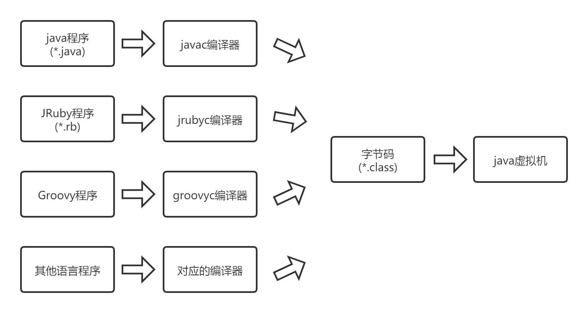

## Class类文件结构

> 任何一个class文件都对应着唯一一个类或接口的定义信息，但反过来说，类或接口并不一定都得定义在文件里（譬如类或接口也可以通过类加载器直接生成）。

​    Class文件是一组以8位字节为基础单位的二进制流，各个数据项目严格按照顺序紧凑地排列在Class文件中，中间没有任何分隔符，这使得整个Class文件中存储的内容几乎全是程序运行的必要数据，没有空隙存在。当遇到需要占用8位字节以上空间的数据项时，则会按照高位在前的方式分割成若干个8位字节进行存储。

​    根据Java虚拟机规范的规定，Class文件格式采用一种类似于C语言结构体的伪结构来存储数据，这种结构中只有两种数据类型：无符号数和表。

​    无符号数属于基本的数据类型，以u1,u2,u4,u8来分别代表1个字节，2个字节，4个字节和8个字节的无符号数，无符号数可以用来描述数字，索引引用，数量值或者按照UTF-8编码构成的字符串

​    表示由多个无符号数或者其他表作为数据项构成的符合数据类型，所有表都习惯性地以"_info"结尾。表用于描述有层次关系的复合结构的数据，整个class文件本质上就是一张表

| 类型           | 名称                | 数量                  |
| -------------- | ------------------- | --------------------- |
| u4             | magic               | 1                     |
| u2             | minor_version       | 1                     |
| u2             | major_version       | 1                     |
| u2             | constant_pool_count | 1                     |
| cp_info        | constant_pool       | constant_pool_count_1 |
| u2             | access_flags        | 1                     |
| u2             | this_class          | 1                     |
| u2             | super_class         | 1                     |
| u2             | interfaces_count    | 1                     |
| u2             | interfaces          | interfaces_count      |
| u2             | fields_count        | 1                     |
| field_info     | fields              | fields_count          |
| u2             | methods_count       | 1                     |
| method_info    | methods             | methods_count         |
| u2             | attributes_count    | 1                     |
| attribute_info | attributes          | attributes_count      |

​    无论是无符号数还是表，当需要描述同一类型但数量不一定的多个数据时，经常会使用一个前置的容量计数器加若干个连续的数据项的形式，这时称这一系列连续的某一类型的数据为某一类型的集合。

### 魔数与Class文件版本

//TODO

# 虚拟机类加载机制

## 概述

​    虚拟机把描述类的数据从Class文件加载到内存，并对数据进行校验、转换解析和初始化，最终形成可以被虚拟机直接使用的Java类型，这就是虚拟机的类加载机制。这里的Class文件并非特指某个存在于具体次磁盘中的文件，这里的Class文件指的是一串二进制的字节流，无论以和中形式存在都可以。

## 类加载的时机

​    类从被加载到虚拟机内存中开始，到卸载出内存为止，它的整个生命周期包括：加载(Loading)、验证(Verification)、准备(Preparation)、解析(Resolution)、初始化(Initialization)、使用(Using)和卸载(Unloading)7个阶段。其中验证、准备、解析3个部分统称为连接(Linking)。

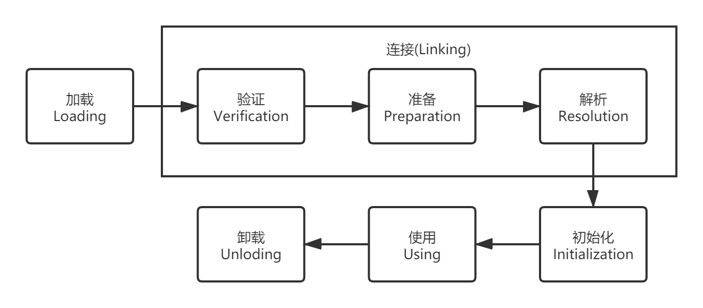

​    上图中，加载、验证、准备、初始化和卸载这5个阶段的顺序是确定的，类的加载过程必须按照这种顺序按部就班的开始，而解析阶段则不一定：它在某些情况下可以在初始化阶段之后再开始，这是为了支持Java语言的运行时绑定（也称为动态绑定或晚期绑定）。注意，这里是按部就班的”开始“，而不是按部就班的进行或完成，强调这点是因为这些阶段通常都是互相交叉地混合式进行的，通常会在一个阶段执行的过程中调用、激活另一个阶段。

​    什么情况下需要开始类加载过程的第一个阶段：加载？Java虚拟机并没有强制约束，这点可以交给虚拟机的具体实现来自由把握。但是对于初始化阶段，虚拟机规范则是严格规定了**有且只有**5中情况必须立即对类进行“初始化”(而加载、验证、准备自然需要在此之前开始)

- 遇到new、getstatic、putstatic 或 invokestatic4条字节码指令时，如果类没有进行初始化，则需要先触发其初始化。生成这4条指令的最常见的Java代码场景是：使用new关键字实例化对象的时候、读取或设置一个类的静态字段（被final修饰、已在编译期把结果放入常量池的静态字段除外）的时候，以及调用一个类的静态方法的时候。
- 使用java.lang.reflect包的方法对类进行反射调用的时候，如果类没有进行过初始化，则需要先触发初始化。
- 当初始化一个类的时候，如果发现其父类还没有进行初始化，则需要先触发其父类的初始化。
- 当虚拟机启动时，用户需要指定一个要执行的主类(包含main()方法的那个类)，虚拟机会先初始化这个主类。
- 当使用JDK1.7 的动态语言支持时，如果一个java.lang.invoke.MethodHandle实例最后的解析结果REF_getStatic、REF_putStatic、REF_invokeStatic的方法句柄，并且这个方法句柄所对应的类没有进行初始化，需要先触发其初始化

​    对于这5种会触发类进行初始化的场景，虚拟机规范中使用了一个很强烈的限定语：**“有且只有”**，这5中场景中的行为称为对一个类进行主动引用。除此之外，所以引用类的方式都不会触发初始化，称为被动引用

```java
/**
* 被动使用类字段演示一
* 通过子类引用父类的静态字段，不会导致子类初始化
*/
public class SuperClass{
    static{
        System.out.println("SuperClass init!");
    }
    public static int value = 123;
}

public class SubClass extends SuperClass{
    static{
        System.out.println("SubClass init!");
    }
}

/**
* 非主动使用类字段演示
*/
public class NotInitialization{
    public static void main(String[] args){
        System.out.println(SubClass.value);
    }
}
```

上述代码运行之后，只会输出"SuperClass Init!"，而不会输出"SubClass init!"。对于静态字段，只有直接定义这个字段的类才会被初始化，因此通过其子类来引用父类中定义的静态字段，只会触发父类的初始化而不会触发子类的初始化。至于是否要触发子类的加载和验证，在虚拟机规范中并未明确规定，这点取决于虚拟机的具体实现。对于Sun HotSpot虚拟机来说，可通过:-XX:+TraceClassLoading 参数观察到此操作会导致子类的加载。

```java
/**
* 被动使用类字段演示二
* 通过数组定义来引用类，不会触发次类的初始化
*/

public class NotInitialization{
    
    public static void main(String[] args){
        SuperClass[] sca = new SuperClass[10];
    }
}
```

​    运行之后发现没有输出"com.melo.SuperClass init!"，说明并没有触发SuperClass的初始化阶段。但是这段代码里触发了另外一个名为"[Lcom.melo.SuperClass"的类的初始化阶段，对于用户代码来说，这并不是一个合法的类名称，它是一个由虚拟机自动生成的、直接继承与Object子类，创建动作由字节码newarray触发。

​    这个类代表了一个元素类型为SuperClass的一维数组，数组中应有的属性和方法（用户可直接使用的只有被修饰为public的length属性和clone()方法）都实现在这个类里。Java语言中对数组访问比C++/C 相对安全是因为这个类封装了数组元素的访问方法，而C/C++ 直接翻译为对数组指针的移动。在Java语言中，当检查到发生数组越界时会抛出java.lang.ArrayIndexOutOfBoundsException异常。

```java
/**
* 被动使用类字段演示三：
* 常量在编译阶段会存入调用类的常量池中，本质上并没有直接引用到应以常量的类，因此不会触发定义常量的类的初始化
*/
public class ConstantClass{
    static{
        System.out.println("ConstClass inti!");
    }
    public static final String HELLOWORLD = "hello world!";
}

public class NotInitialization{
    public static void main(String[] args){
        System.out.println(ConstantClass.HELLOWORLD);
    }
}
```

​    上述代码运行之后，也没有输出“ConstClass Init!”，这是因为虽然在Java源码中引入了ConstClass类中的常量HELLOWORLD，但其实在编译阶段通过常量的传播优化，已经将此倡廉的值“hello world”存储到了NotInitialization 类的常量池中，以后NotInitalization 对常量ConstClass.HELLOWORLD 的引用实际上都被转化为NotInitialization 类对自身常量池的引用。也就是说，实际上NotInitialization 的Class 文件之中并没有ConstClass 类的符号引用入口，这个两个类在编译成Class之后就不存在任何联系了。

​    接口的加载和类的加载过程稍微有一些不同，针对接口需要做一些特殊说明，接口也有初始化过程，这点与类是一致的，上面的代码都是用静态语句块来输出初始化信息的，而接口中不能有静态语句块，但是编译器仍然会为接口生成“<clinit>()”类构造器，用于初始化接口中所定义的成员变量。接口与类初始化的区别在于第三点，一个接口在初始化时，并不要求其父类接口全部都初始化，只有在真正使用到父接口的时候（如引用接口中定义的常量）才会初始化。

## 类加载的过程

Java虚拟机中类加载的全过程：记载、验证、准备、解析和初始化这5个阶段锁执行的具体动作

### 加载

​    “加载”是“类加载”(Class Loading)过程的第一个阶段，虚拟机需要完成以下3件事情

- 通过一个类的全限定名来获取定义此类的二进制字节流
- 将这个字节流所代表的静态存储结构转化为方法区的运行时数据结构
- 在内存中生成一个代表这个类的java.lang.Class对象，作为方法区这个类的各种数据的访问入口。

​    虚拟机规范的这3点要求其实并不算具体，因此虚拟机实现与具体应用的灵活度都是相当大的。例如：“通过一个类的全限定名来获取定义此类的二进制字节流”这条，它没有指明二进制字节流要从一个Class文件中获取，准确地说根本没有指明要从哪里获取。怎样获取。虚拟机设计团队在加载阶段搭建了一个相当开放的、广阔的“舞台”，Java发展历程中，充满创造力的开发人员则在这个“舞台”上玩出了各种花样，许多举足轻重的Java技术都建立在这一基础之上，例如：

- 从zip包中读取，这很常见，最终成为日后JAR,EAR,WAR格式的基础
- 从网络中获取，这种场景最常见的应用就是Applet
- 运行时计算，这种场景使用得最多的就是动态代理技术。
- 由其他文件生成，典型的场景就是JSP应用，即由JSP文件生成对应Class类
- 数数据库读取，这种场景很少见。

​    加载阶段是开发人员可控性最强的，因为加载阶段既可以使用系统提供的引导类加载器来完成，也可以由用户自定义的类加载器去完成，开发人员通过定义自己的类加载器去控制字节流的获取方式（即重写一个类加载器的loadClass()方法）。

​    加载阶段完成之后，虚拟机外部的二进制字节流就按照虚拟机所需的格式存储在方法区之中，方法区中的数据存储格式是由虚拟机实现自定义，虚拟机规范未规定此区域的具体数据结构。然后在内存中实例化一个java.lang.Class对象（并没有明确规定是在Java堆中，对于HotSpot虚拟机而言，Class对象比较特殊，虽然是对象，但是存放在方法区里），这个对象将作为程序访问方法区中这些类型数据的外部接口。

​    加载阶段与连接阶段的部分内容（如一部分字节码文件格式的验证动作）是交叉进行的，加载阶段尚未完成，连接阶段可能已经开始，但这些夹在加载阶段之中进行的动作，仍然属于连接阶段的内容，这两个阶段的开始时间让然保持着固定的先后顺序。

### 验证

验证是连接阶段的第一步，这一阶段的目的是为了确保Class文件的字节流中包含的信息符合当前虚拟机的要求，并且不会危害虚拟机自身的安全。

#### 文件格式验证

​    第一阶段要验证字节流是否符合Class文件格式的规范，并且能被当前版本的虚拟机处理。

#### 元数据验证

​    第二阶段是对字节码描述的信息进行语义分析，以保证其描述的信息符合Java语言规范。

#### 字节码验证

​    第三阶段是整个验证过程中最复杂的一个阶段，主要目的是通过数据流和控制流分析，确定程序语义是否合法、符合逻辑。

- 保证任意时刻操作数栈的数据类型与指令代码序列都能配合工作，例如不会出现类似这样的情况：在操作栈防放置一个int类型的数据，使用时却按照long类型来加载入本地变量表
- 保证跳转指令不会跳转到方法体以外的字节码指令上

#### 符号引用验证

​    最后一个阶段的校验发生在虚拟机将符号引用转化为直接引用的时候，这个转化动作将在连接的第三阶段--解析阶段中发生。

- 符号引用中通过字符串描述的全限定名是否能找到对应的类
- 在指定类中是否存在符合方法的字段描述符以及简单名称所描述的方法和字段。

​    如果无法通过符号引用验证，那么将抛出一个java.lang.IncompatibleClassChangeError异常的子类，如java.lang.IllegalAccessError、java.lang.NoSuchFieldError、java.lang.NoSuchMethod等。

​    对于虚拟机的类加载机制来说，验证阶段是一个非常重要的、但不是一定必要（因为对程序运行期没有影响）的阶段。如果所运行的全部代码（包括自己编写的及第三方包）都已经被反复使用和验证过了，那么在实施阶段既可以考虑使用-Xverify:none 参数来关闭大部分的类验证措施，以缩短虚拟机类加载的时间。

### 准备

​    准备阶段是正式为类变量分配内存并设置类变量初始值的阶段，这些变量所使用的内存都将在方法区中进行分配。这个阶段中有两个容易产生混淆的概念需要强调一下，首先，这个时候进行内存分配的仅包括类变量(被static修饰的变量)，而不包括实例变量，实例变量将会在对象实例化时随着对象一起分配在java堆中。其次，这里说的初始值“通常情况”下是数据类型的零值，假设一个类变量定义为

> public staitc int value = 123;

那变量value在准备阶段过后的初始值为0而不是123，因为这个时候尚未开始执行任何Java方法，而把value赋值为123的putstatic指令时程序被编译后，存放于类构造器<clinit>()方法之中，所以把value赋值为123的动作将在初始化阶段才会执行

| 数据类型  | 零值     |
| --------- | -------- |
| int       | 0        |
| long      | 0L       |
| short     | (short)0 |
| char      | '\u0000' |
| byte      | (byte)0  |
| boolean   | false    |
| float     | 0.0f     |
| double    | 0.0d     |
| reference | null     |

​    上面提到，在“通常情况”下初始值是零值，那么相对的会有一些“特殊情况”：如果类字段的字段属性表中存在ConstantValue属性，那么在准备阶段变量value就会被初始化为ConstantValue属性所指定的值

> public static fianl int value = 123;

​    编译时Javac将会为value生成ConstantValue属性，在准备阶段虚拟就就很根据ConstantValue的设置将value复制为123.

### 解析

​    解析阶段是虚拟机将常量池内的符号引用替换为直接引用的过程，符号引用在Class文件中一CONSTANT_Class_info、CONSTANT_Fieldref_info、CONSTANT_Methodref_info等类型的常量出现，那解析阶段中所说的直接引用于符号引用有什么关联呢？

- 符号引用（Symbolic Reference）：符号引用以一组符号来描述锁引用的目标，符号可以是任何形式的字面量，只要使用时无歧义的定位目标即可。符号引用于虚拟机实现的内存布局无关，引用的目标并不一定已经加载到内存中。各种虚拟机实现的内存布局可以各不相同，但是它们能接受的符号引用必须是一致的，因为符号引用的字面量形式明确定义在Java虚拟机规范的Class文件格式中。
- 直接引用（Direct Reference）：直接引用可以是直接指向目标的指针、相对变异量或者是一个能间接定位到目标的句柄。直接引用是和虚拟机实现的内存布局相关的，同一个符号引用在不同的虚拟机实例上翻译出来的直接引用一般不会相同。如果有了直接引用，那么引用的目标必定已经在内存中存在。

虚拟机规范之中并未规定解析阶段发生的具体时间，只要求了在执行anewarray、checkcast、getstatic、instanceof、invokedynamic、invokeinterface、incokespecial、invokestatic、invokevirtual、ldc、ldc_w、multianewarray、new、putfield和putstatic这16个用于操作符号引用的字节码指令之前，先对他们所使用的符号引用进行解析。

- 类或接口的解析
- 字段解析
- 类方法解析
- 接口方法解析

### 初始化

​    类初始化是类加载过程中的最后一步，前面的类加载过程中，除了在加载阶段用户应用程序可以通过自定义类加载器参与之外，其余动作完全由虚拟机主导和控制。到了初始化阶段，才真正开始执行类中定义的Java程序代码（或者说字节码）

​    在准备阶段，变量已经赋值过一次系统要求的初始值，而在初始化阶段，则根据程序员通过程序制定的主观计划去初始化类变量和其他资源，或者可以从另外一个角度来表达：初始化阶段是执行类构造器<clinit>()方法的过程。

- <Clinit>()方法是由编译器自动收集类中的所有变量的赋值动作和静态语句块中的语句合并产生的，编译器收集的顺序是由语句在源文件中出现的顺序决定的，静态语句块中只能访问到定义在静态语句块之前的变量，定义在之后的变量，在前面的静态语句块可以赋值，但是不能访问

```java
public class Test{
    static{
        i = 0;								//给变量赋值可以正常编译通过
        System.out.println(i);				//这句编译器会提示"非法向前应用"
    }
    static int i = 1;
}
```

- <clinit>()方法与类的构造函数（或者说实例构造函数<init>()方法）不同，它不需要显示的调用父类构造器，虚拟机会保证在子类的<clinit>()方法执行之前，父类的<clinit>()方法已经执行完毕。因此在虚拟机中第一个被执行的<clinit>()方法的肯定是java.lang.Object
- 由于父类的<clinit>()方法先执行，也就是意味着父类中定义的静态语句块要优先于子类的变量赋值的操作，所以在以下代码中变量B的值将会是2而不是1

```java
static class Parent{
    public static int A = 1;
    static{
        A = 2;
    }
}
static class Sub extends Parent{
    public static int B = A;
}

public static void main(String[] args){
	System.out.println(Sub.B)
}
```

- <clinit>()方法对于类或接口来说并不是必须的，如果一个类中没有静态语句块，也没有对变量的赋值操作，那么编译器可以不为这个类生成<clinit>()方法
- 接口中不能使用静态语句块，但仍然有变量初始化的赋值操作，因此接口与类一样都会生成<clinit>()方法。但接口与类不同的是，执行接口的<clinit>()方法不需要先执行父接口的<clinit>()方法。只有当父类接口中定义的变量使用时，父接口才会初始化，另外，接口的实现类在初始化时，也一样不会执行接口的<clinit>()方法。
- 虚拟机会保证一个类的<clinit>()方法在多线程环境中被正确的加锁，同步，如果多个线程同时去初始化一个类，那么只会有一个线程去执行这个类的<clinit>()方法，其他线程都需要阻塞等待，知道活动线程执行<clinit>()方法完毕。如果在一个类的<clinit>()方法中有耗时很长的操作，就可能造成多个线程阻塞

```java
static class DeadLoopClass{
    static {
        //如果不加上这个if语句，编译器将提示"Initializer does not complete normally"，并拒绝编译
        if(true){
            System.out.println(Thread.currentThread() + "init DeadLoopClass");
            whie(true){
                
            }
        }
    }
    public static void main(String[] args){
        Runnable script = new Runnable(){
            public void run(){
                System.out.println(Thread.currentThread() + "start");
                DeadLoopClass dlc = new DeadLoopClass();
                System.out.println(Thread.currentThread + "run over");
            }
        };
        Thread thread1 = new Thread(script);
        Thread thread2 = new Thread(script);
        thread1.start();
        thread2.start();
    }
}
```

## 类加载器

​    虚拟机设计团队吧类加载阶段中的“通过一个类的全限定名来获取描述此类的二进制字节流”这个动作方法哦Java虚拟机外部去实现，一边让应用程序自己决定如何去获取所需要的类，实现这个动作的代码模块称为“类加载器”。

​    类加载器可以说是Java语言的一项创新，也是Java语言流行的重要原因之一，它最初是为了满足Java Applet的需求而开发出来的。虽然目前Java Applet技术基本上很少用了，但类加载器却在类层次划分、OSGI、热部署、代码加密等领域大放异彩，成为了Java体系中一块重要的基石，可谓失之东隅收之桑榆，

### 类与类加载器

​    类加载器虽然只用于实现类的加载动作，但它在java程序中起到的作用却远远不限于类加载阶段。对于任意一个类，都需要由加载它的类加载器和这个类本身一同确立其在java虚拟机中的唯一性，每一个类加载器，都拥有一个独立的类名称空间。这句话可以表达得更通俗一些：比较两个类是否“相等”，只有在这个两个类时由同一个类加载器加载的前提下才有意义，否则，即使这两个类来源于同一个class文件，被同一个虚拟机加载，只要加载它们的类加载器不同，那这两个类就必定不相等。

​    这里所指的相等，包括代表类的Class对象equals()方法,isAssignableFrom()方法，isInstance()方法的返回结果，也包括使用instanceof关键字做对象所属关系判定等情况。如果没有注意到类加载器的影响，在某些情况下可能会产生具有迷惑性的结果。

```java
/**
* 类加载器与instanceof 关键字演示
*/
public class ClassLoaderTest{
    public static void main(String{} args){
        ClassLoader myLoader = new ClassLoader(){
            @override
            public Class<?> loadClass(String name) throws ClassNotFoundException{
                try{
                    String fileName = name.substring(name.lastIndexOf(".") +1 ) + ".class";
                    InputStream is = getClass().getResourceAsStream(fileName);
                    if(is == null){
                        return super.loadClass(name);
                    }
                    byte[] b = new byte[is.available()];
                    is.read(b);
                    return defineClass(name, b, 0, b.length);
                }catch(Exception e){
                    throw new ClassNotFoundException(name);
                }
            }
        };
        Object obj = myLoader.loadClass(".....ClassLoaderTest").newInstance();
        System.out.println(obj.getClass());
        System.out.println(obj instanceof .....ClassLoaderTest);
    }
}

运行结果：
    class .....ClassLoaderTest
    false
```


### 双亲委派模型

​    从java虚拟机的角度来讲，只存在两种不同的类加载器，一种是启动类加载器(Bootstrap ClassLoader)，这个类加载器使用C++语言实现，是虚拟机的一部分；另一种就是所有其他的类加载器，这些类加载器都由java语言实现，独立于虚拟机外部，并且都继承自抽象类java.lang.ClassLoader

​    从java开发人员的角度来看，类加载器还可以划分得更细致一些，绝大部分java程序都会使用到以下三种系统提供的类加载器

- 启动类加载器（BootStrap ClassLoder）：这个类加载器负责将存放在<JAVA_HOME>/lib目录中的，或者被-Xbootclasspath参数所指定的路径中的，并且是虚拟机识别的类库加载到虚拟机内存中。启动类加载器无法被java程序直接引用，用户在编写自定义类加载器时，如果需要把加载请求委派给引导类加载器
- 扩展类加载器(Extension ClassLoader)：这个加载器由sun.misc.Launcher$ExtClassLoader实现，它负载加载<JAVA_HOME>/lib/ext目录中的，或者被java.ext.dirs系统变量锁指定的路径中的所有类，开发者可以直接使用扩展类加载器。
- 应用程序类加载器(Application ClassLoader)：这个类加载器由sun.misc.Launcher$AppClassLoader实现。由于这个类加载器是ClassLoader中getSystemClassLoader()方法的返回值，所有一般也称为系统类加载器。它负载加载用户类路径(ClassPath)上所指定的类库，开发者可以直接使用，如果应用程序没有自定义过自己的类加载器，一般情况下这个就是应用程序默认类加载器。

我们的应用程序都由这3种类加载器互相配合进行加载的，如果有必要，还可以加入自己定义的类加载器。

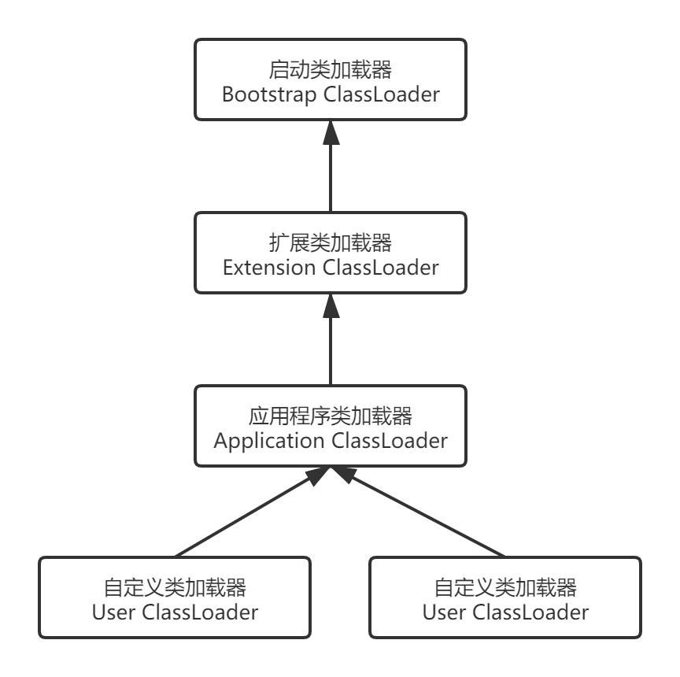

​    如果一个类加载器收到了类加载的请求，它首先不会自己去尝试加载这个类，而是把这个请求委派给父类加载器去完成，每一个层次的类加载器都是如此，因此所有的加载请求最终都应该传送到顶层的启动类加载器中，只有当父加载器反馈自己无法完成这个加载请求（它的搜索范围中没有找到所需的类    ）时，子加载器才会尝试自己去加载。

​    使用双亲委派模型来组织类加载器之间的关系，有一个显而易见的好处就是Java类随着它的类加载器译器具备了一种带有优先级的层次关系。例如java.lang.Object，它存放在rt.jar中，无论哪一个类加载器要加载这个类，最终都是委派给处于模型最顶端的启动类加载器进行加载，因为Object类在程序的各种类加载器环境中都是同一个类。相反，如果没有使用双亲委派模型，由各个类加载器自行取加载的话，如果用户自己编写了一个成为java.lang.Object的类，并放在程序的ClassPath中，那系统中将会出现多个不同的Object类，Java类型体系中最基础的行为也就无法保证，应用程序一片混乱。如果编写一个与rt.jar类库中已有类重名的java类，将会发现可以正常编译，但永远不会加载。

### 破坏双亲委派模型

​    一个典型的例子就是JNDI服务，JNDI服务现在已经是java的标准服务，它的代码由启动类加载器去加载，但JNDI的目的就是对资源进行集中管理和查找，它需要调用独立厂商实现并部署在应用程序的ClassPath下的JNDI接口提供者(SPI,Service Provider Interface)的代码，但是启动类加载器不认识这些代码。为了解决这个问题，java设计团队引入了线程上下文类加载器(Thread Context ClassLoader),这个类加载器可以通过java.lang.Thread类的setContextClassLoader()方法进行设置，如果创建线程时还未设置，则会从父线程中继承一个，如果在应用程序的全局范围内都没有设置过的话，那么这个类加载器就默认为应用程序类记载器。JNDI就是使用这个线程上下文类加载器去加载所需要的SPI代码。


# 调优案例分析与实战

## 高性能硬件上的程序部署策略

