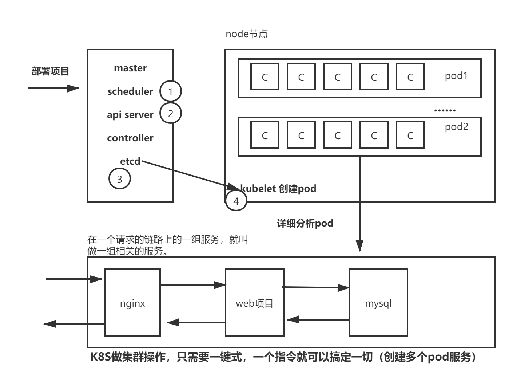
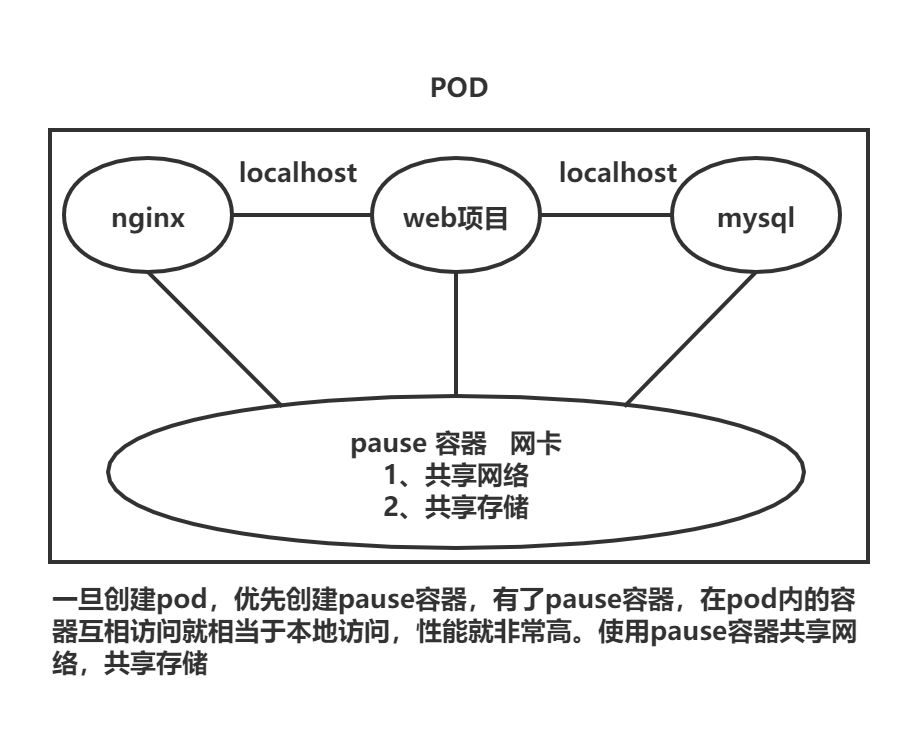

# Kubernetes(k8s)

## Kubernetes在企业中的应用场景

### 创业型公司、中小型企业

创业型公司，中小型企业，使用k8s构建一套自动化运维平台，自动维护服务数量，保持服务永远和预期的数据保持一致性，让服务可以永远提供服务

- 弹性伸缩
- 降本增效
- 私有云
- 公有云

### 互联网企业

互联网企业，有很多服务器资源（物理机），为了充分利用服务器资源，使用k8s构建私有云环境，项目运行在云。

### 产品迭代

项目开发中，产品需求不停的迭代，更新（产品）--- 意味着项目不停的发布新的版本 --- k8s可以实现项目从开发到生产无缝迁移。

以上3点： 可以大大为公司节省开发，上线整个成本，降本增效

## 云技术（云计算平台）-- 虚拟化及虚拟化基本概念及原理

### 什么是虚拟化技术

虚拟化（英语：Virtualization）是一种资源管理技术，就是用来把物理资源（服务器，网络，硬件，CPU）进行隔离（分离）的一种技术。打破了物理资源不可分割障碍。

### 虚拟化技术的作用

- 对高性能物理计算机的资源进行充分利用
- 对老旧硬件资源重组后再充分利用

### 虚拟化分类

#### 全虚拟化架构

在硬件上面-os,os内部可以安装多个操作系统，达到物理资源隔离

虚拟机的监视器（hypervisor）是类似于用户的应用程序运行在主机的OS之上，如VMware的workstation，这种虚拟化产品提供了虚拟的硬件。

#### OS层虚拟化架构

在os系统内部，可以复制多个os系统，达到资源隔离目的

#### 硬件层虚拟化

直接在硬件上安装多个操作系统，达到物理资源隔离目的。硬件层的虚拟化具有高性能和隔离性，因为hypervisor直接在硬件上运行，有利于控制VM的OS访问硬件资源，使用这种解决方案的产品有VMware ESXi 和 Xen server

Hypervisor是一种运行在物理服务器和操作系统之间的中间软件层,可允许多个操作系统和应用共享一套基础物理硬件，因此也可以看作是虚拟环境中的“元”操作系统，它可以协调访问服务器上的所有物理设备和虚拟机，也叫虚拟机监视器（Virtual Machine Monitor，VMM）。

Hypervisor是所有虚拟化技术的核心。当服务器启动并执行Hypervisor时，它会给每一台虚拟机分配适量的内存、CPU、网络和磁盘，并加载所有虚拟机的客户操作系统。 

Hypervisor是所有虚拟化技术的核心，软硬件架构和管理更高效、更灵活，硬件的效能能够更好地发挥出来。常见的产品有：VMware、KVM、Xen等等

### 云计算平台

目前你认为有几种方式构建云计算平台？？？

- 物理机构建云计算平台（机房建设，硬件选择，网络建设，环境维护）
- 虚拟化技术构建云计算平台

云平台：代表有大量的服务器----大量的隔离环境

#### Openstack

开源管理项目 OpenStack是一个旨在为公共及私有云的建设与管理提供软件的开源项目.

美国国家航天局 & RackSpace 开发 ，开源

作用： 提供云平台的基础设施服务，让云平台管理，架构变得更简单。

####  KVM(Kernel-based Virtual Machine)基于linux内核的虚拟机

KVM 虚拟机技术，已经融入到linux内核。

#### VMWare

VMWare (Virtual Machine ware)是一个“虚拟PC”虚拟机管理管理软件

### 云技术

有了虚拟化技术，为什么还需要使用容器化技术构建云计算平台？？

KVM虚拟化在同等CPU,内存，IO，网络，运行相同服务，占用资源非常大。

容器化技术 就是非常轻量级资源隔离技术,容器化镜像小道几KB,大到几百M,隔离性没有虚拟机彻底

#### 容器化技术发展

1979年的UNIX Chroot ，根据目录来进行隔离。

FreeBSD Jails ，给目录分配一个网络地址，可以对目录进行隔离。

Solaris Zone ，已经实现了隔离，每一个空间都有独立存储，网络，防火墙.

**LXC指代的是Linux Containers,通过Cgroups以及Linux Namespaces实现资源隔离。**

Docker利用LXC实现了一套容器化技术完整一套方案，容器化就是利用Cgroups以及Linux Namespaces实现资源隔离。

总结： 容器就是运行在操作系统中的一个进程，利用Cgroups+namepspace实现进程间隔离。

#### docker原理

- docker底层利用 cgroup + nampspace 实现资源隔离
- docker创建procces容器进程，必须依赖磁盘镜像。（原始容器都是依赖centos镜像）

#### OpenStack&KVM&docker

- openstack 主要用于云计算平台管理，同时提供一些基础设施一些管理服务。
- KVM 虚拟化技术 --- 可以利用虚拟化技术构建云计算平台
- docker 和 openstack 可以形成优势互补。
  - docker是一个非常轻量级的容器技术，使用容器技术构建云平台，充分利用服务资源，性能非常高
  - OpenStack可以管理基础设置服务。基础设施服务构建交给openstack

在物理机上使用openstack虚拟化技术隔离出 虚拟机，然后在这些虚拟机的基础上 再使用docker 隔离出容器 构建云计算平台 从颗粒度上来说 docker更细

## 云原生

云原生：就是为了让应用程序（项目、mysql、es、mq...）运行在云上的解决方案，叫做云原生（云架构）

特点（一种思想）：

- 容器化：应用程序运行在容器中
- 微服务：微小的服务，将单体架构根据业务进行拆分，服务进行链式调用模式--可持续交付，部署。
- 可持续交付，部署：CI/CD
- DevOps

云原生架构理念

- iaas 【Infrastructure as a service 基础设施即服务】

  - 用户：购买服务器，建设机房，DNS,交换机，路由，网络... (硬件环境)
  - 云计算提供商：提供 网络、存储、dns、服务器..服务，用户只需要租用云主机即可，不需要关系硬件建设。
  - 网络、存储、dns、服务器，操作系统 这样服务就叫做基础设施即服务。
  - 用户购买一台iaas服务？ 就相当于买了一台空的服务器。

- paas 【platform as a service】

  - 在iaas基础上安装一些软件：基础服务软件---MYSQL,RocketMQ,ElasticSearch...作为基础服务
  - 用户购买这样的服务后，此时用户只需要关系项目业务代码开发，基础软件服务不需要自己安安装。

- caas 【container as a service】

  - 容器就是一个服务。软件，服务都运行在容器中。

- saas 【software as a service】

  - OA（多租户）
  - 钉钉 （多租户）
  - 财务 （多租户）

- faas 【function as a service】,baas 【backend as a service】

  - 视频服务提供商（直播）---- 函数收费 （函数运行，收费）
  - CDN服务商 （视频缓存服务）---- 函数收费
  - 短信服务 --- 发一条短信
  - 支付服务 --- 函数收费

- service mesh

  - 客户端 --> proxy代理服务--> 服务（集群）

  - 客户端+proxy（集成在一起：服务治理--降级，限流、监控..）--> 服务+proxy（集成在一起：服务治理--降级，限流、监控..）（集群）

    注意：

    一般企业直接使用 proxy代理模式就ok，至于服务治理:springcloud

    service mesh 不建议使用，落地非常困难，中小型企业玩不起，技术能力

- serverless

  - server 服务器，less 无  ---> 无服务器

  - 未来开发境界：程序员只需要关心代码业务开发即可，服务器环境不需要关心，所有的服务都上云。

  - 找个架构师架构一下，找几个程序员开发一下就OK了，没有服务器就没有运维了

    公有云：阿里云，腾讯云，网易云、百度云、滴滴云...

    私有云：k8s自己公司构建自己的私有云 ---- 很多公司在使用私有云

### 应用架构部署模式的变迁

- 物理机：操作系统
- 虚拟机：OpenStack
- 云原生：kubernetes

思考：

1. 微服务架构，服务拆分成千上万个服务，就需要非常多的容器来进行部署，那么这些容器怎么管理？
2. 怎么横向扩容？
3. 服务宕机了，怎么恢复，你是如何知道的？
4. 版本更新，上线，更新容器后，线上业务如何不受影响？
5. 监控容器？
6. 调度问题？
7. 安全问题？

### 容器编排（管理）技术

解决问题：

以上问题，容器编排技术来说，一个指令，一个按钮就可以搞定一切。

- docker-compose：非常轻量级容器编排技术，可以通过yaml文件方式，对容器进行批量管理，不能实现复杂容器编排
- rancher：可视化的容器管理工具，v2版本提供对k8s兼容。中小型使用，性能非常差，不能实现复杂的容器编排。
- swarm：docker公司自己研发的容器编排技术，但是docker自己也在使用kubernetes. 
- mesos：apache软件基金会提供开源的容器编排技术。
- borg：google研发一套容器编排技术，这套技术没有对外公开，强大，稳定。
- kubernetes：google研发一套容器编排技术，使用go开发。性能非常强大、稳定、通过指令、yaml编程方式管理容器，非常灵活。
  - 自动化容器的部署和复制
  - 随时扩展或收缩容器规模
  - 将容器组织成组，并且提供容器间的负载均衡
  - 很容易的升级应用程序容器的新版本

### kubernetes -- k8s 基本认识

#### brog

borg（是google公司的秘密武器）（战略武器）。Google的Borg系统运行几十万个以上的任务，来自几千个不同的应用，跨多个集群，每个集群（cell）有上万个机器，十几年前，已经再大量使用。google秘密物理。

#### kubernetes

k8s软件参考 borg系统架构，使用go语言开发的。

架构组件：

- master, slave(node节点)
- master(scheduler, controllers, api server, etcd)
- image
- dashboard ui 

### k8s集群

.png)

分布式架构（一个master节点--主节点，一群node节点--计算节点）

特点：

- 一个master对应一群node
- master不存储容器，只做调度，网关，控制器工作
- 真正容器时存储在node节点的pod容器中
- k8s是用来编排容器，但k8s不直接管理容器，而是通过管理pod来进行容器管理
- pod内部可以有一个或者多个（相关）容器
- kubelet负责本地机器pod的维护（CRUD）
- kube-proxy负载来进行负载均衡，在多个pod之间进行负载均衡

#### master节点

- Api server 网关，所有的请求指令都必须经过ApiServer转发
- scheduler 调度器，把请求指令（crud）调度到合适的node节点上。把调度请求发送给apiserver,apiserver将会把请求指令存储在etcd. node节点有kubelet监控etcd，监控到本node节点的指令，就会获取指令，在node节点执行。
- controllers 控制器（十几个控制器），每一个控制器对应相应的资源，控制器对这些资源进行管理（curd）
- etcd nosql,存储一些指令，用来做服务注册与发现

#### node节点

- pod 是k8s最小的管理单位，pod内部有一个或者多个容器，pod是一个用来封装容器的容器。一个node节点可以多个pod,理论上是无限制的，取决于硬件环境。
- docker 容器引擎（程序），k8s管理容器，容器由docker进行创建，k8s底层必须有docker引擎。
- kubelet 监听etcd,获取指令管理pod,kubelet是真正管理pod的组件。
- kube-proxy 代理服务，主要用来做负载均衡。设置iptables负载规则，更新service虚拟endpoints
- fluentd 日志收集组件
- dns 域名解析服务器

#### controllers

- replication controller ： 副本控制器，控制副本数量与预期设定的数量保持一致。
- Node Controller : 检查node节点监控状况；由k8s本身内部实现的。
- namespce controller : 创建pod,会把pod分配在不同命名空间下，定期清理无效的namespace
- service controller : 虚拟服务控制器，维护虚拟ip,提供负载均衡。
- endpoints controller : 提供了pod,service关联服务。
- service Account controller : 安全认证
- persistent volume controller : 持久化存储控制器-有状态服务部署，数据持久化存储 PVC
- daemon set controller : 让每一个服务器都具有一个相同的服务。
- deployment controller : 部署控制器，支持滚动更新，发版
- Job controller  ： 定时任务控制器
- pod autoscale controller : 自动更新控制器，cup利用率>=80% ,自动扩容。

#### etcd

etcd 是兼具一致性和高可用性的键值数据库，可以作为保存 Kubernetes 所有集群数据的后台数据库。

etcd是一个分布式的，可靠的key-value存储系统，它用于存储分布式系统中的关键数据

#### scheduler 调度器

- podQueue (即将要创建的pod进行排队)
- nodeList (把存储pod的节点的集合)
- scheduler通过调度策略算法把pod 和 某一个node进行配对，存储在etcd,node节点kubelet监控到数据，把pod获取到在本地创建pod.
- 调度算法
  - 预选调度
    - 判断pod是否存在冲突
    - pod名称是否重复
  - 最优节点
    - cpu利用率最小的节点

#### kubelet&kube-proxy

- kubelet 是 k8s 在node节点上的代理服务。pod的CRUD的是有node节点上kubelet来进行操作。kubelet实际上就相当于链式调用，上游服务是master(scheduler,apiserver),有node记得kubelet接受请求，执行具体操作。
- kube-proxy 反向代理，但是kube-proxy不执行具体的代理任务，设置iptables/ipvs路由规则，serviceVIP & iptables来实现的路由规则（kube-proxy监听pod的IP地址，若发生了变化，修改service中endpoints种的对应IP地址）

### POD

pod是k8s操作的最小单元，k8s通过管理pod来编排容器的

pod也是一个“容器”，（这个容器中装的是docker容器，pod是用来封装容器的容器），pod实际上是一个虚拟化的分组（pod有自己的ip地址，自己的主机名，相当于是一台独立的机器），pod中可以存储一个或者多个容器。

#### 功能

通常情况下，再服务上线部署时pod通常被用来部署一组相关的服务

问题：服务的集群部署，应该如何部署？？？

部署多个pod，多几个pod就是集群，k8s随时可以做一个集群

POD底层核心原理：网络，数据存储

一个pod不能割裂，一个pod必须在一个物理机上运行，副本pod可以分布在不同的node节点

每个Pod里运行着一个特殊的被称之为Pause的容器，其他容器则为业务容器，这些业务容器共享Pause容器的网络栈和Volume挂载卷，因此他们之间通信和数据交换更为高效，在设计时我们可以充分利用这一特性将一组密切相关的服务进程放入同一个Pod中。同一个Pod里的容器之间仅需通过localhost就能互相通信。

**kubernetes中的pause容器主要为每个业务容器提供以下功能：**

- PID 命名空间：Pod中的不同应用程序可以看到其他应用程序的进程ID
- 网络命名空间：Pod中的多个容器能够访问同一个IP和端口范围
- IPC命名空间：Pod中的多个容器能够使用SystemV IPC或POSIX消息队列进行通信
- UTS命名空间：Pod中的多个容器共享一个主机名；
- Volumes（共享存储卷）：Pod中的各个容器可以访问在Pod级别定义的Volumes

### Other组件

CoreDNS：可以为集群中的SVC创建一个域名IP的对应关系解析

DasHBoard：给 K8S 集群提供一个 B/S 结构访问体系

Ingress Controller：官方只能实现四层代理，INGRESS 可以实现七层代理

Federation：提供一个可以跨集群中心多K8S统一管理功能

Prometheus：提供K8S集群的监控能力

ELK：提供 K8S 集群日志统一分析介入平台

## 核心组件原理

### replication controller

RC控制器：replication controller	让pod副本数量，与预期的数量始终保持一致（服务要部署集群，实际上就是把pod多部署几个副本，pod数量的控制由副本控制器控制）部署于其副本数量：replicas = 3(3个副本---3个pod)

### ReplicaSet

