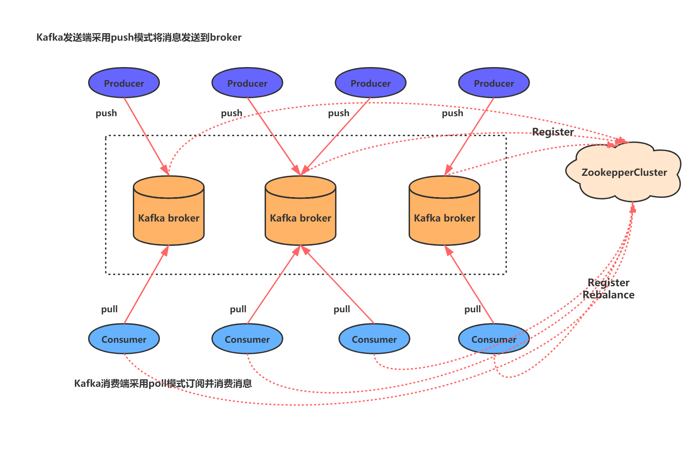

# kafka简介

​	Apache Kafka是一个快速、可扩展的、高吞吐的、可容错的分布式“发布-订阅”消息系统，使用 Scala 与 Java 语言编写，能够将消息从一个端点传递到另一个端点，较之传统的消息中间件（例如 ActiveMQ、RabbitMQ），Kafka 具有**高吞吐量、内置分区、支持消息副本和高容错**的特性，非常适合大规模消息处理应用程序。

## 系统架构图

## 应用场景

用户的活动追踪

日志聚合

限流削峰

## kafka高吞吐率

​	Kafka 与其它 MQ 相比，其最大的特点就是高吞吐率。为了增加存储能力，Kafka 将所有的消息都写入到了低速大容的硬盘。按理说，这将导致性能损失，但实际上，kafka 仍可保持超高的吞吐率，性能并未受到影响。其主要采用了如下的方式实现了高吞吐率。

- 顺序读写：Kafka 将消息写入到了分区 partition 中，而分区中消息是顺序读写的。顺序读写要远快于随机读写。
- 零拷贝：生产者、消费者对于 kafka 中消息的操作是采用零拷贝实现的。
- 批量发送：Kafka 允许使用批量消息发送模式。
- 消息压缩：Kafka 支持对消息集合进行压缩。

# kafka工作原理与工作过程

## kafka基本术语

​	对于kafka基本原理的介绍，可以通过对以下基本术语的介绍进行

### topic

​	主题。在 Kafka 中，使用一个类别属性来划分消息的所属类，划分消息的这个类称为 topic。topic 相当于消息的分类标签，是一个逻辑概念。

### partition

​	分区。topic 中的消息被分割为一个或多个 partition，其是一个物理概念，对应到系统上就是一个或若干个目录。

​	若一个 Topic 包含多个 partition，消息在写入到 partition 时是无法保证其写入顺序与生产顺序的一致性的。若需要严格保证这个一致性，则 partition 数量设置为 1。

​	若要使消费者严格按照进入到kafka中的消息顺序进行消费，则要使partition设置为1。

### segment

​	段。将 partition 进一步细分为了若干的 segment，每个 segment 文件的最大大小相等。

​	kafka中的连续空间的概念就是说的segment，若partition为连续空间，那么对磁盘的要求会非常大，所以，真正的连续空间实际上是一个segment。

​	其数据的体现为：

​	00000000000000000000.index    索引

​	00000000000000000000.log      日志

​	若要找0000000111111的消息，会用二分查找法，先找到segment，再减seg名，然后去找索引，再通过索引找对应的数据，索引是偏移量

​	一个segment放不下了，就会去创建另外一个segment。若磁盘没有连续空间了，就无法放入segment了，相当于满了。

### broker

​	Kafka 集群包含一个或多个服务器，每个服务器节点称为一个 broker。

​	假设某个 topic 中有 N 个 partition，集群中有 M 个 broker，则 broker 与 patition 的数量关系是：

- 若 N>=M，且 N%M=0，每个 broker 上会平均分配 N/M 个 partition
- 若 N>M，但 N%M !=0，此时会出现各个 broker 上 partition 数量不平均的情况，此时各个 broker 的消息负载是不均衡的。该情况要避免。
- 若 N<M，此时会出现某些 broker 上没有 partition，此时各个 broker 的消息负载是不均衡的。该情况要避免。

### producer

​	生产者。即消息的发布者，其会将某 topic 的消息发布到相应的 partition 中。

- ​	消息可以有KEY，然后会用key的hash值和分区的数量取模，决定该放入哪个分区（partition）
- ​	若没有KEY，则会平均分
- ​	也可以指定分区，若指定分区没有，再按KEY来

以上的情况下，顺序的消息分到了不同的分区，所以在生产上，无法保证其写入顺序与生产顺序的一致性。若非要保证顺序，则写到一个partition

若前后两次消息走的不同的网络，就算写入同一分区，也会出现写入与生产顺序不一致（消息1的网络比消息2慢），所以，能严格控制的，只有写入顺序和消费顺序一致

### consumer

​	消费者。可以从 broker 中读取消息。

​	对于消费者需要注意：

- 一个消费者可以消费多个 topic 的消息
- 一个消费者也可以消费同一个 topic 中的多个 partition 中的消息
- 反过来说也成立，即一个 partiton 允许多个无关的消费者（不同组的消费者）同时消费

### consumerGroup

​	consumer group 是 kafka 提供的可扩展且具有容错性的消费者机制。组内可以有多个消费者，它们共享一个公共的ID，即gruop ID。组内的所有消费者会协调在一起平均消费订阅主题的所有分区。

​	Kafka 可以保证在稳定状态下，一个 partition 中的消息只能被同一个 consumer group 中的一个consumer消费，而一个组内consumer只会消费某一个或几个特定的partition。当然，一个消息可以同时被多个 consumer group 消费。

总结：

​	组内 consumer 与 partition 的关系是 1:n，partition 与组内 consumer 的关系则是 1:1

​	也就是说，在**稳定状态**下，一旦为某组内 consumer 分配了某一个/几个 partition 后，就不会变化了。反过来说，一旦为某 partiton 分配了组内 cosumer，就不会再为其分配其它组内consumer 了。

​	这种设计方案最大的好处：简单。但也存在不足：组内 consumer 消息的不平均。

组中 consumer 数量与 partition 数量的对应关系如下。

.jpg)

.jpg)

.jpg)

.jpg)

.jpg)