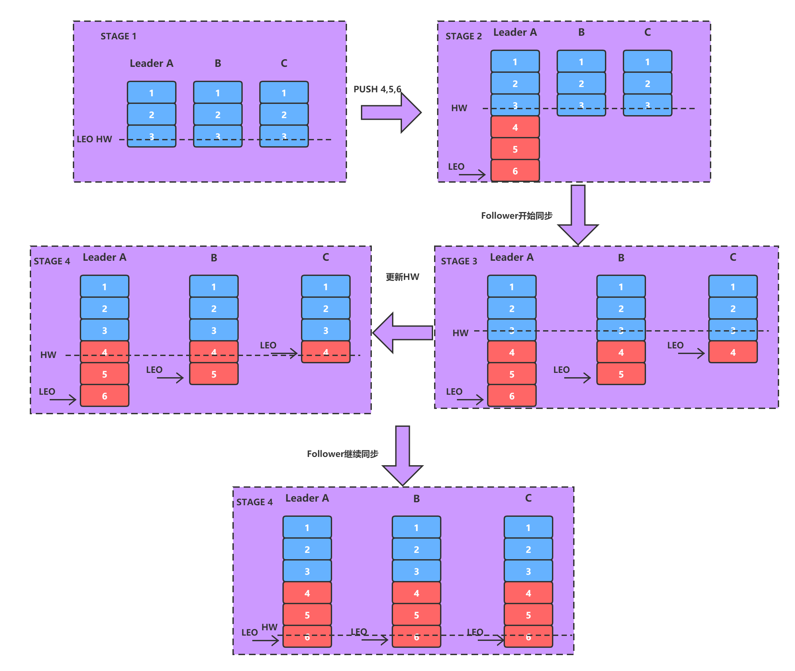
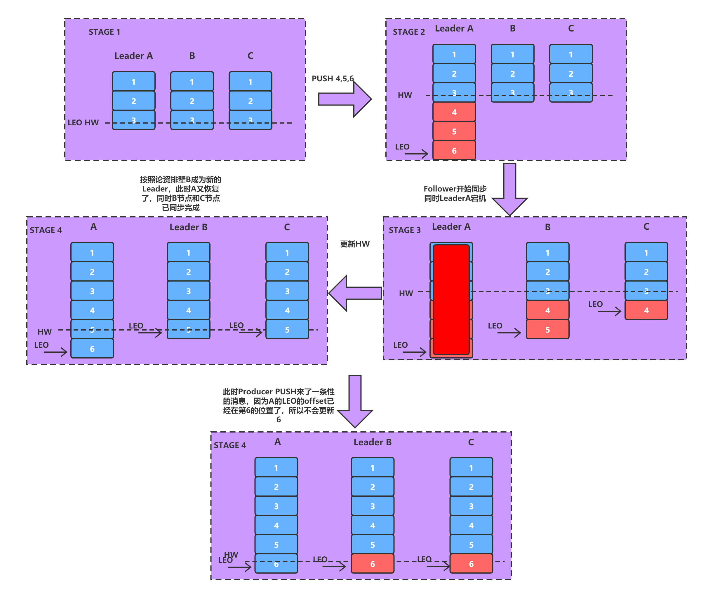
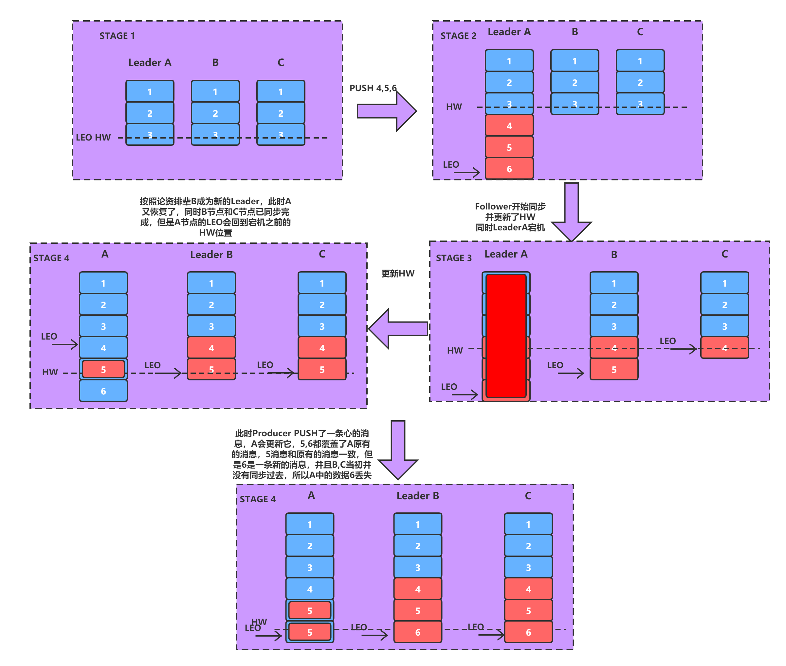

# kafka简介

​	Apache Kafka是一个快速、可扩展的、高吞吐的、可容错的分布式“发布-订阅”消息系统，使用 Scala 与 Java 语言编写，能够将消息从一个端点传递到另一个端点，较之传统的消息中间件（例如 ActiveMQ、RabbitMQ），Kafka 具有**高吞吐量、内置分区、支持消息副本和高容错**的特性，非常适合大规模消息处理应用程序。

## 系统架构图

## 应用场景

用户的活动追踪

日志聚合

限流削峰

## kafka高吞吐率

​	Kafka 与其它 MQ 相比，其最大的特点就是高吞吐率。为了增加存储能力，Kafka 将所有的消息都写入到了低速大容的硬盘。按理说，这将导致性能损失，但实际上，kafka 仍可保持超高的吞吐率，性能并未受到影响。其主要采用了如下的方式实现了高吞吐率。

- 顺序读写：Kafka 将消息写入到了分区 partition 中，而分区中消息是顺序读写的。顺序读写要远快于随机读写。
- 零拷贝：生产者、消费者对于 kafka 中消息的操作是采用零拷贝实现的。
- 批量发送：Kafka 允许使用批量消息发送模式。
- 消息压缩：Kafka 支持对消息集合进行压缩。

# kafka工作原理与工作过程

## kafka基本术语

​	对于kafka基本原理的介绍，可以通过对以下基本术语的介绍进行

### topic

​	主题。在 Kafka 中，使用一个类别属性来划分消息的所属类，划分消息的这个类称为 topic。topic 相当于消息的分类标签，是一个逻辑概念。

### partition

​	分区。topic 中的消息被分割为一个或多个 partition，其是一个物理概念，对应到系统上就是一个或若干个目录。

​	若一个 Topic 包含多个 partition，消息在写入到 partition 时是无法保证其写入顺序与生产顺序的一致性的。若需要严格保证这个一致性，则 partition 数量设置为 1。

​	若要使消费者严格按照进入到kafka中的消息顺序进行消费，则要使partition设置为1。

### segment

​	段。将 partition 进一步细分为了若干的 segment，每个 segment 文件的最大大小相等。

​	kafka中的连续空间的概念就是说的segment，若partition为连续空间，那么对磁盘的要求会非常大，所以，真正的连续空间实际上是一个segment。

​	其数据的体现为：

​	00000000000000000000.index    索引

​	00000000000000000000.log      日志

​	若要找0000000111111的消息，会用二分查找法，先找到segment，再减seg名，然后去找索引，再通过索引找对应的数据，索引是偏移量

​	一个segment放不下了，就会去创建另外一个segment。若磁盘没有连续空间了，就无法放入segment了，相当于满了。

### broker

​	Kafka 集群包含一个或多个服务器，每个服务器节点称为一个 broker。

​	假设某个 topic 中有 N 个 partition，集群中有 M 个 broker，则 broker 与 patition 的数量关系是：

- 若 N>=M，且 N%M=0，每个 broker 上会平均分配 N/M 个 partition
- 若 N>M，但 N%M !=0，此时会出现各个 broker 上 partition 数量不平均的情况，此时各个 broker 的消息负载是不均衡的。该情况要避免。
- 若 N<M，此时会出现某些 broker 上没有 partition，此时各个 broker 的消息负载是不均衡的。该情况要避免。

### producer

​	生产者。即消息的发布者，其会将某 topic 的消息发布到相应的 partition 中。

- ​	消息可以有KEY，然后会用key的hash值和分区的数量取模，决定该放入哪个分区（partition）
- ​	若没有KEY，则会平均分
- ​	也可以指定分区，若指定分区没有，再按KEY来

以上的情况下，顺序的消息分到了不同的分区，所以在生产上，无法保证其写入顺序与生产顺序的一致性。若非要保证顺序，则写到一个partition

若前后两次消息走的不同的网络，就算写入同一分区，也会出现写入与生产顺序不一致（消息1的网络比消息2慢），所以，能严格控制的，只有写入顺序和消费顺序一致

### consumer

​	消费者。可以从 broker 中读取消息。

​	对于消费者需要注意：

- 一个消费者可以消费多个 topic 的消息
- 一个消费者也可以消费同一个 topic 中的多个 partition 中的消息
- 反过来说也成立，即一个 partiton 允许多个无关的消费者（不同组的消费者）同时消费

### consumerGroup

​	consumer group 是 kafka 提供的可扩展且具有容错性的消费者机制。组内可以有多个消费者，它们共享一个公共的ID，即gruop ID。组内的所有消费者会协调在一起平均消费订阅主题的所有分区。

​	Kafka 可以保证在稳定状态下，一个 partition 中的消息只能被同一个 consumer group 中的一个consumer消费，而一个组内consumer只会消费某一个或几个特定的partition。当然，一个消息可以同时被多个 consumer group 消费。

总结：

​	组内 consumer 与 partition 的关系是 1:n，partition 与组内 consumer 的关系则是 1:1

​	也就是说，在**稳定状态**下，一旦为某组内 consumer 分配了某一个/几个 partition 后，就不会变化了。反过来说，一旦为某 partiton 分配了组内 cosumer，就不会再为其分配其它组内consumer 了。

​	这种设计方案最大的好处：简单。但也存在不足：组内 consumer 消息的不平均。

组中 consumer 数量与 partition 数量的对应关系如下。

.jpg)

.jpg)

.jpg)

.jpg)

.jpg)

### Replicas of partition

​	分区副本。副本是一个分区的备份，是为了防止消息丢失而创建的分区的备份。

### Partition Leader

​	每个 partition 有多个副本，其中有且仅有一个作为 Leader，Leader 是当前负责消息读写的 partition。即**所有读写操作只能发生于 Leader 分区上**。

​	broker controller 负责 partiton leader 的选举。

### Partition Follwer

​	所有 Follower 都需要从 Leader 同步消息，Follower 与 Leader 始终保持消息同步。partition leader 与 follower 是主备关系，非主从关系。

### ISR

​	ISR，In-Sync Replicas，是指副本同步列表。

​	AR，Assigned Replicas，指定的副本。在最初时，AR = ISR，但在运行过程中，若出现了ISR 中的某些 follower 同步超时，则 leader 会将这些 follower 从 ISR 列表中踢除，进入到 OSR集合。即 AR = ISR + OSR

​	OSR，Outof-Sync Replicas

### offset

​	偏移量。每条消息都有一个当前 Partition 下唯一的 64 字节的 offset，它是相对于当前分区第一条消息的偏移量。

### offset commit

​	Consumer 从 partition 中取出一批消息写入到 buffer 对其进行消费，在规定时间内消费完消息后，会自动将其消费消息的 offset 提交给 broker，以让 broker 记录下哪些消息是消费过的。当然，若在时限内没有消费完毕，其是不会提交 offset 的。

### Rebalance

​	当消费者组中消费者数量发生变化，或 Topic 中的 partition 数量发生了变化时， partition的**所有权**会在消费者间转移，即 partition 会重新分配，这个过程称为再均衡 Rebalance。

​	再均衡能够给消费者组及 broker 集群带来高可用性和伸缩性，但在再均衡期间消费者是无法读取消息的，即整个 broker 集群有一小段时间是不可用的。因此要避免不必要的再均衡。

### Broker Controller

​	Kafka 集群的多个 broker 中，有一个会被选举为 controller，负责管理整个集群中 partition和副本 replicas 的状态。

### Zookeeper

​	Zookeeper 负责维护和协调 broker，负责 Broker Controller 的选举。

总结对比：

- partition leader 是由 broker controller 负责选举的，选举算法是“论资排辈”。ISR里靠前的，具体情况后续会介绍
- broker controller 是由 zk 负责选举的，选举算法是我们曾在 zk 的典型应用场景中讲过的Master 选举

### Coordinator

Coordinator 一般指的是运行在每个 broker 上的 group Coordinator 进程，用于管理Consumer Group 中的各个成员，主要用于 offset 位移管理和 Rebalance。一个 Coordinator 可以同时管理多个消费者组。

## kafka工作原理和过程

### 消息路由策略

​	在通过 API 方式发布消息时，生产者是以 Record 为消息进行发布的。Record 中包含 key与 value，value 才是我们真正的消息本身，而 key 用于路由消息所要存放的 Partition。消息要写入到哪个 Partition 并不是随机的，而是有路由策略的。

1. 若指定了 partition，则直接写入到指定的 partition；
2. 若未指定 partition 但指定了 key，则通过对 key 的 hash 值与 partition 数量取模，该取模结果就是要选出的 partition 索引；
3. 若 partition 和 key 都未指定，则使用轮询算法选出一个 partition。

### 消息写入算法

​	消息生产者将消息发送给 broker，并形成最终的可供消费者消费的 log，是一个比较复杂的过程。

1. producer 向 broker 集群提交连接请求，其所连接上的任意 broker 都会向其发送 broker controller 的通信 URL，即 broker controller 主机配置文件中的 listeners 地址（zk节点里保存有）
2. 当 producer 指定了要生产消息的 topic 后，其会向 broker controller 发送请求，请求当前topic 中所有 partition 的 leader 列表地址
3. broker controller在接收到请求后，会从zk中查找到**指定topic的所有partition的leader**，并返回给 producer
4. producer 在接收到 leader 列表地址后，根据消息路由策略找到当前要发送消息所要发送的 partition leader，然后将消息发送给该 leader
5. leader 将消息写入本地 log，并通知 ISR 中的 followers
6. ISR 中的 followers 从 leader 中同步消息后向 leader 发送 ACK
7. leader 收到所有 ISR 中的 followers 的 ACK 后，**增加 HW**，表示消费者已经可以消费到该位置了
8. 若 leader 在等待 followers 的 ACK 时超时了，发现还有 follower 没有发送 ACK，则 leader会将这些 follower 从 ISR 中清除，然后再增加 HW

### HW机制

​	HW，HighWatermark，高水位，表示 Consumer 可以消费到的最高 partition 偏移量。HW保证了 Kafka 集群中消息的一致性。确切地说，是**在 broker 集群正常运转的状态下，保证了partition 的 Follower 与 Leader 间数据的一致性**（HW 机制的作用）。

​	在 HW 机制中还有一个很重要的概念，LEO。

​	**LEO，Log End Offset**，日志最后消息的偏移量。消息是被写入到 Kafka 的日志文件中的，ISR 中的 partition follower 同步后才会**更新 HW**，此时消息才能被 consumer 消费。

注意：HW是共同的，LEO是各自私有的

.jpg)

### HW截断机制

​	如果 partition leader 接收到了新的消息， ISR 中其它 Follower 正在同步过程中，还未同步完毕时leader挂了。此时就需要选举出新的leader。若没有HW截断机制，将会导致partition中 leader 与 follower 数据的不一致。

​	HW截断机制，当原 Leader 宕机后又恢复时，将其 LEO 回退到其宕机时的 HW，然后再与新的 Leader进行数据同步，这种机制称为 HW 截断机制。

注意，这个过程中是有可能会引发消息丢失的。

总结对比：

- HW 机制：是为了保证在 broker 集群正常运转状态下的 partition leader 与 follower 的数据的一致性。
- HW 截断机制：是为了保证在 broker 集群中 partiiton leader 出现宕机情况下，partition leader 与 follower 的数据的一致性。

### 消息发送的可靠性机制

生产者向kafka发送消息时，可以选择需要的可靠性级别。通过acks参数的值进行设置。

#### 0值

​	异步发送。生产者向 kafka 发送消息而不需要 kafka 反馈成功 ack。该方式效率最高，但可靠性最低。其可能会存在消息丢失的情况。(例如上面讲到的HW截断机制)

#### 1值（默认值）

​	默认值。同步发送，默认值。生产者发送消息给 kafka，broker 的 partition leader 在收到消息后马上发送成功 ack（无需等待 ISR 中的 follower 同步完成），生产者收到后知道消息发送成功，然后会再发送消息。如果一直未收到 kafka 的 ack，则生产者会认为消息发送失败，会重发消息。其同样存在消息丢失的可能性。

- 问题 1：该方法能否使 producer 确认其发送的消息发送成功（该消息写入到了 broker）？不能。
- 问题 2：该方法能否使 producer 确认其发送的消息发送失败了？能。只要 producer 没有收到 ack，一定是发送失败了。
- 简单说就是，收到ack了，不一定成功，但没有收到ack，一定失败。

#### -1值

​	同步发送。其值等同于 all。生产者发送消息给 kafka，kafka 收到消息后要等到 ISR 列表中的所有副本都同步消息完成后，才向生产者发送成功 ack。如果一直未收到 kafka 的 ack，则认为消息发送失败，会自动重发消息。该方式存在 follower 重复接收的情况。注意，重复接收，与重复消费是两个概念。（HW截断机制）

### 消费者消费过程解析

生产者将消息发送到 topic 中，消费者即可对其进行消费，其消费过程如下：

1. consumer 向 broker 集群提交连接请求，其所连接上的任意 broker 都会向其发送 brokercontroller 的通信 URL，即 broker controller 主机配置文件中的 listeners 地址
2. 当 consumer 指定了要消费的 topic 后，其会向 broker controller 发送 poll 请求
3. broker controller 会为 consumer 分配一个或几个 partition leader，并将该 partitioin 的当前 offset 发送给 consumer
4. consumer 会按照 broker controller 分配的 partition 对其中的消息进行消费
5. 当消费者消费完该条消息后，消费者会向 broker 发送一个该消息已被消费的反馈，即该消息的 offset
   - 若为手动提交：可以是消费完一条消息就提交一个 offset，也可以是消费完这一批消息后，提交最后一个消息的 offset。关键看代码怎么写。
   - 若为自动提交：提交最后一个消息的 offset。
6. 当 broker 接到消费者的 offset 后，会更新到相应的__consumer_offset 中
7. 以上过程一直重复，直到消费者停止请求消息
8. 消费者可以重置 offset，从而可以灵活消费存储在 broker 上的消息

### Parition Leader选举范围

​	当 leader 挂了后 broker controller 会从 ISR 中选一个 follower 成为新的 leader。但，若 ISR中的所有副本都挂了怎么办？可以通过 unclean.leader.election.enable 的取值来设置 Leader选举的范围。

#### false

必须等待ISR列表中有副本活过来才进行新的选举。该策略可靠性有保证，但可用性低。

#### true

在 ISR 中没有副本的情况下可以选择任何一个没有宕机主机中该 topic 的 partition 副本（即 OSR 中的 partition 副本）作为新的 leader，该策略可用性高，但可靠性没有保证。

### 重复消费问题及解决方案

以下讨论的重复消费问题都是基于 offset 自动提交的。

最常见的重复消费有两种：

#### 同一个consumer重复消费

当 Consumer 由于消费能力较低而引发了消费超时时，则可能会形成重复消费。

若在设置的时间内，没有消费完，则发送的是error，对于kafka来说，收到的不是offset，而是error这个时候消费者需要再次消费，但是上一次的offset没有提交，则会重新在poll数据，结果可能又消费不完，又来

解决方案：

- 减少消费量
- 延长自动提交的时长
- 自动提交变为手动提交

#### 不同的consumer重复消费

当 Consumer 消费了消息但还未提交 offset 时宕机，则这些已被消费过的消息会被重复消费。

解决方案：

- 自动提交变为手动提交，逐条提交
- 给消息添加Key，这个key消费过了，下一次读过来不消费（写代码解决）