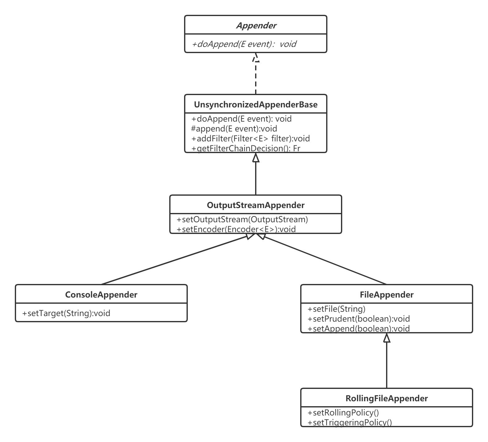

# Appenders

## 什么是Appender

logback 将写入日志事件的任务委托给一个名为 appender 的组件。Appender 必须实现 [`ch.qos.logback.core.Appender`](https://logback.qos.ch/xref/ch/qos/logback/core/Appender.html) 接口。该接口的方法如下：

```java
package ch.qos.logback.core;

import ch.qos.logback.core.spi.ContextAware;
import ch.qos.logback.core.spi.FilterAttachable;
import ch.qos.logback.core.spi.LifeCycle;


public interface Appender<E> extends LifeCycle, ContextAware, FilterAttachable {

    public String getName();
      public void setName(String name);
      void doAppend(E event);
}
```

`doAppender()` 方法接收一个泛型参数 *E* 作为唯一的参数。*E* 的实际参数类型取决于 logback 模块。在 logback-classic 模块里面，*E* 的类型是 [ILoggingEvent](https://logback.qos.ch/apidocs/ch/qos/logback/classic/spi/ILoggingEvent.html) 。在 logback-access 模块里面，*E* 的类型是 [AccessEvent](https://logback.qos.ch/apidocs/ch/qos/logback/access/spi/AccessEvent.html)。`doAppend()` 是 logback 框架里面最重要的模块。它的责任是将日志事件进行格式化，然后输出到对应的设备上。

Appender 都是实体类，这样可以确保它们通过名字被引用。`Appender` 接口继承了 `FilterAttachable` 接口。使得一个或多个过滤器可以附加到 appender 实例上。

Appender 最基本的责任是将日志事件进行输出。然而，它们可以委托 `Layout` 或者 `Encoder` 对象来对日志事件进行格式化。每一个 layout/encoder 有且只与一个 appender 相关联。例如，`SocketAppender` 仅仅序列化日志事件，然后再通过线路传输。

```java
public synchronized void doAppend(E eventObject) {

  // prevent re-entry.
  if (guard) {
    return;
  }

  try {
    guard = true;

    if (!this.started) {
      if (statusRepeatCount++ < ALLOWED_REPEATS) {
        addStatus(new WarnStatus(
            "Attempted to append to non started appender [" + name + "].",this));
      }
      return;
    }

    if (getFilterChainDecision(eventObject) == FilterReply.DENY) {
      return;
    }

    // ok, we now invoke the derived class's implementation of append
    this.append(eventObject);

  } finally {
    guard = false;
  }
}
```

**`doAppend()` 的实现是 synchronized 的。不同的线程通过同一个 appender 打印日志是线程安全的。当一个线程 *T* 正在执行 `doAppend()` 方法，接下来其它的线程调用将会被阻塞直到线程 *T* 离开 `doAppend()` 方法，这样可以确保 *T* 对 appender 的访问具有独占性。**

因为这种同步并不总是适合的，所以 logback 提供了 [`ch.qos.logback.core.UnsynchronizedAppenderBase`](https://logback.qos.ch/xref/ch/qos/logback/core/UnsynchronizedAppenderBase.html)类，0跟 [AppenderBase](https://logback.qos.ch/xref/ch/qos/logback/core/AppenderBase.html) 类十分的相似。为了简单起见，接下来的内容我们只讨论 `UnsynchronizedAppenderBase`。

## Lockback-core

Logback-core 为 logback 其他模块的构建奠定了基础。一般来说，logback-core 的组件需要一些定制，尽管很少。但是，在接下来的几个部分，我们描述了一种可以开箱即用的 appender。

### OutputStreamAppender

[`OutputStreamAppender`](https://logback.qos.ch/xref/ch/qos/logback/core/OutputStreamAppender.html) 将事件附加到 `java.io.OutputStream` 上。这个类提供了其它 appender 构建的基础服务。用户通常不会直接实例一个 OutputStreamAppender 实例。因为一般来说 `java.io.OutputStream` 类型不能方便的转为 String。因为在配置文件中没有方法去直接指定一个 `OutputStream` 目标对象。简单来说，你不能通过配置文件配置一个 `OutputStreamAppender`。但是这并不意味着 `OutputStreamAppender` 缺少配置属性。这些属性描述如下：

| 属性名         | 属性值                                                       | 描述                                                         |
| -------------- | ------------------------------------------------------------ | ------------------------------------------------------------ |
| ecoder         | [`Encoder`](https://logback.qos.ch/xref/ch/qos/logback/core/encoder/Encoder.html) | 决定通过哪种方式将事件写入 `OutputStreamAppender`，Encoder 将会在单独的章节介绍 |
| immediateFlush | boolean                                                      | `immediateFlush` 的默认值为 true。立即刷新输出流可以确保日志事件被立即写入，并且可以保证一旦你的应用没有正确关闭 appender，日志事件也不会丢失。从另一方面来说，设置这个属性为 false，有可能会使日志的吞吐量翻两番(视情况而定)。但是，设置为 false，当应用退出的时候没有正确关闭 appender，会导致日志事件没有被写入磁盘，可能会丢失。 |

`OutputStreamAppender` 是其他三个 appender 的父类，分别是 `ConsoleAppender`、`FileAppender` 以及 `RollingFileAppender`。`FileAppender` 又是 `RollingFileAppender` 的父类。下面的类图展示 `OutputStreamAppender` 与子类之间的关系：



### ConsoleAppender

[`ConsoleAppender`](https://logback.qos.ch/xref/ch/qos/logback/core/ConsoleAppender.html) 就跟名字显示的一样，是将日志事件附加到控制台，跟进一步说就是通过 *System.out* 或者 *System.err* 来进行输出。默认通过前者。`ConsoleAppender` 通过用户指定的 encoder，格式化日志事件。Encoder 会在接下来的章节讨论。*System.out* 与 *System.err* 两者都是 `java.io.PrintStream` 类型。因此，它们被包装在可以进行 I/O 缓存操作的 `OutputStreamWriter` 中。

| 属性名    | 类型                                                         | 描述                                                         |
| --------- | ------------------------------------------------------------ | ------------------------------------------------------------ |
| encoder   | [`Encoder`](https://logback.qos.ch/xref/ch/qos/logback/core/encoder/Encoder.html) | 见 `OutputStreamAppender` 属性                               |
| target    | String                                                       | *System.out* 或 *System.err*。默认为 *System.out*            |
| withJansi | boolean                                                      | `withJansi` 的默认值为 `false`。设置 `withJansi` 为 `true` 可以激活 [Jansi](http://jansi.fusesource.org/)在 windows 使用 ANSI 彩色代码。在 windows 上如果设置为 true，你应该将 `org.fusesource.jansi:jansi:1.9` 这个 jar 包放到 classpath 下。基于 Unix 实现的操作系统，像 Linux、Max OS X 都默认支持 ANSI 才彩色代码。 |

*Example: ConsoleAppender configuraion (logback-Console.xml)*

```xml
<configuration>
    <appender name="STDOUT" class="ch.qos.logback.core.ConsoleAppender" >
        <!-- encoder 默认使用 ch.qos.logback.classic.encoder.PatternLayoutEncoder -->
        <encoder>
            <pattern>%-4relative [%thread] %-5level %logger{35} - %msg %n</pattern>
        </encoder>    
    </appender>
    <root level="DEBUG">
        <appender-ref ref="STDOUT" />
    </root>
</configuration>
```

### FileAppender

[`FileAppender`](https://logback.qos.ch/xref/ch/qos/logback/core/FileAppender.html) 是 `OutputStreamAppender` 的子类，将日志事件输出到文件中。通过 `file` 来指定目标文件。如果该文件存在，根据 `append` 的值，要么将日志追加到文件中，要么该文件被截断。

| 属性名  | 类型                                                         | 描述                                                         |
| ------- | ------------------------------------------------------------ | ------------------------------------------------------------ |
| append  | boolean                                                      | 如果为 `true`，日志事件会被追加到文件中，否则的话，文件会被截断。默认为 `true` |
| encoder | [`Encoder`](https://logback.qos.ch/xref/ch/qos/logback/core/encoder/Encoder.html) | 参见 `OutputStreamAppender` 的属性                           |
| file    | String                                                       | 要写入文件的名称。如果文件不存在，则新建。在 windows 平台上，用户经常忘记对反斜杠进行转义。例如，*c:\temp\test.log* 不会被正确解析，因为 *'\t'* 是一个转义字符，会被解析为一个 *tab* 字符 (\u0009)。正确的值应该像：*c:/temp/test.log* 或者 *c:\\temp\\test.log*。没有默认值。 |
| prudent | boolean                                                      | 在严格模式下，`FileAppender` 会将日志安全的写入指定文件。即使在不同的 JVM 或者不同的主机上运行 `FileAppender` 实例。默认的值为 `false`。<br/>严格模式可以与 `RollingFileAppender` 结合使用。<br/>严格模式也意味着 `append` 属性被自动设置为 `true`。<br/>严格模式依赖排他文件锁。实验证明，文件锁大概是写入日志事件成本的 3 倍。在严格模式关闭的情况下，往一台"普通"电脑的硬盘上将一个日志事件写入文件，大概需要耗费 10 微秒。但是在开启的情况下，大概需要 30 微秒。也就是说在关闭的情况下可以一秒钟写入 100'000 个日志事件，但是在开启的情况下，一秒钟只能写入33'000 个日志事件。严格模式可以在所有 JVM 写入同一个文件时，有效的序列化 I/O 操作。因此，随着竞相访问同一个文件的 JVM 数量上升，将会延迟每一个 I/O 操作。只要总共的 I/O 操作大约为每秒 20 个日志请求，对性能的影响可以被忽略。但是，如果应用每秒产生了 100 个以上的 I/O 操作，性能会受到明显的影响，应该避免使用严格模式。`网络文件锁` 当日志文件位于网络文件系统上时，严谨模式的成本会更高。同样重要的是，网络文件系统的文件锁带有很强的偏向性，当前获得锁的进程在释放锁之后会立马又重新获得。因此，当一个进程独占日志文件，将会导致其它进程饥饿死锁。严格模式的影响严重依赖网速以及操作系统实现的细节。我们提供了一个小型应用 [FileLockSimulator](https://gist.github.com/2794241) 用于在你的环境中模拟严格模式。 |

`立即刷新` 默认情况下，每一个日志事件都会被立即刷新到底层的输出流。默认方法更加的安全，因为日志事件在你的应用没有正确关闭 appender 的情况下不会丢失。但是，要想显著的增加日志的吞吐率，你可以将 `immediateFlush` 设置为 `false`。

下面是 `FileAppender` 的配置示例：

> Example: logback-fileAppender.xml

```xml
<configuration>
    <appender name="FILE" class="ch.qos.logback.core.FileAppender">
        <file>testFile.log</file>
<!--         将 immediateFlush 设置为 false 可以获得更高的日志吞吐量 -->
        <immediateFlush>true</immediateFlush>
<!--         默认为 ch.qos.logback.classic.encoder.PatternLayoutEncoder -->
        <encoder>
            <pattern>%-4relative [%thread] %-5level %logger{35} - %msg%n</pattern>
        </encoder>
    </appender>

    <root level="DEBUG">
        <appender-ref ref="FILE" />
    </root>
</configuration>
```

#### 文件唯一命名（使用时间戳）

在应用的开发阶段或者短期应用中，例如：批处理程序，在每个应用启动的时候创建一个新的日志文件。通过<timestamp>元素可以轻易做到这点。

```java
<configuration>
<!--     通过 "bySecond" 将时间格式化成 "yyyyMMdd'T'HHmmss" 的形式插入到 logger 的上下文中 
        这个值对后续的配置也适用
-->
    <timestamp key="bySecond" datePattern="yyyyMMdd'T'HHmmss" />
    <appender name="FILE" class="ch.qos.logback.core.FileAppender">
<!--         利用之前创建的 timestamp 来创建唯一的文件 -->
        <file>log-${bySecond}.txt</file>
        <encoder>
            <pattern>%logger{35} - %msg%n</pattern>
        </encoder>
    </appender>
    <root level="DEBUG">
        <appender-ref ref="FILE" />
    </root>
</configuration>
```

`timestamp` 元素需要两个强制的属性 *key* 跟 *datePattern* 以及可选的属性 *timeReference*。*key* 属性的值是来区分哪个 timestamp 元素，并且在后续的配置中可以通过[TODO 变量替换](http://www.logback.cn/变量替换)来使用。*datePattern* 属性用于将当前时间格式化成字符串。日期格式必须遵循 [SimpleDateFormat](https://docs.oracle.com/javase/8/docs/api/java/text/SimpleDateFormat.html) 中的规范。*timeReference* 表示时间戳引用哪个时间。默认为解析配置文件的时间，也就是当前时间。但是，在一些特定的情况下，可以设置为上下文初始化的时间。通过 设置 *timeReference* 的值为 `contextBirth`。

```xml
<configuration>
    <timestamp key="bySecond" datePattern="yyyyMMdd'T'HHmmss" timeReference="contextBirth"/>
    ...
</configuration>
```

### RollingFileAppender

[`RollingFileAppender`](https://logback.qos.ch/xref/ch/qos/logback/core/rolling/RollingFileAppender.html) 继承自`FileAppender`，具有轮转日志文件的功能。例如，`RollingFileAppender` 将日志输出到 *log.txt* 文件，在满足了特定的条件之后，将日志输出到另外一个文件。

与 `RollingFileAppender` 进行交互的有两个重要的子组件。第一个是 `RollingPolicy`，它负责日志轮转的功能。另一个是 `TriggeringPolicy`，它负责日志轮转的时机。所以 `RollingPolicy` 负责发生什么，`TriggeringPolicy` 负责什么时候发生。

为了让 `RollingFileAppender` 生效，必须同时设置 `RollingPolicy` 与 `TriggeringPolicy`。但是，如果 `RollingPolicy` 也实现了 `TriggeringPolicy` 接口，那么只需要设置前一个就好了。

`RollingFileAppender` 的属性如下所示：

| 属性             | 类型                                                         | 描述                                                         |
| ---------------- | ------------------------------------------------------------ | ------------------------------------------------------------ |
| file             | String                                                       | 参见 `FileAppender`                                          |
| append           | boolean                                                      | 参见 `FileAppender`                                          |
| encoder          | [`Encoder`](https://logback.qos.ch/xref/ch/qos/logback/core/encoder/Encoder.html) | 参见 `OutputStreamAppender`                                  |
| rollingPolicy    | RollingPolicy                                                | 当轮转发生时，指定 `RollingFileAppender` 的行为。下面将会详细说明 |
| triggeringPolicy | TriggeringPolicy                                             | 告诉 `RollingFileAppender` 什么时候发生轮转行为。下面将会详细说明 |
| prudent          | boolean                                                      | [`FixedWindowRollingPolicy`](http://www.logback.cn/04第四章Appenders.html#FixedWindowRollingPolicy) 不支持该属性。 `RollingFileAppender` 在使用严格模式时要与[`TimeBasedRollingPolicy](http://www.logback.cn/04第四章Appenders.html#TimeBasedRollingPolicy) 结合使用，但是有两个限制： 1. 在严格模式下，也不支持也不允许文件压缩（我们不能让一个 JVM 在写入文件时，另一个 JVM 在压缩该文件） 2. 不能对 `FileAppender` 的 `file` 属性进行设置。实际上，大多数的操作系统不允许在有进程操作文件的情况下对文件改名。 其它的参考 `FileAppender` |

#### Rolling policy 简介

[`RollingPolicy`](https://logback.qos.ch/xref/ch/qos/logback/core/rolling/RollingPolicy.html) 负责轮转的方式为：移动文件以及对文件改名。

`RollingPolicy` 接口如下：

```java
package ch.qos.logback.core.rolling;  

import ch.qos.logback.core.FileAppender;
import ch.qos.logback.core.spi.LifeCycle;

public interface RollingPolicy extends LifeCycle {

    public void rollover() throws RolloverFailure;
    public String getActiveFileName();
    public CompressionMode getCompressionMode();
    public void setParent(FileAppender appender);
}
```

`rollover` 方法负责对日志文件进行归档。`getActiveFileName()` 方法负责获取当前日志文件的名字。`getCompressionMode` 方法决定采取哪种压缩模式。通过 `setParent` 方法引用父类。

#### TimeBasedRollingPolicy

[`TimeBasedRollingPolicy`](https://logback.qos.ch/xref/ch/qos/logback/core/rolling/TimeBasedRollingPolicy.html) 是最常用的轮转策略。它是基于时间来定义轮转策略。例如按天或者按月。`TimeBasedRollingPolicy` 既负责轮转的行为，也负责触发轮转。实际上，`TimeBasedRollingPolicy` 同时实现了 `RollingPolicy` 与 `TriggeringPolicy` 接口。

`TimeBasedRollingPolicy` 的配置需要一个强制的属性 `fileNamePattern` 以及其它的可选属性。

| 属性名              | 类型    | 描述                                                         |
| ------------------- | ------- | ------------------------------------------------------------ |
| fileNamePattern     | String  | 该属性定义了轮转时的属性名。它的值应该由文件名加上一个 *%d*的占位符。*%d* 应该包含 java.text.SimpleDateFormat 中规定的日期格式。如果省略掉这个日期格式，那么就默认为 *yyyy-MM-dd*。轮转周期是通过 **fileNamePattern** 推断出来的。  注意：可以选择对 `RollingFileAppender`（`TimeBasedRollingPolicy` 的父类）中的 `file` 属性进行设置，也可以忽略。通过设置 `FileAppender` 的 `file` 属性，你可以将当前活动日志的路径与归档日志的路径分隔开来。当前日志永远会是通过 `file` 指定的文件。它的名字不会随着时间的推移而发生变化。但是，如果你选择忽略 `file` 属性，当前活动日志在每个周期内将会根据 `fileNamePattern` 的值变化。稍后的例子将会说明这一点。 *%d{}* 中的日期格式将会遵循 java.text.SimpleDateFormat 中的约定。斜杆 '/' 或者反斜杠 '\' 都会被解析成目录分隔符。  **指定多个 %d**  可以指定多个 %d，但是只能有一个是主要的，用于推断轮转周期。其它的 %d 占位符必须通过 'aux' 标记为辅助的。见下面的示例： 多个 %d 占位符允许你在文件夹中去管理归档文件，这个跟轮转周期不同。如下所示：通过年月来管理日志文件夹，但是轮转周期是在每天晚上零点。 /var/log/%d{yyyy/MM, aux}/myapplication.%d{yyyy-MM-dd}.log  **TimeZone**  在某些情况下，你可能想要根据时区而不是主机的时钟来轮转日志。你可以通过如下方式来指定一个时区，例如： aFloder/test.%d{yyyy-MM-dd-HH, UTC}.log 如果指定的 timezone 不能被识别或者拼写错误，将会根据[TimeZone.getTimeZone(String)](http://docs.oracle.com/javase/6/docs/api/java/util/TimeZone.html#getTimeZone(java.lang.String)) 方法指定为 GMT。 |
| maxHistory          | int     | 这个可选的属性用来控制最多保留多少数量的归档文件，将会异步删除旧的文件。比如，你指定按月轮转，指定 maxHistory = 6，那么 6 个月内的归档文件将会保留在文件夹内，大于 6 个月的将会被删除。注意：当旧的归档文件被移除时，当初用来保存这些日志归档文件的文件夹也会在适当的时候被移除。 |
| totalSizeCap        | int     | 这个可选属性用来控制所有归档文件总的大小。当达到这个大小后，旧的归档文件将会被异步的删除。使用这个属性时还需要设置 maxHistory 属性。而且，maxHistory 将会被作为第一条件，该属性作为第二条件。 |
| cleanHistoryOnStart | boolean | 如果设置为 true，那么在 appender 启动的时候，归档文件将会被删除。默认的值为 false。 归档文件的删除通常在轮转期间执行。但是，有些应用的存活时间可能等不到轮转触发。对于这种短期应用，可以通过设置该属性为 true，在 appender 启动的时候执行删除操作。 |

下面是关于 `fileNamePattern` 的介绍。

| fileNamePattern                            | 轮转周期                                                     | 示例                                                         |
| ------------------------------------------ | ------------------------------------------------------------ | ------------------------------------------------------------ |
| */wombat/foo.%d*                           | 每天轮转（晚上零点）。由于省略了指定 %d 的日期格式，所以默认为 *yyyy-MM-dd* | 没有设置 `file` 属性：在 2006.11.23 这一天的日志都会输出到 */wombat/foo.2006-11-23* 这个文件。晚上零点以后，日志将会输出到 *wombat/foo.2016-11-24* 这个文件。 设置 `file` 的值为 */wombat/foo.txt*：在 2016.11.23 这一天的日志将会输出到 */wombat/foo.txt* 这个文件。在晚上零点的时候，*foo.txt* 将会被改名为 */wombat/foo.2016-11-23*。然后将创建一个新的 *foo.txt*，11.24 号这一天的日志将会输出到这个新的文件中。 |
| */wombat/%d{yyyy/MM}/foo.txt*              | 每个月开始的时候轮转                                         | 没有设置 `file` 属性：在 2016.10 这一个月中的日志将会输出到 */wombat/2006/10/foo.txt*。在 10.31 晚上凌晨以后，11 月份的日志将会被输出到 */wombat/2006/11/foo.txt*。 设置 `file` 的值为 */wombat/foo.txt*：在 2016.10，这个月份的日志都会输出到 */wombat/foo.txt*。在 10.31 晚上零点的时候，*/wombat/foo.txt* 将会被重命名为 */wombat/2006/10/foo.txt*，并会创建一个新的文件 */wombat/foo.txt* ，11 月份的日志将会输出到这个文件。依此类推。 |
| */wombat/foo.%d{yyyy-ww}.log*              | 每周的第一天（取决于时区）                                   | 每次轮转发生在每周的第一天，其它的跟上一个例子类似           |
| */wombat/foo%d{yyyy-MM-dd_HH}.log*         | 每小时轮转                                                   | 跟之前的例子类似                                             |
| */wombat/foo%d{yyyy-MM-dd_HH-mm}.log*      | 每分钟轮转                                                   | 跟之前的例子类似                                             |
| */wombat/foo%d{yyyy-MM-dd_HH-mm, UTC}.log* | 每分钟轮转                                                   | 跟之前的例子类似，不过时间格式是 UTC                         |
| */foo/%d{yyyy-MM, aux}/%d.log*             | 每天轮转。归档文件在包含年月的文件夹下                       | 第一个 %d 被辅助标记。第二个 %d 为主要标记，但是日期格式省略了。因此，轮转周期为每天（由第二个 %d 控制），文件夹的名字依赖年与月。例如，在 2016.11 的时候，所有的归档文件都会在 */foo/2006-11/* 文件夹下，如：*/foo/2006-11/2006-11-14.log* |

**任何斜杆或者反斜杠够会被当作文件夹分隔符。任何必要的文件夹都会在有需要的时候创建。你可以轻松的将日志文件放在单独的文件夹中。**

`TimeBasedRollingPolicy` 支持文件自动压缩。如果 `fileNamePattern` 以 *.gz* 或者 *.zip* 结尾，将会启动这个特性。

| fileNamePattern     | 轮转周期                                             | 示例                                                         |
| ------------------- | ---------------------------------------------------- | ------------------------------------------------------------ |
| */wombat/foo.%d.gz* | 每天轮转（晚上零点），自动将归档文件压缩成 GZIP 格式 | `file` 属性没有设置：在 2009.11.23，日志将会被输出到 */wombat/foo.2009-11-23* 这个文件。但是，在晚上零点的时候，文件将会被压缩成 */wombat/foo.2009-11-23.gz*。在 11.24，这一天的日志将会被直接输出到 */wombat/folder/foo.2009-11-24* 这个文件。 `file` 属性的值设置为 */wombat/foo.txt*：在 2009.11.23，日志将会被输出到 */wombat/foo.txt* 这个文件。在晚上零点的时候，该文件会被压缩成 */wombat/foo.2009-11-23.gz*。并会创建一个新的 */wombat/foo.txt* 文件，11.24 这一天的日志将会被输出到该文件。依此类推。 |

`fileNamePattern` 有两个目的。logback 通过该属性可以进行周期性的轮转并且得到每个归档文件的名字。注意，两种跟不同的 pattern 可能会有相同的轮转周期。*yyyy-MM* 与 *yyyy@MM* 同样都是按月轮转，但是归档文件最终的名字不一样。

**通过设置 `file` 属性，你可以将活动日志文件的路径与归档文件的路径分隔开来。日志将会一直输出到通过 `file` 属性指定的文件中，并且不会随着时间而改变。但是，如果你选择忽略 `file` 属性，活动日志的名字将会根据 `fileNamePattern` 的值在每个周期内变化。不设置 `file` 属性的时候，如果在轮转期间存在外部文件句柄引用日志文件，将会避免[命名错误](https://logback.qos.ch/codes.html#renamingError)。**

`maxHistory` 控制归档文件保留的最大数目，并删除旧的文件。例如，如果你指定按月轮转，并设定 `maxHistory` 的值为 6，那么 6 个月之内的归档文件都会被保留，大于 6 个月的文件将会被删除。注意，当旧的文件被移除时，为文件归档而创建的文件夹在适当的时候也会被移除。

由于各种技术原因，轮转并不是时间驱动的，而是依赖日志事件。例如，在 2002.03.08，假设 `fileNamePattern` 的值为 *yyyy-MM-dd*（按天轮转），在晚上零点之后，没有日志事件到来，假设在 23 分 47 秒之后，第一个到达的日志事件将会触发轮转。也就是说轮转实际发生在 03.09 00:23'47 AM 而不是 0:00 AM。因此，依赖日志事件的到达速度，所以轮转可能会有延迟。但是，不管延迟的情况是什么样，一定周期内生成的日志事件将会被输出到指定的文件中，从这个角度来看，轮转算法始终都会是正确的。

下面是 `RollingFileAppender` 与 `TimeBaseRollingPolicy` 结合使用的例子：

```xml
<configuration>
    <appender name="FILE" class="ch.qos.logback.core.rolling.RollingFileAppender">
        <file>logFile.log</file>
        <rollingPolicy class="ch.qos.logback.core.rolling.TimeBasedRollingPolicy">
<!--             按天轮转 -->
            <fileNamePattern>logFile.%d{yyyy-MM-dd}.log</fileNamePattern>
<!--             保存 30 天的历史记录，最大大小为 30GB -->
            <maxHistory>30</maxHistory>
            <totalSizeCap>3GB</totalSizeCap>
        </rollingPolicy>

        <encoder>
            <pattern>%-4relative [%thread] %-5level %logger{35} - %msg%n</pattern>
        </encoder>
    </appender>

    <root level="DEBUG">
        <appender-ref ref="FILE" />
    </root>
</configuration>
```

下面是在 `prudent` 模式下（严格模式）`RollingFileAppender` 与 `TimeBasedRollingPolicy` 的结合使用的例子：

```xml
<configuration>
    <appender name="FILE" class="ch.qos.logback.core.rolling.RollingFileAppender">
        <!-- 支持多个 JVM 同时写一个文件 -->
        <prudent>true</prudent>
        <rollingPolicy class="ch.qos.logback.core.rolling.TimeBasedRollingPolicy">
            <fileNamePattern>logFile.%d{yyyy-MM-dd}.log</fileNamePattern>
            <maxHistory>30</maxHistory>
            <totalSizeCap>3GB</totalSizeCap>
        </rollingPolicy>

        <encoder>
            <pattern>%-4relative [%thread] %-5level %logger{35} - %msg%n</pattern>
        </encoder>
    </appender>

    <root level="DEBUG">
        <appender-ref ref="FILE" />
    </root>
</configuration>
```

#### 基于大小以及时间的轮转策略

有时你希望按时轮转，但同时又想限制每个日志文件的大小。特别是如果后期处理工具需要对日志进行大小限制。为了满足这个需求，logback 配备了 `SizeAndTimeBasedRollingPolicy`。

注意，`TimeBasedRollingPolicy` 可以限制归档文件总的大小。所以如果你想要这个限制，你可以通过设置 `totalSizeCap` 来达到这个目的。

下面的示例展示了基于时间及大小的配置：

```xml
<configuration debug="true">
    <appender name="ROLLING" class="ch.qos.logback.core.rolling.RollingFileAppender">
        <file>mylog.txt</file>
        <rollingPolicy class="ch.qos.logback.core.rolling.SizeAndTimeBasedRollingPolicy">
<!--             按天轮转 -->
            <fileNamePattern>mylog-%d{yyyy-MM-dd}.%i.txt</fileNamePattern>
            <maxFileSize>100MB</maxFileSize>
            <maxHistory>60</maxHistory>
            <totalSizeCap>20GB</totalSizeCap>
        </rollingPolicy>

        <encoder>
            <pattern>%msg%n</pattern>
        </encoder>
    </appender>

    <root level="DEBUG">
        <appender-ref ref="ROLLING" />
    </root>
</configuration>
```

注意，除了 %d 之外还有 %i。这两个占位符都是强制要求的。在当前时间还没有到达周期轮转之前，日志文件达到了 `maxFileSize` 指定的大小，会进行归档，递增索引从 0 开始。

基于大小与时间的文件归档支持删除旧的归档文件。你需要指定 `maxHistory` 属性的值来保存几个周期的日志。当你的应用停止或者启动的时候，日志将会继续向正确的位置输出。即当前周期内索引最大的。在 1.17 版本前，这个文档会提及一个叫 `SizeAndTimeBasedFNATP` 的组件。但是 `SizeAndTimeBasedFNATP` 组件只提供一个最简单的配置。我们不再提供关于 `SizeAndTimeBasedFNATP` 的文档。尽管这样，早期的配置文件使用 `SizeAndTimeBasedFNATP` 依然会运行的很好。 实际上，`SizeAndTimeBasedRollingPolicy` 是使用 `SizeAndTimeBasedFNATP` 实现的。

#### FixedWindowRollingPolicy

在轮转时，[`FixedWindowRollingPolicy`](https://logback.qos.ch/xref/ch/qos/logback/core/rolling/FixedWindowRollingPolicy.html) 根据固定窗口算法重命名文件，具体描述如下：

`filaNamePattern` 表示归档文件的名字。这个属性是必须的，而且必须包含一个表示整形的占位符 *i%*。

`FixedWindowRollingPolicy` 的可用属性如下：

| 属性名          | 类型   | 描述                                                         |
| --------------- | ------ | ------------------------------------------------------------ |
| minIndex        | int    | 表示窗口索引的下界                                           |
| maxIndex        | int    | 表示窗口索引的上界                                           |
| fileNamePattern | String | `FixedWindowRollingPolicy` 在重命名日志文件时将会根据这个属性来命名。它必须包含一个 *i%* 的占位符，该占位符指明了窗口索引的值应该插入的位置。  例如，当该属性的值为 *MyLogFile%i.log*，最小与最大的值分别为 *1* 和 *3*。将会产生的归档文件为 *MyLogFile1.log*，*MyLogFile2.log*，*MyLogFile3.log*。  文件压缩的方式也是通过该属性来指定。例如，设置该属性的值为 *MyLogFile%i.log.zip*，那么归档文件将会被压缩成 *zip* 格式。也可以选择压缩成 *gz* 格式。 |

由于窗口固定算法需要跟窗口大小一样的的重命名次数，因此强烈不推荐太大的窗口大小。当用户指定一个较大值时，当前的实现会将窗口大小自动减少为 20。

让我们通过一个例子来了解下固定窗口算法。假设 `minIndex` 的值为 *1*，`maxIndex` 的值为 *3*。`fileNamePattern` 的值为 *foo%i.log*，`file` 属性的值为 *foo.log*。

| 轮转数目 | 当前输出文件 | 归档日志文件                 | 描述                                                         |
| -------- | ------------ | ---------------------------- | ------------------------------------------------------------ |
| 0        | foo.log      | -                            | 还没有到轮转周期，logbak 将日志输出初始文件                  |
| 2        | foo.log      | foo1.log，foo2.log           | 第二次轮转，*foo1.log* 被重命名为 *foo2.log*。*foo.log* 被重命名为 *foo1.log*。一个新的 *foo.log* 被创建并成为当前输出文件 |
| 3        | foo.log      | foo1.log，foo2.log，foo3.log | 第三次轮转，*foo2.log* 被重命名为 *foo3.log*。*foo1.log* 被命名为 *foo2.log*。*foo.log* 被重命名为 *foo1.log*。一个新的 *foo.log* 被创建并成为当前输出文件 |
| 4        | foo.log      | foo1.log，foo2.log，foo3.log | 在这次以及后续的轮转中，将会删除 *foo3.log* 文件，其它文件的重命名操作跟之前的步骤一样。在本次以及以后的轮转中，将会一直只有三个归档文件以及一个活跃的日志文件 |

下面的给出了 `RollingFileAppender` 配合 `FixedWindowRollingPolicy` 使用的例子。注意，`file` 属性是强制的，即使它包含了一些跟 `fileNamePattern` 属性相同的信息。

```xml
<configuration>
    <appender name="FILE" class="ch.qos.logback.core.rolling.RollingFileAppender">
        <file>test.log</file>
        <rollingPolicy class="ch.qos.logback.core.rolling.FixedWindowRollingPolicy">
            <fileNamePattern>tests.%i.log.zip</fileNamePattern>
            <minIndex>1</minIndex>
            <maxIndex>3</maxIndex>
        </rollingPolicy>

        <triggeringPolicy class="ch.qos.logback.core.rolling.SizeBasedTriggeringPolicy">
            <maxFileSize>5MB</maxFileSize>
        </triggeringPolicy>

        <encoder>
            <pattern>%-4relative [%thread] %-5level %logger{35} - %msg%n</pattern>
        </encoder>
    </appender>

    <root level="DEBUG">
        <appender-ref ref="FILE" />
    </root>
</configuration>
```

#### 触发策略简介

[`TriggeringPolicy`](https://logback.qos.ch/xref/ch/qos/logback/core/rolling/TriggeringPolicy.html) 的实现用于通知 `RollingFileAppender` 何时轮转。

`TriggeringPolicy` 接口仅仅只包含了一个方法。

```java
package ch.qos.logback.core.rolling;

import java.io.File;
import ch.qos.logback.core.spi.LifeCycle;

public interface TriggeringPolicy<E> extends LifeCycle {

  public boolean isTriggeringEvent(final File activeFile, final <E> event);
}
```

`isTriggeringEvent()` 方法接收当前活动的文件以及当前的日志事件作为参数。基于这些参数，通过具体的实现来决定轮转是不是应该发生。

`TimeBasedRollingPolicy` 是使用最广泛的触发策略。也可以用作轮转策略来使用。

#### SizeBasedTriggeringPolicy

[`SizeBasedTriggeringPolicy`](https://logback.qos.ch/xref/ch/qos/logback/core/rolling/SizeBasedTriggeringPolicy.html) 观察当前活动文件的大小，如果已经大于了指定的值，它会给 `RollingFileAppender` 发一个信号触发对当前活动文件的轮转。

`SizeBasedTriggeringPolicy` 只接收 `maxFileSize` 这一个参数，它的默认值是 10 MB。

`maxFileSize` 可以为字节，千字节，兆字节，千兆字节，通过在数值后面指定一个后缀 *KB*，*MB* 或者 *GB*。例如，*5000000*，*5000KB*，*5MB* 以及 *2GB* 都是有效的，前三个是一样的。

```xml
<configuration>
    <appender name="FILE" class="ch.qos.logback.core.rolling.RollingFileAppender">
        <file>test.log</file>
        <rollingPolicy class="ch.qos.logback.core.rolling.FixedWindowRollingPolicy">
            <fileNamePattern>test.%i.log.zip</fileNamePattern>
            <minIndex>1</minIndex>
            <maxIndex>3</maxIndex>
        </rollingPolicy>

        <triggeringPolicy class="ch.qos.logback.core.rolling.SizeBasedTriggeringPolicy">
            <maxFileSize>5MB</maxFileSize>
        </triggeringPolicy>
        <encoder>
            <pattern>%-4relative [%thread] %-5level %logger{35} - %msg%n
            </pattern>
        </encoder>
    </appender>

    <root level="DEBUG">
        <appender-ref ref="FILE" />
    </root>
</configuration>
```


## Logback Classic

虽然日志事件在 logback-core 是通用的，但是在 logback-classic 中，它们永远是 `ILoggingEvent` 的实例。logback-classic 只不过是用来处理 `ILoggingEvent` 实例的专门处理管道。

### SocketAppender and SSLSocketAppender

到目前为止，所介绍的 appender 只能将日志输出到本地资源。相反的是，[`SocketAppender`](https://logback.qos.ch/xref/ch/qos/logback/classic/net/SocketAppender.html) 被设计成可以将 `ILoggingEvent` 实例序列化再传输到远端机器。当使用 `SocketAppender` 时，日志事件将以明文发送，使用 [`SSLSocketAppender`](https://logback.qos.ch/xref/ch/qos/logback/classic/net/SSLSocketAppender.html) 时，日志事件将通过安全的通道传输。

序列化事件的实际类型为 [`LoggingEventVO`](https://logback.qos.ch/xref/ch/qos/logback/classic/spi/LoggingEventVO.html)，它实现了 `ILoggingEvent` 接口。就日志事件而言，远程日志是非侵入式的。在接收到日志事件并反序列化之后，日记事件就像在本地生成的一样。多个 `SocketAppender`实例运行在不同的机器上，直接将它们的日志通过固定的格式输出到中央日志服务器上。`SocketAppender`不会关联 layout，因为它是序列化日志事件到远程服务器上。`SocketAppender` 在 *Transmission Control Protocol (TCP)* 层上运行，该层提供了可靠，有序，流式控制以及段对端的八位字节流。所以，如果远程服务器是可以到达的，那么日志事件最终都会到达那里。相反，如果远程服务器挂掉或者不可达到，那么日志事件会被丢弃。如果服务器重新恢复，那么日志事件的传输将会继续进行。这种重连是通过一个连接线程池周期性的尝试连接来进行的。

日志事件由本地 TCP 实现自动缓冲。也就是说如果连接到服务器的速度很慢，但是比客户端产生日志事件的速度要快，那么客户端不会受到网速的影响。但是，如果网络连接速度比日志产生速度要慢，那么客户端只能以网络速度进行处理。特别在极端情况下，连接到服务器的网络挂掉了，客户端最终会被阻塞。如果网络连接恢复了，但是服务器挂掉了，客户端不会阻塞，尽管因为服务器挂掉了，日志事件丢失。

尽管 `SocketAppender` 不再依赖任何的 logger，在当前线程的连接下也不会被垃圾收集。但是连接线程只有在服务器挂掉的情况下才存在，为了避免出现垃圾收集问题，你需要明确的关闭 `SocketAppender`。生命周期长的应用会创建/销毁许多 `SocketAppender` 实例，应该注意到这个垃圾回收问题。大部分的应用可以忽略这个问题。如果 JVM 在 `SocketAppender` 关闭之前退出，无论是显式的退出或者是通过后续的垃圾回收，都可能会导致未传输的数据在管道中被丢失。这是基于 windows 系统常见的问题。为了避免数据丢失，通常的做法是调用 `close()` 方法去关闭 `SocketAppender`，或者在应用退出之前调用 `LoggerContext` 的 `stop()` 方法。

远程服务器通过 `remoteHost` 与 `port` 属性来标识。`SocketAppender` 属性罗列在下表当中。`SSLSocketAppender` 支持额外的一些属性，将在[第十五章](https://logback.qos.ch/manual/usingSSL.html)进行讨论。

# TODO远程日志，如果后续需要，深入学习