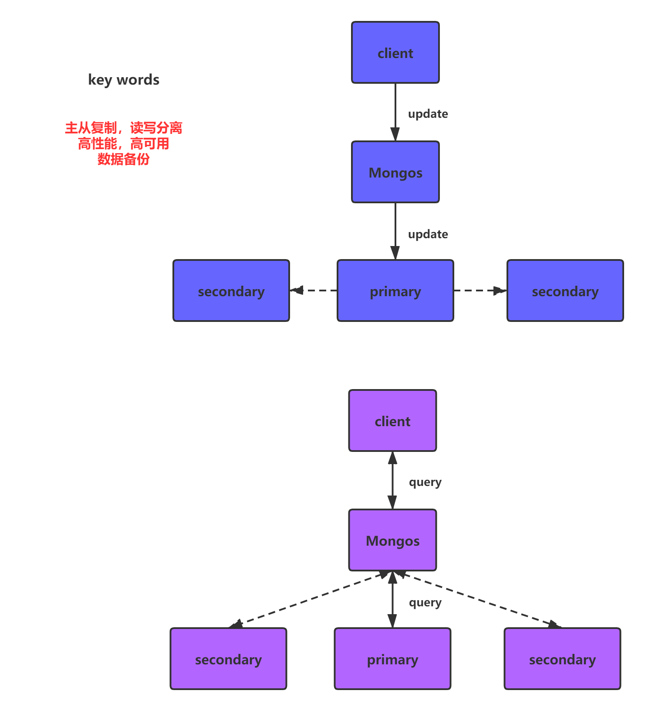
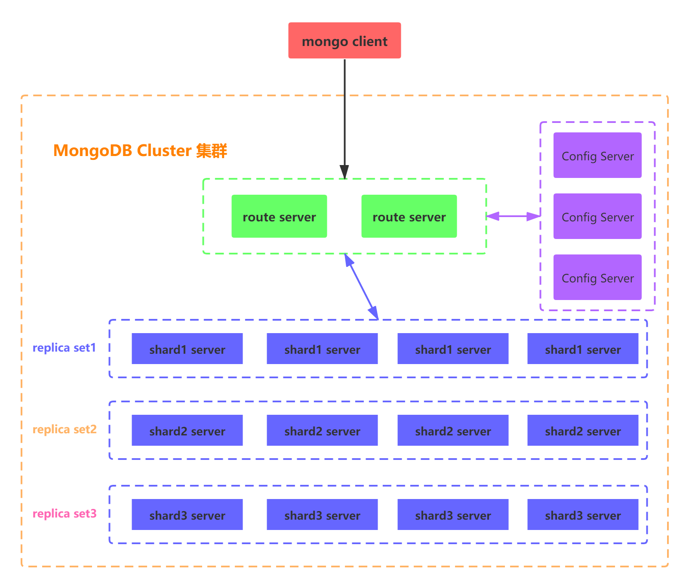
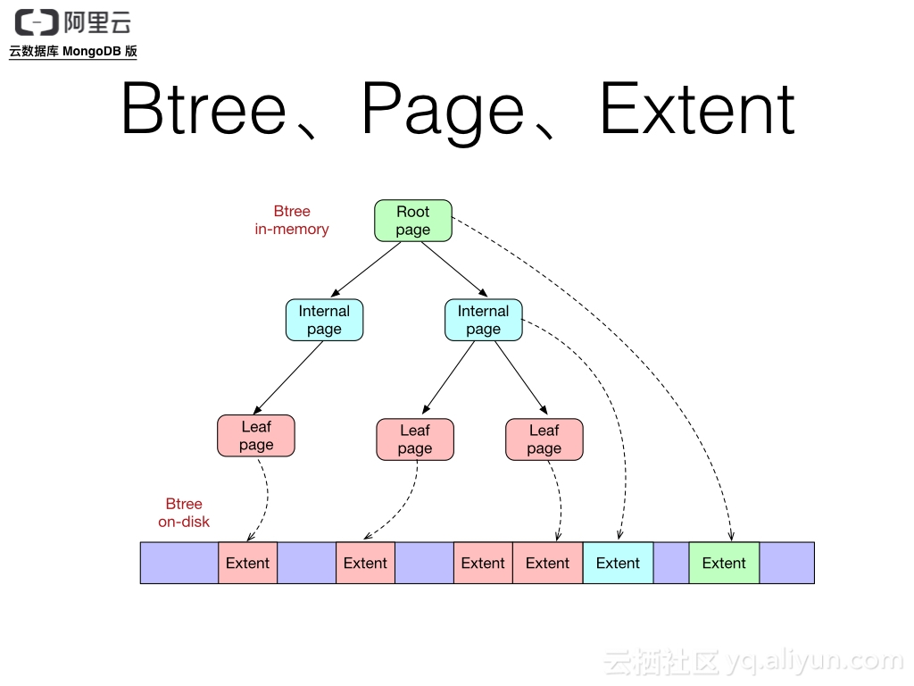

# MongoDB介绍

MongoDB 是一个基于【分布式文件存储】的数据库，它属于NoSQL数据库。由 C++ 语言编写。旨在为 WEB 应用提供【**可扩展**】的【**高性能**】数据存储解决方案。

MongoDB是一个<font color='red'>**介于关系数据库和非关系数据库之间的产品**</font>，是非关系数据库当中功能最丰富，最像关系数据库的。它支持的数据结构非常松散，是类似json的bson格式，因此可以存储比较复杂的数据类型。Mongo最大的特点是它支持的**查询语言非常强大**，其语法有点类似于面向对象的查询语言，几乎可以实现类似关系数据库**<font color='red'>单表查询</font>**的绝大部分功能，而且还支持对数据建立索引。

> NoSQL分类：键值型（key-value）、文档型（document）
>
> MongoDB就是文档型NoSQL数据库，它文档中的数据是以类似JSON的BSON格式进行存储的。我们拿JSON去理解，JSON中的数据，都是key-value，key一般都是String类型的，而value就多种多样了。只有value的类型，后续有专门的讲解。记住value中可以再存储一个文档。

## MongoDB概念解析

在mongodb中基本的概念是**文档、集合、数据库**。

| SQL术语/概念 | MongoDB术语/概念 | 解释/说明                        |
| ------------ | ---------------- | -------------------------------- |
| database     | database         | 数据库                           |
| table        | collection       | 数据库表/集合                    |
| row          | document         | 数据记录行/文档                  |
| column       | field            | 数据字段/域                      |
| index        | index            | 索引                             |
| table joins  |                  | 表连接，MongoDB不支持            |
| primary key  | primary key      | 主键，MongoDB自动将_id设置为主键 |


### 数据库

一个mongodb中可以建立多个数据库。

MongoDB的默认数据库为"db"，该数据库存储在data目录中（**安装时，可以默认，可以指定，但是必须该目录是存在的**）。

MongoDB的单个实例可以容纳多个独立的数据库，每一个都有自己的集合和权限，不同的数据库也放置在不同的文件中。

"**show dbs**" 命令可以显示所有数据的列表。

```shell
$ ./mongo
MongoDB shell version: 3.0.6
connecting to: test
> show dbs
local 0.078GB
test  0.078GB
>
```

执行 "**db**" 命令可以显示当前数据库对象或集合。

```shell
$ ./mongo
MongoDB shell version: 3.0.6
connecting to: test
> db
test
>
```

运行use命令，可以连接一个指定的数据库

```shell
> use local
switched to db local
```

### 文档

文档是一组键值(key-value)对(即 BSON)。**MongoDB 的文档不需要设置相同的字段，并且相同的字段不需要相同的数据类型，这与关系型数据库有很大的区别，也是 MongoDB 非常突出的特点。**

需要注意的是：

1. 文档中的键/值对是有序的。
2. 文档中的值不仅可以是在双引号里面的字符串，还可以是其他几种数据类型（甚至可以是整个嵌入的文档)。
3. MongoDB区分类型和大小写。
4. MongoDB的文档不能有重复的键。
5. 文档的键是字符串。除了少数例外情况，键可以使用任意UTF-8字符。

文档命名规范：

- 键不能含有\0 (空字符)。这个字符用来表示键的结尾。**（C++）**
- .和$有特别的意义，只有在特定环境下才能使用。
- 以下划线"_"开头的键是保留的(不是严格要求的)。

### 集合

集合就是 MongoDB 文档组，类似于 RDBMS （关系数据库管理系统：Relational Database Management System)中的表格。

**集合存在于数据库中，集合没有固定的结构，这意味着你在对集合可以插入不同格式和类型的数据，但通常情况下我们插入集合的数据都会有一定的关联性。**

比如，我们可以将以下不同数据结构的文档插入到集合中：

```sql
{"site":"www.baidu.com"}
{"site":"www.google.com","name":"Google"}
{"site":"www.kaikeba.com","name":"开课吧","num":5}
```

当第一个文档插入时，集合就会被创建。

> 一个collection（集合）中的所有field（域）是collection（集合）中所有document（文档）中包含的field（域）的并集。

合法集合名：

- 集合名不能是空字符串""。
- 集合名不能含有\0字符（空字符)，这个字符表示集合名的结尾。（C++）
- 集合名不能以"system."开头，这是为系统集合保留的前缀。
- 用户创建的集合名字不能含有保留字符。有些驱动程序的确支持在集合名里面包含，这是因为某些系统生成的集合中包含该字符。除非你要访问这种系统创建的集合，否则千万不要在名字里出现$。

### capped collections

Capped collections 就是固定大小的collection。

它有很高的性能以及队列过期的特性(过期按照插入的顺序). 有点和 "RRD" 概念类似。

Capped collections 是高性能自动的维护对象的插入顺序。它非常适合类似记录日志的功能和标准的 collection 不同，你必须要显式的创建一个capped collection，指定一个 collection 的大小，单位是字节。collection 的数据存储空间值提前分配的。

**<font color='red'>Capped collections 可以按照文档的插入顺序保存到集合中，而且这些文档在磁盘上存放位置也是按照插入顺序来保存的，所以当我们更新Capped collections 中文档的时候，更新后的文档不可以超过之前文档的大小，这样话就可以确保所有文档在磁盘上的位置一直保持不变。</font>**

由于 Capped collection 是按照文档的插入顺序而不是使用索引确定插入位置，这样的话可以提高增添数据的效率MongoDB 的操作日志文件 oplog.rs 就是利用 Capped Collection 来实现的。

要注意的是指定的存储大小包含了数据库的头信息。

```sql
db.createCollection("mycoll", {capped:true, size:100000})
```

在 capped collection 中，你能添加新的对象。

- 能进行更新，然而，对象不会增加存储空间。如果增加，更新就会失败 。
- 使用 Capped Collection 不能删除一个文档，可以使用 drop() 方法删除 collection 所有的行。
- 删除之后，你必须显式的重新创建这个 collection。
- 在32bit机器中，capped collection 最大存储为 1e9( 1X10的9次方)个字节。

### ObjectId

ObjectId 类似唯一主键，可以很快的去生成和排序，包含 12 bytes，含义是：

- 前 4 个字节表示创建 unix 时间戳,格林尼治时间 UTC 时间，比北京时间晚了 8 个小时
- 接下来的 3 个字节是机器标识码
- 紧接的两个字节由进程 id 组成 PID
- 最后三个字节是随机数

MongoDB 中存储的文档必须有一个 _id 键。这个键的值可以是任何类型的，默认是个 ObjectId 对象

由于 ObjectId 中保存了创建的时间戳，所以你不需要为你的文档保存时间戳字段，你可以通过 getTimestamp 函数来获取文档的创建时间:

```sql
> var newObject = ObjectId()
> newObject.getTimestamp()
ISODate("2017-11-25T07:21:10Z")
```

ObjectId 转为字符串

```sql
5a1919e63df83ce79df8b38f
```


## MongoDB底层原理

**MongoDB的部署方案由单机部署、主从部署、副本集（主备）部署、分片部署、副本集与分片混合部署。**

### 副本集集群

**对于副本集集群，又有主和从两种角色，写数据和读数据也是不同，写数据的过程是只写到主结点中，由主 结点以异步的方式同步到从结点中：**

**而读数据则只要从任一结点中读取，具体到哪个结点读取是可以指定的：**




### 副本集与分片混合部署

Mongodb的集群部署方案有三类角色：**实际数据存储节点，配置文件存储节点和路由接入节点。**

- **实际数据存储节点**的作用就是存储数据，
- **路由接入节点**的作用是在分片的情况下起到负载均衡的作用。
- **存储配置存储节点**的作用其实存储的是片键与chunk 以及chunk 与server 的映射关系，用上面的数据表 示的配置结点存储的数据模型如下表：

**map1**

| key range | chunk  |
| --------- | ------ |
| [0,10}    | chunk1 |
| [10,20}   | chunk2 |
| [20,30}   | chunk3 |
| [30,40}   | chunk4 |
| [40,50}   | chunk5 |

**map2**

| chunk  | shard  |
| ------ | ------ |
| chunk1 | shard1 |
| chunk2 | shard2 |
| chunk3 | shard3 |
| chunk4 | shard4 |
| chunk5 | shard5 |

MongoDB的客户端直接与**路由节点**相连，从配置节点上查询数据，根据查询结果到实际的存储节点上查询和存储数据。

**副本集与分片混合部署方式如图：**



> 相同的副本集中的节点存储的数据是一样的，副本集中的节点是分为主节点、从节点、仲裁节点（非必须）三种角色。【这种设计方案的目的，主要是为了高性能、高可用、数据备份。】
>
> 不同的副本集中的节点存储的数据是不一样，【这种设计方案，主要是为了解决高扩展问题，理论上是可以无限扩展的。】
>
> 每一个副本集可以看成一个shard（分片），多个副本集共同组成一个逻辑上的大数据节点。通过对shard上面进行逻辑分块chunk（块），每个块都有自己存储的数据范围，所以说客户端请求存储数据的时候，会去读取config server中的映射信息，找到对应的chunk（块）存储数据。

# MongoDB的应用场景和不适用场景

## 适用场景

### 更高的写入负载

默认情况下，MongoDB更侧重高数据写入性能，而非事务安全，MongoDB很适合业务系统中有大量“低价值”数据的场景。但是应当避免在高事务安全性的系统中使用MongoDB，除非能从架构设计上保证事务安全。

### 高可用

MongoDB的复副集(Master-Slave)配置非常简洁方便，此外，MongoDB可以快速响应的处理单节点故障，自动、安全的完成故障转移。这些特性使得MongoDB能在一个相对不稳定（如云主机）的环境中，保持高可用性。

### 数据量很大或者未来会变得很大

依赖数据库(MySQL)自身的特性，完成数据的扩展是较困难的事，**<font color='red'>在MySQL中，当一个单表达到5-10GB时会出现明显的性能降级</font>**，此时需要通过数据的水平和垂直拆分、库的拆分完成扩展，使用MySQL通常需要借助驱动层或代理层完成这类需求。而MongoDB内建了多种数据分片的特性，可以很好的适应大数据量的需求。

### 基于位置的数据查询

MongoDB支持二维空间索引，因此可以快速及精确的从指定位置获取数据。

### 表结构不明确，且数据在不断变大

在一些传统RDBMS中，增加一个字段会锁住整个数据库/表，或者在执行一个重负载的请求时会明显造成其它请求的 性能降级。通常发生在数据表大于1G的时候（当大于1TB时更甚）。 因MongoDB是文档型数据库，为非结构货的文 档增加一个新字段是很快速的操作，并且不会影响到已有数据。另外一个好处当业务数据发生变化时，是将不在需要 由DBA修改表结构。

### 没有DBA支持 

如果没有专职的DBA，并且准备不使用标准的关系型思想（结构化、连接等）来处理数据，那么MongoDB将会是你 的首选。MongoDB对于对像数据的存储非常方便，类可以直接序列化成JSON存储到MongoDB中。 但是需要先了解 一些最佳实践，避免当数据变大后，由于文档设计问题而造成的性能缺陷。 

## 不适用的场景

在某些场景下，MongoDB作为一个非关系型数据库有其局限性。MongoDB不支持事务操作，所以需要用到事务的应用建议不用MongoDB，另外MongoDB目前不支持join操作，需要复杂查询的应用也不建议使用MongoDB。

## MongoDB索引

索引通常能够极大的提高查询的效率，如果没有索引，MongoDB在读取数据时必须扫描集合中的每个文件并选取那些符合查询条件的记录。

### 创建索引

MongoDB使用 createIndex() 方法来创建索引。 

> 注意在 3.0.0 版本前创建索引方法为 db.collection.ensureIndex()，之后的版本使用了 db.collection.createIndex() 方法，ensureIndex() 还能用，但只是 createIndex() 的别名。

#### 语法

```sql
db.collection.createIndex({"title":1})
```

### 查看集合索引

```sql
db.col.getIndexes() 
```

### 查看集合索引大小

```sql
db.col.totalIndexSize() 
```

### 删除集合所有索引

```sql
db.col.dropIndexes() 
```

### 删除所有索引

```sql
db.col.dropIndex("索引名称") 
```

## 聚合查询

MongoDB中聚合(aggregate)主要用于处理数据(诸如统计平均值,求和等)，并返回计算后的数据结果。有点类似sql语 句中的 count(*)。利用Aggregate聚合管道可以完成。MongoDB的聚合管道将MongoDB文档在一个管道处理完毕后将结果传递给下一个管道处理。管道操作是可以重复的。

表达式：处理输入文档并输出。表达式是无状态的，只能用于计算当前聚合管道的文档，不能处理其它的文档。

基本语法为：

```sql
db.COLLECTION_NAME.aggregate(AGGREGATE_OPERATION)
```

为了便于理解，先将常见的mongo的聚合操作和mysql的查询做下类比：

| 表达式   | SQL操作       | 描述                               |
| -------- | ------------- | ---------------------------------- |
| $group   | group by      | 分组                               |
| $sum     | count(),sum() | 计算综合                           |
| $avg     | avg()         | 计算平均值                         |
| $min     | min()         | 获取集合中所有文档对应值得最小值。 |
| $max     | max()         | 获取集合中所有文档对应值得最大值。 |
| $match   | where、having | 查询条件                           |
| $sort    | order by      | 排序                               |
| $limit   | limit         | 取条数                             |
| $project | select        | 选择                               |
| $lookup  | join          | 连接                               |

下面以一个案例来演示：

集合中的数据如下

```sql
> db.LIST1.aggregate([]) 
{ "_id" : ObjectId("5cceaf55e7a4cf28dc5854cf"), "name" : "zhaoyun1", "age" : 1, "city" : "BJ" } 
{ "_id" : ObjectId("5cceaf55e7a4cf28dc5854d0"), "name" : "zhaoyun2", "age" : 2, "city" : "BJ" }
{ "_id" : ObjectId("5cceaf55e7a4cf28dc5854d1"), "name" : "zhaoyun3", "age" : 3, "city" : "BJ" }
{ "_id" : ObjectId("5cceaf55e7a4cf28dc5854d2"), "name" : "zhaoyun4", "age" : 4, "city" : "BJ" }
{ "_id" : ObjectId("5cceaf55e7a4cf28dc5854d3"), "name" : "zhaoyun5", "age" : 5, "city" : "BJ" }
{ "_id" : ObjectId("5cceaf55e7a4cf28dc5854d4"), "name" : "zhaoyun6", "age" : 6, "city" : "BJ" }
{ "_id" : ObjectId("5cceaf55e7a4cf28dc5854d5"), "name" : "zhaoyun7", "age" : 7, "city" : "TJ" }
{ "_id" : ObjectId("5cceaf55e7a4cf28dc5854d6"), "name" : "zhaoyun8", "age" : 8, "city" : "TJ" }
{ "_id" : ObjectId("5cceaf55e7a4cf28dc5854d7"), "name" : "zhaoyun9", "age" : 9, "city" : "TJ" } 
{ "_id" : ObjectId("5cceaf55e7a4cf28dc5854d8"), "name" : "zhaoyun10", "age" : 10, "city" : "TJ"}
```

#### $group

按照城市分组对年龄进行求和

```sql
db.LIST1.aggregate([{$group : {_id : "$city", snum : {$sum : "$age"}}}]) 
{ "_id" : "TJ", "snum" : 34 }
{ "_id" : "BJ", "snum" : 21 
```

#### $sum

按照城市分组对年龄进行求和

```sql
db.LIST1.aggregate([{$group : {_id : "$city", snum : {$sum : "$age"}}}]) 
{ "_id" : "TJ", "snum" : 34 }
{ "_id" : "BJ", "snum" : 21 
```

#### TODO（详情见mongo手册）

# Mongo精华

## MongoDB Writedtiger存储引擎实现原理

MongoDB2.3后默认采用WiredTiger存储引擎。(之前为MMAPV1引擎) 

### Transport Layer业务层

Transport Layer是处理请求的基本单位，Mongo有专门的listener线程，每次有连接进来，listener会创建一个新的线程conn负责与客户交互，它把具体的查询请求给network线程，真正到数据库里查询由TaskExecutor来完成。

### 写请求

WiredTiger的写操作会默认写入 Cache ,并持久化到 WAL (Write Ahead Log)，每60s或Log文件达到2G做一次 checkpoint ，产生快照文件。WiredTiger初始化时，恢复至最新的快照状态，然后根据WAL恢复数据，保证数据的完整性。

Cache是基于BTree的，节点是一个page，root page是根节点，internal page是中间索引节点，leaf page真正存储数据，数据以page为单位与磁道读写。Wiredtiger采用Copy on write的方式管理修改操 作（insert、update、delete），修改操作会先缓存在cache里，**持久化时，修改操作不会在原来的leafpage上进行**，而是写入新分配的page，每次checkpoint都会产生一个新的root page。



### Journaling

为了在数据库宕机保证 MongoDB 中数据的持久性，MongoDB 使用了 Write Ahead Logging 向磁盘上的 journal 文件预先进行写入。 

当数据库发生宕机时，我们就需要 Checkpoint 和 journal 文件协作完成数据的恢复工作：

1. 在数据文件中查找上一个检查点的标识符；
2. 在 journal 文件中查找标识符对应的记录；
3. 重做对应记录之后的全部操作

MongoDB会每隔60s或者在journal数据的写入达到2g的时候设置一次检查点，当然我们也可以通过在写入时传入j:true的参数强制journal文件同步。（<font color='red'>**详情见mongo手册**</font>）

### 一致性

WiredTiger使用copy on write管理修改操作。修改先放在cache中，并持久化，不直接作用在原leaf page，而是写入新分配的page，每次checkpoint产生新的page。

相关文件：

- WiredTiger.basecfg: 存储基本配置信息，与ConfigServer有关系 
- WiredTiger.lock: 定义锁操作 
- table*.wt: 存储各张表的数据 
- WiredTiger.wt: 存储table* 的元数据 
- WiredTiger.turtle: 存储WiredTiger.wt的元数据 
- journal: 存储WAL 

一次Checkpoint的大致流程如下:

对所有的table进行一次Checkpoint，每个table的Checkpoint的元数据更新至WiredTiger.wt 对 WiredTiger.wt进行Checkpoint，将该table Checkpoint的元数据更新至临时文件WiredTiger.turtle.set

将WiredTiger.turtle.set重命名为WiredTiger.turtle。 

上述过程如中间失败，Wiredtiger在下次连接初始化时，首先将数据恢复至最新的快照状态，然后根据WAL恢复数据，以保证存储可靠性。 


## MongoDB集群

### MongoDB的高可用

核心业务99.99%可用，一年宕机时间不超过52分钟（累计；平均每月3分钟，这个世界上没有100%的东西）。

MongoDB的集群部署方案有**主从部署，副本集（主备）部署，分片部署，副本集与分片混合部署**

### 主从复制原理

MongoDB **Oplog**是MongoDB Primary和Secondary在复制建立期间和建立完成之后的复制介质，就是 Primary中所有的写入操作都会记录到MongoDB **Oplog**中，然后从库会来主库一直拉取Oplog并应用到 自己的数据库中。这里的Oplog是MongoDB local数据库的一个集合，它是Capped collection，通俗意 思就是它是固定大小，循环使用的。

<font color='red'>oplog相当于一个表，固定大小循环使用，顺序结构（**undolog**）</font>


#### 主从的特点

- 数据备份
- 读写分离（rs.slaveok()之后才能读）
- 主挂，从不能变主

不能做高可用

## 副本集集群

副本集也是主从的一种方式，

副本集也可以做负载，主挂了，副本集可变主，能做到高可用


#### 有仲裁

主挂，从可变主，若仲裁挂了，集群不能用

#### 无仲裁

主挂，从可变主，没有仲裁节点会好一些？集群风险更小，且多一个节点负载均衡


### 分片集群

**实际数据节点、路由节点、配置节点**

#### 片键

##### 基于范围

​	对于基于范围的分片，MongoDB按照片键的范围把数据分成不同的部分。--**<font color='red'>热点数据不均匀</font>**

##### **基于哈希**

一个片键的哈希范围对应一个chunk，一个chunk是一个副本集的一个存储单元。--**<font color='red'>热点数据可分散</font>**

**map1**

| key range | chunk  |
| --------- | ------ |
| [0,10}    | chunk1 |
| [10,20}   | chunk2 |
| [20,30}   | chunk3 |
| [30,40}   | chunk4 |
| [40,50}   | chunk5 |

**map2**

| chunk  | shard  |
| ------ | ------ |
| chunk1 | shard1 |
| chunk2 | shard2 |
| chunk3 | shard3 |
| chunk4 | shard4 |
| chunk5 | shard5 |


