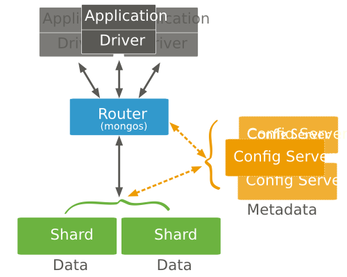
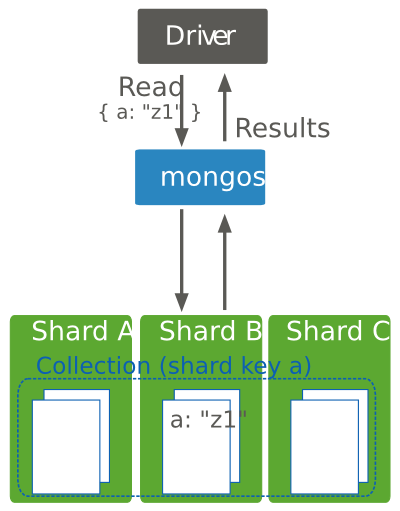
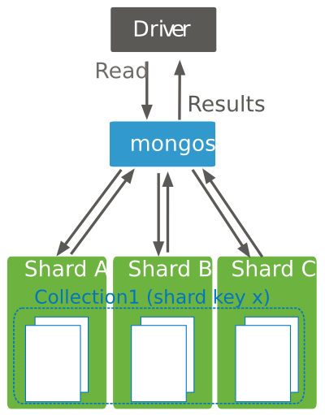
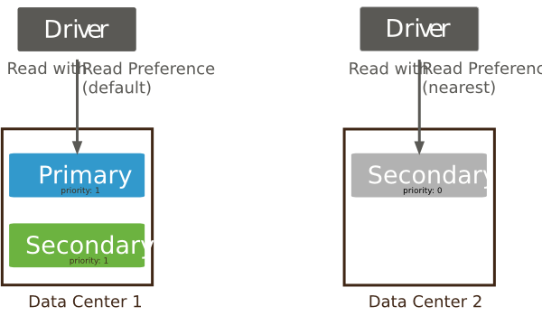
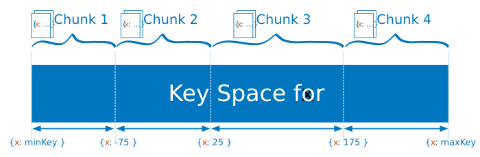
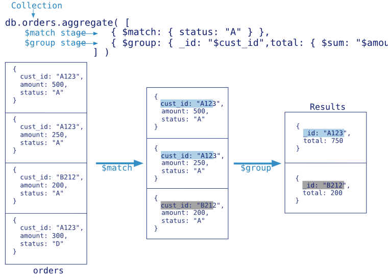
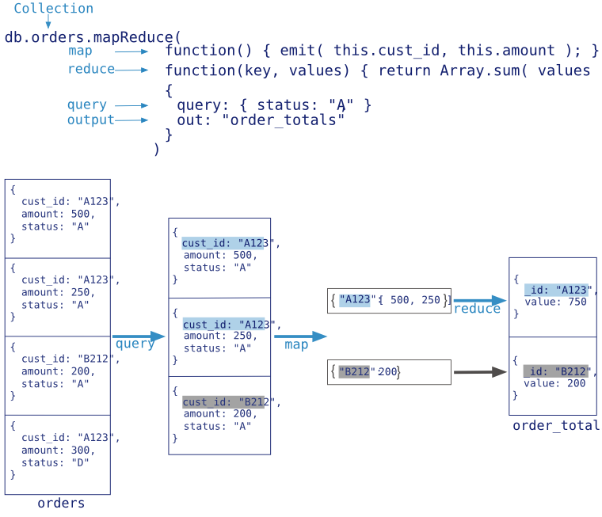

# mongo shell

## 使用mongo shell

> use kkb;
>
> db.myCollection.insert( { x: 1 } );

如果集合中包含空格，连字符"-"，或者以数字开始，可以使用代替语法来指代集合

>  db["3test"].find()
>
> db.getCollection("3test").find()

格式化打印

```sql
db.myCollection.find().pretty()
```

退出shell输入“quit()”

## 配置mongo shell

### 自定义提示符

可以通过在mongo shell中设置变量**prompt**的值来修改提示符的内容。**prompt**变量可以存储字符串以及JavaScript代码。也可以在**.mongorc.js**文件中增加提示符的逻辑操作来设置每次启动mongo shell时的提示符。

#### 自定义提示符展示操作数

例如，为了创建一个显示当前会话中操作数的mongo shell，在mongo shell中定义一下变量：

>  cmdCount = 1;
>
> prompt = function(){
>
> ​				return (cmdCount++) + "> ";	
>
> ​	}

提示符将会类似下面：

>  1>
>
>  2>
>
>  3>

#### 自定义提示符显示数据库和主机名

为创建形式为<database>@<hostname> $的mongo shell提示符，定义下列变量：

>  hots = db.serverStatus().host;
>
> prompt = function(){
>
> ​			return db+"@"+host+"$";
>
> }

提示符将会类似下面

> kkb@192.168.1.106$

#### 自定义提示符展示服务器的启动时间以及文档数

创建一个包含系统启动时间以及当前数据库种文档数的mongo shell提示符：

> prompt = function{
>
> ​		return "Uptime:"+db.serverStatus().uptime+" Documents:"+db.stats().objects+“ >”;
>
> }

提示符将会类似下面：

> Uptime:5896 Documents:6 >

### 在mongo shell种使用外部编辑器

可以通过在启动mongo shell 之前设置EDITOR环境变量来在mongo shell种使用自己的编辑器。

> export EDITOR = vim
>
> mongo

一旦进入mongo shell中，你可以通过输入edit  <variable>或者edit <function>使用特定的编辑器进行编辑

定义一个函数

> function myFunction(){}

使用编辑器编辑函数

> edit myFunction

命令应该打开vim编辑会话

### 修改mongo Shell批处理大小

> DBQuery.shellBatchSize = 10


# MongoDB CRUD操作

## 插入文档

### 插入方法

- db.collection.insertOne()
- db.collection.insertMany()
- db.collection.insert()

### 插入操作的行为表现

插入的时候如果集合不存在，那么插入操作会创建集合

#### _id字段

在MongoDB中，存储于集合中的每一个文档都需要一个唯一的_id字典作为primary_key。如果一个插入文档操作遗漏了"_id"字段，MongoDB驱动会自动为"_id"字段生成一个ObjectId

#### 原子性

<font color='red'>MongoDB中所有的写操作在单一文档层级上是原子的。</font>

#### insertOne

```sql
db.users.insertOne(
   {
      name: "sue",
      age: 19,
      status: "P"
   }
)
```

insertOne()返回一个结果文档，该结果文档中列举了插入文档的“_id”字段值。

```sql
{
        "acknowledged" : true,
        "insertedId" : ObjectId("5e11df35b94752ad750b3b6a")
}
```

#### insertMany()

```sql
db.users.insertMany(
   [
     { name: "bob", age: 42, status: "A", },
     { name: "ahn", age: 22, status: "A", },
     { name: "xi", age: 34, status: "D", }
   ]
)
```

#### insert()


## 查询文档

### 查询方法

MongoDB提供了`db.collection.find()`方法从集合中读取文档。

> db.collection.find(<query filter>,<projection>)

你可以随意增加一个游标修饰符来进行限制、跳过以及排序。除非你声明一个方法 [`sort()`](http://www.mongoing.com/docs/reference/method/cursor.sort.html#cursor.sort) ，否则不会定义查询返回的文档顺序。

#### 示例集合

```sql
db.users.insertMany(
  [
     {
       _id: 1,
       name: "sue",
       age: 19,
       type: 1,
       status: "P",
       favorites: { artist: "Picasso", food: "pizza" },
       finished: [ 17, 3 ],
       badges: [ "blue", "black" ],
       points: [
          { points: 85, bonus: 20 },
          { points: 85, bonus: 10 }
       ]
     },
     {
       _id: 2,
       name: "bob",
       age: 42,
       type: 1,
       status: "A",
       favorites: { artist: "Miro", food: "meringue" },
       finished: [ 11, 25 ],
       badges: [ "green" ],
       points: [
          { points: 85, bonus: 20 },
          { points: 64, bonus: 12 }
       ]
     },
     {
       _id: 3,
       name: "ahn",
       age: 22,
       type: 2,
       status: "A",
       favorites: { artist: "Cassatt", food: "cake" },
       finished: [ 6 ],
       badges: [ "blue", "red" ],
       points: [
          { points: 81, bonus: 8 },
          { points: 55, bonus: 20 }
       ]
     },
     {
       _id: 4,
       name: "xi",
       age: 34,
       type: 2,
       status: "D",
       favorites: { artist: "Chagall", food: "chocolate" },
       finished: [ 5, 11 ],
       badges: [ "red", "black" ],
       points: [
          { points: 53, bonus: 15 },
          { points: 51, bonus: 15 }
       ]
     },
     {
       _id: 5,
       name: "xyz",
       age: 23,
       type: 2,
       status: "D",
       favorites: { artist: "Noguchi", food: "nougat" },
       finished: [ 14, 6 ],
       badges: [ "orange" ],
       points: [
          { points: 71, bonus: 20 }
       ]
     },
     {
       _id: 6,
       name: "abc",
       age: 43,
       type: 1,
       status: "A",
       favorites: { food: "pizza", artist: "Picasso" },
       finished: [ 18, 12 ],
       badges: [ "black", "blue" ],
       points: [
          { points: 78, bonus: 8 },
          { points: 57, bonus: 7 }
       ]
     }
  ]
)
```

#### 选择集合中所有文档

> ```sql
> db.users.find( {} )
> db.users.find()
> ```

#### 指定等于条件

> db.users.find({status:"A"})

#### 使用查询操作符指定条件

> ```sql
> db.users.find( {status :{$in:["P","D"]}} )
> ```

也可以使用$or 操作符表示这个查询，但是在相同字段执行等于检查时，建议使用$in而不是$or

#### 指定AND条件

复合查询可以在集合文档的多个字段上指定条件。隐含的，一个逻辑的AND连接词会连接符合查询的子句，使得查询选出集合中匹配所有条件的文档

> ```sql
> db.users.find( {status:"A",age:{$lt:30}} )
> ```

#### 指定OR条件

通过使用$OR操作符，你可以指定一个使用逻辑OR连接词连接各子句的符合查询选择集合中匹配至少一个条件的文档。

> db.users.find(
>
> ​	{
>
> ​		$or:[{status:"a"},{age:{$lt:30}}]
>
> ​	}
>
> )

#### 指定AND和OR条件

> db.users.find(
>
> ​	{
>
> ​		type:1,
>
> ​		$or:[{status:"a"},{age:{$lt:30}}]
>
> ​	}
>
> )
>
> --特殊字符
>
> **$lt**  <  (less than )
>
> **$lte**  <= (less than or equal to )
>
> **$gt**  >  （greater than ）
>
> **$gte**  >=  (greater than or  equal to)


#### 嵌入文档的查询

当字段中包含嵌入文档时，查询可以指定嵌入文档中的精确匹配或者使用 “[*dot notation*](http://www.mongoing.com/docs/reference/glossary.html#term-dot-notation) 对嵌入文档中的单个字段指定匹配。

##### 嵌入文档上的精确匹配

> db.users.find({favorites:{artist:"Picasso",food:"pizza"}})

##### 嵌入文档中字段上的等于匹配

使用 [*dot notation*](http://www.mongoing.com/docs/reference/glossary.html#term-dot-notation) 匹配内嵌文档中的特定的字段。内嵌文档中特定字段的相等匹配将筛选出集合中内嵌文档包含该指定字段并等于指定的值的文档。内嵌文档可以包含其他的字段

> db.users.find({"favorites.artist":"Picasso"})

#### 数组上的查询

当字段包含数组，你可查询精确的匹配数组或数组中特定的值。如果数组包含嵌入文档，你可以使用 [*dot notation*](http://www.mongoing.com/docs/reference/glossary.html#term-dot-notation) 查询内嵌文档中特定的字段。

##### 数组上的精确匹配

> db.users.find({badges:["blue","black"]})

#### 匹配一个元素

等于匹配可以指定匹配数组中的单一元素。如果数组中至少一个元素包含特定的值，就可以匹配这些声明

> db.users.find({badges:"black"})

##### 匹配数组中的指定元素

等于匹配可以指定匹配数组某一特定所有或位置的元素，使用 [*dot notation*](http://www.mongoing.com/docs/reference/glossary.html#term-dot-notation) 。

> db.users.find({"badges.0":"black"})

##### 指定数组元素的多个查询条件

使用 [`$elemMatch`](http://www.mongoing.com/docs/reference/operator/query/elemMatch.html#op._S_elemMatch) 操作符为数组元素指定复合条件，以查询数组中至少一个元素满足所有指定条件的文档。

下面的例子查询 `finished` 数组至少包含一个大于 ([`$gt`](http://www.mongoing.com/docs/reference/operator/query/gt.html#op._S_gt)) `15` 并且小于 ([`$lt`](http://www.mongoing.com/docs/reference/operator/query/lt.html#op._S_lt)) `20` 的元素的文档：

```sql
db.users.find( { finished: { $elemMatch: { $gt: 15, $lt: 20 } } } )
```

##### 元素组合满足查询条件

下面的例子查询 `finished` 数组包含以某种组合满足查询条件的元素的文档;例如,一个元素满足大于 `15`的条件并且有另一个元素满足小于 `20` 的条件,或者有一个元素满足了这两个条件：

```sql
db.users.find( { finished: { $gt: 15, $lt: 20 } } )
```

#### 其他方法

下面的方法也可以从集合中读取文档：

- [`db.collection.findOne`](http://www.mongoing.com/docs/reference/method/db.collection.findOne.html#db.collection.findOne) [[1\]](http://www.mongoing.com/docs/tutorial/query-documents.html#findone)
- 在 [*aggregation pipeline*](http://www.mongoing.com/docs/core/aggregation-pipeline.html) 中, [`$match`](http://www.mongoing.com/docs/reference/operator/aggregation/match.html#pipe._S_match) 管道阶段提供对MongoDB查询的访问.

##### 返回嵌入文档中的指定字段

```sql
db.users.find(
   { status: "A" },
   { name: 1, status: 1, "favorites.food": 1 }
)
```

##### 映射数组中的嵌入文档

```
db.users.find( { status: "A" }, { name: 1, status: 1, "points.bonus": 1 } )
```

#### 查询为NULL或不存在的字段

```sql
db.users.insert(
   [
      { "_id" : 900, "name" : null },
      { "_id" : 901 }
   ]
)
```


##### 相等过滤

```sql
db.users.find({name : null})
```

该查询返回这两个文档:

```sql
{ "_id" : 900, "name" : null }
{ "_id" : 901 }
```


##### 类型筛选

`{ name : { $type: 10 } }` 查询 *仅仅* 匹配那些包含值是 `null` 的 `name` 字段的文档,亦即 `条目` 字段的值是BSON类型中的 `Null` (即 `10` ):

```sql
db.users.find({name:{$type:10}})
```

该查询只返回文 `条目` 字段是 `null` 值的文档:

```sql
{ "_id" : 900, "name" : null }
```


##### 存在性筛查

```sql
db.users.find( { name : { $exists: false } } )
```

该查询只返回那些 *没有* 包含 `条目` 字段的文档:

```sql
{ "_id" : 901 }
```

### 在mongo命令里迭代游标

#### 手动迭代游标

在mongo里，当你使用var关键字把find()方法返回的游标赋值给一个变量时，它将不会自动迭代

在命令行里，可以调用游标变量迭代最多20次并且打印匹配的文档

```sql
var myCursor = db.users.find({type:2});
--迭代最多20次
myCursor
```

也可以使用游标的Next（）方法来访问文档

```sql
var myCursor = db.user.find({type:2})
while (myCursor.hasNext()){
	print(tojson(myCursor.next()))
}
```

作为一种替代的打印操作，考虑使用 `printjson()` 助手方法来替代 `print(tojson())` ：

```sql
var myCursor = db.users.find( { type: 2 } );

while (myCursor.hasNext()) {
   printjson(myCursor.next());
}
```

你可以使用游标方法 [`forEach()`](http://www.mongoing.com/docs/reference/method/cursor.forEach.html#cursor.forEach) 来迭代游标并且访问文档，如下例所示：

```sql
var myCursor =  db.users.find( { type: 2 } );

myCursor.forEach(printjson);
```

#### 迭代器索引

在 `mongo`命令行里，你可以使用 :method:`~cursor.toArray()` 方法来迭代游标，并且以数组的形式来返回文档，如下例所示：

```sql
var myCursor = db.inventory.find( { type: 2 } );
var documentArray = myCursor.toArray();
var myDocument = documentArray[3];
```

```sql
var myCursor = db.users.find( { type: 2 } );
var myDocument = myCursor[1];
```


## 更新文档

### 更新

MongoDB提供如下方法更新集合中的文档

| 方法                                                         | 说明                                                         |
| ------------------------------------------------------------ | ------------------------------------------------------------ |
| [`db.collection.updateOne()`](http://www.mongoing.com/docs/reference/method/db.collection.updateOne.html#db.collection.updateOne) | 即使可能有多个文档通过过滤条件匹配到，但是也最多也只更新一个文档。 |
| [`db.collection.updateMany()`](http://www.mongoing.com/docs/reference/method/db.collection.updateMany.html#db.collection.updateMany) | 更新所有通过过滤条件匹配到的文档.                            |
| [`db.collection.replaceOne()`](http://www.mongoing.com/docs/reference/method/db.collection.replaceOne.html#db.collection.replaceOne) | 即使可能有多个文档通过过滤条件匹配到，但是也最多也只替换一个文档。 |
| [`db.collection.update()`](http://www.mongoing.com/docs/reference/method/db.collection.update.html#db.collection.update) | 即使可能有多个文档通过过滤条件匹配到，但是也最多也只更新或者替换一个文档。默认情况下, [`db.collection.update()`](http://www.mongoing.com/docs/reference/method/db.collection.update.html#db.collection.update) 只更新 **一个** 文档。要更新多个文档，请使用 [*multi*](http://www.mongoing.com/docs/reference/method/db.collection.update.html#multi-parameter) 选项。 |

### 行为表现

#### 原子性

**MongoDB中所有的写操作在单一文档层级上都是原子的。**

#### _id字段

一旦设定，你不能更新**_id**字段的值，也不能用有不同**_id**字段值的替换文档来替换已经存在的文档

#### 文档大小

当执行更新操作增加的文档大小超过了为该文档分配的空间时。更新操作会在磁盘上**重定位该文档。**

#### 字段顺序

MongoDB按照文档写入的顺序整理文档字段，*除了* 如下的情况：

- `_id` 字段始终是文档中的第一个字段。
- 包括字段名称的 [`renaming`](http://www.mongoing.com/docs/reference/operator/update/rename.html#up._S_rename) 操作可能会导致文档中的字段重新排序。

#### Upsert选项

如果 [`db.collection.update()`](http://www.mongoing.com/docs/reference/method/db.collection.update.html#db.collection.update)，[`db.collection.updateOne()`](http://www.mongoing.com/docs/reference/method/db.collection.updateOne.html#db.collection.updateOne)， [`db.collection.updateMany()`](http://www.mongoing.com/docs/reference/method/db.collection.updateMany.html#db.collection.updateMany) 或者 [`db.collection.replaceOne()`](http://www.mongoing.com/docs/reference/method/db.collection.replaceOne.html#db.collection.replaceOne) 包含 `upsert : true` **并且** 没有文档匹配指定的过滤器，那么此操作会创建一个新文档并插入它。如果有匹配的文档，那么此操作修改或替换匹配的单个或多个文档。

## 删除文档

### 删除方法

| 方法                                                         | 说明                                                         |
| ------------------------------------------------------------ | ------------------------------------------------------------ |
| [`db.collection.remove()`](http://www.mongoing.com/docs/reference/method/db.collection.remove.html#db.collection.remove) | Delete a single document or all documents that match a specified filter. |
| [`db.collection.deleteOne()`](http://www.mongoing.com/docs/reference/method/db.collection.deleteOne.html#db.collection.deleteOne) | Delete at most a single document that match a specified filter even though multiple documents may match the specified filter. |
| [`db.collection.deleteMany()`](http://www.mongoing.com/docs/reference/method/db.collection.deleteMany.html#db.collection.deleteMany) | 删除所有匹配指定过滤条件的文档.                              |

### 删除的行为表现

#### 索引

**Delete operations do not drop indexes, even if deleting all documents from a collection.**

#### 原子性

MongoDB中所有的写操作在单一文档层级上是原子的

## Read Isolation(Read Concern)

### Read Concern Levels

**The following read concern levels are available:**

| level          | Description                                                  |
| -------------- | ------------------------------------------------------------ |
| **"local"**    | **Default. The query returns the instance’s most recent data. Provides no guarantee that the data has been written to a majority of the replica set members (i.e. may be rolled back).** |
| **"majority"** | **The query returns the instance’s most recent data acknowledged as having been written to a majority of members in the replica set.<br />To use read concern level of "<font color='red'>majority</font>"<br />you must start the mongod instances with the --enableMajorityReadConcern command line option(or the replication.enableMajorityReadConcern set to true if using a configuration file)<br />replica sets must use WitrdTiger storage engine and election protocol version 1.** |
|                |                                                              |

### 来自阿里巴巴张东友的解读

#### 作者简介

张东友，阿里巴巴技术专家，主要关注分布式存储、Nosql数据库等技术领域，先后参与[TFS（淘宝分布式文件系统)](https://github.com/alibaba/tfs)、[Redis云数据库](https://www.aliyun.com/product/kvstore)等项目，目前主要从事[MongoDB云数据库](https://www.aliyun.com/product/mongodb)的研发工作，致力于让开发者用上最好的MongoDB云服务。

#### MongoDB readConcern原理解析

MongoDB 可以通过 [writeConcern](https://yq.aliyun.com/articles/54367?spm=5176.8091938.0.0.peSsIL) 来定制写策略，3.2版本后又引入了 `readConcern` 来灵活的定制读策略。

##### readConcern vs readPreference

MongoDB控制读策略，还有一个readPreference的设置，为了避免混淆，先简单说明下二者的区别

- **readPreference**主要控制客户端Driver从复制集的哪个节点读取数据，这个特性可方便实现读写分离，就近读取等策略
  - **primary** 只从primary节点读取数据，这个是默认设置
  - **primaryPreferred** 优先从primary读取，primary不可服务，从secondary读
  - **secondary** 只从secondary节点读数据
  - **secondaryPreferred** 优先从secondary读取，没有secondary成员时，从primary读取
  - **nearest** 根据网络距离就近读取
- **readConcern**决定读取数据时，能读到什么样的数据
  - **local** 能读取任意数据，这个是默认设置
  - **majority** 只能读取到【成功写入大多数节点的数据】

readPreference 和 readConcern可以配合使用。

##### readConcern解决什么问题

readConcern的初衷在于解决**脏读**的问题，比如用户从MongoDB的primary上读取了某一条数据，但这条数据并没有同步到大多数节点，然后primary就故障了，<font color='red'>重新恢复后**这个primary节点会将未同步到大多数节点的数据回滚掉**</font>，导致用户读到了**脏数据**

当指定readConcern级别为majority是，能保证用户读到的数据**已经写入到大多数节点**，而这样的数据肯定不会发生回滚，避免了脏读的问题。

<font color='red'>需要注意的是：readConcern能保证读到的数据**不会发生回滚**，但并不能保证读的数据是最新的。</font>

<font color='red'>有用户误以为，`readConcern` 指定为 majority 时，客户端会从大多数的节点读取数据，然后返回最新的数据。</font>

##### readConcern实现原理

MongoDB 要支持 majority 的 readConcern 级别，必须设置`replication.enableMajorityReadConcern`参数，加上这个参数后，MongoDB 会起一个单独的snapshot 线程，会周期性的对当前的数据集进行 snapshot，并记录 snapshot 时最新 oplog的时间戳，得到一个映射表。

| 最新OPLOG时间戳 | SNAPSHOT  | 状态        |
| --------------- | --------- | ----------- |
| t0              | snapshot0 | committed   |
| t1              | snapshot1 | uncommitted |
| t2              | snapshot2 | uncommitted |
| t3              | snapshot3 | uncommitted |

只有确保 oplog 已经同步到大多数节点时，对应的 snapshot 才会标记为 commmited，用户读取时，从最新的 commited 状态的 snapshot 读取数据，就能保证读到的数据一定已经同步到的大多数节点。

关键的问题就是如何确定『oplog 已经同步到大多数节点』？

###### primary 节点

secondary 节点在 自身oplog发生变化时，会通过 **<font color='red'>replSetUpdatePosition</font>** **命令来将 oplog 进度立即通知给 primary**，另外**心跳的消息里也会包含最新 oplog 的信息**；通过上述方式，primary 节点能很快知道 oplog 同步情况，知道『最新一条已经同步到大多数节点的 oplog』，并更新 snapshot 的状态。比如当t2已经写入到大多数据节点时，snapshot1、snapshot2都可以更新为 commited 状态。（不必要的 snapshot也会定期被清理掉）

###### secondary节点

secondary 节点拉取 oplog 时，primary 节点会将『最新一条已经同步到大多数节点的 oplog』的信息返回给 secondary 节点，secondary 节点通过这个oplog时间戳来更新自身的 snapshot 状态。

##### 注意事项

- 目前 `readConcern` 主要用于跟 **mongos 与 config server 的交互上**，参考[MongoDB Sharded Cluster 路由策略](https://yq.aliyun.com/articles/58689?spm=5176.8091938.0.0.UemLKg)
- 使用 `readConcern` 需要配置`replication.enableMajorityReadConcern`选项
- **只有支持 readCommited 隔离级别的存储引擎才能支持 `readConcern`，比如 wiredtiger 引擎，而 mmapv1引擎则不能支持。**

## Write Concern

### Write Concern Specification

Write concern can include the following fields:

```sql
{ w: <value>, j: <boolean>, wtimeout: <number> }
```

- the [*w*](http://www.mongoing.com/docs/reference/write-concern.html#wc-w) option to request acknowledgment that the write operation has propagated to a specified number of [`mongod`](http://www.mongoing.com/docs/reference/program/mongod.html#bin.mongod) instances or to [`mongod`](http://www.mongoing.com/docs/reference/program/mongod.html#bin.mongod) instances with specified tags.
- the [*j*](http://www.mongoing.com/docs/reference/write-concern.html#wc-j) option to request acknowledgement that the write operation has been written to the journal, and
- the [*wtimeout*](http://www.mongoing.com/docs/reference/write-concern.html#wc-wtimeout) option to specify a time limit to prevent write operations from blocking indefinitely.

### 来自阿里张东有的解读

MongoDB支持客户端灵活配置写入策略（[writeConcern](https://docs.mongodb.com/manual/reference/write-concern/)），以满足不同场景的需求。

```sql
db.collection.insert({x: 1}, {writeConcern: {w: 1}})
```

#### writeConcern选项

MongoDB支持的WriteConncern选项如下

1. w: 数据写入到number个节点才向用客户端确认
   - {w: 0} 对客户端的写入不需要发送任何确认，适用于性能要求高，但不关注正确性的场景
   - {w: 1} 默认的writeConcern，数据写入到Primary就向客户端发送确认
   - {w: “majority”} 数据写入到副本集大多数成员后向客户端发送确认，适用于对数据安全性要求比较高的场景，该选项会降低写入性能
2. j: 写入操作的journal持久化后才向客户端确认
   - 默认为”{j: false}，如果要求Primary写入持久化了才向客户端确认，则指定该选项为true
3. wtimeout: 写入超时时间，仅w的值大于1时有效。
   - 当指定{w: }时，数据需要成功写入number个节点才算成功，如果写入过程中有节点故障，可能导致这个条件一直不能满足，从而一直不能向客户端发送确认结果，针对这种情况，客户端可设置wtimeout选项来指定超时时间，当写入过程持续超过该时间仍未结束，则认为写入失败。

#### {w:"majority"}解析

{w: 1}、{j: true}等writeConcern选项很好理解，Primary等待条件满足发送确认；但{w: “majority”}则相对复杂些，需要确认数据成功写入到大多数节点才算成功，而MongoDB的复制是通过Secondary不断拉取oplog并重放来实现的，并不是Primary主动将写入同步给Secondary，那么Primary是如何确认数据已成功写入到大多数节点的？

1. Client向Primary发起请求，指定writeConcern为{w: “majority”}，Primary收到请求，本地写入并记录写请求到oplog，然后等待大多数节点都同步了这条/批oplog（Secondary应用完oplog会向主报告最新进度)。
2. Secondary拉取到Primary上新写入的oplog，本地重放并记录oplog。为了让Secondary能在第一时间内拉取到主上的oplog，find命令支持一个[awaitData的选项](https://docs.mongodb.com/manual/reference/command/find/#dbcmd.find)，当find没有任何符合条件的文档时，并不立即返回，而是等待最多maxTimeMS(默认为2s)时间看是否有新的符合条件的数据，如果有就返回；所以当新写入oplog时，备立马能获取到新的oplog。
3. Secondary上有单独的线程，当oplog的最新时间戳发生更新时，就会向Primary发送replSetUpdatePosition命令更新自己的oplog时间戳。
4. 当Primary发现有足够多的节点oplog时间戳已经满足条件了，向客户端发送确认。

## MongoDB CRUD概念

### 原子性和事务处理

#### $isolate操作

##### Definition

> Prevents a write operation that **affects multiple documents** from yielding to other reads or writes once the first document is written. By using the `$isolated` option, you can ensure that no client sees the changes until the operation completes or errors out.
>
> This behavior can significantly affect the concurrency of the system as the operation holds the write lock much longer than normal for storage engines that take a write lock (e.g. MMAPv1), or for document-level locking storage engine that normally do not take a write lock (e.g. WiredTiger), `$isolated` operator will make WiredTiger single-threaded for the duration of the operation.

##### Behavior

> The `$isolated` isolation operator does **not** provide “all-or-nothing” atomicity for write operations.
>
> `$isolated` does **not** work with [*sharded clusters*](http://www.mongoing.com/docs/reference/glossary.html#term-sharded-cluster).

##### example

```sql
db.foo.update(
    { status : "A" , $isolated : 1 },
    { $inc : { count : 1 } },
    { multi: true }
)
```

Without the `$isolated` operator, the `multi`-update operation will allow other operations to interleave with its update of the matched documents.

#### 类事务处理语句执行两个阶段的提交

##### 未完待续

#### 并行处理控制

并行处理的控制允许多个应用同时运行而不会造成数据的不一致或者冲突。

一个方法是在字段上创建一个唯一性的:ref: unique index <index-type-unique> 。这样就可以阻止插入或者更新重复的数据。在多个字段上创建唯一性索引将保证多个字段组合的唯一性。

另外一种方法是通过在写操作中使用查询断言来指定期望的字段当前值。两阶段提交模式除了提供查询断言以外还额外可以指定期望的数据写的状态

### 读隔离、一致性和时近性

#### 读的无限制性

在MongoDB中客户端可以在写操作持久化之前看到写的结果：

- 不管**write concern**如何，其他客户端使用:readconcern:"local"(default)，readConcern可以在写操作通知到发出请求的客户端之前看到写操作的结果。
- 客户端使用：readconcern:"local"(default) readConcern可以读到可能在接下来被回滚的数据。（若写入数据未同步到到大多数节点前，primary宕机，会回滚）

**读的无限制性是读的默认隔离级别，并且对于单节点实例以及复制集和分片集群都是一样的。**

#### 读的无限制性与单个文档的原子性

写操作对于单个文档是具有原子性的，这就是说如果一个写正在一个文档中更新多个字段，一个读取者将不会看到只有部分的字段被更新的结果。

尽管读取者不可能看到*部分*更新的文档，**但是读的无限制性意味着并发的读取者还是可以在更新:term:[`](http://www.mongoing.com/docs/core/read-isolation-consistency-recency.html#id1)durable`之前看到已经更新的文档。**

#### 读的无限制性与多个文档写

当单个写操作更改多个文档时，更改每个文档是具有原子性的，但是整个操作是没有原子性的而且其他操作可能会参杂其中。但是您可以使用:update:[`](http://www.mongoing.com/docs/core/read-isolation-consistency-recency.html#id1)$isolated`*隔离*单个写操作更改多个文档。

> :update:[`](http://www.mongoing.com/docs/core/read-isolation-consistency-recency.html#id1)$isolated`操作将使写操作在集合上获得一个排他锁，甚至对于文档级别的锁存储引擎，比如WiredTiger也是这样处理的。这也就是说在执行:update:$isolated`操作运行期间会导致WiredTiger单线程运行。

#### 游标快照

MongoDB的游标可以在某些情况下不止一次返回同一文档。当一个游标返回文档时其他操作有可能会掺杂在查询之中。如果这些操作是删除或修改了查询中使用到的索引，这样有可能导致游标会返回同一个文档多次。

在非常特殊的案例中，可以使用:method:[`](http://www.mongoing.com/docs/core/read-isolation-consistency-recency.html#id1)cursor.snapshot()`方法阻止游标返回同一个文档多次。:method:~cursor.snapshot()`保证了查询将返回每个文档不会多于一次。

> - 方法:method:[`](http://www.mongoing.com/docs/core/read-isolation-consistency-recency.html#id1)~cursor.snapshot()`不会保证查询返回的数据能够反映最新的单个文档同时也*不会*提供阻止插入和删除的操作。
> - 您**不能**在:term:sharded collections <sharding>`中使用:method:`~cursor.snapshot()。
> - 您**不能**与:method:[`](http://www.mongoing.com/docs/core/read-isolation-consistency-recency.html#id1)~cursor.sort()`或者:method:~cursor.hint()`同时使用:method:[`](http://www.mongoing.com/docs/core/read-isolation-consistency-recency.html#id5)~cursor.snapshot()`方法。

作为替换方案，如果集合中有一个或多个字段不会被更改，可以在这个或者多个字段上使用**唯一性**索引来达到与快照相同的效果。查询的时候使用method:~cursor.hint()声明强制走这个索引

### 分布式查询

**复制集从节点成员上的读操作并不能保证能够反映出主节点当前的状态，因为从节点的状态会落后于主节点一段时间。很多情况下，应用不依赖于这种类型的严格一致性，但是应用的开发者在设置复制集读选项之前，应该要经常考虑应用的需求。**

#### 分片集群中的读操作

##### 分片集群

对于一个分片集群而言，应用会将操作分发到与该集群相关的mongos实例之一。



当直接导入到一个特定分片时，分片集群上的写操作是最高效的。对分片集合的查询应该包括该集合的shard key。当某个查询包括一个分片键时，mongos可以使用从config database中获得的集群元数据来将这些查询路由到分片。



如果某个查询不包括片键，mongos一定会将该查询引导到集群中的所有分片中。这种散集式查询是非常低效的。在更大的集群上，散集式查询对于路由而言是难以执行的。



#### 复制集上的读操作

By default, clients reads from a replica set’s [*primary*](http://www.mongoing.com/docs/reference/glossary.html#term-primary); however, clients can specify a [*read preference*](http://www.mongoing.com/docs/core/read-preference.html) to direct read operations to other members. For example, clients can configure read preferences to read from secondaries or from nearest member to:

- reduce latency in multi-data-center deployments,
- 您可以在每个连接及每个操作的基础上对 [*read preference mode*](http://www.mongoing.com/docs/reference/read-preference.html#replica-set-read-preference-modes) 进行配置，允许将数据从 [*从节点*](http://www.mongoing.com/docs/reference/glossary.html#term-secondary) 中读取到：
- perform backup operations, and/or
- allow reads until a [*new primary is elected*](http://www.mongoing.com/docs/core/replica-set-high-availability.html#replica-set-failover).



### 分布式写操作

#### 分片集群上的写操作

对于分片集群上的分片集合而言，mongos程序将写操作从应用导入负责该数据集的特定的分片。mongos使用来自于**config database**的集群元数据将写操作路由到合适的分片

.png)

MongoDB将分片集合中的数据基于片键的值合并到ranges中。然后，MongoDB将这些数据段分发到分片中。片键决定了从数据段到分片的分布，这将影响到集群中些操作的性能



索引过滤器只存在于服务器进程中，在关机之后并不会保存。MongoDB也提供了一个命令手动删除过滤器。

## 评估当前操作的性能

```sql
db.users.find({name:"sue"}).explain()
```


## 优化查询性能

### 创建索引优化查询

对于一般场景下发布的查询，创建 [*indexes*](http://www.mongoing.com/docs/indexes.html)。如果查询搜索了多个字段，创建 [*compound index*](http://www.mongoing.com/docs/core/index-compound.html#index-type-compound)。**扫描索引要比扫描一个集合快得多**。**索引结构比文档引用要小，并且有序地存储着文档引用**。

```sql
db.posts.createIndex( { author_name : 1 } )
```

索引还能提升在指定字段上进行常规排序的查询的效率。

```sql
db.posts.createIndex( { timestamp : 1 } )
```

被优化的查询：

```sql
db.posts.find().sort( { timestamp : -1 } )
```

由于MongoDB能以升序和降序两种顺序读取索引，所以单一键的索引的方向并不重要。

索引支持查询、更新操作，以及 [*aggregation pipeline*](http://www.mongoing.com/docs/core/aggregation-pipeline.html#aggregation-pipeline-operators-and-performance) 的某些阶段。

### 限制查询结果的数目以减少网络需求

MongoDB [*cursors*](http://www.mongoing.com/docs/reference/glossary.html#term-cursor) 以多个文档为一组返回结果。如果你知道你想要的结果数目，你就可以使用 [`limit()`](http://www.mongoing.com/docs/reference/method/cursor.limit.html#cursor.limit)方法来减少对网络资源的需求。

该方法通常与排序操作结合使用。例如，如果你只需要 `posts` 集合上的查询的10条结果，你可以使用如下命令：

```sql
db.posts.find().sort( { timestamp : -1 } ).limit(10)
```

### 使用映射只返回需要的数据

当你仅仅需要文档字段的子集，你可以通过只返回你需要的字段来获取更好的性能。

例如，如果对于 `posts` 集合的查询，你只需要 `timestamp`， `title`， `author` 和 `abstract` 字段，你可以使用如下命令：

```sql
db.posts.find( {}, { timestamp : 1 , title : 1 , author : 1 , abstract : 1} ).sort( { timestamp : -1 } )
```

### 使用$hint选择一个特定的索引

在大多数情况下， [*query optimizer*](http://www.mongoing.com/docs/core/query-plans.html#read-operations-query-optimization) 能对指定的操作选择最优的索引；不过，你可以使用 [`hint()`](http://www.mongoing.com/docs/reference/method/cursor.hint.html#cursor.hint) 方法强制MongoDB使用指定的索引。你可以使用 [`hint()`](http://www.mongoing.com/docs/reference/method/cursor.hint.html#cursor.hint) 来帮助性能测试，或者在某些你必须选择一个字段或字段被多个索引包含的查询上使用它。

### 使用增量操作符在服务端执行操作

Use MongoDB’s [`$inc`](http://www.mongoing.com/docs/reference/operator/update/inc.html#up._S_inc) operator to increment or decrement values in documents. The operator increments the value of the field on the server side, as an alternative to selecting a document, making simple modifications in the client and then writing the entire document to the server. The [`$inc`](http://www.mongoing.com/docs/reference/operator/update/inc.html#up._S_inc) operator can also help avoid race conditions, which would result when two application instances queried for a document, manually incremented a field, and saved the entire document back at the same time.

## 写操作性能

### 索引

在每次插入、更新及删除操作之后，除了数据本身之外，MongoDB还必须更新与该集合相关的 *每一个* 索引。因此，一个集合中的每个索引都会对写操作的性能加大一定数量的开销。

一般说来，索引为 *读操作* 提供的性能提升相较于插入的惩罚是值得的。然而，为了尽可能地优化写入的性能，在创建新索引及评估现有索引时，一定要谨慎，以保证您的查询确实使用了这些索引。

### 存储性能

#### 硬件

存储系统的容量给MongoDB写操作的性能带来了一些重要的、物理方面的限制。许多与驱动器存储系统相关的单值因子都会影响写操作的性能，包括：随机存取模式、磁盘缓存、磁盘预加载库文件以及独立磁盘冗余阵列配置等。

#### 日志

To provide durability in the event of a crash, MongoDB uses ***write ahead logging*** to an on-disk [*journal*](http://www.mongoing.com/docs/reference/glossary.html#term-journal). MongoDB writes the in-memory changes first to the on-disk journal files. If MongoDB should terminate or encounter an error before committing the changes to the data files, MongoDB can use the journal files to apply the write operation to the data files.

While the durability assurance provided by the journal typically outweigh the performance costs of the additional write operations, consider the following interactions between the journal and performance:

- If the journal and the data file reside on the same block device, the data files and the journal may have to **contend for** a **finite** number of available I/O resources. Moving the journal to a separate device may increase the capacity for write operations.
- If applications specify [*write concerns*](http://www.mongoing.com/docs/reference/write-concern.html) that include the [`j option`](http://www.mongoing.com/docs/reference/write-concern.html#writeconcern.j), [`mongod`](http://www.mongoing.com/docs/reference/program/mongod.html#bin.mongod) will decrease the duration between journal writes, which can increase the overall write load.
- The duration between journal writes is configurable using the [`commitIntervalMs`](http://www.mongoing.com/docs/reference/configuration-options.html#storage.journal.commitIntervalMs) run-time option. Decreasing the period between journal commits will increase the number of write operations, which can limit MongoDB’s capacity for write operations. Increasing the amount of time between journal commits may decrease the total number of write operation, but also increases the chance that the journal will not record a write operation in the event of a failure.

### Explain Results

MongoDB provides the [`db.collection.explain()`](http://www.mongoing.com/docs/reference/method/db.collection.explain.html#db.collection.explain) method, the [`cursor.explain()`](http://www.mongoing.com/docs/reference/method/cursor.explain.html#cursor.explain) method, and the [`explain`](http://www.mongoing.com/docs/reference/command/explain.html#dbcmd.explain) command to return information on query plans and execution statistics of the query plans.

#### TODO


### 分析查询性能

#### 评估查询的性能

##### query with no index

The following query retrieves documents where the `quantity` field has a value between `100` and `200`, inclusive:

```sql
db.inventory.find( { quantity: { $gte: 100, $lte: 200 } } )
```

The query returns the following documents:

```sql
{ "_id" : 2, "item" : "f2", "type" : "food", "quantity" : 100 }
{ "_id" : 3, "item" : "p1", "type" : "paper", "quantity" : 200 }
{ "_id" : 4, "item" : "p2", "type" : "paper", "quantity" : 150 }
```

To view the query plan selected, use the `explain("executionStats")` method:

```sql
db.inventory.find(
   { quantity: { $gte: 100, $lte: 200 } }
).explain("executionStats")
```

[`explain()`](http://www.mongoing.com/docs/reference/method/cursor.explain.html#cursor.explain) returns the following results:

```sql
{
   "queryPlanner" : {
         "plannerVersion" : 1,
         ...
         "winningPlan" : {
            "stage" : "COLLSCAN",
            ...
         }
   },
   "executionStats" : {
      "executionSuccess" : true,
      "nReturned" : 3,
      "executionTimeMillis" : 0,
      "totalKeysExamined" : 0,
      "totalDocsExamined" : 10,
      "executionStages" : {
         "stage" : "COLLSCAN",
         ...
      },
      ...
   },
   ...
}
```

- [`queryPlanner.winningPlan.stage`](http://www.mongoing.com/docs/reference/explain-results.html#explain.queryPlanner.winningPlan.stage) displays `COLLSCAN` to indicate a collection scan.
- [`executionStats.nReturned`](http://www.mongoing.com/docs/reference/explain-results.html#explain.executionStats.nReturned) displays `3` to indicate that the query matches and returns three documents.
- [`executionStats.totalDocsExamined`](http://www.mongoing.com/docs/reference/explain-results.html#explain.executionStats.totalDocsExamined) display `10` to indicate that MongoDB had to scan ten documents (i.e. all documents in the collection) to find the three matching documents.

The difference between the number of matching documents and the number of examined documents may suggest that, to improve efficiency, the query might benefit from the use of an index.

##### quey with index

To support the query on the `quantity` field, add an index on the `quantity` field:

```sql
db.inventory.createIndex( { quantity: 1 } )
```

To view the query plan statistics, use the `explain("executionStats")` method:

```sql
db.inventory.find(
   { quantity: { $gte: 100, $lte: 200 } }
).explain("executionStats")
```

The [`explain()`](http://www.mongoing.com/docs/reference/method/cursor.explain.html#cursor.explain) method returns the following results:

```sql
{
   "queryPlanner" : {
         "plannerVersion" : 1,
         ...
         "winningPlan" : {
               "stage" : "FETCH",
               "inputStage" : {
                  "stage" : "IXSCAN",
                  "keyPattern" : {
                     "quantity" : 1
                  },
                  ...
               }
         },
         "rejectedPlans" : [ ]
   },
   "executionStats" : {
         "executionSuccess" : true,
         "nReturned" : 3,
         "executionTimeMillis" : 0,
         "totalKeysExamined" : 3,
         "totalDocsExamined" : 3,
         "executionStages" : {
            ...
         },
         ...
   },
   ...
}
```

- [`queryPlanner.winningPlan.inputStage.stage`](http://www.mongoing.com/docs/reference/explain-results.html#explain.queryPlanner.winningPlan.inputStage) displays `IXSCAN` to indicate index use.
- [`executionStats.nReturned`](http://www.mongoing.com/docs/reference/explain-results.html#explain.executionStats.nReturned) displays `3` to indicate that the query matches and returns three documents.
- [`executionStats.totalKeysExamined`](http://www.mongoing.com/docs/reference/explain-results.html#explain.executionStats.totalKeysExamined) display `3` to indicate that MongoDB scanned three index entries.
- [`executionStats.totalDocsExamined`](http://www.mongoing.com/docs/reference/explain-results.html#explain.executionStats.totalDocsExamined) display `3` to indicate that MongoDB scanned three documents.

When run with an index, the query scanned `3` index entries and `3` documents to return `3` matching documents. Without the index, to return the `3` matching documents, the query had to scan the whole collection, scanning `10` documents.

#### 比较索引的性能

To manually compare the performance of a query using more than one index, you can use the [`hint()`](http://www.mongoing.com/docs/reference/method/cursor.hint.html#cursor.hint)method in conjunction with the [`explain()`](http://www.mongoing.com/docs/reference/method/cursor.explain.html#cursor.explain) method.

Consider the following query:

```sql
db.inventory.find( { quantity: { $gte: 100, $lte: 300 }, type: "food" } )
```

The query returns the following documents:

```sql
{ "_id" : 2, "item" : "f2", "type" : "food", "quantity" : 100 }
{ "_id" : 5, "item" : "f3", "type" : "food", "quantity" : 300 }
```

To support the query, add a [*compound index*](http://www.mongoing.com/docs/core/index-compound.html). With [*compound indexes*](http://www.mongoing.com/docs/core/index-compound.html), the order of the fields matter.

For example, add the following two compound indexes. The first index orders by `quantity` field first, and then the `type` field. The second index orders by `type` first, and then the `quantity` field.

```sql
db.inventory.createIndex( { quantity: 1, type: 1 } )
db.inventory.createIndex( { type: 1, quantity: 1 } )
```

Evaluate the effect of the first index on the query:

```sql
db.inventory.find(
   { quantity: { $gte: 100, $lte: 300 }, type: "food" }
).hint({ quantity: 1, type: 1 }).explain("executionStats")
```

The [`explain()`](http://www.mongoing.com/docs/reference/method/cursor.explain.html#cursor.explain) method returns the following output:

```sql
{
   "queryPlanner" : {
      ...
      "winningPlan" : {
         "stage" : "FETCH",
         "inputStage" : {
            "stage" : "IXSCAN",
            "keyPattern" : {
               "quantity" : 1,
               "type" : 1
            },
            ...
            }
         }
      },
      "rejectedPlans" : [ ]
   },
   "executionStats" : {
      "executionSuccess" : true,
      "nReturned" : 2,
      "executionTimeMillis" : 0,
      "totalKeysExamined" : 5,
      "totalDocsExamined" : 2,
      "executionStages" : {
      ...
      }
   },
   ...
}
```

如果你使用不包含 [`hint()`](http://www.mongoing.com/docs/reference/method/cursor.hint.html#cursor.hint) 的 [`explain()`](http://www.mongoing.com/docs/reference/method/cursor.explain.html#cursor.explain) 方法，查询优化器在返回查询统计之前会重新评估这个查询并且再次执行多重索引。

Evaluate the effect of the second index on the query:

```sql
db.inventory.find(
   { quantity: { $gte: 100, $lte: 300 }, type: "food" }
).hint({ type: 1, quantity: 1 }).explain("executionStats")
```

The [`explain()`](http://www.mongoing.com/docs/reference/method/cursor.explain.html#cursor.explain) method returns the following output:

```sql
{
   "queryPlanner" : {
      ...
      "winningPlan" : {
         "stage" : "FETCH",
         "inputStage" : {
            "stage" : "IXSCAN",
            "keyPattern" : {
               "type" : 1,
               "quantity" : 1
            },
            ...
         }
      },
      "rejectedPlans" : [ ]
   },
   "executionStats" : {
      "executionSuccess" : true,
      "nReturned" : 2,
      "executionTimeMillis" : 0,
      "totalKeysExamined" : 2,
      "totalDocsExamined" : 2,
      "executionStages" : {
         ...
      }
   },
   ...
}
```

MongoDB scanned `2` index keys ([`executionStats.totalKeysExamined`](http://www.mongoing.com/docs/reference/explain-results.html#explain.executionStats.totalKeysExamined)) to return `2` matching documents ([`executionStats.nReturned`](http://www.mongoing.com/docs/reference/explain-results.html#explain.executionStats.nReturned)).

For this example query, the compound index `{ type: 1, quantity: 1 }` is more efficient than the compound index `{ quantity: 1, type: 1 }`.


# 聚合

Aggregations operations process data records and return computed results. Aggregation operations group values from multiple documents together, and can perform a variety of operations on the grouped data to return a single result. MongoDB provides three ways to perform aggregation: the [*aggregation pipeline*](http://www.mongoing.com/docs/aggregation.html#aggregation-framework), the [*map-reduce function*](http://www.mongoing.com/docs/aggregation.html#aggregation-map-reduce), and [*single purpose aggregation methods*](http://www.mongoing.com/docs/aggregation.html#single-purpose-agg-operations).

## Aggregation Pipeline

MongoDB’s [*aggregation framework*](http://www.mongoing.com/docs/core/aggregation-pipeline.html) is modeled on the concept of data processing pipelines. Documents enter a multi-stage pipeline that transforms the documents into an aggregated result.

The most basic pipeline stages provide *filters* that operate like queries and *document transformations* that modify the form of the output document.

Other pipeline operations provide tools for grouping and sorting documents by specific field or fields as well as tools for aggregating the contents of arrays, including arrays of documents. In addition, pipeline stages can use [*operators*](http://www.mongoing.com/docs/reference/operator/aggregation.html#aggregation-expression-operators) for tasks such as calculating the average or concatenating a string.

The pipeline provides efficient data aggregation using native operations within MongoDB, and is the preferred method for data aggregation in MongoDB.

The aggregation pipeline can operate on a [*sharded collection*](http://www.mongoing.com/docs/sharding.html).

The aggregation pipeline can use indexes to improve its performance during some of its stages. In addition, the aggregation pipeline has an internal optimization phase. See [*管道操作符和索引*](http://www.mongoing.com/docs/core/aggregation-pipeline.html#aggregation-pipeline-operators-and-performance) and [*聚合管道的优化*](http://www.mongoing.com/docs/core/aggregation-pipeline-optimization.html) for details.



## Map-Reduce

MongoDB also provides [*map-reduce*](http://www.mongoing.com/docs/core/map-reduce.html) operations to perform aggregation. In general, map-reduce operations have two phases: a *map* stage that processes each document and *emits* one or more objects for each input document, and *reduce* phase that combines the output of the map operation. Optionally, map-reduce can have a *finalize* stage to make final modifications to the result. Like other aggregation operations, map-reduce can specify a query condition to select the input documents as well as sort and limit the results.

Map-reduce uses custom JavaScript functions to perform the map and reduce operations, as well as the optional *finalize* operation. While the custom JavaScript provide great **flexibility** compared to the aggregation pipeline, in general, map-reduce is less efficient and more complex than the aggregation pipeline.

Map-reduce can operate on a [*sharded collection*](http://www.mongoing.com/docs/sharding.html). Map reduce operations can also output to a sharded collection. See [*聚合管道和分片集合*](http://www.mongoing.com/docs/core/aggregation-pipeline-sharded-collections.html) and [*Map-Reduce和分片集合*](http://www.mongoing.com/docs/core/map-reduce-sharded-collections.html) for details.



## Single Purpose Aggregation Operations

MongoDB also provides [`db.collection.count()`](http://www.mongoing.com/docs/reference/method/db.collection.count.html#db.collection.count) and [`db.collection.distinct()`](http://www.mongoing.com/docs/reference/method/db.collection.distinct.html#db.collection.distinct).


## 聚合管道

### 管道

The MongoDB aggregation pipeline consists of [*stages*](http://www.mongoing.com/docs/reference/operator/aggregation.html#aggregation-pipeline-operator-reference). Each stage transforms the documents as they pass through the pipeline. Pipeline stages do not need to produce one output document for every input document; e.g., some stages may generate new documents or filter out documents. Pipeline stages can appear multiple times in the pipeline.

MongoDB provides the [`db.collection.aggregate()`](http://www.mongoing.com/docs/reference/method/db.collection.aggregate.html#db.collection.aggregate) method in the [`mongo`](http://www.mongoing.com/docs/reference/program/mongo.html#bin.mongo) shell and the [`aggregate`](http://www.mongoing.com/docs/reference/command/aggregate.html#dbcmd.aggregate)command for aggregation pipeline. See [*Stage Operators*](http://www.mongoing.com/docs/reference/operator/aggregation.html#aggregation-pipeline-operator-reference) for the available stages.

### 聚合管道的特点

在MongoDB中， [`aggregate`](http://www.mongoing.com/docs/reference/command/aggregate.html#dbcmd.aggregate) 命令会把*整个*集合中的文档传入聚合管道。如有需要，可以使用下面的策略来优化这个操作，避免扫描整个集合。

#### 管道操作符和索引

The [`$match`](http://www.mongoing.com/docs/reference/operator/aggregation/match.html#pipe._S_match) and [`$sort`](http://www.mongoing.com/docs/reference/operator/aggregation/sort.html#pipe._S_sort) pipeline operators can take advantage of an index when they occur at the **beginning** of the pipeline.

#### 预先过滤

If your aggregation operation requires only a subset of the data in a collection, use the [`$match`](http://www.mongoing.com/docs/reference/operator/aggregation/match.html#pipe._S_match), [`$limit`](http://www.mongoing.com/docs/reference/operator/aggregation/limit.html#pipe._S_limit), and [`$skip`](http://www.mongoing.com/docs/reference/operator/aggregation/skip.html#pipe._S_skip) stages to restrict the documents that enter at the beginning of the pipeline. When placed at the beginning of a pipeline, [`$match`](http://www.mongoing.com/docs/reference/operator/aggregation/match.html#pipe._S_match) operations use suitable indexes to scan only the matching documents in a collection.

Placing a [`$match`](http://www.mongoing.com/docs/reference/operator/aggregation/match.html#pipe._S_match) pipeline stage followed by a [`$sort`](http://www.mongoing.com/docs/reference/operator/aggregation/sort.html#pipe._S_sort) stage at the start of the pipeline is logically equivalent to a single query with a sort and can use an index. When possible, place [`$match`](http://www.mongoing.com/docs/reference/operator/aggregation/match.html#pipe._S_match) operators at the beginning of the pipeline.

#### 其他特点

The aggregation pipeline has an internal optimization phase that provides improved performance for certain sequences of operators. For details, see [*聚合管道的优化*](http://www.mongoing.com/docs/core/aggregation-pipeline-optimization.html).

### 聚合管道的优化

#### 预测优化

聚合管道可以检测到是否仅使用文档中的一部分字段就可以完成聚合。如果是的话，管道就可以仅使用这些必要的字段，从而减少进入管道的数据量。

#### Pipeline Sequence Optimization

##### $sort + $match顺序优化

如果你的管道中， [`$sort`](http://www.mongoing.com/docs/reference/operator/aggregation/sort.html#pipe._S_sort) 后面跟着 [`$match`](http://www.mongoing.com/docs/reference/operator/aggregation/match.html#pipe._S_match) ，把 [`$match`](http://www.mongoing.com/docs/reference/operator/aggregation/match.html#pipe._S_match) 移到 [`$sort`](http://www.mongoing.com/docs/reference/operator/aggregation/sort.html#pipe._S_sort) 前面可以减少需要排序的对象个数。例如，如果管道中有以下两个部分：

```sql
{ $sort: { age : -1 } },
{ $match: { status: 'A' } }
```

During the optimization phase, the optimizer transforms the sequence to the following:

```sql
{ $match: { status: 'A' } },
{ $sort: { age : -1 } }
```

##### $skip + $limit顺序优化

如果你的管道中， [`$skip`](http://www.mongoing.com/docs/reference/operator/aggregation/skip.html#pipe._S_skip) 后面跟着 [`$limit`](http://www.mongoing.com/docs/reference/operator/aggregation/limit.html#pipe._S_limit) ，优化器会把 [`$limit`](http://www.mongoing.com/docs/reference/operator/aggregation/limit.html#pipe._S_limit) 移到 [`$skip`](http://www.mongoing.com/docs/reference/operator/aggregation/skip.html#pipe._S_skip) 前面，这个时候， [`$limit`](http://www.mongoing.com/docs/reference/operator/aggregation/limit.html#pipe._S_limit) 的值会加上 [`$skip`](http://www.mongoing.com/docs/reference/operator/aggregation/skip.html#pipe._S_skip) 的个数。

例如，如果管道由以下部分组成：

```sql
{ $skip: 10 },
{ $limit: 5 }
```

During the optimization phase, the optimizer transforms the sequence to the following:

```sql
{ $limit: 15 },
{ $skip: 10 }
```

对于类似 [*$sort + $limit 合并*](http://www.mongoing.com/docs/core/aggregation-pipeline-optimization.html#agg-sort-limit-coalescence) ，例如 `$sort` + `$skip` + `$limit` ，优化器允许你做很多优化。详情请查看 [*$sort + $limit 合并*](http://www.mongoing.com/docs/core/aggregation-pipeline-optimization.html#agg-sort-limit-coalescence) ，也可以在 [*$sort + $skip + $limit 顺序*](http://www.mongoing.com/docs/core/aggregation-pipeline-optimization.html#agg-sort-skip-limit-sequence) 中查看例子。

对于在 [*分片集合上的聚合*](http://www.mongoing.com/docs/core/aggregation-pipeline-sharded-collections.html) ，优化器可以减少从每个分片返回的文档个数。

##### $redact + $match顺序优化

如果可能，当管道中 [`$redact`](http://www.mongoing.com/docs/reference/operator/aggregation/redact.html#pipe._S_redact) 阶段后面紧接着有 [`$match`](http://www.mongoing.com/docs/reference/operator/aggregation/match.html#pipe._S_match) 操作，聚合有时候会添加一个 [`$match`](http://www.mongoing.com/docs/reference/operator/aggregation/match.html#pipe._S_match) 到 [`$redact`](http://www.mongoing.com/docs/reference/operator/aggregation/redact.html#pipe._S_redact) 前面。如果在管道在一开始有 [`$match`](http://www.mongoing.com/docs/reference/operator/aggregation/match.html#pipe._S_match) ，聚合操作在查询时可以使用索引，以减少进入到管道中的文档个数。更多详情请查看 [*管道操作符和索引*](http://www.mongoing.com/docs/core/aggregation-pipeline.html#aggregation-pipeline-operators-and-performance) 。

例如，如果管道由以下部分组成：

```sql
{ $redact: { $cond: { if: { $eq: [ "$level", 5 ] }, then: "$$PRUNE", else: "$$DESCEND" } } },
{ $match: { year: 2014, category: { $ne: "Z" } } }
```

优化器可以在 [`$redact`](http://www.mongoing.com/docs/reference/operator/aggregation/redact.html#pipe._S_redact) 之前增加相同的 [`$match`](http://www.mongoing.com/docs/reference/operator/aggregation/match.html#pipe._S_match) 。

```sql
{ $match: { year: 2014 } },
{ $redact: { $cond: { if: { $eq: [ "$level", 5 ] }, then: "$$PRUNE", else: "$$DESCEND" } } },
{ $match: { year: 2014, category: { $ne: "Z" } } }
```

##### $project + $skip or $limit 顺序优化

*3.2 新版功能.*

When you have a sequence with [`$project`](http://www.mongoing.com/docs/reference/operator/aggregation/project.html#pipe._S_project) followed by either [`$skip`](http://www.mongoing.com/docs/reference/operator/aggregation/skip.html#pipe._S_skip) or [`$limit`](http://www.mongoing.com/docs/reference/operator/aggregation/limit.html#pipe._S_limit), the [`$skip`](http://www.mongoing.com/docs/reference/operator/aggregation/skip.html#pipe._S_skip) or [`$limit`](http://www.mongoing.com/docs/reference/operator/aggregation/limit.html#pipe._S_limit)moves before [`$project`](http://www.mongoing.com/docs/reference/operator/aggregation/project.html#pipe._S_project). For example, if the pipeline consists of the following stages:

```sql
{ $sort: { age : -1 } },
{ $project: { status: 1, name: 1 } },
{ $limit: 5 }
```

During the optimization phase, the optimizer transforms the sequence to the following:

```sql
{ $sort: { age : -1 } },
{ $limit: 5 },
{ $project: { status: 1, name: 1 } }
```

This optimization allows for more opportunities for [*$sort + $limit 合并*](http://www.mongoing.com/docs/core/aggregation-pipeline-optimization.html#agg-sort-limit-coalescence), such as with `$sort` + `$limit`sequences. See [*$sort + $limit 合并*](http://www.mongoing.com/docs/core/aggregation-pipeline-optimization.html#agg-sort-limit-coalescence) for details on the coalescence.

#### 管道合并优化

优化器可以在管道开始之前合并其他的管道。一般情况下，合并发生在所有顺序优化之后。

##### $sort + $limit 合并

如果 [`$sort`](http://www.mongoing.com/docs/reference/operator/aggregation/sort.html#pipe._S_sort) 在 [`$limit`](http://www.mongoing.com/docs/reference/operator/aggregation/limit.html#pipe._S_limit) 前面，优化器可以把 [`$limit`](http://www.mongoing.com/docs/reference/operator/aggregation/limit.html#pipe._S_limit) 合并在 [`$sort`](http://www.mongoing.com/docs/reference/operator/aggregation/sort.html#pipe._S_sort) 内部。此时如果指定了限定返回 `n`个结果，那么排序操作仅需要维护最前面的 `n` 个结果，MongoDB只需要在内存中存储 `n` 个元素 [[1\]](http://www.mongoing.com/docs/core/aggregation-pipeline-optimization.html#coalescence-allowdiskuse)。更多信息请查看 [*$sort Operator and Memory*](http://www.mongoing.com/docs/reference/operator/aggregation/sort.html#sort-and-memory) 。

##### $limit + $limit优化

当 [`$limit`](http://www.mongoing.com/docs/reference/operator/aggregation/limit.html#pipe._S_limit) 操作后面还有一个 [`$limit`](http://www.mongoing.com/docs/reference/operator/aggregation/limit.html#pipe._S_limit) 操作，这两步可以合并成一个单独的 [`$limit`](http://www.mongoing.com/docs/reference/operator/aggregation/limit.html#pipe._S_limit) 操作，此时限制的个数是前面两个限制个数中较小的值。例如，一个管道操作包含有如下操作序列：

```sql
{ $limit: 100 },
{ $limit: 10 }
```

此时，第二个 [`$limit`](http://www.mongoing.com/docs/reference/operator/aggregation/limit.html#pipe._S_limit) 操作可以合并到第一个 [`$limit`](http://www.mongoing.com/docs/reference/operator/aggregation/limit.html#pipe._S_limit) 操作中，最后生成一个 [`$limit`](http://www.mongoing.com/docs/reference/operator/aggregation/limit.html#pipe._S_limit) 操作并且限制个数为初始两个限制个数 `100` 和 `10` 中的较小的一个 `10` 。

```sql
{ $limit: 10 }
```

#### 例子

##### $sort + $skip + $limit顺序

一个依次包含 [`$sort`](http://www.mongoing.com/docs/reference/operator/aggregation/sort.html#pipe._S_sort) 、 [`$skip`](http://www.mongoing.com/docs/reference/operator/aggregation/skip.html#pipe._S_skip) 和 [`$limit`](http://www.mongoing.com/docs/reference/operator/aggregation/limit.html#pipe._S_limit) 的管道：

```sql
{ $sort: { age : -1 } },
{ $skip: 10 },
{ $limit: 5 }
```

首先，优化器执行 [*$skip + $limit 顺序优化*](http://www.mongoing.com/docs/core/aggregation-pipeline-optimization.html#agg-skip-limit-optimization) ，转换后的顺序如下：

```sql
{ $sort: { age : -1 } },
{ $limit: 15 }
{ $skip: 10 }
```

经过 [*$skip + $limit 顺序优化*](http://www.mongoing.com/docs/core/aggregation-pipeline-optimization.html#agg-skip-limit-optimization) 后， [`$limit`](http://www.mongoing.com/docs/reference/operator/aggregation/limit.html#pipe._S_limit) 的限定个数会增长。详情请查看 [*$skip + $limit 顺序优化*](http://www.mongoing.com/docs/core/aggregation-pipeline-optimization.html#agg-skip-limit-optimization) 。

重排后的 [`$sort`](http://www.mongoing.com/docs/reference/operator/aggregation/sort.html#pipe._S_sort) 在 [`$limit`](http://www.mongoing.com/docs/reference/operator/aggregation/limit.html#pipe._S_limit) 前面，这时可以将这两个阶段合并来降低排序时需要的内存大小。详情请查看 [*$sort + $limit 合并*](http://www.mongoing.com/docs/core/aggregation-pipeline-optimization.html#agg-sort-limit-coalescence)

##### `$limit` + `$skip` + `$limit` + `$skip` 顺序

管道中如果交替包含了 [`$limit`](http://www.mongoing.com/docs/reference/operator/aggregation/limit.html#pipe._S_limit) 和 [`$skip`](http://www.mongoing.com/docs/reference/operator/aggregation/skip.html#pipe._S_skip) :

```sql
{ $limit: 100 },
{ $skip: 5 },
{ $limit: 10 },
{ $skip: 2 }
```

The [*$skip + $limit 顺序优化*](http://www.mongoing.com/docs/core/aggregation-pipeline-optimization.html#agg-skip-limit-optimization) reverses the position of the `{ $skip: 5 }` and `{ $limit: 10 }` stages and increases the limit amount:

```sql
{ $limit: 100 },
{ $limit: 15},
{ $skip: 5 },
{ $skip: 2 }
```

优化器会把两个 [`$limit`](http://www.mongoing.com/docs/reference/operator/aggregation/limit.html#pipe._S_limit) 合并为一个 [`$limit`](http://www.mongoing.com/docs/reference/operator/aggregation/limit.html#pipe._S_limit) ，两个 [`$skip`](http://www.mongoing.com/docs/reference/operator/aggregation/skip.html#pipe._S_skip) 合并为一个 [`$skip`](http://www.mongoing.com/docs/reference/operator/aggregation/skip.html#pipe._S_skip) 。合并后的结果如下：

```
{ $limit: 15 },
{ $skip: 7 }
```

详情请查看 [*$limit + $limit 合并*](http://www.mongoing.com/docs/core/aggregation-pipeline-optimization.html#agg-limit-limit-coalescence) 和 [*$skip + $skip 合并*](http://www.mongoing.com/docs/core/aggregation-pipeline-optimization.html#agg-skip-skip-coalescence) 。

### 聚合管道的限制

#### 结果集大小限制

Starting in MongoDB 2.6, the [`aggregate`](http://www.mongoing.com/docs/reference/command/aggregate.html#dbcmd.aggregate) command can return a cursor or store the results in a collection. When returning a cursor or storing the results in a collection, each document in the result set is subject to the [`BSON Document Size`](http://www.mongoing.com/docs/reference/limits.html#BSON-Document-Size) limit, currently **16 megabytes**; if any single document that exceeds the `BSONDocument Size` limit, the command will produce an error. The limit only applies to the returned documents; during the pipeline processing, the documents may exceed this size. The `db.collection.aggregate()`method returns a cursor by default starting in MongoDB 2.6

If you do not specify the cursor option or store the results in a collection, the [`aggregate`](http://www.mongoing.com/docs/reference/command/aggregate.html#dbcmd.aggregate) command returns a single BSON document that contains a field with the result set. As such, the command will produce an error if the total size of the result set exceeds the [`BSON Document Size`](http://www.mongoing.com/docs/reference/limits.html#BSON-Document-Size) limit.

#### 内存限制

Pipeline **stages** have a limit of **100 megabytes** of RAM. If a **stage** **exceeds this limit**, MongoDB will produce an error. To allow for the handling of large datasets, use the `allowDiskUse` option to enable aggregation pipeline stages to write data to temporary files.

### 聚合管道和分片集合

#### 特点

If the pipeline starts with an exact [`$match`](http://www.mongoing.com/docs/reference/operator/aggregation/match.html#pipe._S_match) on a shard key, the entire pipeline runs on the matching shard only. Previously, the pipeline would have been split, and the work of **merging** it would have to be done on the **primary** shard.

For aggregation operations that must run on multiple shards, if the operations do not require running on the database’s primary shard, these operations will route the results **to a random shard to merge the results to avoid overloading the primary shard for that database**. The [`$out`](http://www.mongoing.com/docs/reference/operator/aggregation/out.html#pipe._S_out) stage and the [`$lookup`](http://www.mongoing.com/docs/reference/operator/aggregation/lookup.html#pipe._S_lookup) stage require running on the database’s primary shard.

#### 优化

将聚合管道分为两个步骤，极大的方便了对集群的性能做多个方面的优化。

使用 [`db.collection.aggregate()`](http://www.mongoing.com/docs/reference/method/db.collection.aggregate.html#db.collection.aggregate) 的 [`explain`](http://www.mongoing.com/docs/reference/method/db.collection.aggregate.html#db.collection.aggregate) 选项可以获得管道分裂的详细信息。


### 例：Example with ZIP Code Data

本章节的例子使用了名为 `zipcode` 的集合。这个集合位于 [media.mongodb.org/zips.json](http://media.mongodb.org/zips.json). 可以使用 [`mongoimport`](http://www.mongoing.com/docs/reference/program/mongoimport.html#bin.mongoimport) 将这个集合的数据导入到你的 [`mongod`](http://www.mongoing.com/docs/reference/program/mongod.html#bin.mongod) 实例中。

#### 数据模型

Each document in the `zipcodes` collection has the following form:

```sql
{
  "_id": "10280",
  "city": "NEW YORK",
  "state": "NY",
  "pop": 5574,
  "loc": [
    -74.016323,
    40.710537
  ]
}
```

- `_id` 字段保存邮政编码，使用字符串格式。
- `city` 字段保存城市名称。一个城市对应多个邮编：不同的区使用不同的邮政编码。
- `state` 字段保存州名称的简称（使用了两个字母）。
- `pop` 字段保存了人口总数。
- `loc` 字段使用经纬度对保存位置信息。

#### 查询人口大于1000万的州

The following aggregation operation returns all states with total population greater than 10 million:

```
db.zipcodes.aggregate( [
   { $group: { _id: "$state", totalPop: { $sum: "$pop" } } },
   { $match: { totalPop: { $gte: 10*1000*1000 } } }
] )
```

[`$group`](http://www.mongoing.com/docs/reference/operator/aggregation/group.html#pipe._S_group) 操作会读取集合中所有的文档，并为每个州创建一个文档保存输出结果。

- 新生成的关于州的文档包含了两个字段： `_id` 和 `totalPop` 。 `totalPop` 字段保存了使用 [`$sum`](http://www.mongoing.com/docs/reference/operator/aggregation/sum.html#grp._S_sum)命令对源文档中 `pop` 字段进行求和的值。

  The new per-state documents have two fields: the `_id` field and the `totalPop` field. The `_id` field contains the value of the `state`; i.e. the group by field. The `totalPop` field is a calculated field that contains the total population of each state. To calculate the value, [`$group`](http://www.mongoing.com/docs/reference/operator/aggregation/group.html#pipe._S_group) uses the [`$sum`](http://www.mongoing.com/docs/reference/operator/aggregation/sum.html#grp._S_sum) operator to add the population field (`pop`) for each state.

  [`$match`](http://www.mongoing.com/docs/reference/operator/aggregation/match.html#pipe._S_match) 操作会对输出结果进行过滤，仅保留 `totalPop` 值大于等于1000万的记录。

  ```sql
  {
    "_id" : "AK",
    "totalPop" : 550043
  }
  ```

- The [`$match`](http://www.mongoing.com/docs/reference/operator/aggregation/match.html#pipe._S_match) stage filters these grouped documents to output only those documents whose `totalPop` value is greater than or equal to 10 million. The [`$match`](http://www.mongoing.com/docs/reference/operator/aggregation/match.html#pipe._S_match) stage does not alter the matching documents but outputs the matching documents unmodified.

[`$match`](http://www.mongoing.com/docs/reference/operator/aggregation/match.html#pipe._S_match) 操作不会对文档做任何修改，它的输出仍然是 [`$group`](http://www.mongoing.com/docs/reference/operator/aggregation/group.html#pipe._S_group) 输出的文档内容。

与SQL的对比

```
SELECT state, SUM(pop) AS totalPop
FROM zipcodes
GROUP BY state
HAVING totalPop >= (10*1000*1000)
```

#### 计算所有州的城市人口平均值

The following aggregation operation returns the average populations for cities in each state:

```sql
db.zipcodes.aggregate( [
   { $group: { _id: { state: "$state", city: "$city" }, pop: { $sum: "$pop" } } },
   { $group: { _id: "$_id.state", avgCityPop: { $avg: "$pop" } } }
] )
```

[`aggregate()`](http://www.mongoing.com/docs/reference/method/db.collection.aggregate.html#db.collection.aggregate) 方法会读取集合 `zipcodes` 中的所有文档。 [`aggregate()`](http://www.mongoing.com/docs/reference/method/db.collection.aggregate.html#db.collection.aggregate) 方法的聚合过程由多个 [*pipeline*](http://www.mongoing.com/docs/core/aggregation-pipeline.html#id1) 操作符联接而成。

- [`$group`](http://www.mongoing.com/docs/reference/operator/aggregation/group.html#pipe._S_group) 操作读取所有的文档，并使用每个源文档的 `city` 和 `state` 字段来创建一个新的文档。

  这个步骤完成后，得到的文档应该是：

  ```sql
  {
    "_id" : {
      "state" : "CO",
      "city" : "EDGEWATER"
    },
    "pop" : 13154
  }
  ```

- 第二步的 [`$group`](http://www.mongoing.com/docs/reference/operator/aggregation/group.html#pipe._S_group) 操作会读取所有文档中的 `state` 字段的值，并使用 [`$avg`](http://www.mongoing.com/docs/reference/operator/aggregation/avg.html#grp._S_avg) 来计算出 `avgCityPop` 字段的值。

The documents that result from this aggregation operation resembles the following:

```sql
{
  "_id" : "MN",
  "avgCityPop" : 5335
}
```

The following aggregation operation returns the smallest and largest cities by population for each state:

```sql
db.zipcodes.aggregate( [
   { $group:
      {
        _id: { state: "$state", city: "$city" },
        pop: { $sum: "$pop" }
      }
   },
   { $sort: { pop: 1 } },
   { $group:
      {
        _id : "$_id.state",
        biggestCity:  { $last: "$_id.city" },
        biggestPop:   { $last: "$pop" },
        smallestCity: { $first: "$_id.city" },
        smallestPop:  { $first: "$pop" }
      }
   },

  // the following $project is optional, and
  // modifies the output format.

  { $project:
    { _id: 0,
      state: "$_id",
      biggestCity:  { name: "$biggestCity",  pop: "$biggestPop" },
      smallestCity: { name: "$smallestCity", pop: "$smallestPop" }
    }
  }
] )
```

[`$group`](http://www.mongoing.com/docs/reference/operator/aggregation/group.html#pipe._S_group) 操作读取所有的文档，并使用每个源文档的 `city` 和 `state` 字段来创建一个新的文档。

- 通过设置 `_id` 字段为一个包含了 `state` 和 `city` 字段的子文档，这样就可以保留 `state` 字段方便后面的操作使用。这个步骤输出的文档还有一个字段 `pop` ，它的值是使用 [`$sum`](http://www.mongoing.com/docs/reference/operator/aggregation/sum.html#grp._S_sum) 操作符累加源文档中 `pop` 字段的值而来。

  完成这步后，输出的文档是这样的：

  ```sql
  {
    "_id" : {
      "state" : "CO",
      "city" : "EDGEWATER"
    },
    "pop" : 13154
  }
  ```

- [`$sort`](http://www.mongoing.com/docs/reference/operator/aggregation/sort.html#pipe._S_sort) 操作会对文档按 `pop` 字段值从大到小进行排序，排序操作不会修改文档。

- 第二步的 [`$group`](http://www.mongoing.com/docs/reference/operator/aggregation/group.html#pipe._S_group) 操作会根据文档中 `_id` 内嵌文档的 `state` 字段值，来对前面的输出文档进行分组。

  [`$group`](http://www.mongoing.com/docs/reference/operator/aggregation/group.html#pipe._S_group) 操作输出的每个州的文档中包含了4个字段：使用 [`$last`](http://www.mongoing.com/docs/reference/operator/aggregation/last.html#grp._S_last) 表达式计算出的 `biggestcity`和 `biggestpop` 字段，代表了本州中人口最多的城市名和该城市人口总数；使用 [`$first`](http://www.mongoing.com/docs/reference/operator/aggregation/first.html#grp._S_first) 表达式计算出的 `smallestcity` 和 `smallestpop` 字段，代表了本州中人口最少的城市名和该城市人口总数；

  The documents, at this stage in the pipeline, resemble the following:

  ```sql
  {
    "_id" : "WA",
    "biggestCity" : "SEATTLE",
    "biggestPop" : 520096,
    "smallestCity" : "BENGE",
    "smallestPop" : 2
  }
  ```

- 最后的步骤是 [`$project`](http://www.mongoing.com/docs/reference/operator/aggregation/project.html#pipe._S_project)，它会把 `_id` 字段名重新命名为 `state` ，并把 `biggestCity` , `biggestPop` 移动到子文档 `biggestCity` 中，把 `smallestCity` , `smallestPop` 移动到子文档 `smallestCity` 中。

The output documents of this aggregation operation resemble the following:

```sql
{
  "state" : "RI",
  "biggestCity" : {
    "name" : "CRANSTON",
    "pop" : 176404
  },
  "smallestCity" : {
    "name" : "CLAYVILLE",
    "pop" : 45
  }
}
```

### 例：对用户爱好数据做聚合

#### 数据模型

假定某个运动俱乐部使用了名为 `users` 的集合，存储了用户入会时间，喜欢的运动等数据，在文档中的格式如下：

```sql
{
  _id : "jane",
  joined : ISODate("2011-03-02"),
  likes : ["golf", "racquetball"]
}
{
  _id : "joe",
  joined : ISODate("2012-07-02"),
  likes : ["tennis", "golf", "swimming"]
}
```

#### 将文档标准化后再排序

下面的操作返回按字母顺序排序的大写格式的用户名称记录。该聚合包含了 `users` 集合中所有文档的用户名。你可能需要预先把用户名标准化，以方便后面步骤的处理。

```sql
db.users.aggregate(
  [
    { $project : { name:{$toUpper:"$_id"} , _id:0 } },
    { $sort : { name : 1 } }
  ]
)
```

`users` 集合中的所有文档都输入到管道，该管道包含了以下的操作：

- 执行 [`$project`](http://www.mongoing.com/docs/reference/operator/aggregation/project.html#pipe._S_project) 操作：
  - 创建新的字段 `name`。
  - 首先使用 [`$toUpper`](http://www.mongoing.com/docs/reference/operator/aggregation/toUpper.html#exp._S_toUpper) 操作符将 `_id` 的值转换为大写格式，并把新值保存在由 [`$project`](http://www.mongoing.com/docs/reference/operator/aggregation/project.html#pipe._S_project) 创建的新的字段 `name` 中。
  - 删除 `id` 字段。除非明确删除 `_id` 字段，否则 [`$project`](http://www.mongoing.com/docs/reference/operator/aggregation/project.html#pipe._S_project) 会默认保留该字段。
- 使用 [`$sort`](http://www.mongoing.com/docs/reference/operator/aggregation/sort.html#pipe._S_sort) 操作符对结果集按 `name` 字段进行排序。

本次聚合的结果如下：

```sql
{
  "name" : "JANE"
},
{
  "name" : "JILL"
},
{
  "name" : "JOE"
}
```

#### 查询按入会日期排序的用户名列表

接下来的聚合操作将会返回按入会日期排序的用户名列表。这样的聚合可以帮助生成会员的续费通知。

```sql
db.users.aggregate(
  [
    { $project :
       {
         month_joined : { $month : "$joined" },
         name : "$_id",
         _id : 0
       }
    },
    { $sort : { month_joined : 1 } }
  ]
)
```

管道会查询 `users` 集合中的所有文档，并进行下面这些操作的处理。

- 执行 [`$project`](http://www.mongoing.com/docs/reference/operator/aggregation/project.html#pipe._S_project) 操作：
  - 创建两个新的字段： `month_joined` 和 `name` 。
  - 从结果集中删除 `id` 字段。除非明确删除 `id` 字段，否则 [`aggregate()`](http://www.mongoing.com/docs/reference/method/db.collection.aggregate.html#db.collection.aggregate) 方法默认保留该字段。
- [`$month`](http://www.mongoing.com/docs/reference/operator/aggregation/month.html#exp._S_month) 操作符从 `joined` 字段读取到用户的入会月份，并使用 [`$project`](http://www.mongoing.com/docs/reference/operator/aggregation/project.html#pipe._S_project) 把入会月份赋值到 `month_joined` 字段。
- 使用 [`$sort`](http://www.mongoing.com/docs/reference/operator/aggregation/sort.html#pipe._S_sort) 操作符对结果集按 `month_joined` 字段进行排序。

该操作返回的结果集是这样的：

```sql
{
  "month_joined" : 1,
  "name" : "ruth"
},
{
  "month_joined" : 1,
  "name" : "harold"
},
{
  "month_joined" : 1,
  "name" : "kate"
}
{
  "month_joined" : 2,
  "name" : "jill"
}
```

#### 计算每个月的入会人数

下面的操作计算每个月份的入会人数。你可以使用这些数据来制定营销策略和展开会员续费活动。

```sql
db.users.aggregate(
  [
    { $project : { month_joined : { $month : "$joined" } } } ,
    { $group : { _id : {month_joined:"$month_joined"} , number : { $sum : 1 } } },
    { $sort : { "_id.month_joined" : 1 } }
  ]
)
```

管道会查询 `users` 集合中的所有文档，并进行下面这些操作的处理。

- 使用 [`$project`](http://www.mongoing.com/docs/reference/operator/aggregation/project.html#pipe._S_project) 创建一个新的字段 `month_joined` 。
- [`$month`](http://www.mongoing.com/docs/reference/operator/aggregation/month.html#exp._S_month) 操作符从 `joined` 字段读取到用户的入会月份，并使用 [`$project`](http://www.mongoing.com/docs/reference/operator/aggregation/project.html#pipe._S_project) 把入会月份赋值到 `month_joined` 字段。
- [`$group`](http://www.mongoing.com/docs/reference/operator/aggregation/group.html#pipe._S_group) 遍历所有文档，并计算每个月份的入会人数。 [`$group`](http://www.mongoing.com/docs/reference/operator/aggregation/group.html#pipe._S_group) 会为每个月份创建一个新的包含两个字段的新文档：
  - `_id`，包含了一个内嵌文档，文档里面记录了 `month_joined` 字段和它的值。
  - 新加的 `number` 字段。 [`$sum`](http://www.mongoing.com/docs/reference/operator/aggregation/sum.html#grp._S_sum) 会统计所有当前月份入会的人数，并保存在 `number` 中。
- [`$sort`](http://www.mongoing.com/docs/reference/operator/aggregation/sort.html#pipe._S_sort) 会为新创建的文档按 `month_joined` 字段进行排序。

本次聚合操作的结果是：

```sql
{
  "_id" : {
    "month_joined" : 1
  },
  "number" : 3
},
{
  "_id" : {
    "month_joined" : 2
  },
  "number" : 9
},
{
  "_id" : {
    "month_joined" : 3
  },
  "number" : 5
}
```

#### 查找最受会员喜欢的5种运动

下面的操作计算最受会员喜欢的5种运动。这样的分析可以帮助制定未来的发展计划。

```sql
db.users.aggregate(
  [
    { $unwind : "$likes" },
    { $group : { _id : "$likes" , number : { $sum : 1 } } },
    { $sort : { number : -1 } },
    { $limit : 5 }
  ]
)
```

本次管道首先读取 `users` 中的所有文档，并对这些文档进行下面的操作：

- [`$unwind`](http://www.mongoing.com/docs/reference/operator/aggregation/unwind.html#pipe._S_unwind) 首先对 `likes` 数组中的值进行分类，并为数组的每个值创建一个新的文档。

  例子

  `users` 集合中有一些这样的文档

  ```
  {
    _id : "jane",
    joined : ISODate("2011-03-02"),
    likes : ["golf", "racquetball"]
  }
  ```

  [`$unwind`](http://www.mongoing.com/docs/reference/operator/aggregation/unwind.html#pipe._S_unwind) 会创建出下面的文档：

  ```
  {
    _id : "jane",
    joined : ISODate("2011-03-02"),
    likes : "golf"
  }
  {
    _id : "jane",
    joined : ISODate("2011-03-02"),
    likes : "racquetball"
  }
  ```

- [`$group`](http://www.mongoing.com/docs/reference/operator/aggregation/group.html#pipe._S_group) 计算每种 `likes` 的总数。在这个步骤中， [`$group`](http://www.mongoing.com/docs/reference/operator/aggregation/group.html#pipe._S_group) 会一个创建新的文档：

  - `_id`，记录了 `likes` 值。
  - `number`，保存了由 [`$sum`](http://www.mongoing.com/docs/reference/operator/aggregation/sum.html#grp._S_sum) 统计的每种 `likes` 的总人数值。

- [`$sort`](http://www.mongoing.com/docs/reference/operator/aggregation/sort.html#pipe._S_sort) 对这些文档按 `number` 字段进行降序排序。

- [`$limit`](http://www.mongoing.com/docs/reference/operator/aggregation/limit.html#pipe._S_limit) 限定最前面的5个结果。

The results of aggregation would resemble the following:

```sql
{
  "_id" : "golf",
  "number" : 33
},
{
  "_id" : "racquetball",
  "number" : 31
},
{
  "_id" : "swimming",
  "number" : 24
},
{
  "_id" : "handball",
  "number" : 19
},
{
  "_id" : "tennis",
  "number" : 18
}
```


## 映射化简

映射化简是一种将大量数据转换为有价值的*聚合*结果的数据处理方式。在MongoDB中，使用 [`mapReduce`](http://www.mongoing.com/docs/reference/command/mapReduce.html#dbcmd.mapReduce) 命令来执行映射化简的操作。


对于大部分的聚合操作， [*聚合管道*](http://www.mongoing.com/docs/core/aggregation-pipeline.html) 有着更好的性能和更加一致的接口。当然，映射化简操作比聚合管道的灵活性要好一些。

**映射化简的JavaScript方法**

映射化简使用JavaScript函数来实现，有着很高的灵活性。例如，当处理一个文档的时候，映射函数可以映射多个键值对或者一个也不映射。映射化简还可以在结束的时候使用JavaScript对聚合结果做最后的修改，例如附加的计算。

**映射化简的特点**

如果选择映射化简操作即时返回结果，这些文档一定要在 `BSON文档大小` 限制以内,当前这个限制是16MB。

### Map-Reduce和分片集合

MongoDB支持在分片集合上进行Map-reduce运算,既可以将分片集合作为运算的输入,也可以作为输出。本章节将会讲解分片集合上 [`mapReduce`](http://www.mongoing.com/docs/reference/command/mapReduce.html#dbcmd.mapReduce) 的注意事项.

#### 将分片集合作为输入

当使用分片集合作为map-reduce的输入时, [`mongos`](http://www.mongoing.com/docs/reference/program/mongos.html#bin.mongos) 会自动将map-reduce任务分发到所有分片服务器以并行执行，不需要额外的选项, [`mongos`](http://www.mongoing.com/docs/reference/program/mongos.html#bin.mongos) 会等待所有分片返回运算结果。

#### 将分片集合作为输入

如果 [`mapReduce`](http://www.mongoing.com/docs/reference/command/mapReduce.html#dbcmd.mapReduce) 命令的 `out` 字段有 `sharded` 值，MongoDB会用 `_id` 做片键将输出进行分片.

将结果输出到分片集合中

- 如果输出的集合不存在，MongoDB会创建并使用 `_id` 作为片键.
- 对于新的或者空的分片集合，MongoDB使用map-reduce最初阶段产生的结果进行 [*数据块*](http://www.mongoing.com/docs/reference/glossary.html#term-chunk) 的初始化。
- [`mongos`](http://www.mongoing.com/docs/reference/program/mongos.html#bin.mongos) 并发的为每个拥有数据块的分片分发map-reduce的后处理命令.在后处理阶段，每个分片服务器会从其他分片读取属于自己分块的数据，执行最终的reduce/finalize，并把结果写到本地的输出集合。

注解

- 在之后的map-reduce任务中，MongoDB根据需要进行数据块的分裂.
- 在后处理阶段,为避免并发问题,数据块的迁移被自动停止.

### Map Reduce并发

map-reduce操作包含了几个任务，如从输入集合读取数据、执行 `map` 函数和 `reduce` 函数、处理过程中数据写入临时集合、最终的结果输出到集合。

在执行过程中，map-reduce会持有如下几个锁：

- 读取数据阶段持有一个读锁，每次获取锁后读取100个文档。
- 每一次写入临时集合时需要持有一个写锁。
- 如果输出集合不存在，创建输出集合时需要持有一个写锁。
- If the output collection exists, then the output actions (i.e. `merge`, `replace`, `reduce`) take a write lock. This write lock is *global*, and blocks all operations on the [`mongod`](http://www.mongoing.com/docs/reference/program/mongod.html#bin.mongod) instance.

### Map Reduce例子

在 [`mongo`](http://www.mongoing.com/docs/reference/program/mongo.html#bin.mongo) 命令行， [`db.collection.mapReduce()`](http://www.mongoing.com/docs/reference/method/db.collection.mapReduce.html#db.collection.mapReduce) 方法封装了 [`mapReduce`](http://www.mongoing.com/docs/reference/command/mapReduce.html#dbcmd.mapReduce) 命令。下面是一些使用 [`db.collection.mapReduce()`](http://www.mongoing.com/docs/reference/method/db.collection.mapReduce.html#db.collection.mapReduce) 方法的例子：

接下来的map-reduce操作都是在集合 `orders` 上执行，集合中的文档格式类似于：

```sql
{
     _id: ObjectId("50a8240b927d5d8b5891743c"),
     cust_id: "abc123",
     ord_date: new Date("Oct 04, 2012"),
     status: 'A',
     price: 25,
     items: [ { sku: "mmm", qty: 5, price: 2.5 },
              { sku: "nnn", qty: 5, price: 2.5 } ]
}
```

#### 计算每个顾客的总金额

首先在 `orders` 集合上按 `cust_id` 字段值执行分组map-reduce操作，并对每个分组内文档的 `price` 字段进行求和操作。


1. 定义map方法来处理每一个输入文档：

   - 在方法中，`this` 指的是当前 map-reduce 操作正在处理的文档。
   - 该方法把每一个文档的 `price` 和 `cust_id` 字段映射为一对，并提交 `cust_id` 和 `price` 的配对。

   ```sql
   var mapFunction1 = function() {
                          emit(this.cust_id, this.price);
                      };
   ```

2. 定义对应的reduce函数，入参是 `keyCustId` 和 `valuesPrices`:

   - `valuesPrices` 字段是一个数组，保存了由map函数提交的按 `keyCustId` 分组的多个 `price` 值。
   - reduce函数最终对 `valuesPrice` 数组内的元素值执行求和运算。

   ```sql
   var reduceFunction1 = function(keyCustId, valuesPrices) {
                             return Array.sum(valuesPrices);
                         };
   ```

3. 使用 `mapFunction1` 方法和 `reduceFunction1` 方法对 `orders` 集合中的文档执行 map-reduce。

   ```sql
   db.orders.mapReduce(
                        mapFunction1,
                        reduceFunction1,
                        { out: "map_reduce_example" }
                      )
   ```

   本次操作的结果输出到 `map_reduce_example` 集合中。如果 `map_reduce_example` 集合已经存在，本次操作会把旧的记录覆盖。

#### 计算订单总量和每种sku订购量的平均值

在这个例子中，会对集合 `orders` 中所有的 `ord_date` 大于 `01/01/2012` 的文档执行map-reduce操作。该操作对所有文档按 `item.sku` 字段的值进行分组，并计算订单总数和每种 `sku` 订购量的总和，同时也会计算每种 `sku` 的平均值。

1. 定义map方法来处理每一个输入文档：

   - 在方法中，`this` 指的是当前 map-reduce 操作正在处理的文档。
   - 该方法逐个处理文档中的每个名目，为每个名目创建一个 `sku` 和 `value` 的联合，

   ```sql
   var mapFunction2 = function() {
                          for (var idx = 0; idx < this.items.length; idx++) {
                              var key = this.items[idx].sku;
                              var value = {
                                            count: 1,
                                            qty: this.items[idx].qty
                                          };
                              emit(key, value);
                          }
                       };
   ```

2. 定义相应的reduce函数，它使用两个参数 `keySKU` 和 `countObjVals`：

   - `countObjVals` 是一个数组字段，保存了从map函数提交给reduce函数的分组后的多个 `keySKU` 值。
   - 该方法对 `countObjVals` 数组进行reduce，转换为一个单独的对象 `reducedValue`
   - 在 `reducedVal` 中， 字段 `count` 的值是对数组中每个元素中的 `count` 值求和的结果，`qty`字段的值是对对数组中每个元素中的 `qty` 值求和的结果。

   ```sql
   var reduceFunction2 = function(keySKU, countObjVals) {
                        reducedVal = { count: 0, qty: 0 };
   
                        for (var idx = 0; idx < countObjVals.length; idx++) {
                            reducedVal.count += countObjVals[idx].count;
                            reducedVal.qty += countObjVals[idx].qty;
                        }
   
                        return reducedVal;
                     };
   ```

3. 定义一个使用两个参数 `key` 和 `reducedVal` 的结束函数。该函数在 `reducedVal` 中添加一个平均值 `avg` 字段，然后返回修改后的对象：

   ```sql
   var finalizeFunction2 = function (key, reducedVal) {
   
                          reducedVal.avg = reducedVal.qty/reducedVal.count;
   
                          return reducedVal;
   
                       };
   ```

4. 在 `orders` 集合上执行使用了 `mapFunction2`, `reduceFunction2`， 和 `finalizeFunction2`方法的 map-reduce 操作。

   ```sql
   db.orders.mapReduce( mapFunction2,
                        reduceFunction2,
                        {
                          out: { merge: "map_reduce_example" },
                          query: { ord_date:
                                     { $gt: new Date('01/01/2012') }
                                 },
                          finalize: finalizeFunction2
                        }
                      )
   ```

   This operation uses the `query` field to select only those documents with `ord_date` greater than `newDate(01/01/2012)`. Then it output the results to a collection `map_reduce_example`. If the `map_reduce_example` collection already exists, the operation will merge the existing contents with the results of this map-reduce operation.


# 文本索引

**概述**

MongoDB支持在字符串内容上执行文本检索的查询操作。为了执行文本检索，MongoDB使用 [*text index*](http://www.mongoing.com/docs/core/index-text.html#index-feature-text)和 [`$text`](http://www.mongoing.com/docs/reference/operator/query/text.html#op._S_text) 操作符。

**示例**

这个示例展示了如何构建一个文本索引并且使用它在给定的唯一文本字段上查找咖啡店。

使用下列文档创建一个 `stores` 集合：

```sql
db.stores.insert(
   [
     { _id: 1, name: "Java Hut", description: "Coffee and cakes" },
     { _id: 2, name: "Burger Buns", description: "Gourmet hamburgers" },
     { _id: 3, name: "Coffee Shop", description: "Just coffee" },
     { _id: 4, name: "Clothes Clothes Clothes", description: "Discount clothing" },
     { _id: 5, name: "Java Shopping", description: "Indonesian goods" }
   ]
)
```

**文本索引**

MongoDB提供 [*text indexes*](http://www.mongoing.com/docs/core/index-text.html#index-feature-text) 支持在字符串内容上的文本检索查询。 `text` 索引可以包括任何值为字符串或者字符串元素数组的字段。

为了执行文本检索查询，您必须在集合上有一个 `text` 索引。一个集合只能拥有 **一个**文本检索索引，但是这个索引可以覆盖多个字段。

例如，您可以在 [`mongo`](http://www.mongoing.com/docs/reference/program/mongo.html#bin.mongo) shell上运行以下命令来启动 `name` 和 `description` 字段上的文本检索。

```sql
db.stores.createIndex( { name: "text", description: "text" } )
```

使用 [`$text`](http://www.mongoing.com/docs/reference/operator/query/text.html#op._S_text) 查询操作符在一个有 [*text index*](http://www.mongoing.com/docs/core/index-text.html#index-feature-text) 的集合上执行文本检索。

[`$text`](http://www.mongoing.com/docs/reference/operator/query/text.html#op._S_text) 将会使用空格和标点符号作为分隔符对检索字符串进行分词， 并且对检索字符串中所有的分词结果进行一个逻辑上的 `OR` 操作。

例如，您可以使用下面的查询语句来找到所有包含 **“coffee”, “shop”, 以及 “java” 列表中任何词语**的商店：

```sql
db.stores.find( { $text: { $search: "java coffee shop" } } )
```

**精确检索**

您也可以通过将它们包括在双引号中来进行精确检索。例如，下列的命令将会找到所有包含”java” 或者 “coffee shop” 的文档：

```sql
db.stores.find( { $text: { $search: "java \"coffee shop\"" } } )
```

**排序**

MongoDB默认返回未经排序的结果。然而，文本检索查询将会对每个文档计算一个相关性分数，表明该文档与查询的匹配程度。

为了使用相关性分数进行排序，您必须显式地对 [`$meta`](http://www.mongoing.com/docs/reference/operator/projection/meta.html#proj._S_meta) [``](http://www.mongoing.com/docs/text-search.html#id1)textScore``字段进行映射然后基于该字段进行排序。

```
db.stores.find(
   { $text: { $search: "java coffee shop" } },
   { score: { $meta: "textScore" } }
).sort( { score: { $meta: "textScore" } } )
```

文本检索可以在聚合管道中使用。

### 文本检索

MongoDB提供了 [*文本索引*](http://www.mongoing.com/docs/core/index-text.html#index-feature-text) 支持字符串内容上的文本检索查询。 `文本` 索引可以包括任何值是字符串或者字符串元素数组的字段。

为了执行文本检索查询，您必须在集合上有一个 `文本` 索引。一个集合只能有 **一个** 文本检索索引，但是索引可以覆盖多个字段。

例如，您可以在 [`mongo`](http://www.mongoing.com/docs/reference/program/mongo.html#bin.mongo) shell上运行下列命令来支持 `name` 和 `description` 字段上的文本检索：

```sql
db.stores.createIndex( { name: "text", description: "text" } )
```

### 文本检索操作符

#### 查询框架

使用 [`$text`](http://www.mongoing.com/docs/reference/operator/query/text.html#op._S_text) 查询操作符在有 [*文本索引*](http://www.mongoing.com/docs/core/index-text.html#index-feature-text) 的集合上执行文本检索。

[`$text`](http://www.mongoing.com/docs/reference/operator/query/text.html#op._S_text) 将会使用空格和大部分标点符号作为分隔符对检索字符串进行分词，然后对检索字符串中所有的分词执行一个逻辑的 `OR` 操作。

例如，您可以使用下面的查询找到所有存储着包含”coffee”， “shop” 以及 “java” 列表中任何词语的文档：

```sql
db.stores.find( { $text: { $search: "java coffee shop" } } )
```

使用 [`$meta`](http://www.mongoing.com/docs/reference/operator/projection/meta.html#proj._S_meta) 查询操作符获得并且根据每个匹配文档的相关分数进行排序。例如，按照相关度的顺序对一系列咖啡店进行排序，运行下列命令：

```sql
db.stores.find(
   { $text: { $search: "coffee shop cake" } },
   { score: { $meta: "textScore" } }
).sort( { score: { $meta: "textScore" } } )
```

### 在聚合管道中使用文本搜索

#### 限制

Text search in the aggregation pipeline has the following restrictions:

- 包含了 [`$text`](http://www.mongoing.com/docs/reference/operator/query/text.html#op._S_text) 的 [`$match`](http://www.mongoing.com/docs/reference/operator/aggregation/match.html#pipe._S_match) 阶段必须是管道中的 **第一个** 阶段。
- 操作符 [`$text`](http://www.mongoing.com/docs/reference/operator/query/text.html#op._S_text) 只能在阶段中出现一次。
- 操作符 [`$text`](http://www.mongoing.com/docs/reference/operator/query/text.html#op._S_text) 不能出现在 [`$or`](http://www.mongoing.com/docs/reference/operator/aggregation/or.html#exp._S_or) 和 [`$not`](http://www.mongoing.com/docs/reference/operator/aggregation/not.html#exp._S_not) 表达式中。
- 默认地，文本搜索不会返回按照匹配得分的顺序返回匹配文档。可以选择在 [`$sort`](http://www.mongoing.com/docs/reference/operator/aggregation/sort.html#pipe._S_sort) 阶段使用 [`$meta`](http://www.mongoing.com/docs/reference/operator/aggregation/meta.html#exp._S_meta) 聚合表达式。

#### 文本得分

操作符 [`$text`](http://www.mongoing.com/docs/reference/operator/query/text.html#op._S_text) 会对在被索引的键上含有搜索词的每个文档打分。该得分显示了该文档和给定文本搜索查询的相关性。该得分可以是 [`$sort`](http://www.mongoing.com/docs/reference/operator/aggregation/sort.html#pipe._S_sort) pipeline 管道中明细的一部分也可以用于映射(projection)。表达式 `{$meta: "textScore" }` 可以提供 [`$text`](http://www.mongoing.com/docs/reference/operator/query/text.html#op._S_text) 查询的操作过程的相关信息。参见 [`$meta`](http://www.mongoing.com/docs/reference/operator/aggregation/meta.html#exp._S_meta) aggregation 了解更多在排序和映射中访问文本得分的细节。

元数据(metadata) 只有在包含了 [`$text`](http://www.mongoing.com/docs/reference/operator/query/text.html#op._S_text) 操作的 [`$match`](http://www.mongoing.com/docs/reference/operator/aggregation/match.html#pipe._S_match) 阶段才是可用的。

#### 例子

下例中，假设在集合 `articles` 的 `subject` 键上有一个文本索引：

```
db.articles.createIndex( { subject: "text" } )
```

##### 计算包含某个词的文章的总流量

如下操作在 [`$match`](http://www.mongoing.com/docs/reference/operator/aggregation/match.html#pipe._S_match) 阶段聚合搜索单词 `cake` 并在 [`$group`](http://www.mongoing.com/docs/reference/operator/aggregation/group.html#pipe._S_group) 阶段计算匹配文档的 `views` 之和。

```
db.articles.aggregate(
   [
     { $match: { $text: { $search: "cake" } } },
     { $group: { _id: null, views: { $sum: "$views" } } }
   ]
)
```

##### 返回以文本搜索得分排序后的结果

如果需要根据文本搜索得分排序，可以在 [`$sort`](http://www.mongoing.com/docs/reference/operator/aggregation/sort.html#pipe._S_sort) 阶段包含 [`$meta`](http://www.mongoing.com/docs/reference/operator/aggregation/meta.html#exp._S_meta) 表达式。以下例子中，查询匹配单词 `cake` 或 `tea` 的文档，并以 textScore` 降序进行排序，最后在结果集中只返回 `title` 。

```
db.articles.aggregate(
   [
     { $match: { $text: { $search: "cake tea" } } },
     { $sort: { score: { $meta: "textScore" } } },
     { $project: { title: 1, _id: 0 } }
   ]
)
```

元数据决定了排序的顺序。例如，这里的元数据 `"textScore"` 按降序进行排序。参见 [`$meta`](http://www.mongoing.com/docs/reference/operator/aggregation/meta.html#exp._S_meta) 了解更多元数据的信息，以及查看一个覆盖元数据的默认排序顺序的例子。

##### 匹配文本得分

元数据 `"textScore"` 可以用于排序，映射和 [`$match`](http://www.mongoing.com/docs/reference/operator/aggregation/match.html#pipe._S_match) 阶段之后的条件，这里的 [`$match`](http://www.mongoing.com/docs/reference/operator/aggregation/match.html#pipe._S_match) 阶段必须包含 [`$text`](http://www.mongoing.com/docs/reference/operator/query/text.html#op._S_text) 操作。

下例中，查询匹配单词 `cake` *或* `tea` 的文档，映射 `title` 和 `score` 键，然后只返回那些 `score` 值大于 `1.0` 的文档。

```
db.articles.aggregate(
   [
     { $match: { $text: { $search: "cake tea" } } },
     { $project: { title: 1, _id: 0, score: { $meta: "textScore" } } },
     { $match: { score: { $gt: 1.0 } } }
   ]
)
```


# 数据模型

