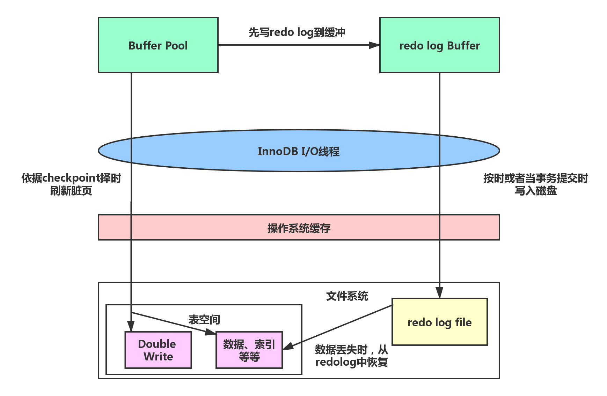
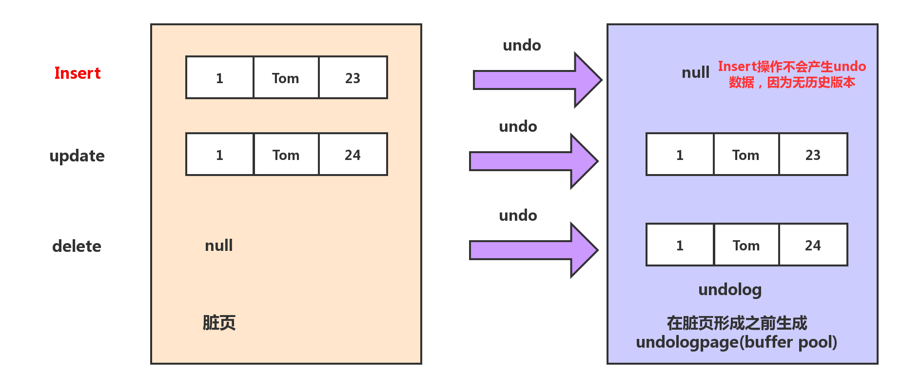
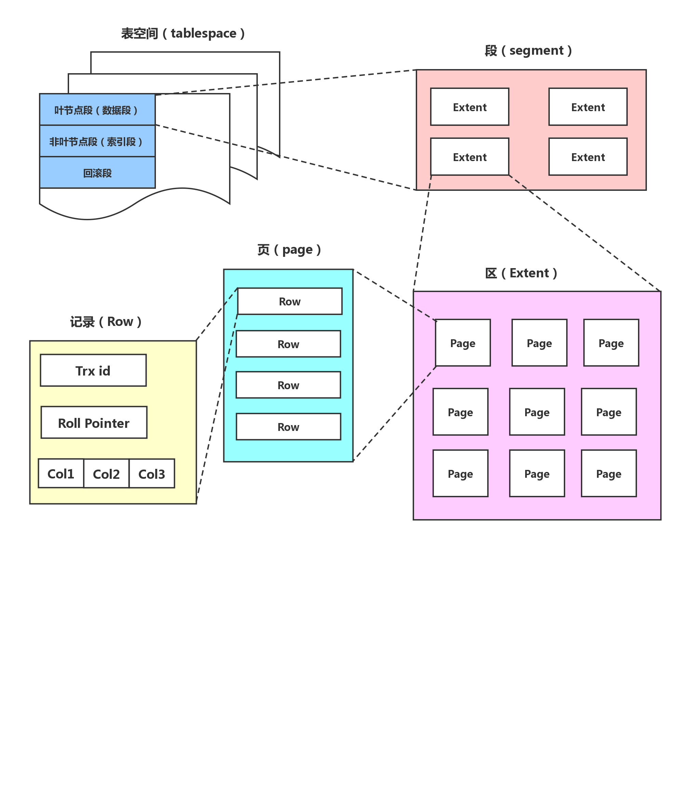
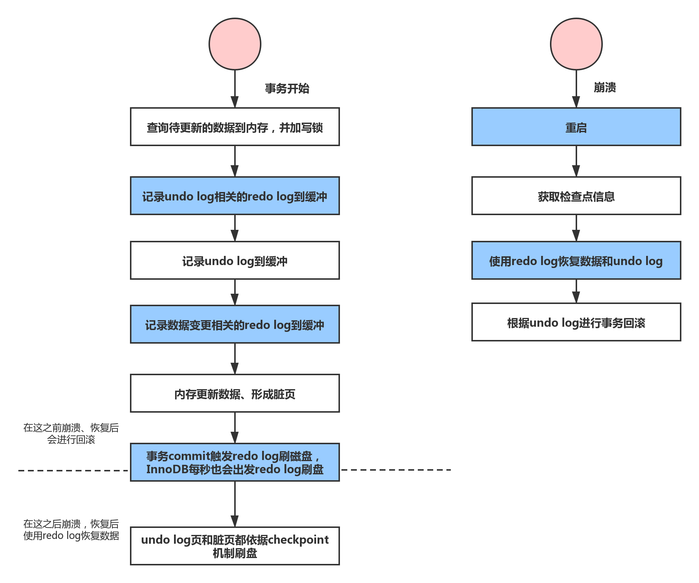
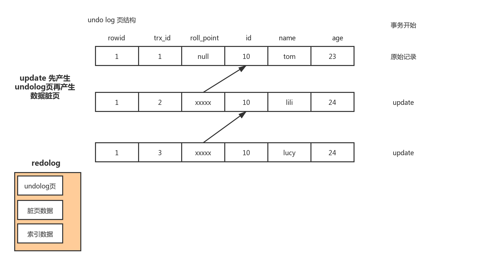

# InnoDB的事务分析

数据库事务具有ACID四大特性。ACID是以下4个词的缩写

- 原子性（Atomicity）:事务最小工作单元，要么全部成功，要么全部失败。
- 一致性（Consistency）：事务开始和结束后，数据库的完整性不会被破坏。
- 隔离性（Isolation）：不同事务之间互不影响，四种隔离级别为RU(读未提交)、RC（读已提交）、RR(可重复度)、SERIALIZABLE(串行化)。
- 持久性（durability）：事务提交后，对数据的修改是永久性的，即使系统故障也不会丢失。

**总结来说，事务的隔离性由多版本控制机制和锁实现，而原子性、一致性和持久性通过InnoDB的redo log、undo log 和Force log at commit机制来实现**

## 原子性，持久性和一致性

**原子性，持久性和一致性主要是通过redo log、undo log和Force log at commit机制来完成的。redo log用于在崩溃时恢复数据，undo log用于对事务的影响进行撤销，也可以用于多版本控制。而Force log at commit机制保证事务提交后redo log日志都已经持久化。**

### RedoLog

数据库日志和数据落盘机制，如下图所示：

redo log写入磁盘时，必须进行一次操作系统的fsync操作，防止redo log知识写了操作系统的磁盘缓存中。参数innodb_flush_log_at_trx_commit可以控制redo log日志刷新到磁盘的策略。

### UndoLog

**数据库崩溃重启后需要从redo log中把未落盘的脏页数据恢复出来，重新写入磁盘，保证用户的数据不丢失。当然，在崩溃恢复中还需要回滚没有提交的事务。由于回滚操作需要undo日志的支持，undo日志的完整性和可靠性需要redo日志来保证，所以崩溃恢复先做redo恢复数据，然后做undo回滚**

在事务执行的过程中，除了记录redo log，还会记录一定量的undo log。undo log记录了数据在每个操作前的状态，如果事务执行过程中需要回滚，就可以根据undo log进行回滚操作。

数据和回滚日志的逻辑存储结构

| rowid | trxid  | Roll Pointer                 | id   | name |
| ----- | ------ | ---------------------------- | ---- | ---- |
| 行id  | 事务id | 回滚指针：只想上一个历史版本 | 数据 | 数据 |

undo log的存储不同于redo log，它存放在数据库内部的一个特殊的段（segment）中，这个段称为回滚段。回滚段位于共享表空间中。undo段中的以undo page为更小组织单位。**undo page和存储数据库数据和索引页类似。因为redo log是物理日志，记录的是数据库页的物理修改操作。所以undolog（也看成数据库数据）的写入也会产生redolog，也就是undo log的产生会伴随着redo log的产生，着是因为undo log也需要持久性的保护。**如上图所示，表空间中有回滚段和页节点段和非页节点段，而三者都有对应的页结构。

总结一下数据库事务的整个流程，如下图所示：

事务进行过程中，commit之后系统崩溃（未刷盘）用redolog恢复数据

commit之前崩溃，用redolog里的undolog进行回滚，commit后，redolog会区分出来已经提交的undolog，只要redolog里有未提交的undolog，会根据undolog进行回滚

undolog的完整性是靠redolog保证的

## 隔离性

### 事务并发问题

在事务的并发操作中可能会出现一些问题：

- **丢失更新：**两个事务针对同一数据都发生修改操作时，会存在丢失更新的问题。
- **脏读：**一个事务读取到另一个事务未提交的数据。
- **不可重复读：**一个事务因读取到另一个事务已提交的update或者delete数据。导致对同一条记录读取两次以上的结果不一致。
- **幻读：**一个事务因读取到另一个事务已提交的Insert数据。导致对同一张表读取两次以上的结果不一致。

### 事务隔离级别

- 四种隔离级别

1. **Read uncommitted(读未提交)：**最低级别，任何情况都无法保证。

2. **Read commited(RC,读已提交)：**可避免脏读的发生。

3. **Repeatable read(RR,可重复读)：**可避免脏读、不可重复读的发生。

   **（注意事项：InnoDB的RR还可以解决幻读，主要原因是Next-Key（Gap）锁，只有RR才能使用Next-key锁）**

4. **Serializable（串行化）：**可避免脏读、不可重复读、幻读的发生。

   **（由MVCC降级为Locking-Base CC）**

### InnoDB的MVCC实现

wiki上对MVCC的定义：

> Multiversion concurrency control (MCC or MVCC), is a concurrency control method commonly used by database management systems to provide concurrent access to the database and in programming languages to implement transactional memory.

#### 当前读和快照读 

在MVCC并发控制中，读操作可以分为两类，**快照读**（snapshot read）与**当前读**（current read）。

> -快照读，读取的是记录的可见版本（有可能是历史版本），不用加锁。（select）
>
> -当前读，读取的是记录的最新版本，并且当前读返回的记录，都会加锁，保证其他事物不会再并发修改这条记录。

在一个支持MVCC并发控制的系统中，那些读操作是快照读？那些操作又是当前读呢？

以MySQL InnoDB为例：

**快照读：**简单的select操作，属于快照读，不加锁，读历史版本。

**当前读：**特殊的读操作，insert/update/delete操作以及select... for update select ... lock in share mode，属于当前读，需要加锁。

#### 非锁定读

一致性非锁定读（consistent nonlocking read）是指InnoDB存储引擎通过多版本控制（MVCC）读取当前数据库中行数据的方式。

如果读取的行正在执行DELETE或UPDATEcaozuo ,这时读取操作不会因此去等待行上的锁释放，相反的，InnoDB会去读取行的一个最新的可见版本快照。

由undolog实现，undolog的作用：

回滚

让mvcc读历史版本

