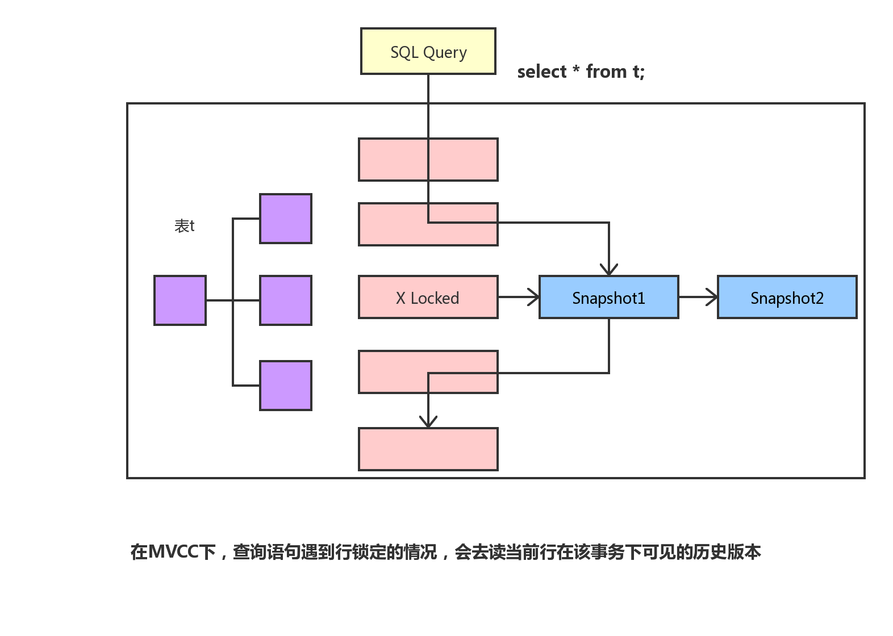
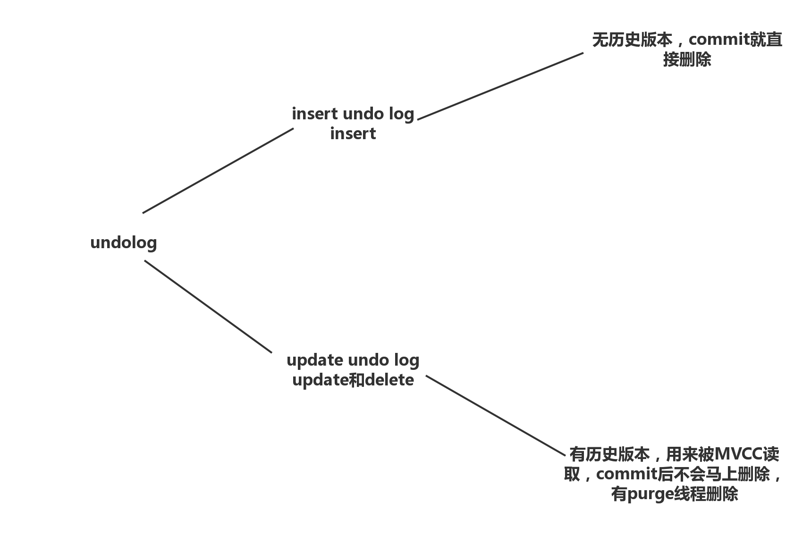
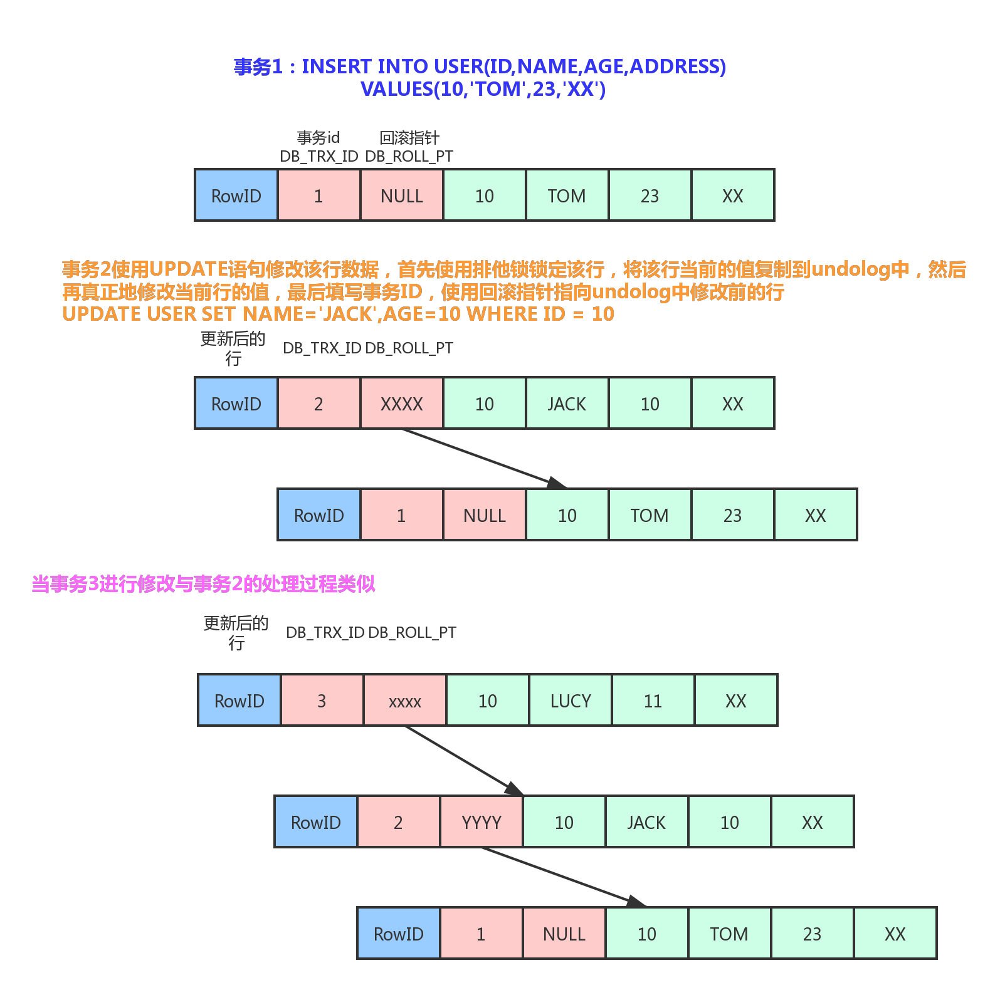

# InnoDB的事务分析


数据库事务具有ACID四大特性。ACID是以下4个词的缩写

- 原子性（Atomicity）:事务最小工作单元，要么全部成功，要么全部失败。
- 一致性（Consistency）：事务开始和结束后，数据库的完整性不会被破坏。
- 隔离性（Isolation）：不同事务之间互不影响，四种隔离级别为RU(读未提交)、RC（读已提交）、RR(可重复度)、SERIALIZABLE(串行化)。
- 持久性（durability）：事务提交后，对数据的修改是永久性的，即使系统故障也不会丢失。

**总结来说，事务的隔离性由多版本控制机制和锁实现，而原子性、一致性和持久性通过InnoDB的redo log、undo log 和Force log at commit机制来实现**

## 原子性，持久性和一致性

**原子性，持久性和一致性主要是通过redo log、undo log和Force log at commit机制来完成的。redo log用于在崩溃时恢复数据，undo log用于对事务的影响进行撤销，也可以用于多版本控制。而Force log at commit机制保证事务提交后redo log日志都已经持久化。**

### RedoLog

数据库日志和数据落盘机制，如下图所示：


redo log写入磁盘时，必须进行一次操作系统的fsync操作，防止redo log知识写了操作系统的磁盘缓存中。参数innodb_flush_log_at_trx_commit可以控制redo log日志刷新到磁盘的策略。

### UndoLog

**数据库崩溃重启后需要从redo log中把未落盘的脏页数据恢复出来，重新写入磁盘，保证用户的数据不丢失。当然，在崩溃恢复中还需要回滚没有提交的事务。由于回滚操作需要undo日志的支持，undo日志的完整性和可靠性需要redo日志来保证，所以崩溃恢复先做redo恢复数据，然后做undo回滚**


在事务执行的过程中，除了记录redo log，还会记录一定量的undo log。undo log记录了数据在每个操作前的状态，如果事务执行过程中需要回滚，就可以根据undo log进行回滚操作。


数据和回滚日志的逻辑存储结构

| rowid | trxid  | Roll Pointer                 | id   | name |
| ----- | ------ | ---------------------------- | ---- | ---- |
| 行id  | 事务id | 回滚指针：只想上一个历史版本 | 数据 | 数据 |

undo log的存储不同于redo log，它存放在数据库内部的一个特殊的段（segment）中，这个段称为**回滚段**。回滚段位于共享表空间中。undo段中的以undo page为更小组织单位。**undo page和存储数据库数据和索引页类似。因为redo log是物理日志，记录的是数据库页的物理修改操作。所以undolog（也看成数据库数据）的写入也会产生redolog，也就是undo log的产生会伴随着redo log的产生，着是因为undo log也需要持久性的保护。**如上图所示，表空间中有回滚段和页节点段和非页节点段，而三者都有对应的页结构。

总结一下数据库事务的整个流程，如下图所示：


<font color='red'>**事务进行过程中，commit之后系统崩溃（未刷盘）用redolog恢复数据**</font>

<font color='red'>**commit之前崩溃，用redolog里的undolog进行回滚，commit后，redolog会区分出来已经提交的undolog，只要redolog里有未提交的undolog，会根据undolog进行回滚**</font>

<font color='red'>**undolog的完整性是靠redolog保证的**</font>


## 隔离性

### 事务并发问题

在事务的并发操作中可能会出现一些问题：

- **丢失更新：**两个事务针对同一数据都发生修改操作时，会存在丢失更新的问题。
- **脏读：**一个事务读取到另一个事务未提交的数据。
- **不可重复读：**一个事务因读取到另一个事务已提交的update或者delete数据。导致对同一条记录读取两次以上的结果不一致。
- **幻读：**一个事务因读取到另一个事务已提交的Insert数据。导致对同一张表读取两次以上的结果不一致。

### 事务隔离级别

- 四种隔离级别

1. **Read uncommitted(读未提交)：**最低级别，任何情况都无法保证。

2. **Read commited(RC,读已提交)：**可避免脏读的发生。

3. **Repeatable read(RR,可重复读)：**可避免脏读、不可重复读的发生。

   **（注意事项：InnoDB的RR还可以解决幻读，主要原因是Next-Key（Gap）锁，只有RR才能使用Next-key锁）**

4. **Serializable（串行化）：**可避免脏读、不可重复读、幻读的发生。

   **（由MVCC降级为Locking-Base CC）**

### InnoDB的MVCC实现

wiki上对MVCC的定义：

> Multiversion concurrency control (MCC or MVCC), is a concurrency control method commonly used by database management systems to provide concurrent access to the database and in programming languages to implement transactional memory.

#### 当前读和快照读 

在MVCC并发控制中，读操作可以分为两类，**快照读**（snapshot read）与**当前读**（current read）。

> -快照读，读取的是记录的可见版本（有可能是历史版本），不用加锁。（select）
>
> -当前读，读取的是记录的最新版本，并且当前读返回的记录，都会加锁，保证其他事物不会再并发修改这条记录。

在一个支持MVCC并发控制的系统中，那些读操作是快照读？那些操作又是当前读呢？

以MySQL InnoDB为例：

**快照读：**简单的select操作，属于快照读，不加锁，读历史版本。

**当前读：**特殊的读操作，insert/update/delete操作以及select... for update select ... lock in share mode，属于当前读，需要加锁。

#### 非锁定读

一致性非锁定读（consistent nonlocking read）是指InnoDB存储引擎通过多版本控制（MVCC）读取当前数据库中行数据的方式。

如果读取的行正在执行DELETE或UPDATEcaozuo ,这时读取操作不会因此去等待行上的锁释放，相反的，InnoDB会去读取行的一个最新的可见版本快照。

由undolog实现，undolog的作用：

回滚

让mvcc读历史版本



MVCC在MySQL中的实现依赖的是**undo log与read view**

#### undoLog

**InnoDB的行记录有三个隐藏字段：分别对应该行的rowid、事务号db_trx_id和回滚指针db_roll_ptr，其中db_trx_id表示最近修改的事务ID，db_roll_ptr指向回滚段中的undo log**

根据行为的不同，undo log分为两种：insert undo log 和update undolog

insert undo log：是在insert操作中产生的undo log。因为insert操作的记录支队事务本身可见，rollback在该事务中直接删除，不需要purge操作（purge Thread）

update undo log：是update或delete操作中产生的undo log，因为会对已经存在的记录产生影响，roll back MVCC机制会找他的历史版本进行恢复。为了提供MVCC读机制，因此update undo log不能在事务提交时就进行删除，而是将事务提交时放到history list上，等待purge线程进行最后的删除操作。





#### 事务链表

MySQL中的事务在开始到提交这段过程中，都会被保存到一个叫trx_sys的事务链表中，这是一个基本的链表结构：

ct-trx ----> trx11 ----> trx 9 ------->trx6 -------->trx5 ------->trx3;

事务链表中rtttttttt

RR隔离级别下，在每个事务开始的时候，会将当前系统中的所有的活跃事务拷贝到一个列表中（read view）

RC隔离级别下，在每个语句开始的时候，会将当前系统中所有的活跃事务拷贝到一个列表中（read view）

show engine innodb status,就能够看到事务列表。

#### ReadView

当前事务（读）能读哪个历史版本？

ReadView是事务开启时当前所有事务的一个集合，这个类存储了当前Read View中最大的事务ID及最小的事务ID。

当前活跃的事务列表

ct-trx ----> trx11 ----> trx 9 ------->trx6 -------->trx5 ------->trx3;

ct-trx 表示当前事务的id，对应上面的read view数据结构如下，

```mysql
read_view->creator_trx_id = ct-trx;
read_view->up_limit_id = trx3; 低水位
read_view->low_limit_id = trx11; 高水位
read_view->trx_ids = [trx11, trx9, trx6, trx5, trx3];
```

low_limit_id是“高水位”，即当时活跃事务的最大id，如果读到row的db_trx_id >= low_limit_id，说明这些id在此之前（在当前事务开起前）的数据都没有提交，这些数据都不可见。

```mysql
if (trx_id >= view->low_limit_id) {
	return(FALSE);
}
注：readview 部分源码
```

up_limit_id是“低水位”，即当活跃事务列表的最小事务id，如果row的db_trx_id<up_limit_id说明这些数据在事务创建的id时都已经提交，如注释中的描述，这些数据均可见。

```mysql
if (trx_id < view->up_limit_id) {
	return(TRUE);
}
```

row的db_trx_id在low_limit_id和up_limit_id之间，则查找该记录的db_trx_id是否在自己事务的read_view->trx_ids列表中，如果在则记录的当前版本不可见，否则该记录的当前版本可见。


# 记于2020年2月15日

经过复习和思考，又对MVCC（多版本并发控制）有了新的理解，建立在已知的知识上（省略上面的内容），得出以下结论：

## RR-read repeted

在RR并发级别下，每隔事务或每个查询在开始之前都会为自己建立一个事务列表，该事务列表记录了当前所有的活跃事务（未提交、未回滚）。MySQL的事务ID是由开启顺序由小到大的，者一点很重要。对于该事务或该查询而言，读取一条记录的时候，会去看这条记录的修改事务ID（上面提到了，每条记录都有三个隐藏字段，这里不作详细解释）。

情况一：若该修改事务ID小于事务列表里的最小的事务ID（不在事务列表内），说明这条记录的修改操作在当前事务开启前/本次查询开始前，已经提交了，所以这条记录对该事务/查询是可见的。

情况二：若该修改事务ID大于事务列表里的最大事务ID（不在该事务列表内），说明这条记录的修改操作发生在本次事务开启/本条查询开始后，所有这条记录对当前事务而言是不可见了。

情况三：若该修改事务ID大于最小事务ID小于最大事务ID，则需要判断，该修改事务是否在事务列表内，若在，则记录对当前事务不可见，若不在，则可见（事务ID的大小顺序很重要，若不在，说明该事务在当前事务开启前已经结束，若在，说明在当前事务开启前未结束，所以不可见 ）。


## RC-read commited

RC和RR的区别是，RC的事务列表是共享的，是全局的，所以，当前事务开启后，事务列表会随着事务的活跃而改变，进进出出，所以只要提交了，所以，判断方法是，只要读取到的记录的修改ID不在事务列表中，均可读取。

所以，RC为读已提交。