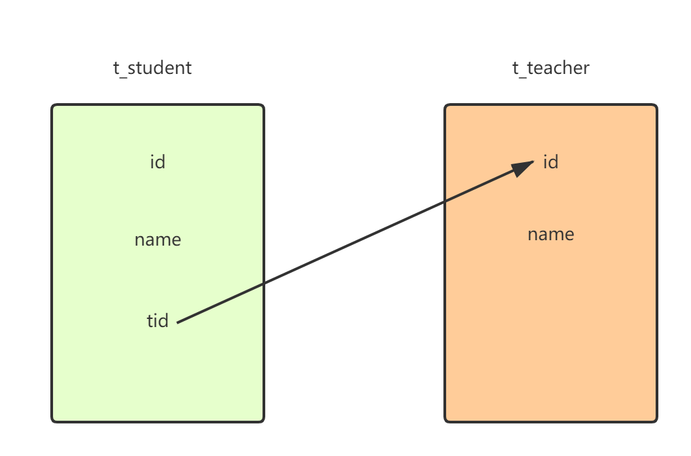

# MySQL外键约束


MySQL 外键约束（FOREIGN KEY）用来在两个表的数据之间建立链接，它可以是一列或多列。一个表可以有一个或多个外键。

外键对应的是参照完整性，一个表的外键可以为空值，若不为空值，则每一个外键的值必须等于另一个表中主键的某个值。

外键是表的一个字段，不是本表的主键，但会自动为外键建立索引，对应另一个表的索引列（非索引列不能建外键）。定义外键后，不允许删除另一个表中具有关联关系的行。

<font color='red'>外键的主要作用是保持数据的一致性、完整性</font>。例如，部门表 tb_dept 的主键是 id，在员工表 tb_emp5 中有一个键 deptId 与这个 id 关联。

- 主表（父表）：对于两个具有关联关系的表而言，相关联字段所在的表就是主表。

- 从表（子表）：对于两个具有关联关系的表而言，相关联字段中外键所在的表就是从表。

数据库不会对外键的唯一性做约束，普通索引也可以建立外键，但是在实际业务中，建立外键的列最好是主键或者是唯一性索引。





# 测试

```sql
--建表
create table test_teacher(
id int PRIMARY key auto_increment,
name varchar(255)
);
--插入数据
insert into test_teacher(name) values('spring');
insert into test_teacher(name) values('mybatis');
insert into test_teacher(name) values('springmvc');
```

## 非索引外键（失败）

此时test_teacher的name字段不是索引，新建学生表，并设置索引

```sql
create table test_student(
id int PRIMARY key auto_increment,
name varchar(255),
TNAME VARCHAR(255),
FOREIGN KEY (TNAME) REFERENCES test_teacher(name)
);
--失败
```

## 普通索引（成功）

```sql
CREATE  INDEX name_index ON test_teacher(name) ;
--
create table test_student(
id int PRIMARY key auto_increment,
name varchar(255),
TNAME VARCHAR(255),
FOREIGN KEY (TNAME) REFERENCES test_teacher(name)
);
--成功
```

### 对学生表插入数据，外键列为空

**若教师表中的对应字段有空值，则成功，反之则失败**

**外键列的字段值在对应表中应该存在，否则插入失败，可重复**

### 删除教师表中与学生表外键有关联的记录，删除失败


