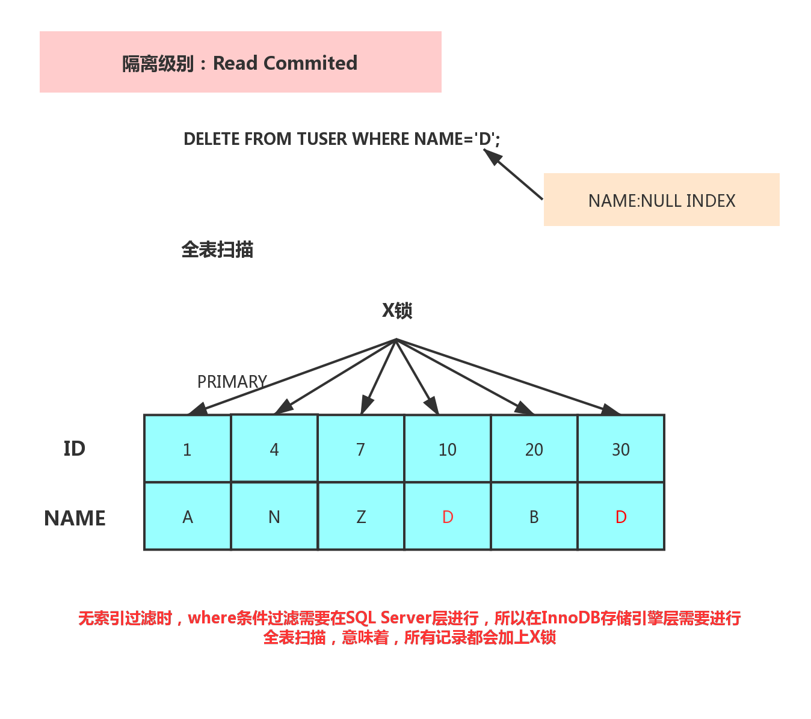
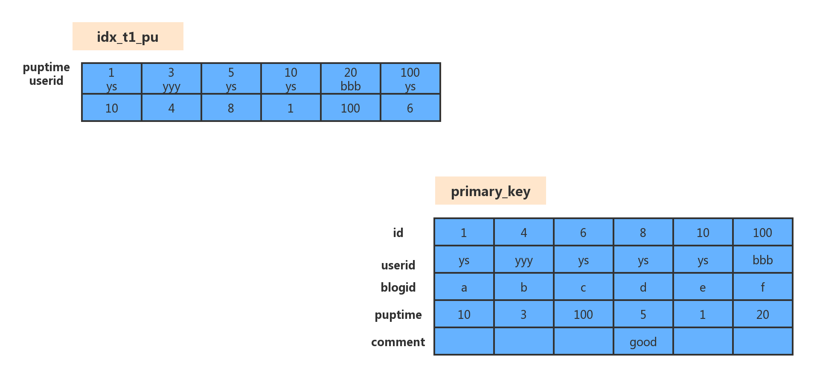

# 行锁原理分析

## 谈锁的前提

1. **where列是不是索引？**
2. **当前系统的隔离级别是什么？**

## 简单SQL的加锁分析

RC隔离级别下

### ID主键+RC

这个组合，是最简单，最容易分析的组合。id是主键，Read Committed隔离级别，给定SQL：delete from t1 where id = 10;只需要将主键上id=10的记录加上X锁即可。如下图所示：


### 唯一索引+RC

这个组合，where条件用name，name是一个Unique的二级索引键值。那么在RC隔离级别下，需要加什么锁呢？见下图

```mysql
delete from tuser where id = 10;
```


### 非唯一索引+RC


### 无索引+RC



### RR隔离级别

与RC类似，只是多了GAP锁

### SERIALIZABLE隔离级别

只要有sql就会加锁，而且无索引就是表锁

## 复杂SQL的加锁分析

```mysql
delete from t1 where puptime > 1 and puptime < 20 and userid='ys' and comment is not null;
#TABLE t1(id primary key,userid,blogid,puptime,comment)
#组合索引 idx_t1_pu(puptime,userid)
```

索引图示：



上面的SQL会加什么锁？假定在Repeatable Read隔离级别下

在详细分析这条SQL的加锁情况前，还需要有一个只是储备，那就是一个SQL中的where条件如何拆分

- **Index key**:puptime >1 and puptime  < 20 。此条件，用于确定SQL在id_t1_pu索引上的查询范围。
- **Index Filter**: userid = 'ys'。此条件，可以在idx_t1_pu索引上进行过滤，但不属于Index Key。
- **Table Filter**:comment is not null。此条件，在idx_t1_pu索引上无法过滤，只能在聚簇索引上过滤。

上面的SQL


