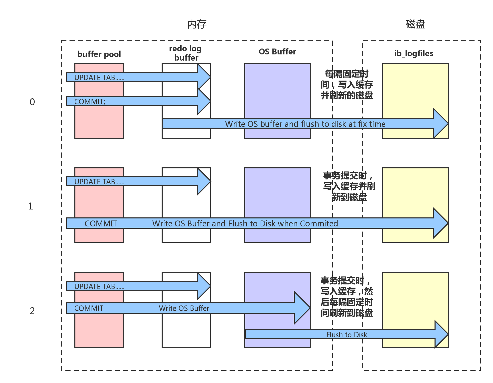
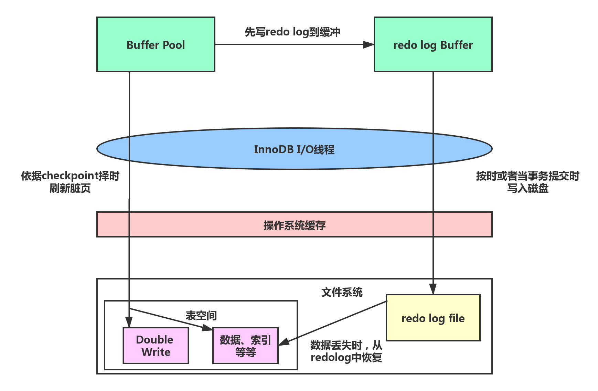
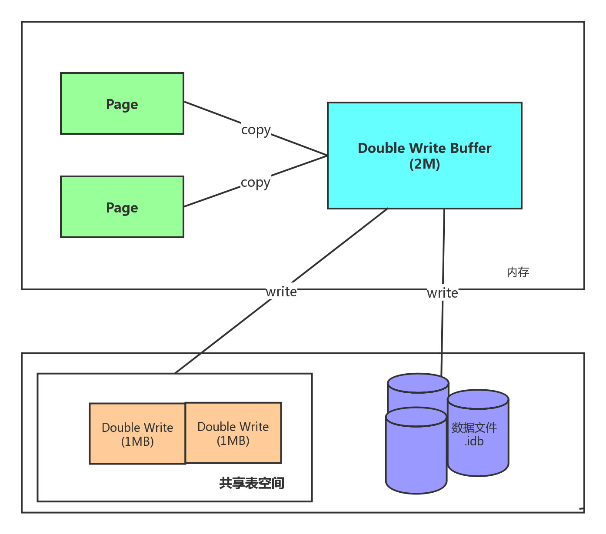
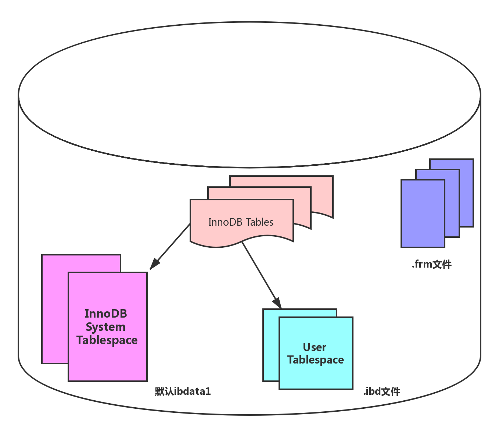

# 事务

## 事务介绍

在MySQL中的事务是由**存储引擎**实现的，而且支持事务的存储引擎不多，这里主要介绍InnoDB存储引擎中的事务。

事务处理可以用维护数据的完整性，保证成批的SQL语句要么全部执行，要么全部不执行。

事务用来管理DDL、DML、DCL操作，比如insert update delete语句，默认是自动提交。

注：

- **DDL：Data Definition Language**
- **DML：Data Manipulation Language**
- **DCL：Data Control Language**

## 事务的四大特性（ACID）

1. Atomicity(原子性):构成事务的所有操作必须使一个逻辑单元，要么全部执行，要么全部不执行。

2. Consistency(一致性):数据库在事务执行前后状态都必须是稳定的或者是一致的。

3. **Isolation(隔离性)：事务之间不会相互影响。**

   **由锁机制和MVCC机制来实现**

   **MVCC（多版本并发控制）：优化读写性能（读不加锁，读写不冲突）**

4. Durability(持久性)：事务执行成功后必须全部写入磁盘

## 事务开启

BEGIN或start transaction；显示的开启一个事务

Commit提交事务，并使事务进行的所有修改变成永久性的。

Rollback回滚用户的事务，并撤销事务未提交的修改；

## InnoDB架构图

.png)

上图详细显示了InnoDB存储引擎的体系架构，从图中可见，InnoDB存储引擎由**内存池，后台线程和磁盘文件**三大部分。

### InnoDB内存结构

#### buffer pool缓冲池

处理数据

数据页和索引页

page是InnoDB存储的最基本结构，也是InnoDB磁盘管理的最小单位。

做增删改时，缓存里的数据也和磁盘里的数据页不一致，该数据页为脏页

插入缓冲（Insert Buffer）

自适应哈希索引（Adaptive Hash Index）

hash结构k-v

InnoDB会根据访问的频率和模式，为热点数据建立哈希索引，来提高查询效率

索信息（lock info）

行锁，表锁

数据字典信息（Data Dictionary）

元素局信息，包括表结构，数据库名或表明，字段的数据类型，视图，索引，表字段信息，存储过程，出发器等。

#### Redo log Buffer重做日志缓冲

重做日志，Redo Log如果要存储数据线存储数据的日志，一旦崩了，可以从日志找

重做日志保证了数据的可靠性，InnoDB采用了write Ahead Log(预写日志)策略，即当事务提交时，先写重做日志，然后在择时将脏页数据写入磁盘，如果发生了宕机等导致数据丢失，就通过重做日志进行数据恢复。（注：Mysql中，数据文件采用的是随机存储结构，日志文件采用的是顺序存储结构，顺序存储结构更快，但耗空间）

insert into xxxx

commit;Redo log file 写成功 则Commit；

Redo Log：ib_logfile0 ib_logfile1 默认8MB，可通过配置参数innodb_log_buffer_size控制

**Force Log at Commit**机制实现事务的持久性，即当事务提交时，必须先将该事务的所有日志写入到重做日志文件进行持久化，然后事务的提交操作才算完成。为了确保每次日志都写入到重做日志文件，在每次讲重做日志缓冲写入重做日志后，必须调用一次（fsync）操作（操作系统），将缓冲文件从文件系统缓存中写入磁盘。

InnoDB_flush_log_at_trx_commit

MySQL的默认值为1

#### 重做日志的落盘机制

可以通过innodb_flush_log_at_trx_commit来控制重做日志刷新到磁盘的策略，该参数默认值为1，表示事务提交必须进行一次fsync操作，还可以设置为0和2,。0表示事务提交时不进行写入重做日志操作，该操作只在主线程中完成。2表示提交时写入重做日志，但是只写入文件系统缓存，不进行fsync操作，由此可见设置为0时，效率最高，但是丧失了事务的一致性。

#### Double Write双写

Double Write带给InnoDB存储引擎的是数据页的可靠性

如上如所示，**Double Write由两部分组成，一部分是内存中的double write buffer，大小为2M，另一部分就是物理磁盘上共享表空间连续的128个页，大小也为2M。**在对缓冲池的脏页进行刷新时，并不直接写磁盘，而是通过memcpy函数将脏页先复制到内存中double write buffer区域，之后通过double write buffer在分两次，每次1MB顺序的写入共享表空间的物理磁盘上，然后马上调用fsync函数，同步磁盘，避免操作系统缓冲写带来的问题。在完成double write页的写入后，再将double write buffer中的页写入到各个表空间文件中。如果操作系统在写入过程中发生了崩溃，在恢复过程中，InnoDB存储引擎可以从共享表空间中的double write中找到该页的一个副本，将其复制到表空间文件中，再应用重做日志。

#### CheckPoint:检查点

检查点，表示脏页写入到磁盘的时机，所以检查点也就意味着脏数据的写入

1. checkpoint的目的

   1. 缩短数据库的恢复时间
   2. buffer pool空间不够用时，将脏页刷新到磁盘
   3. redolog不够用时，刷新脏页

2. 检查点分类

   1. sharp checkpoint

      完全检查点，数据库正常关闭时，会触发把所有的脏页都写入到磁盘

   2. fuzzy checkpoint

      正常使用时，模糊检查点，部分页写入磁盘

      - **master thread checkpoint:**以每秒或每十秒的速度从缓冲池的脏页列表中刷新一定比例的页回磁盘，这个过程是异步的。
      - **flush_lru_list_checkpoint:**读取LRU(Least Recently Used)list，找到脏页，写入磁盘，最近最少使用
      - **async/sync flush checkpoint:**  redo log file快满了，会批量的触发数据页回写，这个事件触发的时候又分为异步和同步，不可被覆盖的redolog占log file的比值：75% 异步，90% 同步，同步就是主线程直接操作。
      - **dirty page too much checkpoint:**    默认脏页占比75%的时候，就会触发刷盘，将脏页写入磁盘。

#### InnoDB磁盘文件

##### 系统表空间和用户表空间

系统表空间（共享表空间）

1. **数据字典（data dictionary）：**记录数据库相关信息
2. **doublewrite write buffer：**解决部分写失败（页断裂）
3. **insert buffer：**内存insert buffer数据，周期写入共享表空间，防止意外宕机
4. **回滚段（rollback segment）**
5. **undo空间：**undo页

用户表空间（独立表空间）

1. **每个表的数据和索引都会存在自己的表空间中**
2. **每个表的结构**
3. **undo空间：**undo页（需要设置）
4. **doublewrite write buffer**

