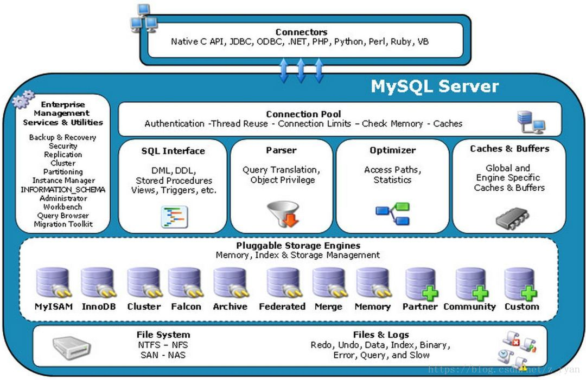
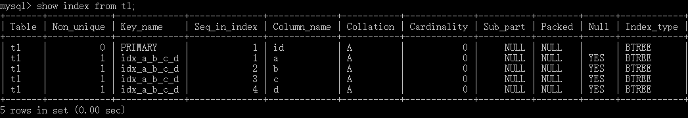

# MySQL第一天

## MySQL大厂面试题

储存引擎的InnoDB与MyISAM的区别，优缺点，使用场景？

说说MySQL的优化之道？

UndoLog和RedLog的区别和联系？

MySQL索引的数据结构是什么，及为什么要使用这种数据结构？

索引失效的场景有哪些？

什么是死锁和死锁的排查和解决？

RC和RR的实现原理及区别和使用场景？

分库分表带来的分布式困境与应对之策？

## MySQL知识图谱


## MySQL逻辑架构

### 逻辑架构图




#### 连接器（Connectors）

#### 系统管理和控制工具（Management Services & Utilities）

#### 连接池（Connection Pool）

SQL Layer MsSQL业务层

#### SQL接口（SQL Interface）

接收SQL DML DDL

#### 解析器（Parser）

词法解析：分词，形成语法树

语法解析：符合SQL的语法，形成正确语法树，语法错误在这里提示

> 词法分析：https://www.cnblogs.com/nocode/archive/2011/08/03/2126726.html
>
> 语法分析：https://www.cnblogs.com/nocode/archive/2011/08/09/2132814.html

#### 查询优化器（Optimizer）

mysql觉得你写的SQL不是完美的

优化内容：

多表关联，小表驱动大表

where从左到右，MYSQL找过滤力度最大的先执行

where sex='男' and id = 1

where id = 1 and sex='男'

explain

oracle 从右到左

#### 查询缓存

把查询结果存起来

select *from tuser where id = 1

MAP

key	sql hash后的值

value	查询结果

存在问题：

​	sql有变化，会缓存多份

​    数据有变化，清除缓存

#### 储存引擎

以表为单位

create table XXXX() engine=InnoDB/Memory/MyISAM

MySQL的存储引擎是针对表进行指定的。

| 存储引擎   | 说明                                                         |
| ---------- | ------------------------------------------------------------ |
| **MyISAM** | 高速引擎，拥有较高的插入，查询速度，**但不支持事务、不支持行锁**、支持3中不同的存储格式。包括静态型、动态型和压缩型 |
| **InnoDB** | **5.5版本后MySQL的默认存储引擎，支持事务和行级锁定，事务处理、回滚、崩溃修复能力和多版本并发控制的事务安全**，比MyISAM处理速度稍慢，支持**外键（FOREIGN KEY）** |
| MEMORY     | **内存存储引擎，拥有极高的插入、更新和查询效率。但是会占用和数据量成正比**的内存空间。只在内存上保存数据，意味着数据可能会丢失。 |

xtraDB储存引擎是由Percona公司提供的存储引擎，该公司还出品了Percona Server这个产品，它是基于MySQL开源代码进行修改之后的产品。

阿里对于Percona Server服务器进行修改，衍生了自己的数据库（alisql）

- InnoDB和MyISAM存储引擎的区别


|              | InnoDB                                     | MyISAM                                               |
| ------------ | :----------------------------------------- | ---------------------------------------------------- |
| **存储文件** | .frm表定义文件<br />.ibd数据文件和索引文件 | .frm表定义文件<br />.myd数据文件<br />.myi索引为文件 |
| **锁**       | 表锁，行锁                                 | 表锁                                                 |
| **事务**     | 支持                                       | 不支持                                               |
| **CRUD**     | 读、写                                     | 读多                                                 |
| **count**    | 扫表                                       | 专门存储的地方（加where也扫表）                      |
| **索引结构** | B+Tree                                     | B+Tree                                               |
| **外键**     | 支持                                       | 不支持                                               |

存储引擎的选型：

**InnoDB：**支持事务处理，支持外键，支持崩溃修复能力和并发控制。如果需要**对事务的完整性要求比**
**较高**（比如银行），**要求实现并发控制**（比如售票），那选择InnoDB有很大的优势。如果需要**频繁的
更新、删除**操作的数据库，也可以选择InnoDB，因为支持事务的提交（commit）和回滚
（rollback）。

**MyISAM:**插入数据快，空间和内存使用比较低。如果表主要是**用于插入新记录和读出记录**，那么选择
MyISAM能实现处理高效率。如果应用的完整性、并发性要求比 较低，也可以使用。

**MEMORY:**所有的数据都在内存中，数据的处理速度快，但是安全性不高。如果需要**很快的读写速度**，
对数据的安全性要求较低，不需要持久保存，可以选择MEMOEY。它对表的大小有要求，不能建立太大的表。所以，这类数据库只使用在相对较小的数据库表。

同一个数据库也可以使用多种存储引擎的表，如果一个表要求比较高的事务处理，可以选择InnoDB。这个数据库中可以将查询要求比较高的表选择MyISAM存储。如果数据库需要一个用于查询的临时表，可以选择MEMORY存储引擎。

### 简版执行流程


### 详细执行流程图


## 物理结构

- MySQL是通过文件系统对数据和索引进行存储的。
- MySQL的物理结果可以分为日志文件和数据索引文件。
- MySQL在Linux中的数据索引文件和日志文件都在/var/lib/mysql目录下
- 日志文件采用顺序IO方式存储，数据文件采用随机IO方式存储
  - 顺序IO记录首地址和偏移量
    - 优势：记录速度快
    - 劣势：只能追加，浪费空间
    - 适合：日志
  - 随机IO记录的是地址
    - 优势：省空间
    - 劣势：相对慢
    - 适合：数据+索引


# MySQL索引篇

## 索引介绍

### 索引是什么

官方介绍索引是帮助Mysql**高效获取数据的数据结构**。更通俗的讲：数据库索引就好比是一本书的目录，能**加快数据库的查询速度**

### 索引的优势和劣势

**优势：**

**可以提高数据检索的效率，降低数据库的IO成本**，类似于书的目录。

通过**索引对数据进行排序**，降低数据排序的成本，降低了CPU的消耗。

**劣势**：

索引会占用磁盘空间

索引虽然会提高查询效率，但是会降低更新表的效率。比如每次对表进行增删改操作，Mysql不仅要保存数据，还要保存或者更新对应的索引文件

### 索引的使用

#### 创建索引

- 单列索引之普通索引

```mysql
CREATE INDEX index_name ON table(column(length)) ;
ALTER TABLE table_name ADD INDEX index_name (column(length)) ;
```

- 单列索引之唯一索引

```mysql
CREATE UNIQUE INDEX index_name ON table(column(length)) ;
alter table table_name add unique index index_name(column);
```

- 单列索引之全文索引

```mysql
CREATE FULLTEXT INDEX index_name ON table(column(length)) ;
alter table table_name add fulltext index_name(column);
```

- 组合索引

```mysql
ALTER TABLE article ADD INDEX index_titme_time (title(50),time(10)) ;
```

#### 删除索引

```mysql
DROP INDEX index_name ON table
```

#### 查看索引

```mysql
SHOW INDEX FROM table_name
```

### 索引原理分析

#### 索引的储存结构

索引是在**存储引擎中实现的**，也就是说不通的存储引擎，会使用不同的索引。

**MyISAM和InnoDB存储引擎：只支持B+Tree索引**

MEMORY/HEAP存储引擎：支持HASHhe BTREE索引

#### B树和B+树

数据结构实例网站

> https://www.cs.usfca.edu/~galles/visualization/Algorithms.html

- B树的高度一般都是在2-4这个高度，树的高度直接影响IO读写的次数


- 如果是三层树结构---支撑的数据可以达到20G，如果是四层树结构---支撑的数据可以达到几十T

  B和B+树的最大区别在于非叶子节点是否存储数据的问题

  B树是非叶子节点和叶子节点都会存储数据

  B+树只有叶子节点才会存储数据，而且这些数据都是有指针指向的，也就是有顺序的


### 非聚集索引（MyISAM）

#### 主键索引

叶子节点上存的是：地址


#### 辅助索引（次要索引）

辅助索引和主键索引类似,叶子节点上存的是：地址

主键索引和非主键索引不是同一棵树，操作数据时，都会去更新索引树

### 聚集索引（InnoDB）

#### 主键索引

数据挂载在叶子节点上


#### 辅助索引（次要索引）

叶子节点上存的是主键


如果是非主键索引查询，则需要搜索两次索引树（一次辅助索引，一次主键索引），最终取出来数据

```sql
select * from t where id = 15;
--只找一次索引树（主键索引）
select * from t where name = 'Tom';
--回表（从辅助索引树上找到主键后在主键索引树下找到数据）
select name from t where name = 'Tom';
--不回表，直接返回
select id,name from t where name = 'Tom';
--不回表
```

组合索引可以解决回表的问题


利用组合索引完成覆盖索引（利用组合索引完成在辅助索引树的便利，不回表）

如果字段比较少，可以在辅助索引上加组合索引，这样一棵树就能全部查出来，如果字段较多，回表就回表吧，这个需要综合考虑,分析业务场景
综上所述，sql语句最好是不用select * 

## 索引使用场景

### 那些情况下需要使用索引

1. 主键自动建立唯一索引
2. 频繁作为查询条件的字段应该创建索引
3. 多表关联查询中，关联字段应该创建索引on两边都要创建索引
4. 查询中排序的字段，应该创建索引B+Tree有顺序
5. 覆盖索引 不需要回表 组合索引
6. 统计或者分组字段，应该创建索引

### 那些情况不需要创建索引

1. 表记录太少，索引是要有存储的开销
2. 频繁更新，索引需要维护
3. 查询字段使用频率不高

### 组合索引

由多个字段组成的索引，使用顺序就是创建的顺序

```mysql
ALTER TABLE 'table_name' ADD INDEX index_name(col1,col2,col3);
```


在一颗索引树上有多个字段

**优势：**效率高、省空间、容易形成覆盖索引

#### 使用

遵循最左前缀原则

**前缀索引：**like 常量% 使用索引 like %常量 不适用索引

**最左前缀：**从左向右匹配知道遇到范围查询><between 索引失效

```mysql
create table t1(id int primary key,a int,b int,c int,d int);
desc t1;
+-------+---------+------+-----+---------+-------+
| Field | Type    | Null | Key | Default | Extra |
+-------+---------+------+-----+---------+-------+
| id    | int(11) | NO   | PRI | NULL    |       |
| a     | int(11) | YES  |     | NULL    |       |
| b     | int(11) | YES  |     | NULL    |       |
| c     | int(11) | YES  |     | NULL    |       |
| d     | int(11) | YES  |     | NULL    |       |
+-------+---------+------+-----+---------+-------+
alter table t1 add index idx_a_b_c_d(a,b,c,d);
show index from t1;
```




```mysql
explain select *from t1 where a=1 and b=1 and c=1 and d=1;
```


## 索引失效

### 查看执行计划

#### 参数说明

explain出来的信息有10列，分别是

> id	select_type	table	type	possible_keys	key	key_len	ref	rows	Extra

案例表

```sql
--用户表
create table tuser(
id int primary key,
loginname varchar(100),
name varchar(100),
age int,
sex char(1),
dep int,
address varchar(100)
);
--部门表
create table tdep(
id int primary key,
name varchar(100)
);
--地址表
create table taddr(
id int primary key,
addr varchar(100)
);
--创建普通索引
mysql> alter table tuser add index idx_dep(dep);
--创建唯一索引
mysql> alter table tuser add unique index idx_loginname(loginname);
--创建组合索引
mysql> alter table tuser add index idx_name_age_sex(name,age,sex);
--创建全文索引
mysql> alter table taddr add fulltext ft_addr(addr);
```

##### id

- 每个select语句都会自动分配的一个唯一标识符。
- 表示查询中操作表的顺序，有三种情况
  - id相同：执行顺序由上到下
  - id不同：如果是子查询，id号回自增，**id越大，优先级越高**
  - id相同的不同的同时存在
- id列为null的就表示这是一个结果集，不需要使用它来进行查询

##### select_type(重要)

**查询类型**，主要用于区别**普通查询、联合查询、子查询等复杂查询**

###### simple

表示不需要union操作或者不包含子查询的简单select查询。有连接查询时，外层的查询为simple，且只有一个


###### primary

一个需要union操作或者含有子查询的select，位于最外层的单位查询的select_type即为primary，且只有一个


###### subquery

除了from子句中包含的子查询外，其他地方出现的子查询都可能是subquery


###### dependent subquery

与dependent union类似，表示这个subquery的查询要受到外部表查询的影响


###### union

union连接的两个select查询，第一个查询时PRIMARY，除了第一个外，其他都是union


###### dependent union

与union一样，出现在union或union all语句中，但是这个查询要受到外部查询的影响


###### union result

包含union的结果集，在union和union all语句中，因为它不需要参与查询，所以id字段为null

###### derived

from中出现的子查询，也叫做派生表，其他数据库中可能叫做内联视图或嵌套select

##### table

显示的查询表名，如果查询使用了别名，那么这里显示的是别名

如果不涉及对数据表的操作，这里应该是null

如果显示为尖括号括起来的就表示这个是临时表，后边的N就是执行计划中的ID，表示结果来自于这个查询产生

如果是尖括号括起来的<union ,M,N>也是临时表，表示这个结果来自于union查询的id为M,N的结果集

##### type(重要)

- 依次从好到差


> system	const 	eq_ref	 ref 	fulltext	ref_or_null	unique_subquery	index_subquery	range	index_merge	index	ALL 

**除了all之外，其他的type都可以使用到索引，除了index_merge之外，其他的type只可以用到一个索引**

优化器会选用最优索引

- **注意事项**

> 最少要索引使用到range级别

###### system

表中只有一行数据或者是空表,mysql5.7没事测试出来，不重要

###### const（重要）

使用**唯一索引或者主键**，返回记录一定是1行记录的等值where条件时，通常type是const。其他数据库也叫唯一索引扫描


###### eq_ref(重要)

关键字：连接字段**主键或唯一性索引**

此类型通常出现在多表的join查询，表示对于前表的每一个结果，**都只能匹配到后表的一行结果**，并且查询的比较操作通常是‘=’查询效率较高


###### ref(重要)

**针对非唯一性索引**，使用**等值（=）查询非主键**，或者使用了**最左前缀规则索引的查询**

- 非唯一索引

  ```mysql
  #非唯一索引
  explain select * from tuser where dep='1';
  ```


- 等值非主键连接

  ```mysql
  #等值非主键连接
  explain select a.id from tuser a left join tdep b on a.name = b.name;
  ```


- 最左前缀

  ```mysql
  #最左前缀
  explain select id from tuser where name = 'melo';
  ```


​		不满足最左前缀的，就会全表扫描

```mysql
explain select * from tuser where sex = '1';
##结果出来type为ALL
```

###### fulltext

全文索引检索，要注意，全文索引的优先级很高，若全文索引和普通索引同时存在时，mysql不管代价，优先选择使用全文索引

###### ref_or_null

与ref方法类似，只是增加了null值的比较，实际用的不多。

###### unique_subquery

用于where中in形式子查询，子查询返回不重复的唯一值

###### index_subquery

用in形式子查询使用到了辅助索引或者in常数列表，子查询可能返回重复值，可以使用索引将子查询去重

###### range(重要)

**索引范围扫描**，常见与使用>,<,is null,between,in,like等运算符的查询中。

```mysql
#>
explain select * from tuser where id>0;
```


```mysql
#like 前缀索引
explain select * from tuser where name like 'm%';
```


###### index merge

表示查询使用了两个以上的索引，最后取交集或者并集，常见and ，or的条件使用了不同的索引

###### index(重要)

**索引全扫描，MYSQL遍历整个索引来查找匹配的行。（虽然where条件中没有用到索引，但是要取出的列title是索引包含的列，所以只要全表扫描索引即可，直接使用索引树查找数据）**

**索引全表扫描**，把索引从头到尾扫一遍，常见于使用索引列就可以处理不需要读取数据文件的查询、可以使用索引排序或者分组的查询。

```mysql
#单索引
explain select loginname from tuser;
#组合索引
explain select age from tuser;
```

###### ALL(重要)

这个就是全表扫描数据文件，然后再在server层进行过滤返回符合要求的记录。


##### extra（重要）

这个列包含不适合在其塔列中显示但十分重要的额外信息，这个列可以显示的信息非常多，有几十种，常用的有

###### no tables used

不带from的查询或者from dual查询

使用not in()形式子查询或not exists运算符的连接查询，这种叫做反连接

即，一般连接查询是先查询内表，再查询外表，反连接就是先查询外表，再查询内表

###### using filesort

- 排序时无法使用到索引时，就会出现这个。常见于order by和group by语句中
- 说明MySQL会使用到一个外部的索引排序，而不是按照索引顺序进行读取
- Mysql中无法利用索引完成的排序操作称为“文件排序”

```mysql
explain select * from tuser order by address;
```

###### using index(重要)

查询时**不需要回表查询**，直接通过索引就可以获取查询的数据

- 表示相应的SELECT查询中使用到了**覆盖索引（Coverring Index）**，避免访问表的数据行，效率不错
- 如果同时出现Using where，说明索引被用来执行查找索引键值
- 如果没有同时出现Using Where，表明索引用来读取数据而非执行查找动作

```mysql
explain select name,age,sex,id from tuser;
```

###### using temporary

表明使用了临时存储中间结果

- MySql在对查询结果order by和group by时使用临时表
- 临时表可以是内存临时表和磁盘临时表，执行计划中看不出来，需要查看status变量

###### distinct

在select部分使用了distinct关键字（索引字段）

```mysql
explain select distinct a.id from tuser a, tdep b where a.dep = b.id;
```

###### using where

表示存储引擎返回的记录并不是满足所有的查询条件，需要在server层进行过滤

```sql
--查询条件无索引
mysql> explain select * from tuser where address='beijing';
--索引失效
mysql> explain select * from tuser where age=1;
explain select * from tuser where id in(1,2);
```


###### using Index condition

索引下推

```
ELECT * FROM people
  WHERE zipcode='95054'
  AND lastname LIKE '%etrunia%'
  AND address LIKE '%Main Street%';
```

people表中（zipcode，lastname，firstname）构成一个索引。

**如果没有使用索引下推技术**，则MySQL会通过zipcode='95054'从存储引擎中查询对应的元祖，返回到MySQL服务端，然后MySQL服务端基于lastname LIKE '%etrunia%'和address LIKE '%Main Street%'来判断元祖是否符合条件。

**如果使用了索引下推技术**，则MYSQL首先会返回符合zipcode='95054'的索引，然后根据lastname LIKE '%etrunia%'和address LIKE '%Main Street%'来判断索引是否符合条件。如果符合条件，则根据该索引来定位对应的元祖，如果不符合，则直接reject掉。

### 索引失效分析

#### 全值匹配我最爱

```mysql
explain select * from tuser where name='zhaoyun' and age=1 and sex='1';
```

#### 最佳左前缀法则

##### 组合索引

> 带头大哥不能死，中间索引不能断

如果索引了多个列，要遵守最佳左前缀法则。指的是查询从索引的最左前列开始，并且不跳过索引中的列

**正确的示例：**

```mysql
explain select * from tuser where name='zhaoyun' and age=1 and sex='1';
```

**错误的示例：**

带头索引死（全失效）：

```mysql
explain select * from tuser where  age=1 and sex='1';
```

中间索引断（带头索引生效，其他索引失效）

```mysql
explain select * from tuser where name='zhaoyun' and sex='1';
```

#### 不要在索引上做计算

```mysql
#不要进行这些操作：计算、函数、自动/手动类型转换，不然会导致索引失效而转向全表扫描
explain select * from tuser where loginname='melo123'
#explain type 为 const,查询走唯一索引
explain select * from tuser where loginname='melo'||'123';
#explain type 为 ALL 查询走了全表扫描
```

#### 范围条件右边的列失效

```mysql
#不能继续使用索引中范围条件（between > < in 等）右边的列
explain select * from tuser where name='asd' and age>20 and sex='1';
#相当于从age开始，索引断开
```

#### 尽量使用覆盖索引

```mysql
#尽量使用覆盖索引（只查询索引的列），也就是索引和查询列一致，减少select *
explain select * from tuser;
#explain type 为 ALL
explain select name,loginname from tuser;
#explain type 为 ALL
explain select name,age,sex from tuser;
#explain type 为 index（覆盖索引）,直接查询索引树就可以得到全部列
```

#### 索引字段上不要使用不等

```mysql
#索引字段上使用(!= 或 <>)判断时，会导致索引失效而转向全表扫描
#注：主键索引会使用范围索引，辅助索引会失效
explain select * from tuser where id != 1;
#explain type 为 range
explain select * from tuser where loginname != 'melo123';
#explain type 为 ALL
```

#### 主键索引字段上不可以判断null

```mysql
#主键字段上不可以使用null
#辅助索引字段上使用is null 判断时，可使用索引
explain select * from tuser where loginname is null;
#explain type 为 ref
#主键非空判断不走索引
explain select * from tuser where id is not null;
#explain type 为 ALL
#非主键索引非空，使用range，但是主要三分之一的阈值
```

#### 索引字段使用like不以通配符开头

```mysql
#索引字段使用like以通配符开头（'%字符串'）时，会导致所以失效而转向全表扫描
explain select * from tuser where name like '%o';
#explain type 为 ALL
explain select * from tuser where name like 'm%';
#explain type 为 range
```

#### 索引字段不要使用or

```mysql
#组合索引字段间使用or时，会导致索引失效而转向全表扫描
explain select * from tuser where name='asd' or age=23;
#explain type 为 ALL
#若是单个索引字段自己和自己or，使用range
```

### 索引优化口诀

> 全值匹配我最爱，最左前缀要遵守；
>
> 带头大哥不能死，中间兄弟不能断；
>
> 索引列上少计算，范围之后全失效；
>
> LIKE百分写最右，覆盖索引不写*；
>
> 不等空值还有or，索引失效要少用。

