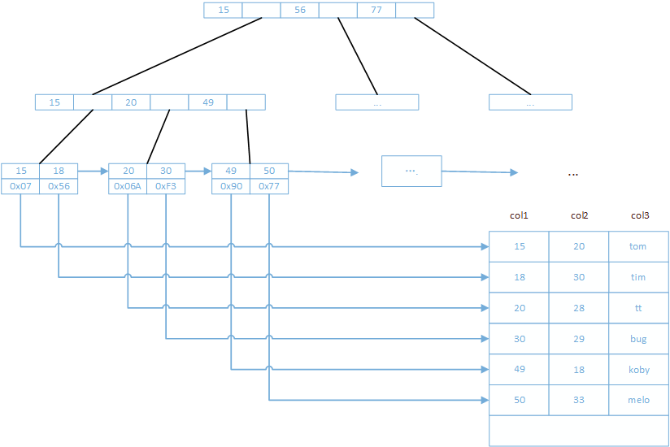

# MySQL第一天

## MySQL大厂面试题

储存引擎的InnoDB与MyISAM的区别，优缺点，使用场景？

说说MySQL的优化之道？

UndoLog和RedLog的区别和联系？

MySQL索引的数据结构是什么，及为什么要使用这种数据结构？

索引失效的场景有哪些？

什么是死锁和死锁的排查和解决？

RC和RR的实现原理及区别和使用场景？

分库分表带来的分布式困境与应对之策？

## MySQL知识图谱


## MySQL逻辑架构

### 逻辑架构图


#### 连接器（Connectors）

#### 系统管理和控制工具（Management Services & Utilities）

#### 连接池（Connection Pool）

SQL Layer MsSQL业务层

#### SQL接口（SQL Interface）

接收SQL DML DDL

#### 解析器（Parser）

词法解析：分词，形成语法树

语法解析：符合SQL的语法，形成正确语法树，语法错误在这里提示

> 词法分析：https://www.cnblogs.com/nocode/archive/2011/08/03/2126726.html
>
> 语法分析：https://www.cnblogs.com/nocode/archive/2011/08/09/2132814.html

#### 查询优化器（Optimizer）

mysql觉得你写的SQL不是完美的

优化内容：

多表关联，小表驱动大表

where从左到右，MYSQL找过滤力度最大的先执行

where sex='男' and id = 1

where id = 1 and sex='男'

explain

oracle 从右到左

#### 查询缓存

把查询结果存起来

select *from tuser where id = 1

MAP

key	sql hash后的值

value	查询结果

存在问题：

​	sql有变化，会缓存多份

​    数据有变化，清除缓存

#### 储存引擎

以表为单位

create table XXXX() engine=InnoDB/Memory/MyISAM

MySQL的存储引擎是针对表进行指定的。

| 存储引擎   | 说明                                                         |
| ---------- | ------------------------------------------------------------ |
| **MyISAM** | 高速引擎，拥有较高的插入，查询速度，**但不支持事务、不支持行锁**、支持3中不同的存储格式。包括静态型、动态型和压缩型 |
| **InnoDB** | **5.5版本后MySQL的默认存储引擎，支持事务和行级锁定，事务处理、回滚、崩溃修复能力和多版本并发控制的事务安全**，比MyISAM处理速度稍慢，支持**外键（FOREIGN KEY）** |
| MEMORY     | **内存存储引擎，拥有极高的插入、更新和查询效率。但是会占用和数据量成正比**的内存空间。只在内存上保存数据，意味着数据可能会丢失。 |

xtraDB储存引擎是由Percona公司提供的存储引擎，该公司还出品了Percona Server这个产品，它是基于MySQL开源代码进行修改之后的产品。

阿里对于Percona Server服务器进行修改，衍生了自己的数据库（alisql）

- InnoDB和MyISAM存储引擎的区别


|              | InnoDB                                     | MyISAM                                               |
| ------------ | :----------------------------------------- | ---------------------------------------------------- |
| **存储文件** | .frm表定义文件<br />.ibd数据文件和索引文件 | .frm表定义文件<br />.myd数据文件<br />.myi索引为文件 |
| **锁**       | 表锁，行锁                                 | 表锁                                                 |
| **事务**     | 支持                                       | 不支持                                               |
| **CRUD**     | 读、写                                     | 读多                                                 |
| **count**    | 扫表                                       | 专门存储的地方（加where也扫表）                      |
| **索引结构** | B+Tree                                     | B+Tree                                               |
| **外键**     | 支持                                       | 不支持                                               |

存储引擎的选型：

**InnoDB：**支持事务处理，支持外键，支持崩溃修复能力和并发控制。如果需要**对事务的完整性要求比**
**较高**（比如银行），**要求实现并发控制**（比如售票），那选择InnoDB有很大的优势。如果需要**频繁的
更新、删除**操作的数据库，也可以选择InnoDB，因为支持事务的提交（commit）和回滚
（rollback）。

**MyISAM:**插入数据快，空间和内存使用比较低。如果表主要是**用于插入新记录和读出记录**，那么选择
MyISAM能实现处理高效率。如果应用的完整性、并发性要求比 较低，也可以使用。

**MEMORY:**所有的数据都在内存中，数据的处理速度快，但是安全性不高。如果需要**很快的读写速度**，
对数据的安全性要求较低，不需要持久保存，可以选择MEMOEY。它对表的大小有要求，不能建立太大的表。所以，这类数据库只使用在相对较小的数据库表。

同一个数据库也可以使用多种存储引擎的表，如果一个表要求比较高的事务处理，可以选择InnoDB。这个数据库中可以将查询要求比较高的表选择MyISAM存储。如果数据库需要一个用于查询的临时表，可以选择MEMORY存储引擎。

### 简版执行流程


### 详细执行流程图


## 物理结构

- MySQL是通过文件系统对数据和索引进行存储的。
- MySQL的物理结果可以分为日志文件和数据索引文件。
- MySQL在Linux中的数据索引文件和日志文件都在/var/lib/mysql目录下
- 日志文件采用顺序IO方式存储，数据文件采用随机IO方式存储
  - 顺序IO记录首地址和偏移量
    - 优势：记录速度快
    - 劣势：只能追加，浪费空间
    - 适合：日志
  - 随机IO记录的是地址
    - 优势：省空间
    - 劣势：相对慢
    - 适合：数据+索引


# MySQL索引篇

## 索引介绍

### 索引是什么

官方介绍索引是帮助Mysql**高效获取数据的数据结构**。更通俗的讲：数据库索引就好比是一本书的目录，能**加快数据库的查询速度**

### 索引的优势和劣势

**优势：**

**可以提高数据检索的效率，降低数据库的IO成本**，类似于书的目录。

通过**索引对数据进行排序**，降低数据排序的成本，降低了CPU的消耗。

**劣势**：

索引会占用磁盘空间

索引虽然会提高查询效率，但是会降低更新表的效率。比如每次对表进行增删改操作，Mysql不仅要保存数据，还要保存或者更新对应的索引文件

### 索引的使用

#### 创建索引

- 单列索引之普通索引

```mysql
CREATE INDEX index_name ON table(column(length)) ;
ALTER TABLE table_name ADD INDEX index_name (column(length)) ;
```

- 单列索引之唯一索引

```mysql
CREATE UNIQUE INDEX index_name ON table(column(length)) ;
alter table table_name add unique index index_name(column);
```

- 单列索引之全文索引

```mysql
CREATE FULLTEXT INDEX index_name ON table(column(length)) ;
alter table table_name add fulltext index_name(column);
```

- 组合索引

```mysql
ALTER TABLE article ADD INDEX index_titme_time (title(50),time(10)) ;
```

#### 删除索引

```mysql
DROP INDEX index_name ON table
```

#### 查看索引

```mysql
SHOW INDEX FROM table_name
```

### 索引原理分析

#### 索引的储存结构

索引是在**存储引擎中实现的**，也就是说不通的存储引擎，会使用不同的索引。

**MyISAM和InnoDB存储引擎：只支持B+Tree索引**

MEMORY/HEAP存储引擎：支持HASHhe BTREE索引

#### B树和B+树

数据结构实例网站

> https://www.cs.usfca.edu/~galles/visualization/Algorithms.html

- B树的高度一般都是在2-4这个高度，树的高度直接影响IO读写的次数


- 如果是三层树结构---支撑的数据可以达到20G，如果是四层树结构---支撑的数据可以达到几十T

  B和B+树的最大区别在于非叶子节点是否存储数据的问题

  B树是非叶子节点和叶子节点都会存储数据

  B+树只有叶子节点才会存储数据，而且这些数据都是有指针指向的，也就是有顺序的


### 非聚集索引（MyISAM）

#### 主键索引

叶子节点上存的是：地址



#### 辅助索引（次要索引）

辅助索引和主键索引类似,叶子节点上存的是：地址

主键索引和非主键索引不是同一棵树，操作数据时，都会去更新索引树

### 聚集索引（InnoDB）

#### 主键索引

数据挂载在叶子节点上


#### 辅助索引（次要索引）

叶子节点上存的是主键


如果是非主键索引查询，则需要搜索两次索引树（一次辅助索引，一次主键索引），最终取出来数据

```sql
select * from t where id = 15;
--只找一次索引树（主键索引）
select * from t where name = 'Tom';
--回表（从辅助索引树上找到主键后在主键索引树下找到数据）
select name from t where name = 'Tom';
--不回表，直接返回
select id,name from t where name = 'Tom';
--不回表
```

组合索引可以解决回表的问题


利用组合索引完成覆盖索引（利用组合索引完成在辅助索引树的便利，不回表）

如果字段比较少，可以在辅助索引上加组合索引，这样一棵树就能全部查出来，如果字段较多，回表就回表吧，这个需要综合考虑,分析业务场景
综上所述，sql语句最好是不用select * 