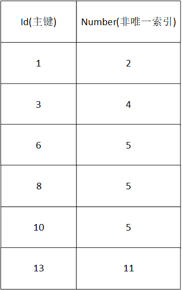

# MySQL锁

## MySQL锁介绍


## MySQL表级锁

### 表级锁介绍

**由MySQL SQL Layer层实现**

- MySQL的表级锁由两种：

> 一种是表锁。
>
> 一种是元数据锁（meta data lock，MDL）。

- MySQL实现的表级锁定的争用状态变量

> show status like 'table%';

### 表锁介绍

- 表锁有两种形式：

> 表共享读锁（Table Read Lock）
>
> 表独占写锁（Table Write Lock）

- 手动增加表锁

```mysql
lock table 表名称 read(write),表名称2 read(write),其他;
```

查看表锁情况

```mysql
show open tables;
```

删除表锁

```mysql
unlock tables;
```

### 表锁演示

#### 环境准备

```sql
--新建表
CREATE TABLE mylock (
id int(11) NOT NULL AUTO_INCREMENT,
NAME varchar(20) DEFAULT NULL,
PRIMARY KEY (id)
);
INSERT INTO mylock (id,NAME) VALUES (1, 'a');
INSERT INTO mylock (id,NAME) VALUES (2, 'b');
INSERT INTO mylock (id,NAME) VALUES (3, 'c');
INSERT INTO mylock (id,NAME) VALUES (4, 'd');
```

#### 读锁演示

表读锁

```sql
1、session1: lock table mylock read; -- 给mylock表加读锁
2、session1: select * from mylock; -- 可以查询
3、session1：select * from tdep; --不能访问非锁定表
4、session2：select * from mylock; -- 可以查询 没有锁
5、session2：update mylock set name='x' where id=2; -- 修改阻塞,自动加行写锁
6、session1：unlock tables; -- 释放表锁
7、session2：Rows matched: 1 Changed: 1 Warnings: 0 -- 修改执行完成
8、session1：select * from tdep; --可以访问
```

表写锁

```sql
1、session1: lock table mylock write; -- 给mylock表加写锁
2、session1: select * from mylock; -- 可以查询
3、session1：select * from tdep; --不能访问非锁定表
4、session1：update mylock set name='y' where id=2; --可以执行
5、session2：select * from mylock; -- 查询阻塞
6、session1：unlock tables; -- 释放表锁
7、session2：4 rows in set (22.57 sec) -- 查询执行完成
8、session1：select * from tdep; --可以访问
```

## 元数据锁

### 元数据锁介绍

MDL(metaDataLock)元数据：表结构

在MySQL5.5版本中引入了MDL，当对一个表做**增删改查操作**时，加MDL读锁；当对**表结构做变更操作**时，加MDL写锁

```sql
1、session1: begin;--开启事务
  select * from mylock;--加MDL读锁
2、session2: alter table mylock add f int; -- 修改阻塞
3、session1：commit; --提交事务 或者 rollback 释放读锁
4、session2：Query OK, 0 rows affected (38.67 sec)  --修改完成
```

## 下列命令自动提交事务

下列命令自动的结束一个事务 (就好像你在执行这个命令之前，做了一个 COMMIT)： 

1. **ALTER TABLE**
2. **BEGIN**
3. **CREATE INDEX**
4. **DROP DATABASE**
5. **DROP TABLE**
6. **RENAME TABLE**
7. **TRUNCATE**  

## 行级锁

### 行级锁介绍

InnoDB存储引擎实现

InnoDB的行级锁，按照锁定范围来说，分三种：
记录锁（Record Locks）:锁定索引中一条记录。主键指定where id = 3

间隙锁(Gap Locks):锁定记录前，记录中、记录后的行RR隔离剂（可重复读）--MySQL默认隔离级别

Next-Key锁：记录锁+间隙锁

### 行级锁分类

按照功能来说，分为两种：

共享读锁（S）：允许一个事务去读一行，阻止其他事务获得相同数据集的排他锁。

```sql
select * from table_name where ... lock in share mode;  -- 共享读锁  手动添加
select * from table_name where ...; -- 无锁
```

排他写锁（X）：允许获得排他锁的事务更新数据，阻止其他事务取得相同数据集的共享读锁和排他写锁。

1、自动加 DML

对于**UPDATE/DELETE/INSERT**语句，InnoDB会自动给涉及数据集加排他写锁（X）；

2、手动加

```sql
select * from table_name where id = ..... for update;
```

InnoDB也实现了表级锁，也就是易向锁，意向锁是mysql内部使用的，不需要用户干预

意向共享读（IS）：事务打算给数据行加行共享锁，事务在给一个数据行加共享锁前，必须先取得该表的IS锁。

意向排他写（IX）：事务打算给数据行加排它锁，事务在给一个数据行加排它锁前必须先取得该表的IX锁。

|                  | 共享锁（S） | 排他锁（X） | 意向共享锁（IS） | 意向排他锁（IX） |
| ---------------- | ----------- | ----------- | ---------------- | ---------------- |
| 共享锁（S）      | 兼容        | 冲突        | 兼容             | 冲突             |
| 排他锁（X）      | 冲突        | 冲突        | 冲突             | 冲突             |
| 意向共享锁（IS） | 兼容        | 冲突        | 兼容             | 兼容             |
| 意向排他锁（IX） | 冲突        | 冲突        | 兼容             | 兼容             |

### 两阶段锁（2PL）


锁操作分为两个阶段：加锁阶段和解锁阶段；

加锁阶段与解锁阶段不相交

加锁阶段：只加锁，不放锁；

解锁阶段：只放锁，不加锁；

### 行锁演示

**InnoDB**行锁是通过给索引上的**索引项加锁来实现的**，因此InnoDB这种行锁实现特点以为着，只有通过索引条件检索的数据，InnoDB才使用行级锁，否则，InnoDB使用表级锁。

where 索引 行锁 否则 表锁

#### 行读锁

```sql
--查看行锁状态
show status like 'innodb_row_lock';
1、session1: begin;--开启事务未提交
     select * from mylock  where ID=1 lock in share mode; --手动加id=1的行读锁,使用索引
2、session2：update mylock set name='y' where id=2; -- 未锁定该行可以修改
3、session2：update mylock set name='y' where id=1; -- 锁定该行修改阻塞
ERROR 1205 (HY000): Lock wait timeout exceeded; try restarting transaction
 -- 锁定超时
4、session1: commit; --提交事务 或者 rollback 释放读锁
5、session2：update mylock set name='y' where id=1; --修改成功
     Query OK, 1 row affected (0.00 sec)
     Rows matched: 1 Changed: 1 Warnings: 0

```

#### 行锁升级为表锁

```sql
1、session1: begin;--开启事务未提交
      --手动加name='c'的行读锁,未使用索引
      select * from mylock  where name='c' lock in share mode;
2、session2：update mylock set name='y' where id=2; -- 修改阻塞 未用索引行锁升级为表锁
3、session1: commit; --提交事务 或者 rollback 释放读锁
4、session2：update mylock set name='y' where id=2; --修改成功
     Query OK, 1 row affected (0.00 sec)
     Rows matched: 1 Changed: 1 Warnings: 0
```

#### 行写锁

```sql
1、session1: begin;--开启事务未提交
      --手动加id=1的行写锁,
      select * from mylock  where id=1 for update;
     
2、session2：select * from mylock  where id=2 ; -- 可以访问
3、session2: select * from mylock  where id=1 ; -- 可以读 不加锁 
  4、session2: select * from mylock  where id=1 lock in share mode ; -- 加读锁被阻塞
5、session1：commit; -- 提交事务 或者 rollback 释放写锁
5、session2：执行成功
```

#### 间隙锁

**间隙锁防止两种情况**

防止插入间隙内的数据。

防止已有数据更新为间隙内的数据。




##### 非唯一索引等值

```sql
-- 非唯一索引的等值
session 1:
start transaction ;
update news set number=3 where number=4;
session 2:
start transaction ;
insert into news value(2,3);#（均在间隙内，阻塞）
insert into news value(7,8);#（均在间隙外，成功）
insert into news value(2,8);#（id在间隙内，number在间隙外，成功）
insert into news value(4,8);#（id在间隙内，number在间隙外，成功）
insert into news value(7,3);#（id在间隙外，number在间隙内，阻塞）
insert into news value(7,2);# (id在间隙外，number为上边缘数据，阻塞)
insert into news value(2,2);#（id在间隙内，number为上边缘数据，阻塞）
insert into news value(7,5);#（id在间隙外，number为下边缘数据，成功）
insert into news value(4,5);#（id在间隙内，number为下边缘数据，阻塞）
```

**结论：只要number（where后面的）在间隙里（2，3, 4），不包含最后一个数（5）则不管ID是多少都会阻塞。number是下边缘，若ID在间隙内会阻塞**

##### 主键索引范围

```sql
--主键索引范围
session 1:
start transaction ;
update news set number=3 where id>1 and id <6;
session 2:
start transaction ;
insert into news value(2,3);#（均在间隙内，阻塞）
insert into news value(7,8);#（均在间隙外，成功）
insert into news value(2,8);#（id在间隙内，number在间隙外，阻塞）
insert into news value(4,8);#（id在间隙内，number在间隙外，阻塞）
insert into news value(7,3);#（id在间隙外，number在间隙内，成功）
--id无边缘数据，因为主键不能重复
```

**结论：只要id（在where后面的）在间隙里（2,4,5）则不管number是多少都会阻塞**

### 死锁

两个session互相等待对方的资源释放之后，才释放自己的资源造成了死锁。

```sql
1、session1: begin;--开启事务未提交
      --手动加行写锁 id=1 ，使用索引
      update mylock set name='m' where id=1;
2、session2：begin;--开启事务未提交
--手动加行写锁 id=2 ，使用索引
      update mylock set name='m' where id=2;
     
3、session1: update mylock set name='nn' where id=2; -- 加写锁被阻塞
4、session2：update mylock set name='nn' where id=1; -- 加写锁会死锁，不允许操作
ERROR 1213 (40001): Deadlock found when trying to get lock; try restarting
transaction
```

**mysql如果发现死锁，会中断造成死锁的事务，并回滚该事务。**