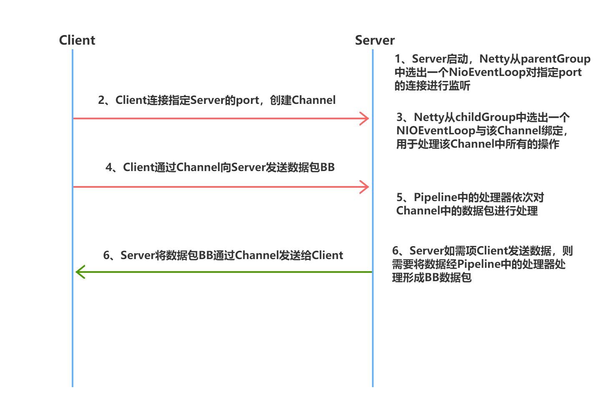

# Netty入门

## Netty概述

### Netty简介

Netty is an asynchronous event-driven network application framework for rapid development of maintainable high performance protocol servers & clients.

Netty is a NIO client server framework which enables quick and easy development of network applications such as protocol servers and clients. It greatly simplifies and streamlines network programming such as TCP and UDP socket server.

Netty has been designed carefully with the experiences earned from the implementation of a lot of protocols such as FTP, SMTP, HTTP, and various binary and text-based legacy protocols. As a result, Netty has succeeded to find a way to achieve ease of development, performance, stability, and flexibility without a compromise.

- Netty 是一个异步事件驱动的网络应用程序框架，用于快速开发可维护的高性能服务器和客户端。
- Netty 是一个 NIO 客户机-服务器框架，它支持快速、简单地开发网络应用程序，如服务器和客户机。它大大简化了网络编程，如 TCP 和 UDP 套接字服务器。
- “快速和简单”并不意味着生成的应用程序将受到可维护性或性能问题的影响。Netty经过精心设计，并积累了许多协议（如 ftp、smtp、http）的实施经验，以及各种二进制和基于文本的遗留协议。因此，Netty 成功地找到了一种方法，在不妥协的情况下实现了易于开发、性能、稳定性和灵活性。

### 谁在使用Netty

Dubbo、zk、RocketMQ、ElasticSearch、Spring5(对 HTTP 协议的实现)、GRpc、Spark 等大型开源项目都在使用 Netty 作为底层通讯框架。

### Netty中的核心概念

#### Channel

​	管道，其是对Socket的封装，其包含了一组API，大大简化了直接与socket进行操作的复杂性。

#### EventLoopGroup

​	EventLoopGroup 是一个 EventLoop 池，包含很多的 EventLoop。

​	Netty 为每个 Channel 分配了一个 EventLoop，用于处理用户连接请求、对用户请求的处理等所有事件。EventLoop 本身只是一个**线程驱动**，在其生命周期内只会绑定一个线程，让该线程处理一个 Channel 的所有 IO 事件。

​	一个 Channel 一旦与一个 EventLoop 相绑定，那么在 Channel 的整个生命周期内是不能改变的。一个 EventLoop 可以与多个 Channel 绑定。即 Channel 与 EventLoop 的关系是 n:1，而 EventLoop 与线程的关系是 1:1。

#### ServerBootStrap

​	用于配置整个 Netty 代码，将各个组件关联起来。服务端使用的是 ServerBootStrap，而客户端使用的是则 BootStrap。

#### ChannelHandler与ChannelPipeline

​	ChannelHandler 是对 Channel 中数据的处理器，这些处理器可以是系统本身定义好的编解码器，也可以是用户自定义的。这些处理器会被统一添加到一个 ChannelPipeline 的对象中，然后按照添加的顺序对 Channel 中的数据进行依次处理。

#### ChannelFuture

​	Netty 中所有的 I/O 操作都是异步的，即操作不会立即得到返回结果，所以 Netty 中定义了一个 ChannelFuture 对象作为这个异步操作的“代言人”，表示异步操作本身。如果想获取到该异步操作的返回值，可以通过该异步操作对象的 addListener()方法为该异步操作添加监听器，为其注册回调：当结果出来后马上调用执行。

​	Netty 的异步编程模型都是建立在 Future 与回调概念之上的。


### Netty的执行流程




# TCP的拆包与粘包

​	Netty 在基于 TCP 协议的网络通信中，存在拆包与粘包情况。拆包与粘包同时发生在数据的发送方与接收方两方。

​	发送方通过网络每发送一批二进制数据包，那么这次所发送的数据包就称为一帧，即Frame。在进行基于 TCP 的网络传输时，TCP 协议会将用户真正要发送的数据根据当前缓存的实际情况对其进行拆分或重组，变为用于网络传输的 Frame。在 Netty 中就是将 ByteBuf中的数据拆分或重组为二进制的 Frame。而接收方则需要将接收到的 Frame 中的数据进行重组或拆分，重新恢复为发送方发送时的 ByteBuf 数据。

​	具体场景描述如下

- 发送方发送的 ByteBuf 较大，在传输之前会被 TCP 底层拆分为多个 Frame 进行发送，这个过程称为发送拆包；接收方在接收到需要将这些 Frame 进行合并，这个合并的过程称为接收方粘包。
- 发送方发送的 ByteBuf 较小，无法形成一个 Frame，此时 TCP 底层会将很多的这样的小的 ByteBuf 合并为一个 Frame 进行传输，这个合并的过程称为发送方的粘包；接收方在接收到这个 Frame 后需要进行拆包，拆分出多个原来的小的 ByteBuf，这个拆分的过程称为接收方拆包。
- 当一个 Frame 无法放入整数倍个 ByteBuf 时，最后一个 ByteBuf 会会发生拆包。这个ByteBuf 中的一部分入入到了一个 Frame 中，另一部分被放入到了另一个 Frame 中。这个过程就是发送方拆包。但对于将这些 ByteBuf 放入到一个 Frame 的过程，就是发送方粘包；当接收方在接收到两个 Frame 后，对于第一个 Frame 的最后部分，与第二个 Frame的最前部分会进行合并，这个合并的过程就是接收方粘包。但在将 Frame 中的各个ByteBuf 拆分出来的过程，就是接收方拆包。

## 发送方拆包

## 发送方粘包

## 接收方的粘包拆包

​	为了解决接收方接收到的数据的混乱性，接收方也可以对接收到的 Frame 包进行粘包与拆包。Netty 中已经定义好了很多的接收方粘包拆包解决方案，我们可以直接使用。下面就介绍几个最常用的解决方案。

​	接收方的粘包拆包实际在做的工作是解码工作。这个解码基本思想是：发送方在发送数据中添加一个分隔标记，并告诉接收方该标记是什么。这样在接收方接收到 Frame 后，其会根据事先约定好的分隔标记，将数据进行拆分或合并，产生相应的 ByteBuf 数据。这个拆分或合并的过程，称为接收方的拆包与粘包。


### LineBasedFrameDecoder

​	基于行的帧解码器，即会按照**行分隔符**对数据进行拆包粘包，解码出BB

```java
pipeline.addLast(new LineBasedFrameDecoder(5120));
```

### DelimiterBasedFrameDecoder

​	基于分隔符的帧解码器，即会按照**指定分隔符**对数据进行拆包粘包，解码出BB。

```java
ByteBuf delimiter = Unpooled.copiedBuffer("***+++***".getBytes());
                            pipeline.addLast(new DelimiterBasedFrameDecoder(6144,delimiter));
```

### FixedLengthFrameDecoder

​	固定长度帧解码器，即会按照指定的长度对 Frame 中的数据进行拆粘包。

```java
pipeline.addLast(new FixedLengthFrameDecoder(17));
```


### LengthFieldBasedFrameDecoder

​	基于长度域的帧解码器，用于对 LengthFieldPrepender 编码器编码后的数据进行解码的。所以，首先要清楚 LengthFieldPrepender 编码器的编码原理。


#### 构造器函数

maxFrameLength：要解码的 Frame 的最大长度

lengthFieldOffset：长度域的偏移量

lengthFieldLength：长度域的长度

lengthAdjustment：要添加到长度域值中的补偿值，长度矫正值。

initialBytesToStrip：从解码帧中要剥去的前面字节

```java
public class SocketServer {
    public static void main(String[] args) throws InterruptedException {
        EventLoopGroup parentGroup = new NioEventLoopGroup();
        EventLoopGroup childGroup = new NioEventLoopGroup();
        try{
            ServerBootstrap bootstrap = new ServerBootstrap();
            bootstrap.group(parentGroup,childGroup)
                    .channel(NioServerSocketChannel.class)
                    .childHandler(new ChannelInitializer<SocketChannel>() {
                        @Override
                        protected void initChannel(SocketChannel socketChannel) throws Exception {
                            ChannelPipeline pipeline = socketChannel.pipeline();
                            pipeline.addLast(new LengthFieldBasedFrameDecoder(1024,0,4,-4,4));
                            pipeline.addLast(new LengthFieldPrepender(4));
                            pipeline.addLast(new StringDecoder(CharsetUtil.UTF_8));
                            pipeline.addLast(new StringEncoder(CharsetUtil.UTF_8));
                            pipeline.addLast(new SocketServerHandler());
                        }
                    });
            ChannelFuture future = bootstrap.bind(8888).sync();
            System.out.println("服务已启动");
            future.channel().closeFuture().sync();
        }finally {
            parentGroup.shutdownGracefully();
            childGroup.shutdownGracefully();
        }
    }
}
```

```java
public class SocketClient {
    public static void main(String[] args) throws InterruptedException {
        EventLoopGroup group = new NioEventLoopGroup();
        try{
            Bootstrap bootstrap = new Bootstrap();
            bootstrap.group(group)
                    .channel(NioSocketChannel.class)
                    .handler(new ChannelInitializer<SocketChannel>() {
                        @Override
                        protected void initChannel(SocketChannel socketChannel) throws Exception {
                            ChannelPipeline pipeline = socketChannel.pipeline();
                            pipeline.addLast(new LengthFieldBasedFrameDecoder(1024,0,4,0,4));
                            pipeline.addLast(new LengthFieldPrepender(4,true));
                            pipeline.addLast(new StringDecoder(CharsetUtil.UTF_8));
                            pipeline.addLast(new StringEncoder(CharsetUtil.UTF_8));
                            pipeline.addLast(new SocketClientHandler());
                        }
                    });
            ChannelFuture future = bootstrap.connect("localhost",8888).sync();
            future.channel().closeFuture().sync();

        }finally {
            group.shutdownGracefully();
        }
    }
}

```


# Netty高级应用

## WebSocket长连接

### WebSocket简介

​	WebSocket 是 HTML5 中的协议，是构建在 HTTP 协议之上的一个网络通信协议，其以长连接的方式实现了客户端与服务端的**全双工通信**

​	HTTP/1.1 版本协议中具有 keep-alive 属性，实现的是半双工通信。

