# RocketMQ基本理论及架构

## 一、前置知识

### 链式调用和木桶理论

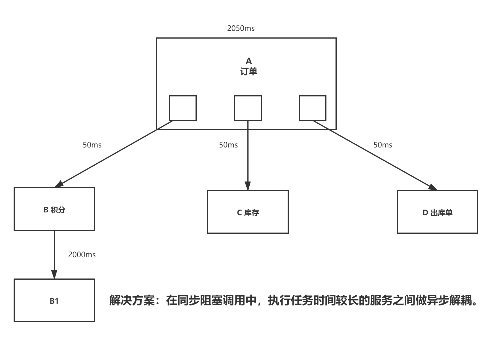

### 引入MQ

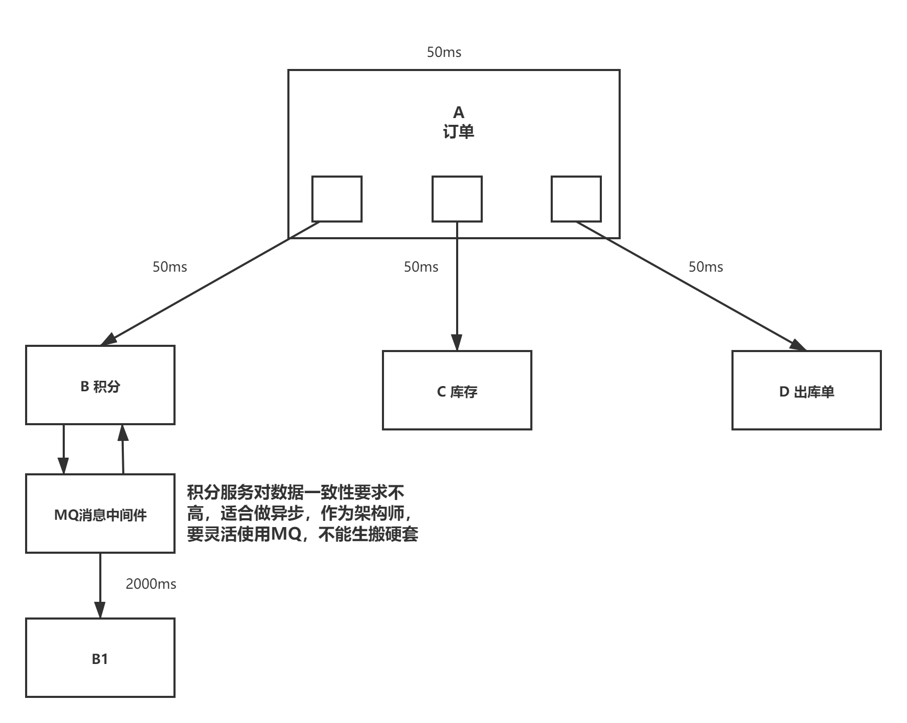

## 二、MQ前置知识

### MQ作用

消息队列作为高并发系统的核心组件之一，能够帮助业务系统解耦提升开发效率和系统稳定性。主要具有以下优势

- 削峰填谷（大促等流量洪流突然来袭时，MQ 可以缓冲突发流量，避免下游订阅系统因突发流量崩溃）
- 系统解耦（解决不同重要程序，不同能力级别系统之间依赖导致一死全死）
- 提升性能（当存在一对多调用时，可以发一条消息给消息系统，让消息系统通知相关系统）
- 蓄流压测（线上有些链路不好压测，可以通过堆积一定量消息再放开来压测）

### 应用场景

- 日志监控：作为重要日志的监控通信管道，将应用日志监控对系统性能影响降到最低
- 推送消息：为社交应用和物联网应用提供点对点推送
- 金融报文：发送金融报文，实现金融准实时的报文传输，可靠安全
- 电信信令：将电信信令封装成消息，传递到各个控制终端，实现准实时控制和信息传递。

#### 1、异步处理

场景说明：用户注册后，需要发注册邮件和注册短信。传统的做法有两种：

**串行处理**

1. register ---------------50ms
2. send mail ------------50ms
3. send msg ------------50ms

**并行模式**

1. register ---------------50ms
2. 多线程，线程1send mail -----------50ms，线程2send msg------------50ms

**消息中间件**

1. register ---------------50ms
2. 写入消息队列--------1ms

按照以上约定，用户的响应时间相当于是注册信息写入数据库的时间，也就是 50 毫秒。注册邮件，发送短信写入消息队列后，直接返回，因此写入消息队列的速度很快，基本可以忽略，因此用户的响应时间可能是 50 毫秒。因此架构改变后，系统的吞吐量提高到每秒 20 QPS。比串行提高了 3 倍，比并行提高了两倍。

#### 2、应用解耦

场景说明：用户下单后，订单系统需要通知库存系统。传统的做法是，订单系统调用库存系统的接口。

**传统模式的缺点：**假如库存系统无法访问，则订单减库存将失败，从而导致订单失败，订单系统与库存系统耦合

**引入消息中间件**：

1. 订单系统：用户下单后，订单系统完成持久化处理，将消息写入消息队列，返回用户订单下单成功
2. 库存系统：订阅下单的消息，采用拉/推的方式，获取下单信息，库存系统根据下单信息，进行库存操作

#### 3、流量削峰

1、地铁早高峰

2、高铁春运

**排队，如果所有人都进去了，地铁站和高铁站就瘫痪了**

流量削锋也是消息队列中的常用场景，一般在秒杀或团抢活动中使用广泛。 应用场景：秒杀活动，一般会因为流量过大，导致流量暴增，应用挂掉。为解决这个问题，一般需要在应用前端加入消息队列。

**用户请求------->消息队列<--------秒杀业务处理**

用户的请求，服务器接收后，首先写入消息队列。假如消息队列长度超过最大数量，则直接抛弃用户请求或跳转到错误页面。 秒杀业务根据消息队列中的请求信息，再做后续处理

#### 4、日志处理

日志处理是指将消息队列用在日志处理中，比如 Kafka 的应用，解决大量日志传输的问题。架构简化如下

日志采集客户端 -------->KAFKA消息队列<--------日志处理应用

日志采集客户端，负责日志数据采集，定时写受写入 Kafka 队列， Kafka 消息队列，负责日志数据的接收，存储和转发 日志处理应用：订阅并消费 kafka 队列中的日志数据

#### 5、消息通讯

消息通讯是指，消息队列一般都内置了高效的通信机制，因此也可以用在纯的消息通讯。比如实现点对点消息队列，或者聊天室等 点对点通讯：

客户端 A ----------->消息队列<-----------客户端B

聊天室通讯

​                ----------->消息队列<-----------

客户端 A                                                客户端B

​                < -----------消息队列----------->

客户端 A，客户端 B，客户端 N 订阅同一主题，进行消息发布和接收。实现类似聊天室效果。

以上实际是消息队列的两种消息模式，点对点或发布订阅模式。

### 示例

#### 电商系统

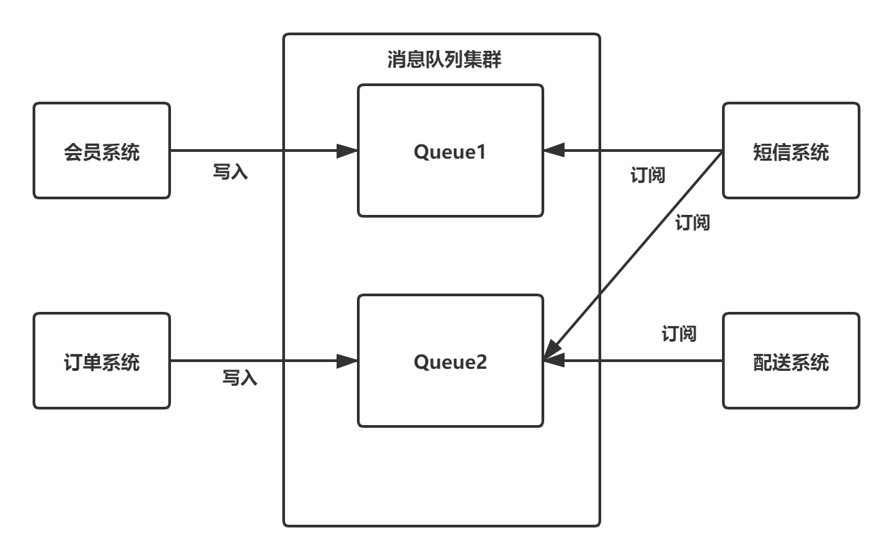

消息队列采用高可用，可持久化的消息中间件。比如 Active MQ，Rabbit MQ，RocketMq。

#### 日志收集系统

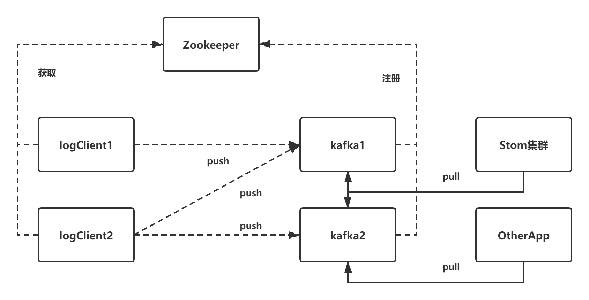

#### 事务处理

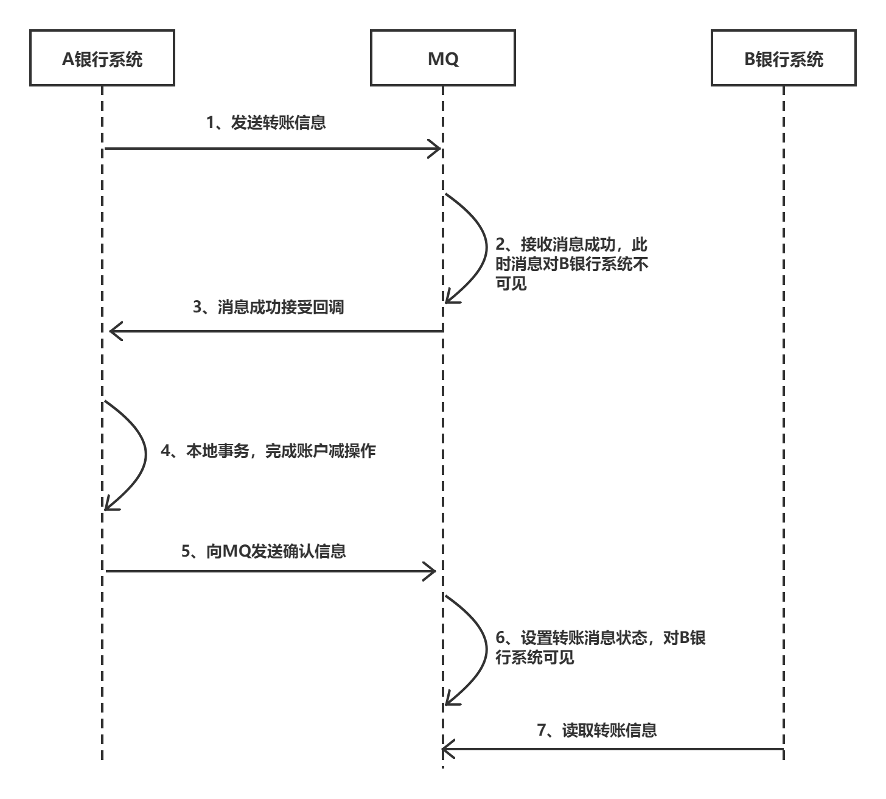

### MQ对比

目前主流的MQ主要是

ZeroMQ

推特的Distributedlog

ActiveMQ:Apache旗下老牌消息引擎

RabbitMQ、Kafka：AMQP的默认实现

RocketMQ

Artemis：Apache的ActiveMQ下的子项目

Apollo：同样为Apache的ActiveMQ的子项目的号称下一代消息引擎


#### ActiveMQ

**单机吞吐量：万级**

**时效性：ms级**

**可用性：高，基于主从架构实现高可用**

**消息可靠性：有较低的概率丢失数据**

**功能支持：MQ领域的功能及其完备**

总结：

1. 非常成熟，功能强大，在早些年业内大量的公司及项目中都有应用
2. 偶尔会有较低的概率丢失数据
3. 现在社区以及国内应用都越来越少，官方社区现在对 ActiveMQ 5.x 维护越来越少，几个月才发布一个版本
4. 主要是基于解耦和异步来用的，较少在大规模吞吐的场景中使用

#### RabbitMQ

单机吞吐量：万级

topic数量对吞吐量的影响

时效性：微秒级，延时低是一大特点。

可用性：高，基于主从架构实现高可用性

功能支持：基于 erlang 开发，所以并发能力很强，性能极其好，延时很低

总结：

1. erlang 语言开发，性能极其好，延时很低
2. 吐量到万级，MQ 功能比较完备
3. 开源提供的管理界面非常棒，用起来很好用
4. 社区相对比较活跃，几乎每个月都发布几个版本分
5. 在国内一些互联网公司近几年用 rabbitmq 也比较多一些 但是问题也是显而易见的，RabbitMQ 确实吞吐量会低一些，这是因为他做的实现机制比较重。
6. erlang 开发，很难去看懂源码，基本职能依赖于开源社区的快速维护和修复bug
7. rabbitmq 集群动态扩展会很麻烦，不过这个我觉得还好。其实主要是 erlang 语本身带来的问题。很难读源码，很难定制和掌控。

#### RocketMQ

单机吞吐量：十万级

消息可靠性：消息0丢失

topic数量对吞吐量的影响：topic 可以达到几百，几千个的级别，吞吐量会有较小幅度的下降。可支持大量 topic 是一大优势。

时效性：ms 级

可用性：非常高，分布式架构

消息可靠性：经过参数优化配置，消息可以做到 0 丢失

功能支持：MQ 功能较为完善，还是分布式的，扩展性好

总结：

1. 接口简单易用，可以做到大规模吞吐，性能也非常好，分布式扩展也很方便，社区维护还可以，可靠性和可用性都是 ok 的，还可以支撑大规模的 topic 数量，支持复杂MQ 业务场景
2. 而且一个很大的优势在于，源码是 java，我们可以自己阅读源码，定制自己公司的 MQ，可以掌控
3. 社区活跃度相对较为一般，不过也还可以，文档相对来说简单一些，然后接口这块不是按照标准 JMS 规范走的有些系统要迁移需要修改大量代码

相比于其他的 mq 消息中间件具有主要优势特性有：

- 支持事务型消息（消息发送和 DB 操作保持两方的最终一致性，rabbitmq 和 kafka 不支持）
- 支持结合 rocketmq 的多个系统之间数据最终一致性（多方事务，二方事务是前提）
- 支持 18 个级别的延迟消息（rabbitmq 和 kafka 不支持
- 支持指定次数和时间间隔的失败消息重发（kafka 不支持，rabbitmq 需要手动确认）
- 支持 consumer 端 tag 过滤，减少不必要的网络传输（rabbitmq 和 kafka 不支持）
- 支持重复消费（rabbitmq 不支持，kafka 支持

#### Kafka

单机吞吐量：十万级，最大的优点，就是吞吐量高。

topic 数量都吞吐量的影响：topic 从几十个到几百个的时候，吞吐量会大幅度下降。所以在同等机器下，kafka 尽量保证 topic 数量不要过多。如果要支撑大规模 topic，需要增加更多的机器资源

时效性：ms 级

可用性：非常高，kafka 是分布式的，一个数据多个副本，少数机器宕机，不会丢失数据，不会导致不可用

消息可靠性：经过参数优化配置，消息可以做到 0 丢失

功能支持：功能较为简单，主要支持简单的 MQ 功能，在大数据领域的实时计算以及日志采集被大规模使用

总结：

1. kafka 的特点其实很明显，就是仅仅提供较少的核心功能，但是提供超高的吞吐量，ms 级的延迟，极高的可用性以及可靠性，而且分布式可以任意扩展
2. 同时 kafka 最好是支撑较少的 topic 数量即可，保证其超高吞吐量
3. kafka 唯一的一点劣势是有可能消息重复消费，那么对数据准确性会造成极其轻微的影响，在大数据领域中以及日志采集中，这点轻微影响可以忽略

#### 对比表

| 特性       | ActiveMQ                                                     | RabbitMQ                                                     | RocketMQ                  | Kafka                                                        |
| ---------- | ------------------------------------------------------------ | ------------------------------------------------------------ | ------------------------- | ------------------------------------------------------------ |
| 开发语言   | java                                                         | erlang                                                       | java                      | scala                                                        |
| 单机吞吐量 | 万级                                                         | 万级                                                         | 十万级                    | 十万级                                                       |
| 时效性     | ms级                                                         | us级                                                         | ms级                      | ms级以内                                                     |
| 可用性     | 高（主从架构）                                               | 高（主从架构）                                               | 非常高（分布式架构）      | 非常高（分布式架构）                                         |
| 功能特性   | 成熟的产品，在很多公司得到应用；有较多的文档；各种协议支持较好 | 基于 erlang 开发，所以并发能力很强，性能极其好，延时很低;管理界面较丰富 | MQ 功能比较完备，扩展性佳 | 只支持主要的 MQ 功能，像一些消息查询，消息回溯等功能没有提供，毕竟是为大数据准备的，在大数据领域应用广 |


### 缺点

一个使用了 MQ 的项目，如果连这个问题都没有考虑过，就把 MQ 引进去了，那就给自己的项目带来了风险。我们引入一个技术，要对这个技术的弊端有充分的认识，才能做好预防。要记住，不要给公司挖坑！ 回答:回答也很容易，从以下两个个角度来答：

1. 系统可用性降低:你想啊，本来其他系统只要运行好好的，那你的系统就是正常的。现在你非要加个消息队列进去，那消息队列挂了，你的系统不是呵呵了。因此，系统可用性降低
2. 系统复杂性增加:要多考虑很多方面的问题，比如一致性问题、如何保证消息不被重复消费，如何保证保证消息可靠传输。因此，需要考虑的东西更多，系统复杂性增大。

既然有这些缺点，那么是不是不敢使用 MQ 了呢？答案很明显，不是，为了提高项目的性能，构建松耦合、异步的结构，必须要使用 MQ.

### 产品选型

我们在进行中间件选型时，一般都是通过下面几点来进行产品选型的：

1. 性能
2. 功能支持程度
3. 开发语言（团队中是否有成员熟悉此中间件的开发语言，市场上次语言的开发人员是否好招）
4. 有多少公司已经在生产环境上实际使用过，使用的效果如何
5. 社区的支持力度如何
6. 中间件的学习程度是否简单、文档是否详尽
7. 稳定性
8. 集群功能是否完备

如果从以上 8 点来选型一个消息队列，作为一名熟悉 java 的程序员，当遇到重新选择消息队列的场景时，我会毫不犹豫的选型 rocketmq，rocketmq 除了在第 6 点上表现略差(文档少，学习成本高)以及监控管理功能不友好外，从其它方面来说，它真的是一款非常优秀的消息队列中间件。

## 三、RocketMQ基本理论

### 发展历史

参考RocketMQ的前世今生

阿里巴巴消息中间件起源于2001年的五彩石项目，Notify在这期间应运而生，用于交易核心消息的流转。

至2010年，B2B开始大规模使用ActiveMQ作为消息内核，随着阿里业务的快速发展，急需一款支持顺序消息，拥有海量消息堆积能力的消息中间件，MetaQ 1.0在2011年诞生。

到2012年，MetaQ已经发展到了MetaQ 3.0，并抽象出了通用的消息引擎RocketMQ。随后，将RocketMQ进行了开源，阿里的消息中间件正式走入了公众的视野。

到2015年，RocketMQ已经经历了多年双十一的洗礼，在可用性、可靠性以及稳定性等方面都有出色的表现。与此同时，云计算大行其道，阿里消息中间件基于RocketMQ推出了Aliware MQ 1.0，开始为阿里云上成千上万家企业提供消息服务。

MetaQ在2016年双十一承载了万亿级消息的流转，跨越了一个新的里程碑，同时RocketMQ进入Apache 孵化。

### 消息存储

Topic 是一个逻辑上的概念，实际上 Message 是在每个 Broker 上以 Queue 的形式记录。

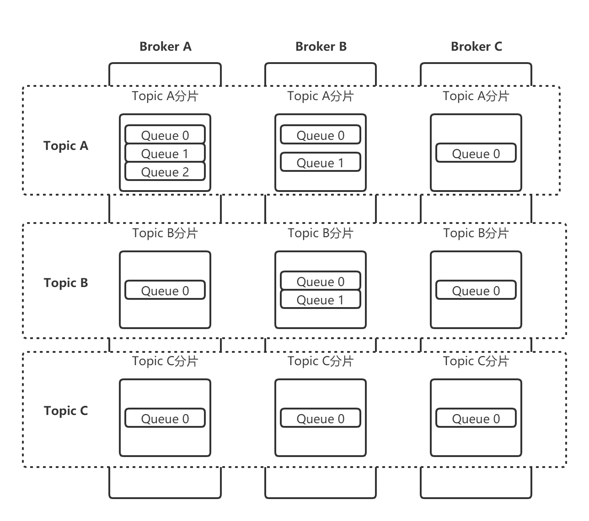

从上面的图可以总结一下几条结论

1. 消费者发送的 Message 会在 Broker 中的 Queue 队列中记录
2. 一个 Topic 的数据可能会存在多个 Broker 中
3. 一个 Broker 存在多个 Queue

也就是说每个 Topic 在 Broker 上会划分成几个逻辑队列，每个逻辑队列保存一部分消息数据，但是保存的消息数据实际上不是真正的消息数据，而是指向 commit log 的消息索引


### 消息发送

一个消息从发送，到接收，最简单的步骤：producer,topic,consumer,先由简单到复杂的来理解它的一些核心概念

**producer------------>Topic--------------->consumer**

消息先发到 Topic，然后消费者去 Topic 拿消息。只是 Topic 在这里只是个概念，那它到底是怎么存储消息数据的呢，这里就要引入 Broker 概念。

### 细化流程

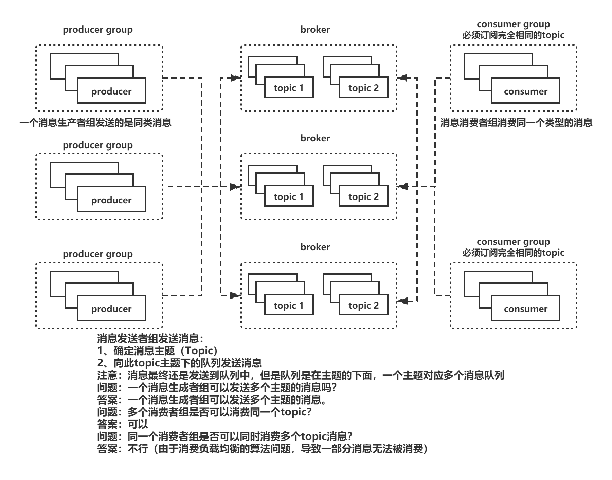

总结：

1. 消息发送者服务集群：构成一个消息发送者组
2. 消息发送者组根据主题（topic）发送消息，先确定主题，然后才能在这个主题下创建消息队列，从而可以向此主题下的消息队列发送消息。
3. 消息消费者组：只能消费一个topic类型的消息
4. 一个topic可以被多个消费者组所消费

### 消息消费

.jpg)

#### 广播模式

.jpg)

每一条消息被每一个消费者都消费一次

注：不能违背基本模型，一个消费者组只能消费一个topic

#### 集群消费

消息队列中的消息被consumer消费后，消息还一直存在，没有消失，如何避免这条消息被不同的的消费者重复消息？？？？

**解决方案，把queue分配给不同的消费者，一旦分配，此队列不能被其他消费者所消费**

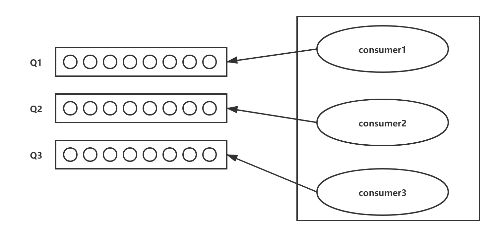

**平均分配算法**

10个队列，平均分配给4个消费者，用10除以4，除不尽有余数，余2

consumer1 : 2

consumer2 : 2

consumer3 : 2

consumer4 : 2

剩下两个，再从第一个消费者开始顺序分配

**环形平均算法**

.jpg)

**就近机房分配**

阿里云服务可以提供


### 一个消费者组同时监听多个主题的问题

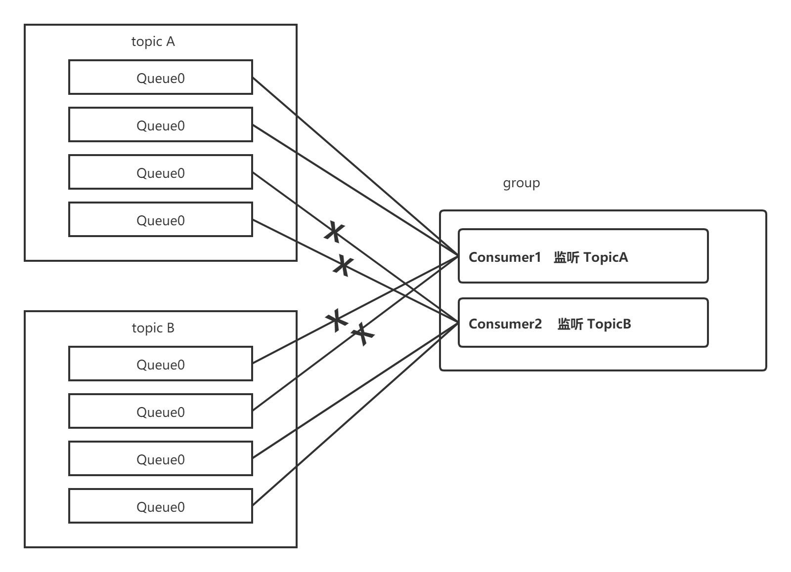

负载均衡算法：
			1、根据名称，把主题下的队列平均分配给消费者
			2、topicA主题：4队列平均分配给两个消费者，因此每一个消费者各分得两个队列
			3、topicB主题、4队列平均分配给两个消费者，因此每一个消费者各分得2个队列
			矛盾
			4、个队列平均分配给2个消费者，第二个消费者监听的是另一个主题，因此分配给第二个消费者的
			队列无法被消费


# 深入RocketMQ

## 面试问题

如何保证消息不被重复消费？如何保证消费的时候是幂等？

如何保证消息队列的高可用

如何保证消息的可靠性传输？消息丢了怎么办？

如何保证消息的顺序性？

如何决消息队列的延时以及过期失效的问题？消息队列满了以后该怎么处理，有几百万消息持续积压几小时，怎么解决？


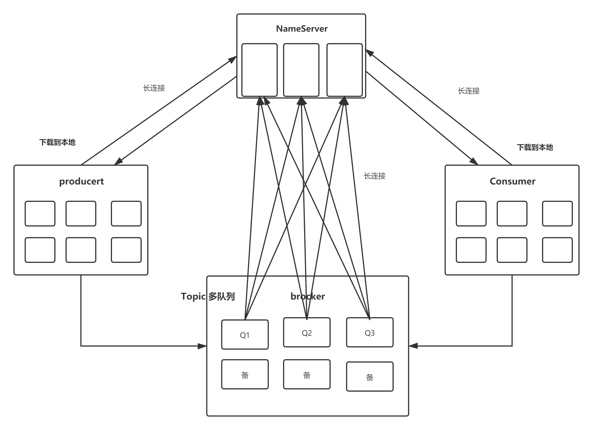

对于上图中几个角色的说明：

1. NameServer：RocketMQ集群的命名服务器（也可以说是注册中心），它本身是无状态的（实际情况下可能存在每个NameServer实例上的数据有短暂的不一致现象，但是通过定时更新，在大部分情况下都是一致的），用于管理集群的元数据（ 例如，KV配置、Topic、Broker的注册信息）。(类似于kafka的zookeeper)
2. Broker（Master）：RocketMQ消息代理服务器主节点，起到串联Producer的消息发送和Consumer的消息消费，和将消息的落盘存储的作用；
3. Broker（Slave）：RocketMQ消息代理服务器备份节点，主要是通过同步/异步的方式将主节点的消息同步过来进行备份，为RocketMQ集群的高可用性提供保障；
4. Producer（消息生产者）：在这里为普通消息的生产者，主要基于RocketMQ-Client模块将消息发送至RocketMQ的主节点。

RocketMQ网络架构借鉴了kafka架构，在一些地方做了优化

1. 注册中心
2. 数据存储

### NameServer

NameServer是一个无状态服务，多个nameserver之间没有任何联系。都是独立存在

其中一些nameserver宕机，不影响整个服务运行，全部nameserver宕机，也不会影响服务运行

由于nameserver是无状态服务，所有broker需要同时向所有nameserver注册路由信息（队列和brokerIP映射关系）

### Broker

broker是用于存储消息的服务，是主从结构。

broker和nameserver保持长连接，每隔30s向nameserver发送心跳包（topic中队列信息：路由）

### Producer

**问题：**producer发送消息的时候，是否知道应该把消息发送到哪个broker服务器中进行储存

**答案：**producer不知道把消息发送到哪个broker服务器，首先从注册中心nameserver获取路由信息。路由信息包含：队列--ip地址

producer获取路由信息后，会在本地进行缓存

producer和nameserver保持长连接，每隔30s查询新的topic对象信息

producer和broker保持长连接，每隔30s会向broker发送心跳检测。（是否处于running状态）

### Consumer

consumer和nameserver保持长连接，没隔30s将会从nameserver服务中查询topic路由信息，（会在本地进行缓存）根据IP映射文件从broker中消费消息

consumer和broker保持长连接，每隔30s发送心跳检测。

### Topic

topic代表主题，代表一类消息，一个消费者组只能消费一类消息

### 分区

queue，并发消费

### message

发送消息：用Message封装消息对象

### Tag

是一个消息的标签，可以对消息进行二次过滤，相当于二次分类


面试问题

如何保证消息不被重复消费？

**解决方案，把queue分配给不同的消费者，一旦分配，此队列不能被其他消费者所消费**


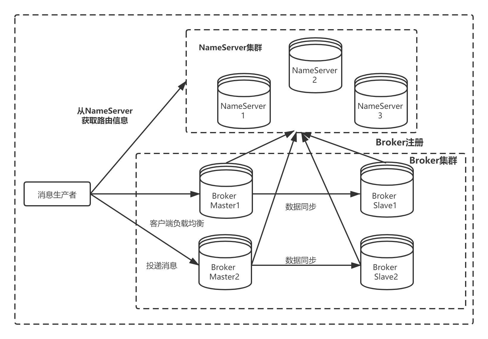

对于上面图中几条通信链路的关系：

1. Producer与NamerServer：每一个Producer会与NameServer集群中的一个实例建立TCP连接，从这个NameServer实例上拉取Topic路由信息；
2. Producer和Broker:Producer会和它要发送的topic相关联的Master的Broker代理服务器建立TCP连接，用于发送消息以及定时的心跳信息；
3. Broker和NamerServer：Broker（Master or Slave）均会和每一个NameServer实例来建立TCP连接。Broker在启动的时候会注册自己配置的Topic信息到NameServer集群的每一台机器中。即每一个NameServer均有该broker的Topic路由配置信息。其中，Master与Master之间无连接，Master与Slave之间有连接；

## 消息存储

### 消息存储模型

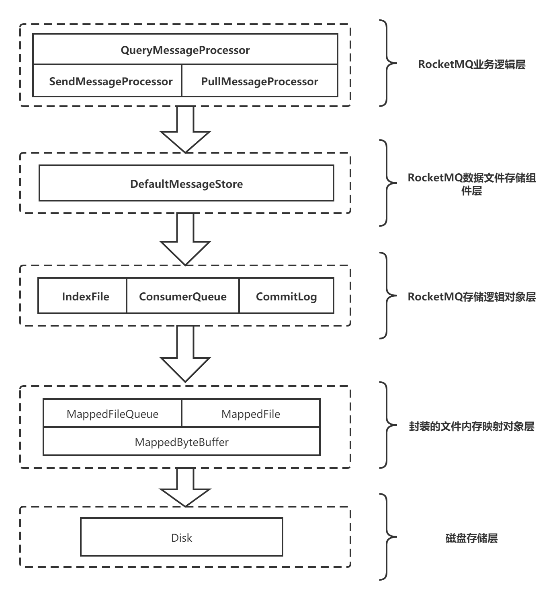

RocketMQ文件存储模型层次结构如上图所示，根据类别和作用从概念模型上大致可以划分为5层

**IndexFile：索引文件，可以通过key找到消息，对消息进行维护**

**ConsumerQueue：队列**

**CommitLog：log文件，真正用于存储消息的**

kafka使用队列存储消息，RockerMQ队列只存地址，不存储消息。

真正的消息是存储在CommitLog文件，此文件用于存储消息，队列只用来存储消息的地址。

.png)

kafka的顺序读写是针对partition的，当partition过多，就编程随机读写了。

kafka：使用partition的概念，一个topic下有多个partition，一个partition就是一个文件一个文件写入磁盘时顺序存储的，但是两个文件之间不是顺序的，所以kafka的topic不能太多，多了就会急剧下降

原因：多个分区导致磁盘数据的随机存储，导致查询数据非常慢

Rocket也有分区的概念

分区，queue如果也是非常庞大，比如说1000个队列，是否会影响性能呢？

1、对于queue来说尺寸非常小，

2、queue是常驻在内存里面

### 数据刷盘

同步刷盘：flushDiskType = SYNC_FLUSH，等消息写入到磁盘上后才返回确认

异步刷盘：flushDiskType = ASYNC_FLUSH，为了性能考虑，大多数情况下采用异步刷盘

此种情况下，如何保证消息百分之百不丢失？

### 顺序消息

**分区顺序：一个Partition内所有的消息按照先进先出的顺序进行发布和消费**
**全局顺序：一个Topic内所有的消息按照先进先出的顺序进行发布和消费**

顺序消息：发送消息具有顺序性----思考：在什么样的场景下，要求发送的消息具有严格顺序？？？

场景：
					1、创建订单
					2、支付订单
					3、支付完毕
					4、商品出库

以上的消息的顺序是否可以颠倒？以上的消息在业务上具有不可逆的顺序，无法颠倒，发送消息必须按照业务顺序进行

思考：消息在高并发（多线程）情况下，被发送到一个topic下的多个队列中进行存储？

全局顺序消息（让所有的队列，所有的消息都具有顺序）：很难实现


局部消息顺序性（让某些独立具有顺序）采用单线程的方式发送消息


.png)

### 消息去重

什么场景下会产生重复消息

.png)

如何解决重复性消息

messageID 唯一标识，

借助第三方库：redis mysql

用msgId做key

接受broker中消息

从redis/mysql查询消息，做消息去重判断

如果没有重复，业务继续执行

否则如果有重复的，直接return

在多线程情况下，若多个consumer同时做消息重复判断，都通过了，会导致重复消费这个时候需要加分布式锁，让多个consumer互斥访问

### 消息堆积

消息严重堆积怎么处理？

先修复 consumer 的问题，确保其恢复消费速度，然后将现有 consumer 都停掉。

新建一个 topic，partition 是原来的 10 倍，临时建立好原先 10 倍的 queue 数量。

接着临时征用 10 倍的机器来部署 consumer，每一批 consumer 消费一个临时 queue 的数据。这种做法相当于是临时将 queue 资源和 consumer 资源扩大 10 倍，以正常的 10 倍速度来消费数据。

等快速消费完积压数据之后，得恢复原先部署的架构，重新用原先的 consumer 机器来消费消息。


### 延时消息

什么是延时消息：发送消息后一段时间，这个消息不能被消费者消费，只有等到延时时间到了，此消息才能被消费者所消费

延时消息应用场景：用户下单，完成订单支付，下单到支付需要一段时间，限定30min如果未完成支持，订单超时，关闭订单，恢复库存

如果用定时任务去轮询支付状态，性能非常不好，因为会频繁去扫描数据库

延迟配置说明：

1、broker.conf配置文件配置

```properties
#broker.conf配置文件
brokerClusterName = DefaultCluster
brokerName = broker-a
brokerId = 0
deleteWhen = 04
fileReservedTime = 48
brokerRole = ASYNC_MASTER
flushDiskType = ASYNC_FLUSH
#可以设置消息延时级别
messageDelayLevel = 1s 5s 10s 30s 1m 2m 3m 4m 5m 6m 7m 8m 9m 10m 20m 30m 1h 2h
```

配置说明：

- 配置项配置了从1级开始，各级延时的时间，可以修改这个指定级别的延时时间；
- 时间单位支持：s、m、h、d，分别表示秒、分、时、天；
- 默认值就是上面声明的，可手工调整；
- 默认值已够用，不建议修改这个值。

2、设置消息延时级别

```java
//创建消息对象
Message message = new Message("topic-A",
"tagB", ("helloB" +
i).getBytes(RemotingHelper.DEFAULT_CHARSET));
//设置消息延时级别
message.setDelayTimeLevel(6);
```

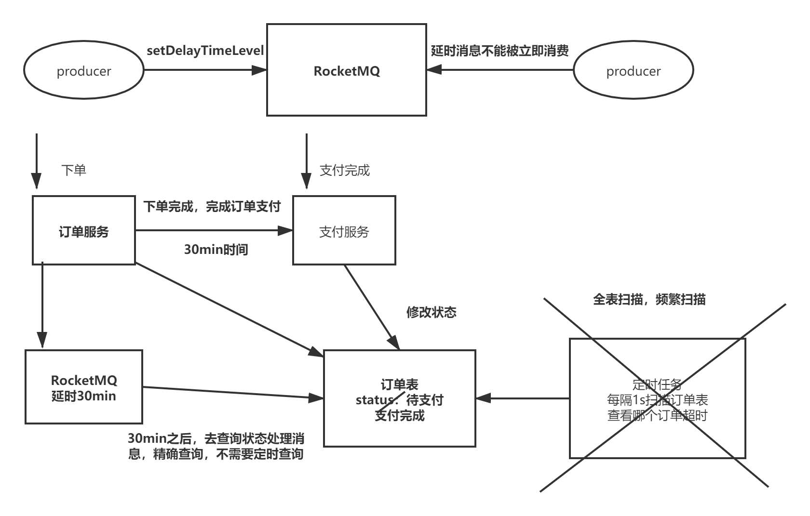

### 消息可靠性

如何保证消息百分之百不丢失？consumer消费异常后，怎么让消息重新投递？

.png)

### 事务消息

RocketMQ在其消息定义的基础上，对事务消息扩展了两个相关的概念：

**Half(Prepare) Message——半消息(预处理消息)**

半消息是一种特殊的消息类型，该状态的消息暂时不能被Consumer消费。当一条事务消息被成功投递到Broker上，但是Broker并没有接收到Producer发出的二次确认时，该事务消息就处于"**暂时不可被消费**"状态，该状态的事务消息被称为半消息。

**Message Status Check——消息状态回查**

由于网络抖动、Producer重启等原因，可能导致Producer向Broker发送的二次确认消息没有成功送达。如果Broker检测到某条事务消息长时间处于半消息状态，则会主动向Producer端发起回查操作，查询该事务消息在Producer端的事务状态(Commit 或 Rollback)。可以看出，Message Status Check主要用来解决分布式事务中的超时问题。

.png)

上面是官网提供的事务消息执行流程图，下面对具体流程进行分析：

1. Step1：Producer向Broker端发送Half Message；
2. Step2：Broker ACK，Half Message发送成功；
3. Step3：Producer执行本地事务；
4. Step4：本地事务完毕，根据事务的状态，Producer向Broker发送二次确认消息，确认该Half
Message的Commit或者Rollback状态。Broker收到二次确认消息后，对于Commit状态，则直接
发送到Consumer端执行消费逻辑，而对于Rollback则直接标记为失败，一段时间后清除，并不会
发给Consumer。正常情况下，到此分布式事务已经完成，剩下要处理的就是超时问题，即一段时
间后Broker仍没有收到Producer的二次确认消息；
5. Step5：针对超时状态，Broker主动向Producer发起消息回查；

6. Step6：Producer处理回查消息，返回对应的本地事务的执行结果；
7. Step7：Broker针对回查消息的结果，执行Commit或Rollback操作，同Step4

### 实际案例

