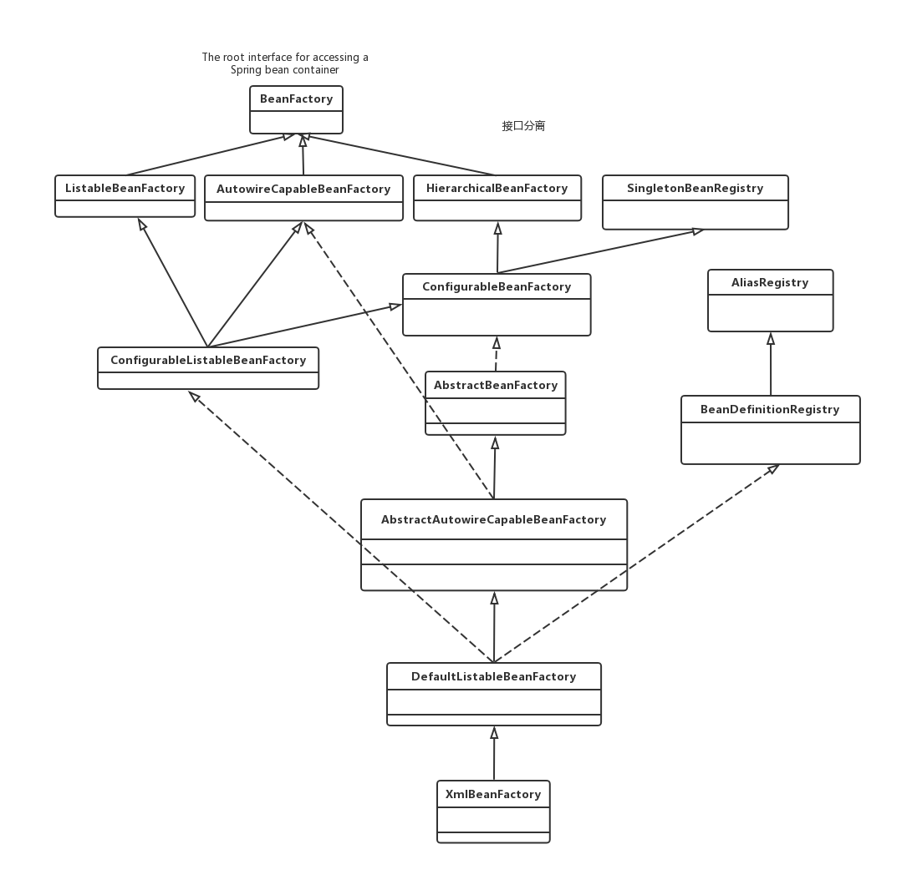
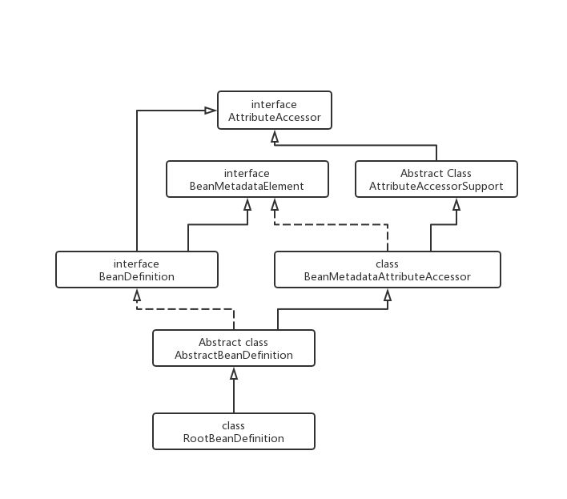
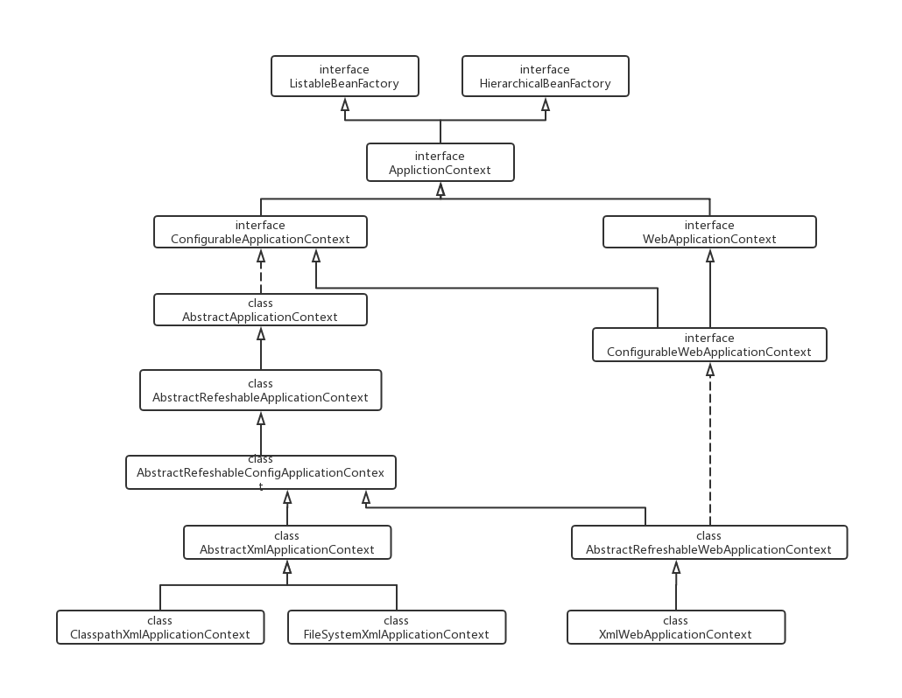

# Spring BeanFactory source code analysis

## Spring重要接口详解

### BeanFactory继承体系

#### 体系结构图



#### BeanFactory

```java
package org.springframework.beans.factory;
    public interface BeanFactory {
    //用来引用一个实例，或把它和工厂产生的Bean区分开
    //就是说，如果一个FactoryBean的名字为a，那么，&a会得到那个Factory
    String FACTORY_BEAN_PREFIX = "&";
    /*
    * 四个不同形式的getBean方法，获取实例
    */
    Object getBean(String name) throws BeansException;
    <T> T getBean(String name, Class<T> requiredType) throws
    BeansException;
    <T> T getBean(Class<T> requiredType) throws BeansException;
    Object getBean(String name, Object... args) throws BeansException;
    // 是否存在
    boolean containsBean(String name);
    // 是否为单实例
    boolean isSingleton(String name) throws NoSuchBeanDefinitionException;
    // 是否为原型（多实例）
    boolean isPrototype(String name) throws NoSuchBeanDefinitionException;
    // 名称、类型是否匹配
    boolean isTypeMatch(String name, Class<?> targetType)
    throws NoSuchBeanDefinitionException;
    // 获取类型
    Class<?> getType(String name) throws NoSuchBeanDefinitionException;
    // 根据实例的名字获取实例的别名
    String[] getAliases(String name);
}
```

在BeanFactory里只对IOC容器的基本行为作了定义，根本不关心你的Bean是如何定义怎样加载的。正如我们只关心工厂里得到什么产品对象，至于工厂是怎么生成这些对象的，这个基本的接口不关心。

- **源码说明：**

  4个获取实例的方法。getBean的重载方法

  4个判断的方法。判断是否存在，是否为单例、原型，名称类型是否匹配

  1个获取类型的方法、1个获取别名的方法。根据名称获取类型、根据名称获取别名。一目了然。

- **总结：**

  这10个方法，很明显，这是一个典型的工厂模式的工厂接口


#### ListableBeanFactory

**可将Bean逐一列出的工厂**


```java
public interface ListableBeanFactory extends BeanFactory {
    // 对于给定的名字是否含有BeanDefinition
    boolean containsBeanDefinition(String beanName); 
    // 返回工厂的BeanDefinition总数
    int getBeanDefinitionCount();
    // 返回工厂中所有Bean的名字
    String[] getBeanDefinitionNames();
    // 返回对于指定类型Bean（包括子类）的所有名字
    String[] getBeanNamesForType(Class<?> type);
    /*
    * 返回指定类型的名字
    * includeNonSingletons为false表示只取单例Bean，true则不是
    * allowEagerInit为true表示立刻加载，false表示延迟加载。
    * 注意：FactoryBeans都是立刻加载的。
    */
    String[] getBeanNamesForType(Class<?> type, boolean
    includeNonSingletons,
    boolean allowEagerInit);
    // 根据类型（包括子类）返回指定Bean名和Bean的Map
    <T> Map<String, T> getBeansOfType(Class<T> type) throws BeansException;
    <T> Map<String, T> getBeansOfType(Class<T> type,
    boolean includeNonSingletons, boolean allowEagerInit)
    throws BeansException;
    // 根据注解类型，查找所有有这个注解的Bean名和Bean的Map
    Map<String, Object> getBeansWithAnnotation(
        Class<? extends Annotation> annotationType) throws
    BeansException;
    // 根据指定Bean名和注解类型查找指定的Bean
    <A extends Annotation> A findAnnotationOnBean(String beanName,
    Class<A> annotationType);
}
```

- **源码说明：**

  3个跟BeanDefinition有关的操作。包括BeanDefinition的总数、名字的集合、指定名字的集合

  ```
  这里指出，BeanDefinition是Spring中非常重要的一个类，每个BeanDefinition实例
  都包含一个类在Spring工厂中所有属性。
  ```

  2个getBeanNamesForType重载方法。根据指定类型（包括子类）

  2个getBeansOfType重载方法。根据类型（包括子类）返回指定bean名称和Bean的Map

  2个跟注解查找相关的方法。根据注解类型，查找Bean名和Bean的Map。以及根据指定Bean名和注解类型查找指定的Bean。

- **总结：**

  正如这个工厂接口的名字所示，这个工厂接口最大的特点就是可以列出工厂可以生产的所有实例。当然，工厂并没有直接提供返回所有实例的方法，也没这个必要。它可以返回指定类型的所有实例。而且你可以通过getBeanDefinitionNames()得到工厂所有bean的名字，然后根据这些名字得到所有的Bean。这个工厂接口扩展BeanFactory的功能，作为上文指出的BeanFactory耳机接口，有9个独有的方法，扩展了跟BeanDefinition的功能，提供了BeanDefinition、BeanName、注解有关的各种操作。**它可以根据条件返回Bean的信息集合，这就是它名字的由来--ListableBeanFactory**

#### HierarachicalBeanFactory

**分层的Bean工厂**

```java
public interface HierarchicalBeanFactory extends BeanFactory {
    // 返回本Bean工厂的父工厂
    BeanFactory getParentBeanFactory();
    // 本地工厂是否包含这个Bean
    boolean containsLocalBean(String name);
}
```

- **参数说明：**

  第一个方法返回本Bean工厂的父工厂。这个方法实现了工厂的分层。

  第二个方法判断本地工厂是否包含这个Bean（忽略其他所有父工厂）。这也是分层思想体现

- **总结：**

  这个工厂接口非常简单，实现了Bean工厂的分层。这个工厂接口也是继承自BeanFactory，也是一个二级接口，相对于父接口，它只扩展了一个重要的功能--**工厂分层。**

#### AutowireCapableBeanFactory

**自动装配的Bean工厂**

```java
public interface AutowireCapableBeanFactory extends BeanFactory {
    // 这个常量表明工厂没有自动装配的Bean
    int AUTOWIRE_NO = 0;
    // 表明根据名称自动装配
    int AUTOWIRE_BY_NAME = 1;
    // 表明根据类型自动装配
    int AUTOWIRE_BY_TYPE = 2;
    // 表明根据构造方法快速装配
    int AUTOWIRE_CONSTRUCTOR = 3;
    //表明通过Bean的class的内部来自动装配（有没翻译错...）Spring3.0被弃用。
    @Deprecated
    int AUTOWIRE_AUTODETECT = 4;
    // 根据指定Class创建一个全新的Bean实例
    <T> T createBean(Class<T> beanClass) throws BeansException;
    // 给定对象，根据注释、后处理器等，进行自动装配
    void autowireBean(Object existingBean) throws BeansException;
    // 根据Bean名的BeanDefinition装配这个未加工的Object，执行回调和各种后处理器。
    Object configureBean(Object existingBean, String beanName) throws
    BeansException;
    // 分解Bean在工厂中定义的这个指定的依赖descriptor
    Object resolveDependency(DependencyDescriptor descriptor, String
    beanName) throws BeansException;
    // 根据给定的类型和指定的装配策略，创建一个新的Bean实例
    Object createBean(Class<?> beanClass, int autowireMode, boolean
    dependencyCheck) throws BeansException;
    // 与上面类似，不过稍有不同。
    Object autowire(Class<?> beanClass, int autowireMode, boolean
    dependencyCheck) throws BeansException;
    /*
    * 根据名称或类型自动装配
    */
    void autowireBeanProperties(Object existingBean, int autowireMode,
    boolean dependencyCheck)
    throws BeansException;
    /*
    * 也是自动装配
    */
    void applyBeanPropertyValues(Object existingBean, String beanName)
    throws BeansException;
    /*
    * 初始化一个Bean...
    */
    Object initializeBean(Object existingBean, String beanName) throws
    BeansException;
    /*
    * 初始化之前执行BeanPostProcessors
    */
        Object applyBeanPostProcessorsBeforeInitialization(Object existingBean,
    String beanName)
    throws BeansException;
    /*
    * 初始化之后执行BeanPostProcessors
    */
    Object applyBeanPostProcessorsAfterInitialization(Object existingBean,
    String beanName)
    throws BeansException;
    /*
    * 分解指定的依赖
    */
    Object resolveDependency(DependencyDescriptor descriptor, String
    beanName,
    Set<String> autowiredBeanNames, TypeConverter typeConverter)
    throws BeansException;
}
```

- **源码说明：**

  总共5个静态不可变量来致命装配策略，其中一个常量被Spring3.0废弃、一个常量标识没有自动装配，另外3个常量指明不同的装配策略--根据名称、根据类型、根据构造方法

  8个跟自动装配相关的方法，实在是繁杂，具体的意义我们研究类的时候再分辨

  2个执行BeanPostProcessors的方法

  2个分解指定依赖的方法

- **总结：**

  这个工厂接口继承自BeanFactory，它扩展了自动装配的功能，根据类定义BeanDefinition装配Bean、执行前、后处理等。

#### ConfigurationBeanFactory

**复杂的配置Bean工厂**

```java
public interface ConfigurableBeanFactory extends HierarchicalBeanFactory,
SingletonBeanRegistry {
    String SCOPE_SINGLETON = "singleton"; // 单例
    String SCOPE_PROTOTYPE = "prototype"; // 原型
    /*
    * 搭配HierarchicalBeanFactory接口的getParentBeanFactory方法
    */
    void setParentBeanFactory(BeanFactory parentBeanFactory) throws
    IllegalStateException;
    /*
    * 设置、返回工厂的类加载器
    */
    void setBeanClassLoader(ClassLoader beanClassLoader);
       ClassLoader getBeanClassLoader();
    /*
    * 设置、返回一个临时的类加载器
    */
    void setTempClassLoader(ClassLoader tempClassLoader);
    ClassLoader getTempClassLoader();
    /*
    * 设置、是否缓存元数据，如果false，那么每次请求实例，都会从类加载器重新加载（热加
    载）
    */
    void setCacheBeanMetadata(boolean cacheBeanMetadata);
    boolean isCacheBeanMetadata();//是否缓存元数据
        /*
    * Bean表达式分解器
    */
    void setBeanExpressionResolver(BeanExpressionResolver resolver);
    BeanExpressionResolver getBeanExpressionResolver();
    /*
    * 设置、返回一个转换服务
    */
    void setConversionService(ConversionService conversionService);
    ConversionService getConversionService();
    /*
    * 设置属性编辑登记员...
    */
    void addPropertyEditorRegistrar(PropertyEditorRegistrar registrar);
    /*
    * 注册常用属性编辑器
    */
    void registerCustomEditor(Class<?> requiredType, Class<? extends
    PropertyEditor> propertyEditorClass);
    /*
    * 用工厂中注册的通用的编辑器初始化指定的属性编辑注册器
    */
    void copyRegisteredEditorsTo(PropertyEditorRegistry registry);

        /*
    * 设置、得到一个类型转换器
    */
    void setTypeConverter(TypeConverter typeConverter);
    TypeConverter getTypeConverter();
    /*
    * 增加一个嵌入式的StringValueResolver
    */
        void addEmbeddedValueResolver(StringValueResolver valueResolver);
    String resolveEmbeddedValue(String value);//分解指定的嵌入式的值
    void addBeanPostProcessor(BeanPostProcessor beanPostProcessor);//设置一
    个Bean后处理器
    int getBeanPostProcessorCount();//返回Bean后处理器的数量
    void registerScope(String scopeName, Scope scope);//注册范围
    String[] getRegisteredScopeNames();//返回注册的范围名
    Scope getRegisteredScope(String scopeName);//返回指定的范围
    AccessControlContext getAccessControlContext();//返回本工厂的一个安全访问上
    下文
    void copyConfigurationFrom(ConfigurableBeanFactory otherFactory);//从其
    他的工厂复制相关的所有配置
    /*
    * 给指定的Bean注册别名
    */
    void registerAlias(String beanName, String alias) throws
    BeanDefinitionStoreException;
    void resolveAliases(StringValueResolver valueResolver);//根据指定的
    StringValueResolver移除所有的别名
    /*
    * 返回指定Bean合并后的Bean定义
    */
    BeanDefinition getMergedBeanDefinition(String beanName) throws
    NoSuchBeanDefinitionException;
        boolean isFactoryBean(String name) throws
    NoSuchBeanDefinitionException;//判断指定Bean是否为一个工厂Bean
    void setCurrentlyInCreation(String beanName, boolean inCreation);//设置
    一个Bean是否正在创建
    boolean isCurrentlyInCreation(String beanName);//返回指定Bean是否已经成功
    创建
    void registerDependentBean(String beanName, String
    dependentBeanName);//注册一个依赖于指定bean的Bean
    String[] getDependentBeans(String beanName);//返回依赖于指定Bean的所欲Bean
    名
    String[] getDependenciesForBean(String beanName);//返回指定Bean依赖的所有
    Bean名
    void destroyBean(String beanName, Object beanInstance);//销毁指定的Bean
    void destroyScopedBean(String beanName);//销毁指定的范围Bean
        void destroySingletons(); //销毁所有的单例类
}
```

#### ConfigurableListableBeanFactory

**BeanFacotry的集大成者**

```java
public interface ConfigurableListableBeanFactory
extends ListableBeanFactory, AutowireCapableBeanFactory,
ConfigurableBeanFactory {
    void ignoreDependencyType(Class<?> type);//忽略自动装配的依赖类型
    void ignoreDependencyInterface(Class<?> ifc);//忽略自动装配的接口
    /*
    * 注册一个可分解的依赖
    */
    void registerResolvableDependency(Class<?> dependencyType, Object
    autowiredValue);
    /*
    * 判断指定的Bean是否有资格作为自动装配的候选者
    */
    boolean isAutowireCandidate(String beanName, DependencyDescriptor
    descriptor) throws NoSuchBeanDefinitionException;
    // 返回注册的Bean定义
    BeanDefinition getBeanDefinition(String beanName) throws
    NoSuchBeanDefinitionException;
    // 暂时冻结所有的Bean配置
    void freezeConfiguration();
    // 判断本工厂配置是否被冻结
    boolean isConfigurationFrozen();
    // 使所有的非延迟加载的单例类都实例化。
    void preInstantiateSingletons() throws BeansException;
}
```

- **源码说明：**

  2个忽略自动装配的方法

  1个注册一个可分解的依赖的方法

  1个判断指定Bean是否有资格作为自动装配的候选者的方法

  1个根据指定bean名，返回注册的Bean定义的方法

  2个冻结所有的Bean配置相关的方法

  1个使所有非延迟加载的单例类都实例化的方法

- **总结：**

  工厂接口ConfigurableListableBeanFactory同时继承了3个接口，ListableBeanFactory、AutowireCapableBeanFactory和ConfigurableBeanFactory，扩展之后，加上自有的这8个方法，这个工厂接口总共有83个方法，实在是巨大到不行了。这个工厂接口自有方法总体上只是对父类接口功能的补充，包含BeanFactory体系目前所有方法，可以说是接口的集大成者。

#### BeanDedinitionRegistry

**额外的接口，这个接口基本用来操作定义在工厂内部的BeanDefinition的。**

```java
public interface BeanDefinitionRegistry extends AliasRegistry {
    // 给定bean名称，注册一个新的bean定义
    void registerBeanDefinition(String beanName, BeanDefinition
    beanDefinition) throws BeanDefinitionStoreException;
    /*
    * 根据指定Bean名移除对应的Bean定义
    */
    void removeBeanDefinition(String beanName) throws
    NoSuchBeanDefinitionException;
    /*
    * 根据指定bean名得到对应的Bean定义
    */
    BeanDefinition getBeanDefinition(String beanName) throws
    NoSuchBeanDefinitionException;
    /*
    * 查找，指定的Bean名是否包含Bean定义
    */
    boolean containsBeanDefinition(String beanName);
    String[] getBeanDefinitionNames();//返回本容器内所有注册的Bean定义名称
    int getBeanDefinitionCount();//返回本容器内注册的Bean定义数目
    boolean isBeanNameInUse(String beanName);//指定Bean名是否被注册过。
}
```

### BeanDefinition继承体系

#### 体系结构图

SpringIoc容器管理了我们定义的各种Bean对象及其相互的关系，Bean对象在Spring实现中是以Beandefinition来描述的，其继承体系如下



### ApplictionContext体系

#### 体系结构图




## 容器初始化流程源码分析

### 主流程源码分析

#### 找入口

- **java程序入口**

```java
BeanFactory bf = new XMLBeanFactory("spring.xml");
ApplicationContext ctx = new ClassPathXmlApplicationContext("spring.xml");
```

- **web程序入口**

```xml
<context-param>
    <param-name>contextConfigLocation</param-name>
    <param-value>classpath:spring.xml</param-value>
</context-param>
<listener>
    <listener-class>
    	org.springframework.web.context.ContextLoaderListener
    </listener-class>
</listener>
```

不管上面那种方式，最终都会调AbstractApplicationContext的refresh方法，而这个方法才是我们的入口

#### 流程分析

**AbstractApplicationContext的refresh方法**

```java
public void refresh() throws BeansException, IllegalStateException {
synchronized (this.startupShutdownMonitor) {
    // Prepare this context for refreshing.
    // STEP 1： 刷新预处理
    prepareRefresh();
    // Tell the subclass to refresh the internal bean factory.
    // STEP 2：
    // a） 创建IoC容器（DefaultListableBeanFactory）
    // b） 加载解析XML文件（最终存储到Document对象中）
    // c） 读取Document对象，并完成BeanDefinition的加载和注册工作
    ConfigurableListableBeanFactory beanFactory =
    obtainFreshBeanFactory();
    // Prepare the bean factory for use in this context.
    // STEP 3： 对IoC容器进行一些预处理（设置一些公共属性）
    prepareBeanFactory(beanFactory);
    try {
        // Allows post-processing of the bean factory in context
        subclasses.
        // STEP 4：
        postProcessBeanFactory(beanFactory);
        // Invoke factory processors registered as beans in the
        context.
        // STEP 5： 调用BeanFactoryPostProcessor后置处理器对
        BeanDefinition处理
        invokeBeanFactoryPostProcessors(beanFactory);
        // Register bean processors that intercept bean creation.
        // STEP 6： 注册BeanPostProcessor后置处理器
        registerBeanPostProcessors(beanFactory);
        // Initialize message source for this context.
        // STEP 7： 初始化一些消息源（比如处理国际化的i18n等消息源）
        initMessageSource();
        // Initialize event multicaster for this context.
        // STEP 8： 初始化应用事件广播器
        initApplicationEventMulticaster();
        // Initialize other special beans in specific context
        subclasses.
        // STEP 9： 初始化一些特殊的bean
        onRefresh();
        // Check for listener beans and register them.
        // STEP 10： 注册一些监听器
        registerListeners();
        // Instantiate all remaining (non-lazy-init) singletons.
        // STEP 11： 实例化剩余的单例bean（非懒加载方式）
            // 注意事项：Bean的IoC、DI和AOP都是发生在此步骤
        finishBeanFactoryInitialization(beanFactory);
        // Last step: publish corresponding event.
        // STEP 12： 完成刷新时，需要发布对应的事件
        finishRefresh();
    }
    catch (BeansException ex) {
        if (logger.isWarnEnabled()) {
            logger.warn("Exception encountered during context
            initialization - " +
            "cancelling refresh attempt: " + ex);
    	}
        // Destroy already created singletons to avoid dangling
        resources.
        destroyBeans();
        // Reset 'active' flag.
        cancelRefresh(ex);
        // Propagate exception to caller.
        throw ex;
    }
    finally {
            // Reset common introspection caches in Spring's core,since we
            // might not ever need metadata for singleton beansanymore...
            resetCommonCaches();
        }
    }
}
```

### 创建BeanFactory流程源码分析

#### 找入口

**AbstractApplicationContext的refresh方法**

```java
// Tell the subclass to refresh the internal bean factory.
// STEP 2：
// a） 创建IoC容器（DefaultListableBeanFactory）
// b） 加载解析XML文件（最终存储到Document对象中）
// c） 读取Document对象，并完成BeanDefinition的加载和注册工作
ConfigurableListableBeanFactory beanFactory = obtainFreshBeanFactory();
```

#### 流程解析

- **进入AbstractApplication的obtainFreshBeanFactory方法**

  用于创建一个Ioc容器，这个Ioc容器**就是DefaultListableBeanFactory对象**

```java
protected ConfigurableListableBeanFactory obtainFreshBeanFactory() {
    // 主要是通过该方法完成IoC容器的刷新
    refreshBeanFactory();
    ConfigurableListableBeanFactory beanFactory = getBeanFactory();
    if (logger.isDebugEnabled()) {
        logger.debug("Bean factory for " + getDisplayName() + ": " +
        beanFactory);
    }
    return beanFactory;
}
```

- **进入AbstractRefreshableApplicationContext的refreshBeanFactory方法**

  销毁以前的容器

  创建新的IOC容器

  加载BeanDefinition对象注册到Ioc容器中

```java
protected final void refreshBeanFactory() throws BeansException {
    //如果之前有Ioc容器，则销毁
		if (hasBeanFactory()) {
			destroyBeans();
			closeBeanFactory();
		}
		try {
            //创建IOC容器，也就是DefaultListableBeanFactory
			DefaultListableBeanFactory beanFactory = createBeanFactory();
			beanFactory.setSerializationId(getId());
			customizeBeanFactory(beanFactory);
            //加载BeanDefinition对象，并注册到IOC容器中（重点）
			loadBeanDefinitions(beanFactory);
			synchronized (this.beanFactoryMonitor) {
				this.beanFactory = beanFactory;
			}
		}
		catch (IOException ex) {
			throw new ApplicationContextException("I/O error parsing bean definition source for " + getDisplayName(), ex);
		}
	}
```

- **进入AbstractRefreshableApplicationContext的createBeanFactory方法**

```java
protected DefaultListableBeanFactory createBeanFactory() {
		return new DefaultListableBeanFactory(getInternalParentBeanFactory());
	}
```

### 加载BeanDefinition流程分析

#### 找入口

AbstractRefreshableApplicationContext类的refreshBeanFactory方法中的第13行代码：

```java
protected final void refreshBeanFactory() throws BeansException {
    //如果之前有Ioc容器，则销毁
		if (hasBeanFactory()) {
			destroyBeans();
			closeBeanFactory();
		}
		try {
            //创建IOC容器，也就是DefaultListableBeanFactory
			DefaultListableBeanFactory beanFactory = createBeanFactory();
			beanFactory.setSerializationId(getId());
			customizeBeanFactory(beanFactory);
            //加载BeanDefinition对象，并注册到IOC容器中（重点）
			loadBeanDefinitions(beanFactory);
			synchronized (this.beanFactoryMonitor) {
				this.beanFactory = beanFactory;
			}
		}
		catch (IOException ex) {
			throw new ApplicationContextException("I/O error parsing bean definition source for " + getDisplayName(), ex);
		}
	}
```

**BeanDefinition流程**

```
|--AbstractRefreshableApplicationContext#refreshBeanFactory
	|--AbstractXmlApplicationContext#loadBeanDefinitions
		|--AbstractBeanDefinitionReader#loadBeanDefinitions
			|--XmlBeanDefinitionReader#loadBeanDefinitions
				|--XmlBeanDefinitionReader#doLoadBeanDefinitions
					|--XmlBeanDefinitionReader#registerBeanDefinitions
						|--DefaultBeanDefinitionDocumentReader#registerBeanDefinitions
							|--#doRegisterBeanDefinitions
								|--#parseBeanDefinitions
									|--BeanDefinitionParserDelegate#parseCustomElement
```

**流程相关类的说明**

- **AbstractRefreshableApplicationContext**

  主要用来对BeanFactory提供refresh功能。包括BeanFacotry的创建和BeanDefinition的定义、解析、注册操作

- **AbstractXmlApplicationContext**

  主要提供对于XML资源的加载功能。包括从Resource资源对象和资源路径中加载XML文件

- **AbstractBeanDefinitionReader**

  主要提供对于BeanDefinition对象的读取功能。具体读取工作交给子类实现

- **XmlBeanDefinitionReader**

  主要通过DOM4J对于XML资源的读取、解析功能，并提供对于BeanDefinition的注册功能。

- **DefaultBeanDefinitionDocumentReader**

- **BeanDefinitionParserDelegate**

