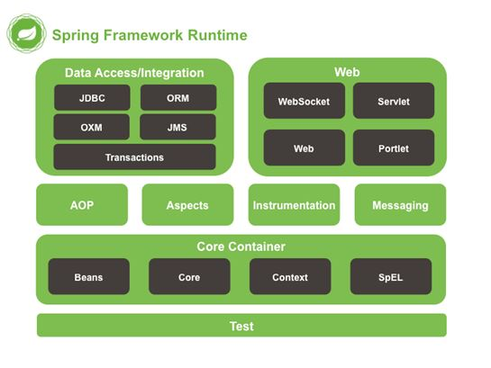

# Spring体系结构

Spring总共大约有20个模块，由1300多个不同的文件构成。而这些组件被分别整合在核心容器（CoreContainer）、AOP（AspectOrientedProgramming）和设备支持（Instrmentation）、数据访问及集成（DataAccess/Integeration）、Web、报文发送（Messaging）、Test，6个模块集合中。

组成Spring框架的每个模块集合或者模块都可以单独存在，也可以一个或多个模块联合实现。每个模块的组成和功能如下：

## 核心容器

**由spring-beans、spring-core、spring-context和spring-expression（Spring ExpressionLanguage,SpEL）4个模块组成。**

**spring-beans和spring-core模块是Spring框架的核心模块**，包含了**控制反转（InversionofControl,IOC）和依赖注入（DependencyInjection,DI）**。BeanFactory接口是Spring框架中的核心接口，它是工厂模式的具体实现。BeanFactory使用控制反转对应用程序的配置和依赖性规范与实际的应用程序代码进行了分离。但BeanFactory容器实例化后并不会自动实例化Bean，只有当Bean被使用时BeanFactory容器才会对该Bean进行实例化与依赖关系的装配。

**spring-context模块构架于核心模块之上，他扩展了BeanFactory，为她添加了Bean生命周期控制、框架事件体系以及资源加载透明化等功能。**此外该模块还提供了许多企业级支持，如邮件访问、远程访问、任务调度等，ApplicationContext是该模块的核心接口，她是BeanFactory的超类，与BeanFactory不同，ApplicationContext容器实例化后会自动对所有的单实例Bean进行实例化与依赖关系的装配，使之处于待用状态。

**spring-expression模块是统一表达式语言（EL）的扩展模块，可以查询、管理运行中的对象，同时也方便的可以调用对象方法、操作数组、集合等**。它的语法类似于传统EL，但提供了额外的功能，最出色的要数函数调用和简单字符串的模板函数。这种语言的特性是基于Spring产品的需求而设计，他可以非常方便地同SpringIOC进行交互。

## AOP和设备支持

**由spring-aop、spring-aspects和spring-instrument3个模块组成。**

**spring-aop是Spring的另一个核心模块，是AOP主要的实现模块**。作为继OOP后，对程序员影响最大的编程思想之一，AOP极大地开拓了人们对于编程的思路。在Spring中，他是以JVM的动态代理技术为基础，然后设计出了一系列的AOP横切实现，比如前置通知、返回通知、异常通知等，同时，Pointcut接口来匹配切入点，可以使用现有的切入点来设计横切面，也可以扩展相关方法根据需求进行切入。