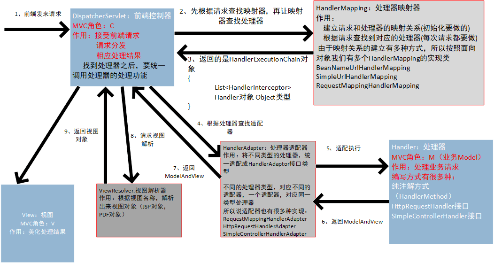

# Springmvc 介绍

## 基础概念介绍

### 应用系统的三层架构

- 表现层
  - 也就是我们常说的web层
  - 它负责**接收客户端请求，向客户端响应结果**，通常客户端使用http 协议请求web 层，web 层需要接收http 请求，完成 http 响应。
  - **表现层包括展示层和控制层**：控制层负责接收请求，展示层负责结果的展示。
  - 表现层依赖业务层，接收到客户端请求一般会调用业务层进行业务处理，并将处理结果响应给客户端。
  - 表现层的设计一般都使用 **MVC 模型**。（MVC 是表现层的设计模型，和其他层没有关系）
- 业务层
  - 也就是我们常说的 service 层。
  - 它负责业务逻辑处理，和我们开发项目的需求息息相关。web 层依赖业务层，但是业务层不依赖 web层。
  - 业务层在业务处理时可能会依赖持久层，如果要对数据持久化需要保证事务一致性。（也就是我们说的，
    事务应该放到业务层来控制）
- 持久层
  - 也就是我们是常说的 dao 层。
  - 负责数据持久化，包括数据层即数据库和数据访问层，数据库是对数据进行持久化的载体，数据访问层是业务层和持久层交互的接口，业务层需要通过数据访问层将数据持久化到数据库中。
  - 通俗的讲，持久层就是和数据库交互，对数据库表进行曾删改查的。

### MVC设计模式

MVC 是模型(model)－视图(view)－控制器(controller)的缩写， 是一种用于设计编写 Web 应用程序表现层的
模式。

MVC 设计模式的三大角色：

- **Model（模型）：**

  模型包含**业务模型**和**数据模型**，**数据模型用于封装数据，业务模型用于处理业务。**

- **View（视图）：**

  通常指的就是我们的 jsp 或者 html。作用一般就是展示数据的。

  通常视图是依据数据模型创建的。

- **Controller(控制器)：**

  是应用程序中处理用户交互的部分。作用一般就是处理程序逻辑的。

## SpringMVC介绍

### SpringMVC是什么

- SpringMVC 是一种基于MVC 设计模型的请求驱动类型的**轻量级 Web 框架**，属于 SpringFrameWork 的后续产品，已经融合在 Spring Web Flow 里面。Spring 框架提供了构建 Web 应用程序的全功能 MVC 模块。
- 使用 Spring 可插入的 MVC 架构，从而在使用 Spring 进行 WEB 开发时，可以选择使用 Spring 的Spring MVC 框架或集成其他 MVC 开发框架，如 Struts1(现在一般不用)，Struts2 等。
- SpringMVC 已经成为目前最主流的 MVC 框架之一，并且**随着 Spring3.0 的发布，全面超越 Struts2，成为最优秀的 MVC 框架。**
- 它通过一套注解，让一个简单的 Java 类成为处理请求的控制器，而无须实现任何接口。同时它还支持RESTful 编程风格的请求。

### SpringMVC与Spring的联系

Spring MVC 全名叫Spring Web MVC ，它是Spring家族Web模块的一个重要成员。

### 为什么要学习SpringMVC

也许你要问，为什么要学习Spring MVC呢？Struts2不才是主流吗？看SSH的概念有多火？

其实很多初学者混淆了一个概念，SSH实际上指的是Struts1.x+Spring+Hibernate 。这个概念已经有十几年的历史了。在Struts1.x时代，它是当之无愧的霸主，但是在新的MVC框架涌现的时代，形式已经不是这样了，Struts2.x借助了Struts1.x的好名声，让国内开发人员认为Struts2.x是霸主继任者（其实两者在技术上无任何关系），导致国内程序员大多数学习基于Struts2.x的框架，又一个貌似很火的概念出来了S2SH（ Struts2+Spring+Hibernate ）整合开发。

SpringMVC的市场占有率是40%，而Struts2只有可怜的6%。这已然说明了学习SpringMVC的必要性了，再说了，SpringMVC本身就是spring家族的一员，与整合spring时，SpringMVC根本无需中间整合包，而struts2得需要。

### 六大组件介绍

六大组件说明：

> 说明：
>
> 1. 在springmvc 的各个组件中，**前端控制器、处理器、视图**称为springmvc 的MVC组件
> 2. 在springmvc 的各个组件中，**处理器映射器、处理器适配器、视图解析器**称为springmvc 的三大组件
> 3. 需要开发的组件有：处理器、视图

- DispatcherServlet：前端控制器

  > 用户请求到达前端控制器，它就相当于mvc模式中的C，dispatcherServlet是整个流程控制的中心，由它调用其它组件处理用户的请求，dispatcherServlet的存在降低了组件之间的耦合性。

- Handler：处理器

  > Handler 是继DispatcherServlet前端控制器的后端控制器，在DispatcherServlet的控制下Handler对具体的用户请求进行处理。
  >
  > 由于Handler涉及到具体的用户业务请求，所以一般情况需要程序员根据业务需求开发Handler。

- View：视图

  > springmvc框架提供了很多的View视图类型的支持，包括：jstlView、freemarkerView、pdfView等。我
  > 们最常用的视图就是jsp。
  >
  > 一般情况下需要通过页面标签或页面模版技术将模型数据通过页面展示给用户，需要由程序员根据业务需求开发具体的页面。

- HandlerMapping：处理器映射器

  > HandlerMapping负责根据用户请求找到Handler即处理器，springmvc提供了不同的映射器实现不同的映射方式，例如：配置文件方式，实现接口方式，注解方式等。

- HandlAdapter：处理器适配器

  > 通过HandlerAdapter对处理器进行执行，这是适配器模式的应用，通过扩展适配器可以对更多类型的处理器进行执行。

- View Resolver：视图解析器

  > View Resolver负责将处理结果生成View视图，View Resolver首先根据逻辑视图名解析成物理视图名即具
  > 体的页面地址，再生成View视图对象，最后对View进行渲染将处理结果通过页面展示给用户。

## RESTful支持

理解什么是REST之前，先去理解一下什么是HTTP

### HTTP介绍

#### HTTP协议概述

HTTP协议（HyperText Transfer Protocol，超文本传输协议）是因特网上应用最为广泛的一种网络传输协议，所有的WWW文件都必须遵守这个标准。

#### 什么是HTTP协议

> HTTP协议是建立在客户端和服务器之间的一个应用层协议，在客户端和服务器之间需要数据的传输，而传输数据的时候，我们要按照指定的规则或者叫协议去传输数据。
>
> - HTTP是建立在TCP/IP协议基础之上的一个网络协议。
> - HTTP协议属于网络七层结构中最上层（应用层）的协议。
> - HTTP协议是一个无状态协议（不会记录每次访问时的信息）
> - HTTP是一个客户端和服务器端请求和应答的标准（TCP）。客户端是终端用户，服务器端是网站。

#### 什么是URL/URI

**URI：Uniform Resource Identifier，统一资源标识符。**

> 它相当于一个网络资源的名称，只是名称的表现形式是/开头的路径形式。

**URL：Uniform Resource Location，统一资源定位符。**

**URL和URI的区别：URL是URI的子集。**

#### 什么是WEB资源？

通过浏览器可以访问到的所有资源都是web资源，web资源分为静态资源和动态资源：

- 动态资源是通过后台程序展示页面数据的，比如Servlet请求。
- 静态资源的数据是不变的，比如HTML、JPG、AVI。