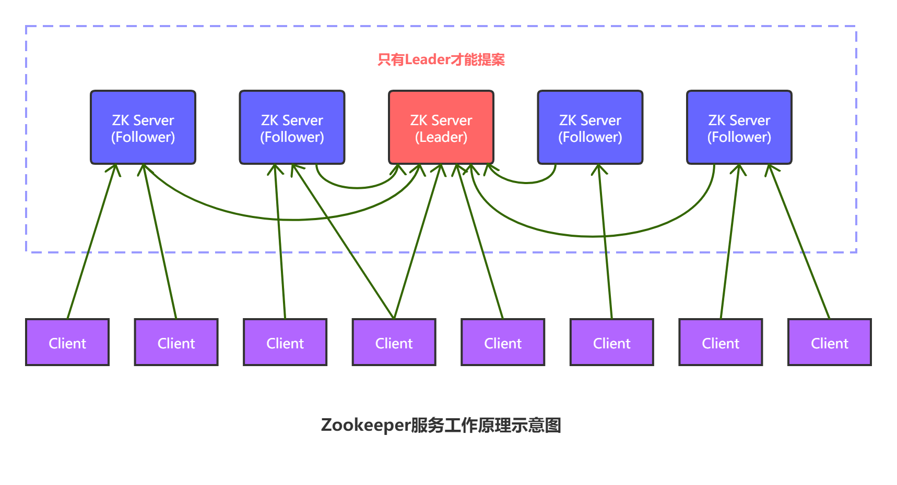
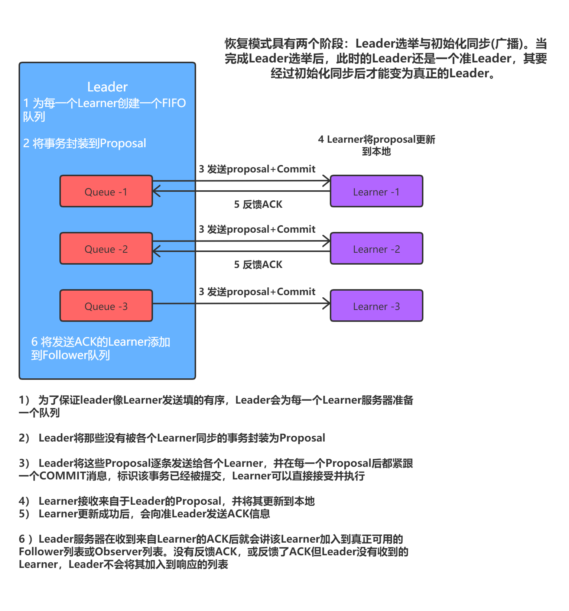
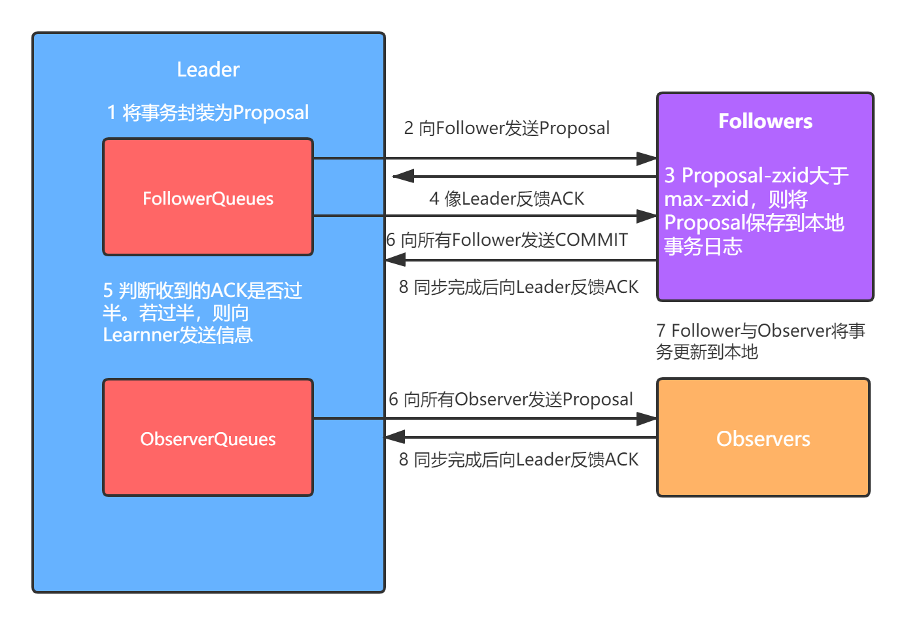
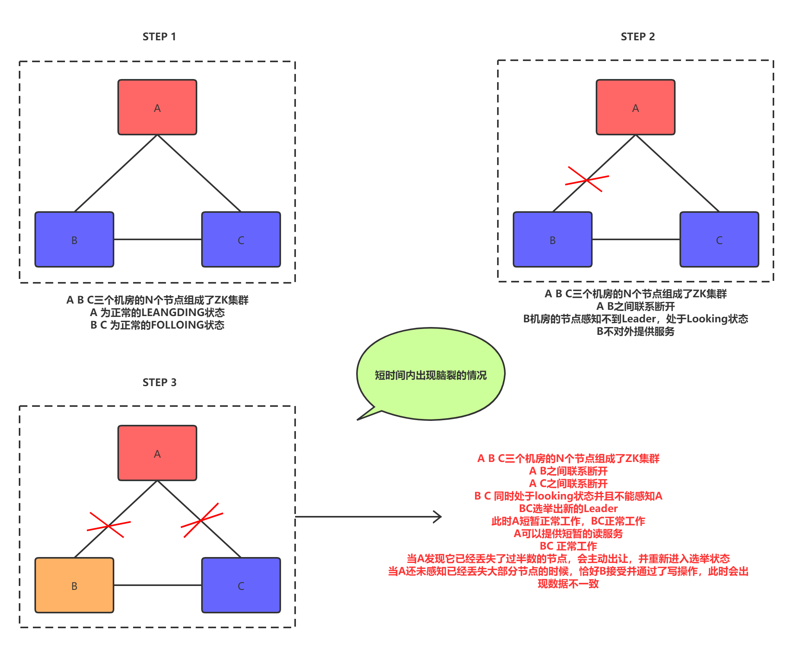
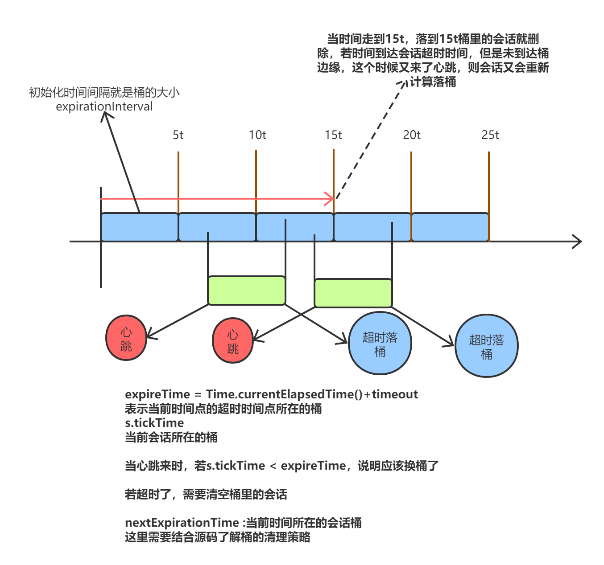
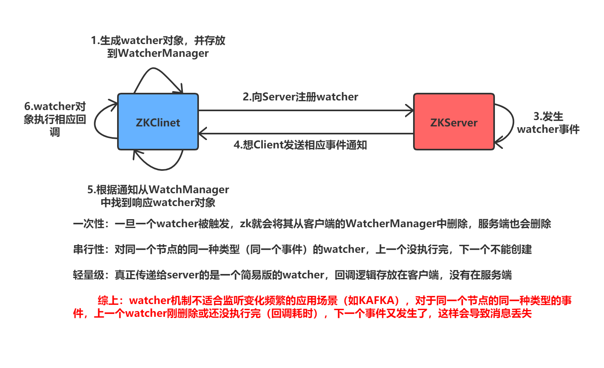

# Zookeeper理论基础

## Zookeeper简介

​	ZooKeeper 由雅虎研究院开发，后来捐赠给了 Apache。ZooKeeper 是一个开源的分布式应用程序协调服务器，其为分布式系统提供**一致性**服务。其一致性是通过基于 Paxos 算法的ZAB 协议完成的。其主要功能包括：配置维护、域名服务、分布式同步、集群管理等。


## 一致性

​	zk 是如何保证分布式系统的一致性的呢？是因为 zk 具有以下几方面的特点：

### 顺序一致性

​	从同一个客户端发起的多个事务请求（写操作请求），最终会严格按照其发起顺序记录到zk中。

### 原子性

​	所有事务请求的结果在集群中所有 Server 上的应用情况是一致的。要么全部应用成功，要么都没有成功，不会出现部分成功，部分失败的情况。

### 单一视图

​	无论客户端连接的是集群中的哪台 Server，其读取到的数据模型中的数据都是一致的。

### 可靠性

​	一旦某事务被成功应用到了 zk，则会一直被保留下来，除非另一个事务将其修改。

### 最终一致性

​	一旦一个事务被成功应用，zk 可以保证在一段较短的时间内，客户端最终一定能够从服务端读取到最新的数据。但不能保证实时读取到。


## Paxos算法

​	对于ZK理论的学习，最重要也是最难的知识点就是Paxos算法。

### 算法简介

​	Paxos 算法是莱斯利·兰伯特(Leslie Lamport)1990 年提出的一种基于消息传递的、具有高容错性的**一致性算法**。Google Chubby 的作者 Mike Burrows 说过，世上只有一种**一致性算法**，那就是 Paxos，所有其他一致性算法都是 Paxos 算法的不完整版。Paxos 算法是一种公认的晦涩难懂的算法，并且工程实现上也具有很大难度。较有名的Paxos工程实现有Google Chubby、ZAB、微信的 PhxPaxos 等。

​	Paxos 算法是用于解决什么问题的呢？Paxos 算法要解决的问题是，在分布式系统中如何就某个决议达成一致。

### Paxos与拜占庭将军问题

​	拜占庭将军问题是由 Paxos 算法作者莱斯利·兰伯特提出的点对点通信中的基本问题。该问题要说明的含义是，**在不可靠信道上试图通过消息传递的方式达到一致性是不可能的**。所以，**Paxos 算法的前提是不存在拜占庭将军问题**，即信道是安全的、可靠的，集群节点间传递的消息是不会被篡改的。

​	一般情况下，分布式系统中各个节点间采用两种通讯模型：共享内存（Shared Memory）、消息传递（Messages Passing）。而 Paxos 是基于消息传递通讯模型的。

### 算法描述

#### 三种角色

​	在 Paxos 算法中有三种角色，分别具有三种不同的行为。但很多时候，一个进程可能同时充当着多种角色。

- **Proposer：提案者**
- **Acceptor：表决者**
- **Leanrner：同步者**

#### Paxos算法的一致性

​	Paxos 算法的一致性主要体现在以下几点：

- 每个提案者在提出提案时都会首先获取到一个具有全局唯一性的、递增的提案编号 N，即在整个集群中是唯一的编号 N，然后将该编号赋予其要提出的提案。
- 每个表决者在 accept 某提案后，会将该提案的编号 N 记录在本地，这样每个表决者中保存的已经被 accept 的提案中会存在一个编号最大的提案，其编号假设为 maxN。每个表决者仅会 accept 编号大于自己本地 maxN 的提案。
- 在众多提案中最终只能有一个提案被选定。
- 一旦一个提案被选定，则其它服务器会主动同步(Learn)该提案到本地。
- 没有提案被提出则不会有提案被选定。

#### 算法过程描述

Paxos 算法的执行过程划分为两个阶段：准备阶段 prepare 与接受阶段 accept。

.jpg)

##### prepare阶段

1. 提案者(Proposer)准备提交一个编号为 N 的提议，于是其首先向所有表决者(Acceptor)发送 prepare(N)请求，用于试探集群是否支持该编号的提议。
2. 每个表决者(Acceptor)中都保存着自己曾经 accept 过的提议中的最大编号 maxN。当一个表决者接收到其它主机发送来的 prepare(N)请求时，其会比较 N 与 maxN 的值。有以下几种情况：
   1. 若 N 小于 maxN，则说明该提议已过时，当前表决者采取不回应或回应 Error 的方式来拒绝该 prepare 请求；
   2. 若N大于maxN，则说明该提议是可以接受的，当前表决者会首先将该N记录下来，并将其曾经已经 accept 的编号最大的提案 Proposal(myid,maxN,value)反馈给提案者以向提案者展示自己支持的提案意愿。其中第一个参数 myid 表示该提案的提案者标识 id，第二个参数表示其曾接受的提案的最大编号 maxN，第三个参数表示该提案的真正内容 value。当然，若当前表决者还未曾 accept 过任何提议，则会将Proposal(myid,null,null)反馈给提案者。
   3. 在 prepare 阶段 N 不可能等于 maxN。这是由 N 的生成机制决定的。要获得 N 的值，其必定会在原来数值的基础上采用同步锁方式增一。

##### accept阶段

1. 当提案者(Proposer)发出 prepare(N)后，若收到了超过半数的表决者(Accepter)的反馈，那么该提案者就会将其真正的提案 Proposal(myid,N,value)发送给所有的表决者。
2. 当表决者(Acceptor)接收到提案者发送的 Proposal(myid,N,value)提案后，会再次拿出自己曾经 accept 过的提议中的最大编号 maxN，或曾经记录下的 prepare 的最大编号，让 N与它们进行比较，若 N 大于等于这两个编号，则当前表决者 accept 该提案，并反馈给提案者。若 N 小于这两个编号，则表决者采取不回应或回应 Error 的方式来拒绝该提议。
3. 若提案者没有接收到超过半数的表决者的 accept 反馈，则有两种可能的结果产生。一是放弃该提案，不再提出；二是重新进入 prepare 阶段，递增提案号，重新提出 prepare请求。
4. 若提案者接收到的反馈数量超过了半数，则其会向外广播两类信息：
   1. 向曾 accept 其提案的表决者发送“可执行数据同步信号”，即让它们执行其曾接收到的提案；
   2. 向未曾向其发送 accept 反馈的表决者发送“提案 + 可执行数据同步信号”，即让它们接受到该提案后马上执行。

### Paxos算法的活锁问题

​	前面所述的Paxos算法在实际工程应用过程中，根据不同的实际需求存在诸多不便之处，所以也就出现了很多对于基本 Paxos 算法的优化算法，以对 Paxos 算法进行改进，例如，MultiPaxos、Fast Paxos、EPaxos。

​	例如，Paxos 算法存在“活锁问题”，Fast Paxos 算法对 Paxos 算法进行了改进：只允许一个进程提交提案，即该进程具有对 N 的唯一操作权。该方式解决了“活锁”问题。

	活锁指的是任务或者执行者没有被阻塞，由于某些条件没有满足，导致一直重复尝试—失败—尝试—失败的过程。处于活锁的实体是在不断的改变状态，活锁有可能自行解开。
		两个节点提案，但是一直重提，就会一直不成功
		该问题的解决：只允许一个进程提交提案
**死锁需要同时具备以下几个条件**
			**互斥条件：一个资源每次只能被一个进程使用**
			**请求与保持条件：一个进程因请求资源而阻塞时，对方获得的资源保持不放**
			**不剥夺条件：进程已获得的资源，在未使用完之前，不能强行剥夺**
			**循环等待条件L若干进程之间形成一种头尾相接的循环等待资源关系**


## ZAB协议

### ZAB协议简介

​	ZAB ，Zookeeper Atomic Broadcast，**zk 原子消息广播协议**，是专为 ZooKeeper 设计的一种支持**崩溃恢复**的原子广播协议，在 Zookeeper 中，主要依赖 ZAB 协议来实现分布式数据一致性。

​	Zookeeper 使用一个单一主进程来接收并处理客户端的所有事务请求，即写请求。当服务器数据的状态发生变更后，集群采用 ZAB 原子广播协议，以事务提案 Proposal 的形式广播到所有的副本进程上。ZAB 协议能够保证一个全局的变更序列，即可以为每一个事务分配一个全局的递增编号 xid。

​	当 Zookeeper 客户端连接到 Zookeeper 集群的一个节点后，若客户端提交的是读请求，那么当前节点就直接根据自己保存的数据对其进行响应；如果是写请求且当前节点不是Leader，那么节点就会将该写请求转发给 Leader，Leader 会以提案的方式广播该写操作，只要有超过半数节点同意该写操作，则该写操作请求就会被提交。然后 Leader 会再次广播给所有订阅者，即 Learner，通知它们同步数据。



### ZAB于Paxos的关系

​	ZAB 协议是 Paxos 算法的一种工业实现算法。但两者的设计目标不太一样。ZAB 协议主要用于构建一个高可用的分布式数据**主从系统**，即 Follower 是 Leader 的从机，Leader 挂了，马上就可以选举出一个新的 Leader，但平时它们都对外提供服务。而 Fast Paxos 算法则是用于构建一个分布式一致性状态机系统，确保系统中各个节点的状态都是一致的。

主备和主从的区别：
			主备：平时备用机只做备份，当主宕机，切换到备用机
			主从：平时从机是对外服务的，当主宕机，从机变主机

### 三类角色

​	为了避免 Zookeeper 的单点问题，zk 也是以集群的形式出现的。zk 集群中的角色主要有以下三类：

- Leader：事务请求的唯一处理者，也可以处理读请求。
- Follower：可以直接处理客户端的读请求，并向客户端响应；但其不会处理事务请求，其只会将客户端事务请求转发给Leader来处理；对Leader发起的事务提案具有表决权；同步 Leader 中的事务处理结果；Leader 选举过程的参与者，具有选举权与被选举权。 （就好像正式工）
- Observer：可以理解为不参与 Leader 选举的 Follower，在 Leader 选举过程中没有选举权与被选举权；同时，对于 Leader 的提案没有表决权。用于协助 Follower 处理更多的客户端读请求。Observer 的增加，会提高集群读请求处理的吞吐量，但不会增加事务请求的通过压力，不会增加 Leader 选举的压力。（就好像临时工）

**observer的数量问题**

Observer 数量一般与 Follower 数量相同。并不是 Observer 越多越好，因为 Observer 数量的增多虽不会增加事务操作压力，但其需要从 Leader 同步数据，Observer 同步数据的时间是小于等于 Follower 同步数据的时间的。当 Follower 同步数据完成，Leader 的 Observer列表中的 Observer 主机将结束同步。那些完成同步的 Observer 将会进入到另一个对外提供服务的列表。那么，那些没有同步了数据无法提供服务的 Observer 主机就形成了资源浪费。

所以，对于事务操作发生频繁的系统，不建议使用过多的 Observer。

- ​	并不是越多越好，虽然不会增加事务和选举的压力，但是其需要从leader同步数据，若observer很多，会增加leader的压力。
- ​	Leader将follower同步完成之后，会结束observer的同步
- ​	Leader中存在两个关于Observer的列表：ALL（包含所有observer）于serverce（包含与leader同步过数据的Observer）
- ​	service列表是动态变化的，对于没有进入到service列表中的Observer，其会通过心跳与Leader进行连接，一旦连接成功，马上就会从Leader同步数据，同步完成后向Leader发送ACK。Leader在接收到其ACK后会将其添加到service列表。
- ​	若客户端连接上了不在service列表中的Observer，那么这个Observer是不能提供服务的。因为该Observer的状态不是Observering。这个状态是通过Observer与Leader间的心跳来维护的。
- ​	Leader中对于Follower也同样存在两个列表：all与service。其功能与Observer的相似。但不同点是，若Leader收到的Follower同步完成的ACK数量没有过半，则认为同步失败，会重新进行广播，让Follower重新进行同步。

综上：写操作少，读操作很多很多的业务场景下，可以设置合理多的observer，对于写操作多的情况，设置合理少的Observer


这三类角色在不同的情况下又有一些不同的名称：

- **Learner**：学习者，即要从 Leader 中同步数据的 Server，即 Follower 与 Observer。
- **QuorumServer**：QuorumPeer，Participant，法定服务器，法定主机，参与者。在集群正常服务状态下，具有表决权的服务器称为 QuorumServer，或 QuorumPeer；在 Leader选举过程中，具有选举权与被选举权的服务器，称为 Participant。**QuorumServer = Leader + Follower = Participant**

### 三个数据

在 ZAB 中有三个很重要的数据：

- **zxid**：其为一个 64 位长度的 Long 类型，其中高 32 位表示 epoch，低 32 位表示 xid。
- **epoch**：（时期、年号）每个 Leader 选举结束后都会生成一个新的 epoch，并会通知到集群中所有其它 Server，包含 Follower 与 Observer。
- **xid**：事务 id，是一个流水号。

### 三种模式

ZAB 协议中对 zkServer 的状态描述有三种模式。这三种模式并没有十分明显的界线，它们相互交织在一起。

#### 恢复模式

​	在集群启动过程中，或 Leader 崩溃后，系统都需要进入恢复模式，以恢复系统对外提供服务的能力。其包含两个重要阶段：Leader 选举与初始化同步。

恢复模式的三个原则

- **Leader的主动出让原则**：若集群中Leader收到的Follower心跳数量没有过半，此时Leader会自认为自己与集群的连接已经出现了问题，其会主动修改自己的状态为LOOKING，去查找新的Leader。为了防止集群出现脑裂。而其它Server由于有过半的主机认为已经丢失了Leader，所以它们会发起新的Leader选举，选出一个新的Leader。一个集群出现两个Leader叫脑裂
- **已经被处理过的消息不能丢**：Leader的更新还未同步到所有Follwer，此时Leader挂，再进行Leader选举的时候，会从maxN最大的Follower中选出新的Leader，此时，在进行同步算法，初始化同步。
- **被丢弃的消息不能再现原则**：Leader某个事务修改了还未同步到Follower，此时Leader挂了，原来的Followers投票选举了新的Leader，原先的Leader重启后变成Follower，此时再去同步事务，直到遇到与新leader事务ID相同的事务后，递归同步相同事务+1的事务，之前的应该被丢弃的消息会被覆盖。

#### 广播模式

其分为两类：初始化广播与更新广播。

##### 初始化广播

​	前面我们说过，恢复模式具有两个阶段：Leader 选举与初始化同步(广播)。当完成 Leader
选举后，此时的 Leader 还是一个准 Leader，其要经过初始化同步后才能变为真正的 Leader。



##### 消息广播算法



当集群中的 Learner 完成了初始化状态同步，那么整个 zk 集群就进入到了正常工作模式了。

如果集群中的 Learner 节点收到客户端的事务请求，那么这些 Learner 会将请求转发给Leader 服务器。然后再执行如下的具体过程：

1. Leader 接收到事务请求后，为事务赋予一个全局唯一的 64 位自增 id，即 zxid，通过zxid 的大小比较即可实现事务的有序性管理，然后将事务封装为一个 Proposal。
2. Leader 根据 Follower 列表获取到所有 Follower，然后再将 Proposal 通过这些 Follower 的队列将提案发送给各个 Follower。
3. 当 Follower 接收到提案后，会先将提案的 zxid 与本地记录的事务日志中的最大的 zxid进行比较。若当前提案的 zxid 大于最大 zxid，则将当前提案记录到本地事务日志中，并向 Leader 返回一个 ACK。（提问学员）
4. 当 Leader 接收到过半的 ACKs 后，Leader 就会向所有 Follower 的队列发送 COMMIT消息，向所有 Observer 的队列发送 Proposal。
5. 当 Follower 收到 COMMIT 消息后，就会将日志中的事务正式更新到本地。当 Observer收到 Proposal 后，会直接将事务更新到本地。
6. 无论是 Follower 还是 Observer，在同步完成后都需要向 Leader 发送成功 ACK。

#### 同步模式

其分为两类：初始化同步与更新同步。

### 四种状态

​	zk 集群中的每一台主机，在不同的阶段会处于不同的状态。每一台主机具有四种状态。

- **LOOKING**：选举状态
- **FOLLOWING**：Follower 的正常工作状态
- **OBSERVING**：Observer 的正常工作状态
- **LEADING**：Leader 的正常工作状态

### Leader选举

​	在集群启动过程中，或 Leader 宕机后，集群就进入了恢复模式。恢复模式中最重要的阶段就是 Leader 选举。

#### Leader选举的基本概念

**myid:**也称为 ServerId，这是 zk 集群中服务器的唯一标识。例如，有三个 zk 服务器，那么编号分别是 1,2,3。

**逻辑时钟**:逻辑时钟，Logicalclock，是一个整型数，该概念在选举时称为 logicalclock，而在选举结束后称为 epoch。即 epoch 与 logicalclock 是同一个值，在不同情况下的不同名称。

#### Leader选举算法

​	在集群启动过程中的 Leader 选举过程（算法）与 Leader 断连后的 Leader 选举过程稍微有一些区别，基本相同。

##### 集群启动中的Leader选举

.jpg)

##### 宕机后的Leader选举

​	在 Zookeeper 运行期间，Leader 与非 Leader 服务器各司其职，即便当有非 Leader 服务器宕机或新加入时也不会影响 Leader。但是若 Leader 服务器挂了，那么整个集群将暂停对外服务，进入新一轮的 Leader 选举，其过程和启动时期的 Leader 选举过程基本一致。

.jpg)

假设正在运行的有 Server1、Server2、Server3 三台服务器，当前 Leader 是 Server2，若某一时刻 Server2 挂了，此时便开始新一轮的 Leader 选举了。选举过程如下：

1. 变更状态。Leader 挂后，余下的非 Observer 服务器都会将自己的服务器状态由FOLLOWING 变更为 LOOKING，然后开始进入 Leader 选举过程。
2. 每个 Server 会发出一个投票，仍然会首先投自己。不过，在运行期间每个服务器上的 ZXID 可能是不同，此时假定 Server1 的 ZXID 为 111，Server3 的 ZXID 为 333；在第一轮投票中，Server1 和 Server3 都会投自己，产生投票(1, 111)，(3, 333)，然后各自将投票发送给集群中所有机器。
3.  接收来自各个服务器的投票。与启动时过程相同。集群的每个服务器收到投票后，首先判断该投票的有效性，如检查是否是本轮投票、是否来自 LOOKING 状态的服务器。
4.  处理投票。与启动时过程相同。针对每一个投票，服务器都需要将别人的投票和自己的投票进行 PK。对于 Server1 而言，它的投票是(1, 111)，接收 Server3 的投票为(3, 333)。其首先会比较两者的 ZXID，Server3 投票的 zxid 为 333 大于 Server1 投票的 zxid 的 111，于是Server1 更新自己的投票为(3, 333)，然后重新投票。对于 Server3 而言，其无须更新自己的投票，只是再次向集群中所有主机发出上一次投票信息即可。
5. 统计投票。与启动时过程相同。对于 Server1、Server2 而言，都统计出集群中已经有两台主机接受了(3, 333)的投票信息，此时便认为已经选出了新的 Leader，即 Server3。
6. 改变服务器的状态。与启动时过程相同。一旦确定了 Leader，每个服务器就会更新自己的状态。Server1 变更为 FOLLOWING，Server3 变更为 LEADING。

## 高可用集群的容灾

### 服务器数量的奇数与偶数

​	前面我们说过，无论是写操作投票，还是 Leader 选举投票，都必须过半才能通过，也就是说若出现超过半数的主机宕机，则投票永远无法通过。基于该理论，由 5 台主机构成的集群，最多只允许 2 台宕机。而由 6 台构成的集群，其最多也只允许 2 台宕机。即，6 台与5 台的容灾能力是相同的。基于此容灾能力的原因，建议使用奇数台主机构成集群，以避免资源浪费。

​	但从系统吞吐量上说，6 台主机的性能一定是高于 5 台的。所以使用 6 台主机并不是资源浪费。

### 集群容灾设计方案

​	对于一个高可用的系统，除了要设置多台主机部署为一个集群避免单点问题外，还需要考虑将集群部署在多个机房、多个楼宇。对于多个机房、楼宇中集群也是不能随意部署的，下面就多个机房的部署进行分析。

​	在多机房部署设计中，要充分考虑“过半原则”，也就是说，尽量要确保 zk 集群中有过半的机器能够正常运行。

#### 三机房部署

​	在生产环境下，三机房部署是最常见的、容灾性最好的部署方案。

三机房部署中要求每个机房中的主机数量必须少于集群总数的一半。这样可以保证，三个机房中若有一个机房断电或断网，其它两个机房中的机器总数仍是过半的，集群仍可以正常对外提供服务。当然，若两个机房出现了问题，那么整个集群就瘫痪了。这种情况出现的概率要远低于一个机房出问题的情况。

#### 双机房部署

​	zk 官网没有给出较好的双机房部署的容灾方案。只能是让其中一个机房占有超过半数的主机，使其做为主机房，而另一机房少于半数。当然，若主机房出现问题，则整个集群会瘫痪。

## CAP定理

### 简介

​	CAP 定理指的是在一个分布式系统中，Consistency（一致性）、 Availability（可用性）、Partition tolerance（分区容错性），三者不可兼得。

- **一致性（C）**：分布式系统中多个主机之间是否能够保持数据一致的特性。即，当系统数据发生更新操作后，各个主机中的数据仍然处于一致的状态。
- **可用性（A）**：系统提供的服务必须一直处于可用的状态，即对于用户的每一个请求，系统总是可以在有限的时间内对用户做出响应。
- **分区容错性（P）**：分布式系统在遇到任何网络分区故障时，仍能够保证对外提供满足一致性和可用性的服务。

对于分布式系统，网络环境相对是不可控的，出现网络分区是不可避免的，因此系统必须具备分区容错性。但其并不能同时保证一致性与可用性。CAP 原则对于一个分布式系统来说，只可能满足两项，即要么 CP，要么 AP。

### Base理论

​	BASE 是 Basically Available（基本可用）、Soft state（软状态）和 Eventually consistent（最终一致性）三个短语的简写。是 CAP 定理对于一致性与可用性权衡的结果。

​	BASE 理论的核心思想是：即使无法做到强一致性，但每个系统都可以根据自身的业务特点，采用适当的方式来使系统达到最终一致性。

#### 基本可用

​	基本可用是指分布式系统在出现不可预知故障的时候，允许损失部分可用性。

- 响应时间的损失：
- 功能上的损失：为了保证重要的功能，牺牲一些不重要的功能，服务降级。

#### 软状态

​	软状态，是指允许系统数据存在的中间状态，并认为该中间状态的存在不会影响系统的整体可用性，即允许系统主机间进行数据同步的过程存在一定延时。软状态，其实就是一种灰度状态，过渡状态。

#### 最终一致性

​	最终一致性强调的是系统中所有的数据副本，在经过一段时间的同步后，最终能够达到一个一致的状态。因此，最终一致性的本质是需要系统保证最终数据能够达到一致，而不需要实时保证系统数据的强一致性。

### ZK 与 CP

​	zk 遵循的是 CP 原则，即保证了一致性，但牺牲了可用性。体现在哪里呢？

​	当 Leader 宕机后，zk 集群会马上进行新的 Leader 的选举。但选举时长一般在 200 毫秒内，最长不超过 60 秒，整个选举期间 zk 集群是不接受客户端的读写操作的，即 zk 集群是处于瘫痪状态的。所以，其不满足可用性。

​	Eureka 保证了 AP，牺牲了 CP。即其保证了可用性，但无法保证一致性。

## ZK可能会存在脑裂




# Zookeeper的Leader选举机制

 

## 源码分析

Zookeeper 的 Leader 选举类是 FastLeaderElection，该类是 ZAB 协议在 Leader 选举中的工程应用，所以直接找到该类对其进行分析。该类中的最为重要的方法为 lookForLeader()，是选举 Leader 的核心方法。该方法大体思路可以划分为以下几块：

### 选举前的准备工作

​	选举前需要做一些准备工作，例如，创建选举对象、创建选举过程中需要用到的集合、初始化选举时限等。

### 将自己作为初始化Leader投出去

​	在当前 Server 第一次投票时会先将自己作为 Leader，然后将自己的选票广播给其它所有 Server。

### 验证自己的投票与大家的投票谁更适合做Leader

​	在“我选我”后，当前 Server 同样会接收到其它 Server 发送来的选票通知(Notification)。通过 while 循环，遍历所有接收到的选票通知，比较谁更适合做 Leader。若找到一个比自己更适合的 Leader，则修改自己选票，重新将新的选票广播出去。当然，每验证一个选票，则会将其记录到一个集合中，将来用于进行票数统计。

### 判断本轮选举是否应该结束

​	其实在每次验证过谁更适合做 Leader 后，就会马上判断当前的选举是否可以结束了，即当前主机所推荐的这个选票是否过半了。若过半了，则直接完成后续的一些收尾工作，例如清空选举过程中所使用的集合，以备下次使用；再例如，生成最终的选票，以备其它 Server来同步数据。若没有过半，则继续从队列中读取出下一个来自于其它主机的选票，然后进行验证。

### 无需选举的情况

​	对一些特殊情况的处理。


# Zookeeper的安装与集群搭建


# Zookeeper技术内幕

## 重要理论

### 数据模型 znode

.jpg)


每个znode上都可以放数据，每隔znode只能放一个数据，数据最大1M

#### 节点类型

- 持久节点：
- 持久顺序节点：
- 临时节点：其生命周期与客户端会话相同， 临时节点无子节点，只能做叶子节点
- 临时顺序节点：

#### 节点状态

- <font color=#FF0000 >cZxid</font>：Created Zxid，表示当前 znode 被创建时的事务 ID
- <font color=#FF0000 >ctime</font>：Created Time，表示当前 znode 被创建的时间
- <font color=#FF0000 >mZxid</font>：Modified Zxid，表示当前 znode 最后一次被修改时的事务 ID
- <font color=#FF0000 >mtime</font>：Modified Time，表示当前 znode 最后一次被修改时的时间
- <font color=#FF0000 >pZxid</font>：表示当前 znode 的<font color=#FF0000 >子节点列表</font>最后一次被修改时的事务 ID。注意，只能是其子节点列表变更了才会引起 pZxid 的变更，子节点内容的修改不会影响 pZxid。
- <font color=#FF0000 >cversion</font>：Children Version，表示子节点的版本号。该版本号用于充当乐观锁。
- <font color=#FF0000 >dataVersion</font>：表示当前 znode 数据的版本号。该版本号用于充当乐观锁。
- <font color=#FF0000 >aclVersion</font>：表示当前 znode 的权限 ACL 的版本号。该版本号用于充当乐观锁。
- <font color=#FF0000 >ephemeralOwner</font>：若当前 znode 是持久节点，则其值为 0；若为临时节点，则其值为创建该节点的话的SessionID。当会话消失后，会根据 SessionID 来查找与该会话相关的临时节点进行删除。
- <font color=#FF0000 >dataLength</font>：当前 znode 中存放的数据的长度。
- <font color=#FF0000 >numChildren</font>：当前 znode 所包含的子节点的个数。

### 会话

会话是 zk 中最重要的概念之一，客户端与服务端之间的任何交互操作都与会话相关。

ZooKeeper 客户端启动时，首先会与 zk 服务器建立一个 TCP 长连接。连接一旦建立，客户端会话的生命周期也就开始了。

#### 会话状态

常见的会话状态有三种：

- <font color=#FF0000 >CONNECTING</font>：连接中。Client要创建一个连接，其首先会在本地创建一个zk对象，用于表示其所连接上的Server。
- <font color=#FF0000 >CONNECTED</font>：已连接。连接成功后，该连接的各种临时性数据会被初始化到zk对象中。
- <font color=#FF0000 >CLOSED</font>：已关闭。连接关闭后，这个代表Server的zk对象会被删除。

#### 会话连接超时管理--客户端维护

​	我们这里的会话连接超时管理指的是，客户端所发起的服务端连接时间记录，是从客户端当前会话第一次发起服务端连接的时间开始计时。

#### 会话空闲超时管理--服务端维护

​	服务器为每一个客户端的会话都记录着上一次交互后空闲的时长，及从上一次交互结束开始会话空闲超时的时间点。一旦空闲时长超时，服务端就会将该会话的 SessionId 从服务端清除。这也就是为什么客户端在空闲时需要定时向服务端发送心跳，就是为了维护这个会话长连接的。服务器是通过空闲超时管理来判断会话是否发生中断的。

​	服务端对于会话空闲超时管理，采用了一种特殊的方式——分桶策略。


源码入口：ZookepperServer   startUp()


算桶：SeesionTrackerImpl    roundToInterval(long time


tickTime用于记录当前会话所在的会话桶

touchSession

计算当前会话的空闲超时时间点所在的桶：

expireTime =  roundToInterval(Time.currentLapsedTime()+timeout)




### ACL

#### ACL简介

​	ACL是一种细粒度的权限管理策略，可以针对任意用户与组进行细粒度的权限控制。zk利用ACL控制znode节点的访问权限，如节点数据读写、节点创建、节点删除、读取子节点列表、设置节点权限等

​	UGO, User Group Others，是一种粗粒度的权限管理策略

#### ZK的ACL维度

​	node与子node之间是“挂载”关系，不是包含关系，子 znode 不会继承父 znode 的权限。

​	 Zookeeper 的 ACL 分为三个维度：授权策略 scheme、授权对象 id、用户权限 permission

##### 授权策略 scheme

​	授权策略用于确定权限验证过程中使用的检验策略（简单来说就是，通过什么来验证权限，或一个用户要访问某个节点，系统如何验证其身份），在 zk 中最常用的有四种策略。

- IP：根据 IP 地址进行权限验证。
- digest：根据用户名与密码进行验证。
- world：对所有用户不做任何验证。
- super：超级用户可以对任意节点进行任意操作。这种模式打开客户端的方式都与正常方式的不同。需要在打开客户端时添加一个系统属性。

##### 授权对象

​	授权对象指的是权限赋予的用户。不同的授权策略具有不同类型的授权对象。下面是各个授权模式对应的授权对象 id。

- ip：授权对象是 IP 地址。
- digest：授权对象是“用户名 + 密码”。
- world：其授权对象只有一个，即 anyone。
- Super：与 digest 相同，极权对象为“用户名 + 密码”。

##### 权限Permission

​	权限指的是通过验证的用户可以对 znode 执行的操作。共有五种权限，不过 zk 支持自定义权限。

- c：Create，允许授权对象在当前节点下创建子节点。
- d：Delete，允许授权对象删除当前节点。
- r：Read，允许授权对象读取当前节点的数据内容，及子节点列表。
- w：Write，允许授权对象修改当前节点的数据内容，及子节点列表。
- a：Acl，允许极权对象对当前节点进行 ACL 相关的设置。


### Watcher机制

​	zk 通过 Watcher 机制实现了发布/订阅模式。

#### watcher工作原理



#### watcher事件

对于同一个事件类型，在不同的通知状态中代表的含义是不同的。

| 客户端所处的状态 | 事件类型                 | 触发条件                                                     | 说明                           |
| ---------------- | ------------------------ | ------------------------------------------------------------ | ------------------------------ |
| SyncConnected    | Node(-1)                 | 客户端与服务器成功建立会话                                   | 此时客户端与服务器处于连接状态 |
| SyncConnected    | NodeCreated（1）         | Watcher 监听的对应数据节点被创建                             | 客户端与服务器成功建立会话     |
| SyncConnected    | NodeDeleted（2）         | <font color=#FF0000 >**Watcher 监听的对应数据节点被删除**</font> | 客户端与服务器成功建立会话     |
| SyncConnected    | NodeDataChange（2）      | <font color=#FF0000 >**Watcher 监听的对应数据节点的数据内容发生变化**</font> | 客户端与服务器成功建立会话     |
| SyncConnected    | NodeChildrenChanged（4） | <font color=#FF0000 >**Watcher 监听的对应数据节点的子节点列表**</font> | 客户端与服务器成功建立会话     |
| Disconnected     | Node(-1)                 | 客户端与ZK失联                                               | 断开状态                       |
| Expire(-112)     | Node(-1)                 | 会话失效                                                     |                                |
| AuthFailed       | Node(-1)                 | 使用错误的scheme                                             |                                |


## 客户端命令

### 连接客户端

```shell
zkCli.sh
zkCli.sh -server 192.168.1.201:2181
```

### 查看子节点-ls

ls

### 创建节点

create /china 999

create -s /china/beijing bj

create -e /china/aaa A

当创建临时节点的客户端关闭时，临时节点自动删除

### 获取节点信息

**get**

cZxid: Create Zxid表示当前节点被创建时的事务ID
			ctime: Create time
			mZxid: Modified Zxid
			mtime:
			pZxid: 表示当前znode的子节点列表最后一次被修改时的事务ID
			cversion:Children Version 表示子节点的版本号。该版本号用于充当乐观锁
			dataVersion:表示当前znode数据的版本号。该版本号用于充当乐观锁。
			ephemeralOwner：若当前节点是持久节点，值为0.若是临时节点，则是创建该临时节点的会话SessionID
			dataLength:当前znode中存放的数据的长度
			numChildren：当前znode锁包含的子节点的个数

### 修改

set /china/shenzhen sz666

### 删除

delete /china/guangzhou

有子节点就不能删

### ACL

getAcl

addauth digest zs:123

setAcl /china auth:zs:123:cdrwa

权限不向下访问，可以访问该节点的子节点列表


## ZKClient客户端

### 简介

​	ZkClient 是一个开源客户端，在 Zookeeper 原生 API 接口的基础上进行了包装，更便于开发人员使用。内部实现了 Session 超时重连，Watcher 反复注册等功能。像 dubbo 等框架对其也进行了集成使用。

### TODO

## Curator客户端

### 简介

Curator 是 Netflix 公司开源的一套 zk 客户端框架，与 ZkClient 一样，其也封装了 zk 原生API。其目前已经成为 Apache 的顶级项目。同时，Curator 还提供了一套易用性、可读性更强的 Fluent 风格的客户端 API 框架.

### TODO


# Zookeeper典型应用场景

​	为进一步加强对 zk 的认识，理解 zk 的作用，下面再详细介绍一下 zk 在生产环境中的典型应用场景。

## 配置维护

### 什么是配置维护

​	分布式系统中，很多服务都是部署在集群中的，即多台服务器中部署着完全相同的应用，起着完全相同的作用。当然，集群中的这些服务器的配置文件是完全相同的。

​	若集群中服务器的配置文件需要进行修改，那么我们就需要逐台修改这些服务器中的配置文件。如果我们集群服务器比较少，那么这些修改还不是太麻烦，但如果集群服务器特别多，比如某些大型互联网公司的 Hadoop 集群有数千台服务器，那么纯手工的更改这些配置文件几乎就是一件不可能完成的任务。即使使用大量人力进行修改可行，但过多的人员参与，出错的概率大大提升，对于集群所形成的危险是很大的。

### 实现原理

.jpg)

zk 可以通过“发布/订阅模型”实现对集群配置文件的管理与维护。“发布/订阅模型”分为推模式（Push）与拉模式（Pull）。zk 的“发布/订阅模型”采用的是推拉相结合的模式。

**修改数据节点大小**

vim zkServer.sh

在头部添加

ZOO_USER_CFG=”-Djute.maxbuffer=XXX”

## 命名服务

### 什么是命名服务

​	命名服务是指可以为一定范围内的元素命名一个唯一标识，以与其它元素进行区分。在分布式系统中被命名的实体可以是集群中的主机、服务地址等。

### 实现原理

.jpg)

​	通过利用 zk 中节点路径不可重复的特点来实现命名服务的。当然，也可以配带上顺序节点的有序性来体现唯一标识的顺序性。

## DNS服务

​	zk 的 DNS 服务的功能主要是实现消费者与提供者的解耦合，防止提供者的单点问题，实现对提供者的负载均衡。

.jpg)

### 什么是DNS

​	DNS，Domain Name System，域名系统，即可以将一个名称与特定的主机 IP 加端口号进行绑定。zk 可以充当 DNS 的作用，完成域名到主机的映射。

### 基本DNS原理

​	假设提供者应用程序 app1 与 app2 分别用于提供 service1 与 service2 两种服务，现要将其注册到 zk 中，具体的实现步骤如下图所示。

.jpg)

​	具体实现步骤

Step1：在 zk 上为每一个提供者应用创建一个节点，例如/DNS/app1

Step2：以该提供者的服务名称为名在对应的提供者应用节点下创建子节点，该节点即为域名节点，例如/DNS/app1/service1。

Step3：为域名节点添加数据内容，数据内容为当前服务的所有提供者主机地址集合，即多个提供者地址间使用逗号分隔。

### 具有状态收集功能的DNS实现原理

.jpg)

以上模型存在一个问题，如何获取各个提供者主机的健康状态、运行状态呢？可以为每一个域名节点再添加一个状态子节点，而该状态子节点的数据内容则为开发人员定义好的状态数据。这些状态数据是如何获取到的呢？是通过状态收集器（开发人员自行开发的）定期写入到 zk 的该节点中的。

阿里的 Dubbo 就是使用 Zookeeper 作为域名服务器的。

以上状态收集器的缺点：

​	状态收集器的定时收集，如果刚收集了，其中一台提供者挂了，这个时候信息得不到及时的更新

用提供者去创建临时节点来替换状态收集器，若提供者挂了，临时节点立马删除。状态聚合器在父节点上注册一个子节点列表变更监听，当子节点列表发生变化的时候，触发状态聚合器的回调更新，这样可以做到实时状态收集


## Master选举

### 什么是Master选举


​	集群是分布式系统中不可或却的组成部分，是为了解决分布式系统中计算单元的单点问题，水平扩展计算单元的处理能力的一种解决方案。

​	一般情况下，会在群集中选举出一个 Master，用于协调集群中的其它 Slave 主机，对于Slave 主机的状态具有决定权。

### 广告推荐系统

#### 需求

​	系统会根据用户画像，将用户归结为不同的种类。系统会为不同种类的用户推荐不同的广告。每个用户前端需要从广告推荐系统中获取到不同的广告 ID。

#### 分析

​	这个向前端提供服务的广告推荐系统一定是一个集群，这样可以更加快速高效的为前端进行响应。需要注意，推荐系统对于广告 ID 的计算是一个相对复杂且消耗 CPU 等资源的过程。如果让集群中每一台主机都可以执行这个计算逻辑的话，那么势必会形成资源浪费，且降低了响应效率。此时，可以只让其中的一台主机去处理计算逻辑，然后将计算的结果写入到某中间存储系统中，并通知集群中的其它主机从该中间存储系统中共享该计算结果。那么，这个运行计算逻辑的主机就是 Master，而其它主机则为 Slave。

#### 架构

.jpg)

#### Master选举

​	使用 DBMS 的主键唯一特性可以实现 Master 的选举。让所有集群主机向数据库某表中插入主键相同的记录，由于 DBMS 具有主键冲突检查功能，所以其只能有一个主机插入成功，那么这个成功的主机即为 Master，其它为 Slave。

​	其存在的弊端是，仅使用 DBMS 的功能无法实现当 Master 宕机后对于 Slave 的通知，通知它们进行重新选举。

​	这个广告推荐系统集群中的 Master 是如何选举出来的呢？使用 zk 可以完成。使用 zk中多个客户端对同一节点创建时，只有一个客户端可以成功的特性实现。

​	让N个节点同时去创建master节点（临时），N个中，只能有一个能创建成功，创建成功之后，就作为master节点，若该master挂了之后，让其他节点立马又去抢着创建新的master节点

​	这么做，需要客户端都在master节点的父节点上注册watcher事件，监听子节点列表的变更，watcher事件发生之后立马去抢着创建新的master

​	用zk实现的好处是，master挂了，立马能够重新选举


## 分布式同步

​	分布式同步，也称为分布式协调，是分布式系统中不可缺少的环节，是将不同的分布式组件有机结合起来的关键。对于一个在多台机器上运行的应用而言，通常需要一个协调者来控制整个系统的运行流程，例如执行的先后顺序，或执行与不执行等。

### MySQL数据复制总线

​	下面以“MySQL 数据复制总线”为例来分析 zk 的分布式同步服务。

#### 数据复制总线组成

​	MySQL 数据复制总线是一个实时数据复制框架，用于在<font color=#FF0000 >不同的MySQL数据库实例间</font>进行异步数据复制。其核心部分由三部分组成：生产者、复制管道、消费者

.jpg)

那么，MySQL 数据复制总线系统中哪里需要使用 zk 的分布式同步功能呢？以上结构中可以显示看到存在的问题：replicator 存在单点问题。为了解决这个问题，就需要为其设置多个热备主机。那么，这些热备主机是如何协调工作的呢？这时候就需要使用 zk 来做协调工作了，即由 zk 来完成分布式同步工作。

#### 数据复制总线工作原理

.jpg)

MySQL复制总线的工作步骤，总的来说分为三步：

##### 复制任务注册

​	复制任务注册实际就是指不同的复制人物在zk中创建不同的znode，即将复制任务注册到zk中

##### replicator热备

​	复制任务是由 replicator 主机完成的。为了防止 replicator 在复制过程中出现故障，replicator 采用**热备容灾方案**，即将同一个复制任务部署到多个不同的 replicator 主机上，但仅使一个处于 RUNNING 状态，而其它的主机则处于 STANDBY 状态。当 RUNNING 状态的主机出现故障，无法完成复制任务时，使某一个 STANDBY 状态主机转换为 RUNNING 状态，继续完成复制任务。

##### 主备切换

​	当 RUNNING 态的主机出现宕机，则该主机对应的子节点马上就被删除了，然后在当前处于 STANDBY 状态中的 replicator 中找到序号最小的子节点，然后将其状态马上修改为RUNNING，完成“主备切换”。


## 集群管理

​	对于集群，我们总是希望能够随时获取到当前集群中各个主机的运行时状态、当前集群中主机的存活状况等信息。通过 zk 可以实现对集群的随机监控。

		### 基本原理

zk 进行集群管理的基本原理如下图所示。

.jpg)

### 分布式日志收集系统

下面以分布式日志收集系统为例来分析 zk 对于集群的管理。

#### 系统组成

​	首先要清楚，分布式日志收集系统由四部分组成：日志源集群、日志收集器集群，zk集群，及监控系统。

.jpg)

#### 系统工作原理

.jpg)

分布式日志收集系统的工作步骤有以下几步：

##### 收集器的注册

在 zk 上创建各个收集器对应的节点。

##### 任务分配

系统根据收集器的个数，将所有日志源集群主机分组，分别分配给各个收集器

##### 收集状态

这里的状态收集指的是两方面的收集：

- 日志源主机状态，例如，日志源主机是否存活，其已经产生多少日志等
- 收集器的运行状态，例如，收集器本身已经收集了多少字节的日志、当前 CPU、内存的使用情况等

##### 任务再分配Rebalance

​	当出现收集器挂掉或扩容，就需要动态地进行日志收集任务再分配了，这个过程称为Rebalance。只要发现某个收集器挂了，则系统进行任务再分配。

​	Rebalance 分配方案：

​	全局动态分配：

​	局部动态分配：首先要定义收集器负载判别标准。

具体实现步骤：

1. **Step1：**在监控系统启动时首先在 zk 中创建一个根节点/logs
2. **Step2：**收集器在启动时会在根节点下创建自己的持久节点，并在该持久节点下创建一个临时顺序节点，该节点序号一定是 0000000000。
3. **Step3：**日志源主机在启动时会在其所分配的收集器节点下创建临时顺序节点。
4. **Step4：**监控系统分别对根节点与每个收集器持久节点上注册子节点列表变更的 watcher 监听。当然两种 watcher 监听的回调逻辑是不同的。
5. **Step5：**收集器与日志源主机会定时将其自身的状态信息写入到相应的节点数据内容中。
6. **Step6**：监控系统定时/实时收集收集器与日志源主机的状态信息。

zk关注他们的生存状态，监控系统，对持久节点建立子节点列表监听，若子列表发生变化，收集所有的子节点过来，分析挂的是不是收集器，若挂的是收集器，则把其他子节点根据负载均衡，分给其他收集器，若挂的是日志源，则是另外的逻辑了（例如，当前收集器负载变小，可以主动去窃取任务）


## 分布式锁

​	分布式锁是控制分布式系统同步访问共享资源的一种方式。Zookeeper 可以实现分布式锁功能。根据用户操作类型的不同，可以分为排他锁（写锁）与共享锁（读锁）。

### 分布式锁的实现

​	在 zk 上对于分布式锁的实现，使用的是类似于“/xs_lock/[hostname]-请求类型-序号”的临时顺序节点。当客户端发出读写请求时会在 zk 中创建不同的节点。根据读写操作的不同及当前节点与之前节点的序号关系来执行不同的逻辑。

.jpg)

具体实现步骤：

1. Step1：当一个客户端向某资源发出读/写请求时，若发现其为第一个请求，则首先会在 zk中创建一个根节点。若节点已经存在，则无需创建。
2. Step2：根节点已经存在了，客户端在根节点上注册子节点列表变更的 watcher 监听。
3. Step3：watcher 注册完毕后，其会在根节点下人创建一个读/写操作的临时顺序节点。
4. Step4：节点创建完毕后，其就会马上触发客户端的 watcher 回调的执行。回调方法首先会将子节点列表读取，然后会查看序号比自己小的节点，并根据读写操作的不同，执行不同的逻辑。
5. Step5：客户端读写操作完毕，其与 zk 的连接断开，则 zk 中该会话对应的节点消失。

### 分布式锁的改进

前面的实现方式存在“羊群效应”，为了解决其所带来的性能下降，可以对前述分布式锁的实现进行改进。

由于一个操作而引发了大量的低效或无用的操作的执行，这种情况称为羊群效应。

当客户端请求发出后，在 zk 中创建相应的临时顺序节点后马上获取当前的/xs_lock 的所有子节点列表，但任何客户端都不向/xs_lock 注册用于监听子节点列表变化的 watcher。而是改为根据请求类型的不同向“对其有影响的”子节点注册 watcher。

一个客户端来了（读），不创建监听，创建临时节点，触发watcher，获得子节点列表，发现自己的最小的

又来了一个（读），不创建监听，发现自己不是最小的，但是前面的节点全是读操作，所以可以直接读

又来了一个节点（写），不创建监听，发现自己不是最小的，不能写，则在离自己最近的节点上创建监听，阻塞

又来了一个（读）不创建监听，发现自己不是最小的，发现前面还有小的，并且包含了写，注册离自己最近的写操作节点监听，所以阻塞了


## 分布式队列

​	说到分布式队列，我们马上可以想到 RabbitMQ、Kafka 等分布式消息队列中间件产品。zk 也可以实现简单的消息队列。

### FIFO队列

.jpg)

​	zk 实现 FIFO 队列的思路是：利用顺序节点的有序性，为每个数据在 zk 中都创建一个相应的节点。然后为每个节点都注册 watcher 监听。一个节点被消费，则会引发消费者消费下一个节点，直到消费完毕。

### 分布式屏障队列

.jpg)

​	Barrier，屏障、障碍物。Barrier 队列是分布式系统中的一种同步协调器，规定了一个队列中的元素必须全部聚齐后才能继续执行后面的任务，否则一直等待。其常见于大规模分布式并行计算的应用场景中：最终的合并计算需要基于很多并行计算的子结果来进行。

​	zk 对于 Barrier 的实现原理是，在 zk 中创建一个/barrier 节点，其数据内容设置为屏障打开的阈值，即当其下的子节点数量达到该阈值后，app 才可进行最终的计算，否则一直等待。每一个并行运算完成，都会在/barrier 下创建一个子节点，直到所有并行运算完成。